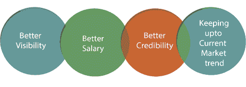
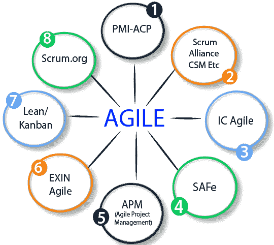

# 2019 年敏捷认证(更新)

> 原文：<https://www.javatpoint.com/agile-certification>

在这个时代，只有传统的软件开发方法是不够的。敏捷是大多数组织的需要。信息技术行业对敏捷专业人员的需求越来越大。这一需求带来了对敏捷认证的需求。

如果你是一个敏捷专业人士，想要验证你的技能并提升职业水平，你应该获得顶级敏捷认证。为自己选择一个写作认证，检查自己的实力，勇往直前。敏捷认证将为您提供全球认可，让您脱颖而出。

许多不同的机构和教育机构提供了敏捷认证的数量。找到其中一个可以帮助你提升职业水平，这是一项乏味的任务。

在本文中，我们将讨论市场上不同机构提供的一些顶级敏捷认证课程。

## 为什么是敏捷认证？

现在，敏捷和其他领域一样成熟了，比如项目管理和服务管理。组织正在从候选人那里寻找敏捷认证和经验。由于这个原因，敏捷专业人士渴望获得认证。使用这种认证，当他们计划换工作或在敏捷领域追求职业生涯时，他们可以获得所有的好处。

**敏捷认证提供以下优势:**

*   更好的可视性
*   更好的薪水
*   更好的可信度
*   跟上当前的市场趋势

## 前 5 大敏捷认证

市场上有很多认证可以选择敏捷领域的认证。由于有大量的认证可用，您会对在什么时间点选择哪个敏捷认证感到困惑。

下图说明了市场上可用的各种认证。你必须选择一个最好的敏捷认证，这对你有好处。

5 大敏捷认证，最适合想要用敏捷方法建立职业生涯的敏捷专业人士。

1.  敏捷认证从业者
2.  Scrum 联盟(认证 Scrum 大师/认证 Scrum 产品所有者/认证 Scrum 开发人员)
3.  Scrum 联盟(认证 Scrum 专业人员)
4.  Scrum.org(专业 Scrum 大师/专业 Scrum 产品负责人/专业 Scrum 开发者-1)
5.  SAFe 缩放敏捷列表

## 敏捷认证从业者

**敏捷证书从业者**证书是最好的项目管理认证之一。由项目管理研究所提供。PMI-ACP 证书是为使用敏捷方法的项目管理专业人员设计的。这个证书也是为那些正在实践他们的项目或者计划转向敏捷的专业人士设计的。

## Scrum 联盟(认证 Scrum 开发者/认证 Scrum 大师/认证 Scrum 产品所有者)

Scrum 联盟(scrumalliance.org)是那些在项目中实践 Scrum 的人最喜欢的组织。Scrum 联盟为敏捷 Scrum 专业人士提供了 3 个热门认证，分别是:**认证 Scrum 开发人员**、**认证 Scrum 大师**、**认证 Scrum 产品负责人**。

## Scrum 联盟(认证 Scrum 专业人员)

Scrum 联盟提供了一个被称为**认证 Scrum 专业人员**证书的专业水平证书。它是顶级敏捷认证之一。它也是顶级的项目管理认证。该证书承认 Scrum 框架的专业的预先实践、角色、工件和过程的能力。

## Scrum.org(专业 Scrum 开发者-我/专业 Scrum 大师/专业 Scrum 产品所有者)

scrum 提供专业级别的 scrum 证书。这个证书验证了候选人对 Scrum 的理解。这也检查了候选人如何在现实世界中应用 scrum 实践和框架。它为所有 scrum 开发人员、scrum 大师和 scrum 产品所有者提供认证。无需参加任何人从 scrum.org 参加的认证培训来获得这些证书；相反，他们需要强制通过认证考试。

## SAFe 缩放敏捷列表

SAFe 缩放敏捷列表也称为 SAFe 敏捷列表或缩放敏捷列表。这是由培训提供者提供的为期两天的培训课程。该认证的候选人在软件开发、测试、项目管理、业务分析或 scrum 方面有 5 年以上的经验。在本课程中，候选人将获得关于精益-敏捷领导原则的详细信息。候选人还将学习如何在敏捷中启动 SAFe。

* * *