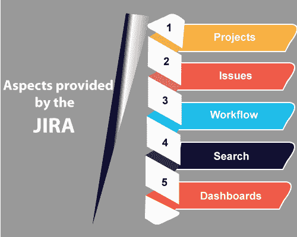

# JIRA 教程

> 吴奇珍:t0]https://www . javatppoint . com/jira-tutorial

JIRA 教程提供了 JIRA 工具的基本和高级概念。我们的 JIRA 教程是为初学者和专业人士设计的。

JIRA 是手动测试中使用最广泛的开源测试工具之一。

我们的 JIRA 教程包括测试工具的所有主题，如特性、安装、问题、工作流、组件、报告等。

## 什么是 JIRA？

JIRA 是一个由澳大利亚公司 Atlassian 开发的软件测试工具。这是一个 bug 跟踪工具，可以报告与您的软件或移动应用程序相关的所有问题。JIRA 这个词来自日语，即“Gojira”，意思是哥斯拉。

JIRA 基于敏捷方法，吉拉的当前版本是 6。

**以下是吉拉提供的有用方面:**

*   **项目:**用于非常有效地管理缺陷。
*   **问题:**用于跟踪和管理缺陷/问题。
*   **工作流程:**处理问题/缺陷生命周期。假设我们有一个业务需求，我们创建技术设计，并从技术设计中创建测试用例。创建测试用例后，编码完成，然后对项目进行测试。通过使用吉拉，这种设计工作流程是可能的。
*   **搜索:**轻松找到。假设我们在 12 月初完成了一个项目，它的版本是 1.0。现在，我们转向 1.1 版本，并于 12 月底完成。我们正在做的是添加新版本。通过吉拉，我们可以了解到在早期版本中发生了什么，在早期项目中出现了多少缺陷，以及我们从早期项目中获得的学习。
*   **仪表盘:**仪表盘是您登录吉拉时看到的显示屏。您可以为多个项目创建多个仪表板。您可以创建个人仪表板，并可以在仪表板中添加小工具，以便跟踪您正在处理的任务和问题。

## 为什么是 JIRA

**使用 JIRA 工具的原因如下:**

*   **更快地计划、跟踪和工作**
    JIRA 是一个 bug 跟踪工具，主要用于跟踪、组织和区分某些软件版本的 bug、新添加的特性和改进。项目被细分为问题，问题可以有多种类型，例如 bug、新特性、改进和文档任务。
    当软件的发布日期临近时，那么软件开发人员就需要把精力放在剩余的问题上，这些问题需要在指定日期之前解决。质量保证部门也很难保持文档的状态，也就是说，有时很难跟踪所有的事情。
    JIRA 是处理上述问题的好选择。它使软件开发人员能够跟踪问题和改进。它管理项目并维护技术文档。
*   **主要信息来源**
    JIRA 是下一个软件发布的主要信息来源。在 JIRA，软件开发人员的整个团队可以计划在下一个版本中添加新功能和修复错误。
    还帮助质量保证团队编写技术文档。通过 JIRA，质量保证团队可以检查软件开发人员新添加的每个功能的状态，并据此计划如何为新版本编制文档。
*   **组织文档任务**
    JIRA 工具用于组织文档任务。使用组件功能对多个任务进行分组非常有用，甚至您可以创建自己的文档。通过这种方式，您可以创建结构化的文档。
*   **跟踪我们文档的进度**
    它是跟踪我们文档进度的非常有用的工具。JIRA 工具提供了一个非常重要的功能，即饼图宏。在饼图宏中，您可以查看未完成任务、已完成任务、已解决任务等任务。
*   **有助于满足文档发布的截止日期。**
    您可以定义文档发布的具体截止日期，甚至可以使用通知配置 JIRA 工具，以便及时完成文档。
*   **测量花在文档上的时间**
    JIRA 工具没有测量花在文档上的时间的默认功能。“JIRA”工具与“速度时间表”捆绑在一起，后者衡量在文档上花费了多少时间。
*   **提供更快的反馈**
    JIRA 工具提供了融合页面，您只需点击几下鼠标即可连接到问题。如果某些内容需要更新，那么您可以直接从合流页面创建问题。

## 先决条件

在学习 JIRA 之前，您应该对手动测试有一个基本的了解。

## 观众

我们的 JIRA 教程旨在帮助初学者和专业人士。

## 问题

我们保证您在本 JIRA 教程中不会发现任何问题。但是如果有任何错误，请在联系表格中发布问题。

* * *