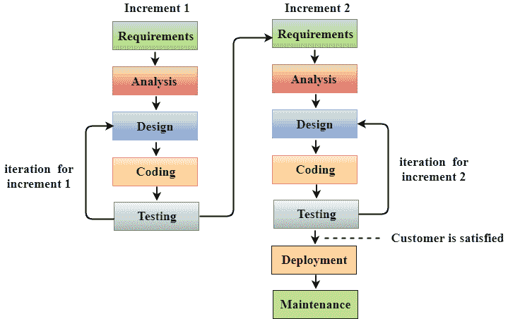

# 敏捷

> 原文：<https://www.javatpoint.com/jira-agile>

*   敏捷是一种有时间限制的迭代方法，以增量方式构建项目，而不是一次全部构建。
*   敏捷是一种在整个软件中促进开发和测试持续迭代的实践。

## 什么不是敏捷？

*   **进行会议**
    团队每天进行 10-15 分钟的频繁会议，他们认为进行频繁会议会很敏捷。但是，只有以下会议不是敏捷的。
*   **需求随时变化**
    需求可以随时变化，那就不是敏捷。例如，一个客户端想要添加一些新的特性，并且希望同时更新更改，那么这将不是敏捷的。
*   **非结构化开发**
    假设你没有遵循任何计划，而是在即席基础上工作，那么这不是敏捷，即席测试中，测试人员随机测试应用，而不遵循任何文档和测试设计技术。
*   **无文档**
    如果公司不做文档，那就不是敏捷。

## 什么是敏捷？

*   敏捷是一种哲学，即制定软件开发决策的一套价值观和原则。
*   敏捷基于迭代增量模型。在增量模型中，我们以增量方式创建系统，其中每个增量都是单独开发和测试的。

上图展示了敏捷模型是如何增量工作的。

## 什么是价值观？

| **个体和相互作用** | **超过流程和工具。** |
| **工作软件** | **超过综合文档。** |
| **客户协作** | **合同谈判结束** |
| **响应变化** | **按照计划结束** |

在敏捷中，您需要执行上表中提到的所有八项任务。然而，我们必须确保左任务比右任务具有更高的优先级。

*   **个人和交互，超越流程和工具**
    假设团队在软件中发现任何问题，然后他们搜索另一个流程或工具来解决问题。但是，在敏捷中，最好与客户、经理或团队就问题进行互动，并确保问题得到解决。
*   **工作软件，过度全面的文档**
    文档是需要的，但是工作软件是非常需要的。敏捷不是说不需要文档，而是非常需要工作软件。例如，你有 20 页的文档，但是你没有一个软件的原型。在这种情况下，客户会不高兴，因为最终客户需要一个文档。
*   **客户协作，超合同谈判**
    合同谈判很重要，因为他们制定软件的预算，但是客户协作比超合同谈判更重要。例如，如果你坚持要求或流程，那么不要去争取我们已经协商好的合同。你需要与客户互动，收集他们的需求。
*   **响应变化，过度遵循计划**
    在瀑布模型中，一切都是有计划的，也就是在什么时候，每个阶段都会完成。有时候你需要在软件的中间实现新的需求，所以你需要多才多艺才能在软件中做出改变。

#### 注意:根据敏捷方法，左任务应该比右任务更优先。

## 敏捷原则

*   我们最优先考虑的是通过早期和持续交付有价值的软件来满足客户。根据敏捷原则，客户就是他们的一切。无论客户需要什么，他们有什么问题或者想增加新的需求，他们总是优先考虑客户。倾听客户所说的话，并向他们提供高质量的软件。
*   它欢迎不断变化的需求，即使是在开发后期。敏捷流程为客户驾驭变革？的竞争优势。在瀑布模型中，如果需要在软件中间进行任何新的更改，整个过程都要重新进行。因此，瀑布模型是刚性的，不是通用的。敏捷说像这样工作，这样新的变化就可以很容易地融入到软件中。
*   经常交付工作软件，从几周到几个月，优先选择较短的时间。在瀑布模型中，当整个系统被开发出来时，只有它被交付给客户，而敏捷说不要等待太久，只等待几周或几个月。无论你开发了什么，给客户做一个演示，让客户看到你在初始阶段开发的软件。
*   在整个项目中，业务人员和开发人员必须每天一起工作。这意味着客户、客户和团队应该每天互动。
*   围绕有动力的个人建立项目，给他们所需的环境和支持，并信任他们完成工作。敏捷表示相信你的团队、客户、公司。假设给团队成员一项任务，然后提供他需要的所有资源，如文档、系统、信息研究等。
*   向开发团队传递信息以及在开发团队内部传递信息的最有效的方法是面对面的对话。假设有需要与客户、开发团队互动的情况，这通常是通过邮件或电话来完成的，但最好是面对面的对话。
*   工作软件是进步的主要衡量标准。敏捷表示，无论开发了什么，都不是通过文档或你的项目经理所说的，开发了多少软件或有多少软件在工作是对进度的衡量。
*   敏捷过程促进可持续发展。赞助商、开发者和用户应该能够无限期地保持不变的速度。敏捷说让你的团队持续交付，这样团队就应该有固定的工作时间，这意味着如果公司的工作时间是 8 小时，那么团队应该一天工作 8 小时。
*   持续关注技术上的卓越和良好的设计增强了敏捷性，这意味着团队成员应该在技术上是健全的，这样他们就可以做出好的设计。如果做了任何改变，那么他们就可以很容易地融入到软件中。
*   最好的架构、需求和设计来自自组织团队。无论架构团队做了什么样的设计，他们都会确保和开发团队坐在一起讨论软件的架构。
*   每隔一段时间，团队会思考如何变得更有效，然后相应地调整和调整自己的行为。这个原则说，团队应该经常开会，以便他们可以讨论他们面临的问题，并可以有效地解决。

* * *