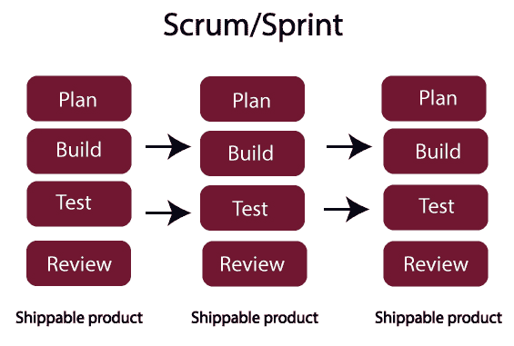
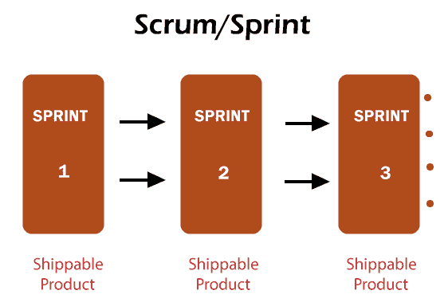
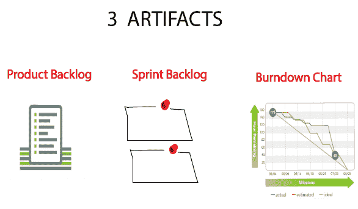

# 混乱

> 原文：<https://www.javatpoint.com/jira-scrum>

我们已经研究了敏捷方法，其中敏捷是开发软件开发项目应该遵循的一组信念。在这些信念或价值观上，有很多模型已经发展出来，而其中一个模型就是 **scrum** 。

**在深入 Scrum 之前，您应该知道一些基本术语的含义:**

*   **Scrum:** Scrum 是一个敏捷框架，可以帮助你组织、迭代和继续你正在进行的同一个项目。在 scrum 中，产品是在一系列的迭代中构建的，这些迭代被称为 sprints 或 parts。
*   **Sprint:** Sprint 是一个时间限制期，scrum 团队需要完成设定的工作量。每个冲刺都有一个特定的时间表，即 2 周到 1 个月。scrum 团队在 sprint 计划会议上同意这个时间表。
*   **Scrum Master:** Scrum Master 被定义为 Scrum 开发团队的促进者或仆人-领导者。Scrum Master 必须确保遵循 Scrum 原则。
*   **Scrum 开发团队:**Scrum 开发团队是包括开发人员、QA 和 Scrum 大师在内的个体成员的集合。它决定并提供努力评估。scrum 团队的推荐规模在 5 到 9 名成员之间。

## Scrum 是如何工作的

在瀑布模型中，我们已经读到，首先完成整个需求，然后完成整个设计，然后完成整个开发，然后完成整个测试和部署。这种模式占据了产品的整个生命周期，然后客户可以看到唯一的产品。虽然 Scrum 说考虑软件的一小部分，然后计划它、构建它、测试并最终审查它。这个已经开发的小模块将展示给客户。例如，我们需要开发电子商务网站，它可以分为多个冲刺或模块，如登录页面、支付页面、购物车页面等。然后，分别开发每个模块，并同时向客户展示。因此，我们可以说，在每个 sprint 完成之后，产品被运送到客户端，尽管不是完整的产品，而是功能的一部分。

## Scrum 的工件

scrum 中准备的文档和材料被称为工件。

**以下是 Scrum 的工件:**

*   **产品积压**
    产品积压是项目内需要完成的活动的集合。当我们想要开发软件时，我们需要执行‘n’个活动。例如，我们需要开发电子商务网站，然后我们必须进行“n”个活动，例如我们需要创建登录页面、支付系统、购物车系统等。开发软件所需的这 n 个活动被称为产品积压。
*   **sprint Backlog**
    我们知道，在 scrum 中，我们将 scrum 分成 n 个 Sprint，Sprint 的目标是将软件的小功能带到客户端进行演示。在产品积压中，我们必须完成开发软件所需的所有活动，而在 sprint 积压中，一小部分产品积压活动在 sprint 中执行。冲刺积压的数量等于 1 个产品积压。
*   **燃耗图**
    燃耗图是冲刺的结果，它显示了一次冲刺的进度。每一次冲刺之后，我们都需要考察每一次冲刺的进度。燃烧图告诉你如何进行冲刺。在燃耗图中，图表从某个时间开始，即活动开始的地方，在冲刺结束时，图表在活动结束的地方达到零。一般是从上到下的斜线。

## Scrum 角色

**有三个 scrum 角色:**

*   **产品负责人**
    有一个客户想开发他的软件，于是他就去找能开发他软件的公司。公司是做什么的？公司指定了一个角色，即产品所有者。产品负责人是与客户沟通并了解他们需求的人。产品负责人是公司软件开发的负责人。
*   **Scrum Master**
    在冲刺的时候，敏捷说团队应该每天集合一次。当团队遵循 scrum 时，意味着他们每天都要进行 10 到 15 分钟的会议。这个会议被称为 scrum 会议。Scrum Master 是处理 Scrum 会议的人。
*   **团队**
    团队由从事该项目的人员组成。它可以是开发人员、测试人员或设计人员。当我们谈论敏捷或 Scrum 时，我们谈论的是团队，而不是作为个体的开发人员或测试人员。敏捷表示开发人员可以作为测试人员工作，或者测试人员可以在需要时作为开发人员工作。

## Scrum 仪式

**我们来看看下面的 Scrum 仪式:**

*   **Sprint Planning**
    Scrum 由许多 Sprint 组成，它们有一组不同的模块用来交付软件。在开始冲刺计划之前，我们有一个称为冲刺计划的会议，在冲刺计划中，我们讨论我们在冲刺中要做什么。在 sprint 计划中，产品所有者讨论产品的每个特性，并估计开发团队所付出的努力。
*   **每日 Scrum**
    在 Scrum 中，会议由 Scrum Master 每天进行 15 分钟，其中 Scrum Master 是管理会议的人。会议由 scrum 主、开发人员、测试人员、设计人员、产品所有者、客户组成，其中产品所有者和客户是可选的。
*   **冲刺评审**
    每次冲刺完成后，与客户进行会议，向客户展示产品进行演示，团队讨论他们在项目中添加的功能。

* * *