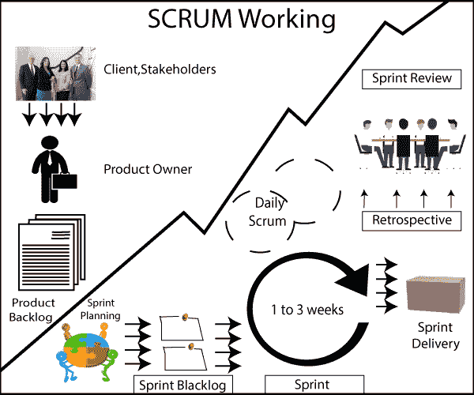
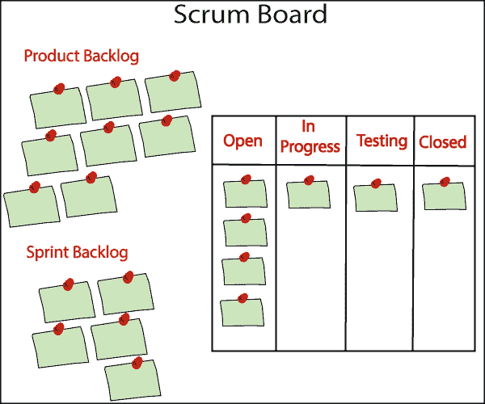

# 短跑运动

> 原文：<https://www.javatpoint.com/jira-working-of-sprint>

### 客户、利益相关方

假设有一个客户想要开发他们的软件，所以他们联系了基于服务的公司来开发他们的软件。

### 产品所有者

**公司会怎么做？**

公司将指定一个人作为产品所有者。客户端与产品所有者交互，产品所有者将从客户端获取所有需求或用户故事，这些需求或用户故事将被命名为产品积压。

### 产品积压

产品积压是开发软件需要完成的一系列活动。

### 冲刺计划

现在，我们将开始冲刺。我们不会像在瀑布模型中那样一次开发完所有的产品。我们将考虑产品积压的一部分，这部分将首先开发。为了开发这个特定的部分，需要考虑一些因素，比如什么是优先级，哪些组件可以组合在一起，客户需要什么特性等等。在开始冲刺之前，会召开一个名为**冲刺规划**的会议，我们将在会上讨论所有的特性。在**冲刺规划**中，我们还选择了本次冲刺中将要开展的活动或积压，所选择的积压称为冲刺积压。

### 冲刺积压

Sprint Backlog 是需要在这个 Sprint 中执行的一组活动。从产品积压中，一组活动被捕获在冲刺积压中，并且冲刺积压的每个活动被分配给一个特定的人。完成冲刺的最短时间是 4 天，但也可以拉长到 2-3 周。

### 冲刺

在 Sprint Backlog 之后，团队开始进行冲刺，完成冲刺可能需要大约 1 到 3 周的时间。sprint 的完成情况因项目而异。当 sprint 开始的时候，一个日常会议被称为每日 Scrum，Scrum 大师主持这个会议。在 Daily Scrum 中，每天都会进行一次会议，会议可以拉长到 10-15 次会议。会议有一个预定义的格式，即团队成员必须告诉他昨天在做什么，他今天要做什么，以及哪些事情阻碍了他完成工作。scrum 大师有责任解决团队成员面临的问题。

### 冲刺交付

当一个 sprint 完成时，这个 sprint 被交付给客户端。产品交付给客户意味着被称为 sprint backlog 的最小产品积压集已经完成。sprint 交付是为了让客户可以查看产品，而不是我们开发了客户无法查看的东西。

### 冲刺回顾和回顾

冲刺交付结束后，会召开两种类型的会议，即冲刺评审和回顾。**冲刺评审**是团队成员坐在一起的会议，他们向客户演示他们在这次冲刺中开发的产品。

**回顾**是团队成员之间举行的另一次会议。在这次会议上，他们讨论在这次冲刺中什么是对的，什么是错的，比如阻碍他们工作的问题。

在 sprint 评审之后，我们回到 Product Backlog，然后进行 sprint 规划，选择 sprint backlog，即 sprint2，这样，这个周期一直持续到整个产品开发完成并发货到客户端。

## Scrum 委员会

**产品积压:**产品积压是开发软件需要完成的一组活动。

**Sprint Backlog:**Sprint Backlog 是一个从产品 Backlog 中提取了一些活动的 Backlog，这些活动需要在这个 Sprint 中完成。

**Scrum Board:** Scrum Board 是一个显示在这个冲刺阶段需要完成的所有活动的状态的板。

**Scrum Board 由四个状态组成:**

*   **打开**
    **打开**状态表示**打开**中可用的任务尚未开始。
*   **进行中**
    进行中状态表示开发者完成了他们的任务。
*   **测试**
    这个‘测试’意味着任务处于测试阶段。
*   **关闭**T2【关闭】表示任务已经完成。

* * *