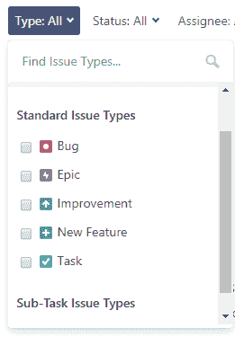
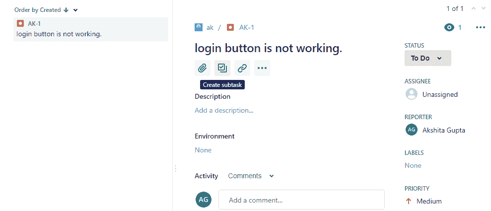
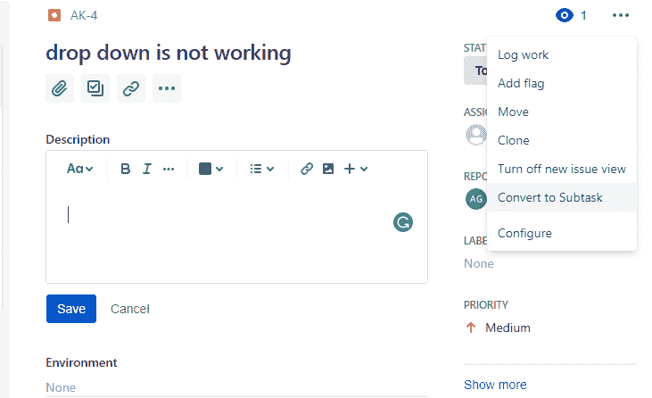
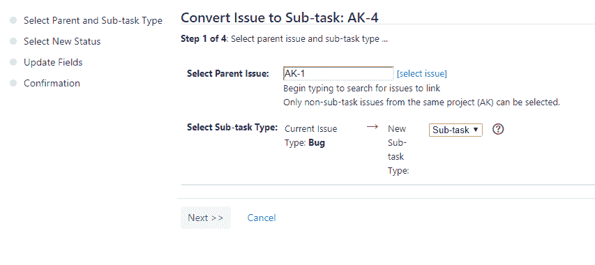
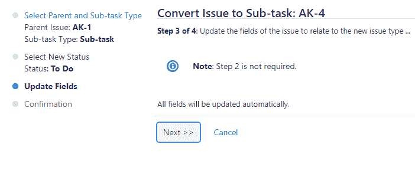
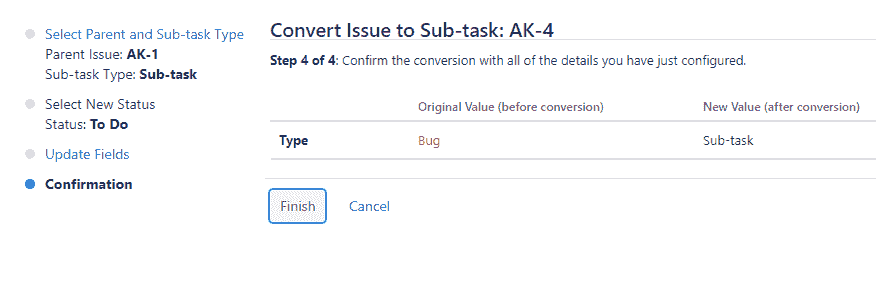

# 什么是问题？

> 原文：<https://www.javatpoint.com/jira-issues>

JIRA 问题用于跟踪已完成或未完成的单个工作。JIRA 问题可能是软件错误或任何其他问题。在JIRA导入项目后，您可以创建问题。

## 问题类型

团队合作将工作分解成问题。问题可以代表软件错误、项目任务、子任务或任何其他项目工作。JIRA项目附带默认问题类型，您也可以创建自己的问题类型。

问题类型是工作单元的通称。在JIRA，我们在一个项目中有不同的工作单元，问题类型字段区分了这一点。

创建问题时，需要指定问题类型。您甚至可以在创建问题后更改问题类型。

每个问题都有一个与之关联的图标来标识问题类型。

**定制问题类型:**还用于创建定制问题类型，为团队根据项目创建自己的问题类型提供了灵活性

**以下屏幕显示问题类型列表:**

**发行类型有三种:**

*   **JIRA 核心违约发行类型**
    *   **任务:**任务是团队完成的工作项，但与用户需求没有直接联系。例如，升级团队使用的产品版本。
    *   **子任务:**是另一个问题的一部分。它用于将一个问题分解成不同的工作。创建问题时，子任务问题没有在问题类型字段下拉中给出，因为它包含一些父问题，所以我们可以说子任务问题不能独立创建。
*   **JIRA 软件默认问题类型**
    *   **故事:**是用户角度的需求。
    *   **Bug:** 是产品中的一个缺陷，需要开发者来修复。它可以用自己的问题类型进行跟踪，以区别于其他类型的工作。
    *   **史诗:**史诗是包含其他问题的大问题。
*   **JIRA 服务台默认问题类型**
    *   事件
    *   服务请求
    *   变化
    *   问题

## 为什么是问题类型？

**使用问题类型的原因如下:**

*   它们支持多个工作项目。通常，团队包含多个工作项，问题类型用于区分这些工作项。
*   每个问题类型可以有不同的字段、屏幕和工作流。例如，bug 出现在项目板的顶部。
*   您可以单独报告问题类型。问题按问题类型分类；例如，您想要报告前一周的工作进度。

**子任务**

*   子任务是必须有父问题的问题类型。
*   要创建子任务，请单击父问题的创建子任务图标。

*   它将一个问题转化为单个可管理的任务，每个任务都分配给团队成员。
*   子任务比父问题更具技术性。例如，问题的类型是故事，那么故事中写的台词将是非技术性的，以便团队成员和利益相关者能够理解。但是子任务是按照实现子任务的技术路线编写的。

**子任务特征**

*   子任务有自己的问题关键字和字段。
*   子任务具有独立的工作流状态
*   子任务问题类型可以转换为另一个问题。

## 将子任务转换为问题

*   移动到子任务的细节，然后点击**更多(...)**按钮，然后点击**转换为发行**。

*   点击**转换为问题**，出现如下所示的屏幕。您可以选择您选择的问题类型。

## 将问题转换为子任务

*   打开要转换为子任务的问题。
*   点击上的**(...)按钮，则下拉菜单将被打开。**

*   点击**转换为子任务**菜单项。单击“转换为子任务”时，将出现如下所示的屏幕:

在上面的屏幕中，选择父问题，然后单击下一步> >。

*   下面的屏幕显示不需要步骤 2。点击下一步> >。

*   下面的屏幕是确认。点击**完成**按钮。

* * *