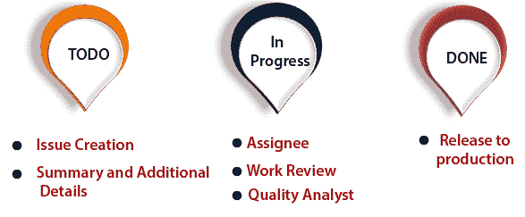
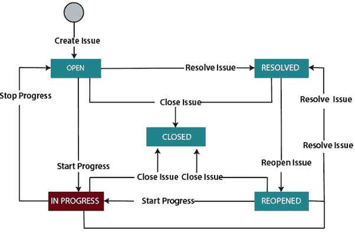

# JIRA 工作流

> 原文：<https://www.javatpoint.com/jira-workflow>

工作流是一组活动，用于在问题的生命周期中跟踪问题的状态和转变。

其中**转换**表示当问题从一种状态转移到另一种状态时，两种状态之间以链接的形式进行的一些工作。

**状态:**状态决定了工作对测试人员提交的问题的影响。

**在JIRA工具中，以下是工作流程中发生的阶段:**

*   **待办状态**
*   **进行中状态**
*   **完成状态**

**在 TODO 状态下执行两个活动:**

*   **问题创建**
    当测试人员发现一个缺陷时，他们将该缺陷记录在JIRA工具中。一旦缺陷被记录在JIRA工具中，JIRA工具就会生成唯一的票证标识号。这个过程称为问题创建。
*   **摘要和附加详细信息**
    创建问题需要添加或更新一些附加信息，如问题描述、优先级、严重性、受影响的组件、子任务、上传截图、电子邮件历史记录等。将所有细节添加到问题后，JIRA工具将状态指定为待办事项状态。

**在进行中状态下执行三个活动:**

*   **受让人**
    创建问题后，会将其分配给一个人或一个团队。将问题分配给某个人后，状态变为**进行中**状态。
*   **工作评审**
    问题的工作首先由问题报告者、受让人和其他项目管理人员进行评审和监控。当开发人员移除一个问题时，首先由开发人员进行单元测试，然后由代码审查团队进行审查。在工作评审活动期间，状态保持在**进行中**状态。
*   **质量分析**
    代码评审后，变更由质量分析团队进行验证，包括回归测试。如果质量保证团队在变更中发现任何问题，则该问题将被重新分配给开发人员，否则质量保证团队将关闭该问题，声明该问题已被修复。在质量分析期间，状态保持在**进行中**状态。

在**完成**状态下执行一项活动:

*   **发布到生产**一旦产品已经开发和测试，那么产品就发布到市场上。产品投放市场后，状态变为**完成**状态。

**JIRA 工作流也可以称为缺陷生命周期。缺陷生命周期如下所示:**

*   **开放问题:**当问题被创建时，然后问题被分配给软件开发人员，他们开始处理它。
*   **进行中问题:**软件开发人员开始着手解决该问题。
*   **已解决问题:**问题由软件开发人员解决，但等待测试人员验证。如果验证成功，则关闭问题；否则，问题将被重新打开。
*   **重新打开的问题:**当软件开发人员没有按照要求解决问题时，问题就进入重新打开的状态。
*   **关闭问题:**当软件开发人员正确解决问题并通过软件测试人员验证后，则关闭问题。

* * *