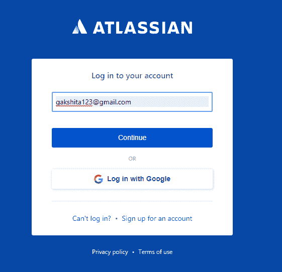
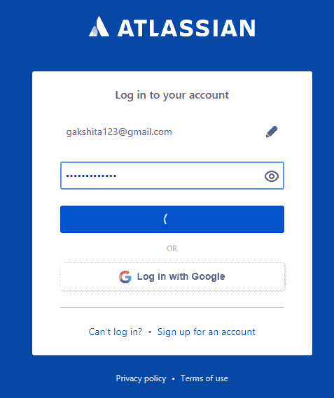
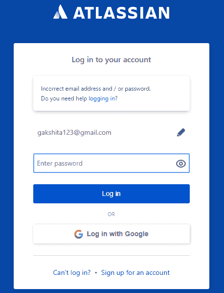
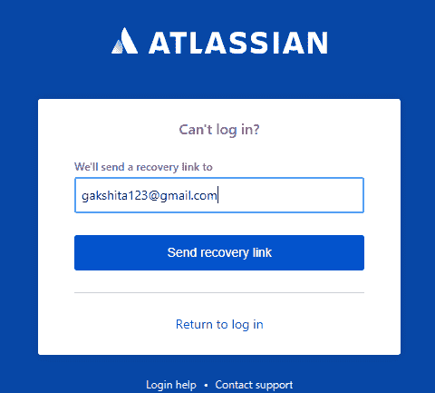
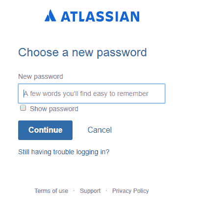
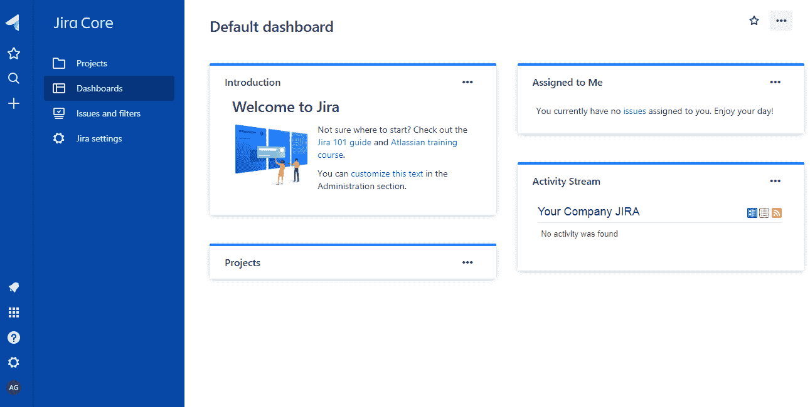

# JIRA 登录

> 吴奇珍:t0]https://www . javatppoint . com/jira-log in

**登录吉拉的步骤如下:**

*   要登录吉拉，请转到我们在**吉拉**创建的网站。登录页面出现，然后您需要填写凭据，如用户名和密码。
    **点击继续按钮。**

*   输入密码，然后点击**登录**按钮。

*   如果密码不正确，则会显示验证消息“电子邮件地址或密码不正确”。这显示在下面的截图中:

*   要克服以上错误，点击**不能登录？**链接。点击链接，我们将看到如下所示的屏幕:

*   点击**发送恢复链接**按钮。点击**发送恢复链接**按钮后，邮件被发送到注册的邮箱 id，并要求您**重置我的密码**。当您点击**重置我的密码**按钮时，我们将获得如下所示的屏幕:

*   输入您的新密码，然后点击**继续**按钮。
*   当我们提供不正确的用户名或密码时，就会出现上述情况。成功登录后，您的 jira 帐户将被打开，屏幕显示如下:

* * *