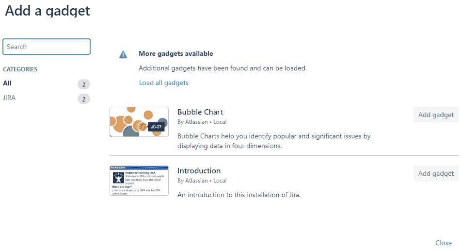
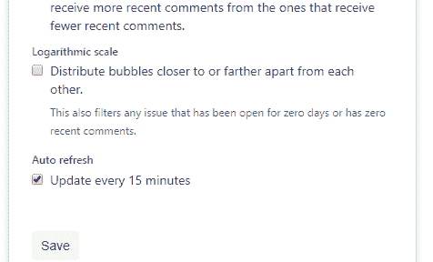
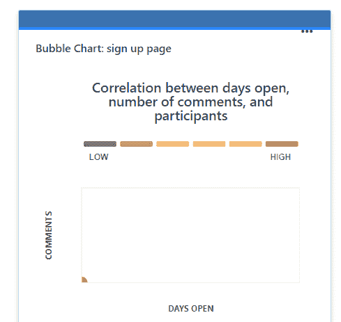
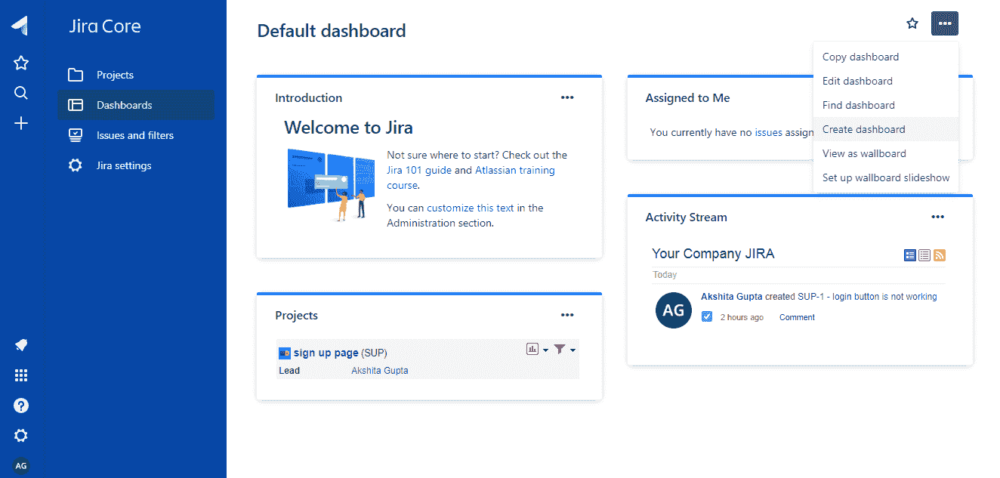
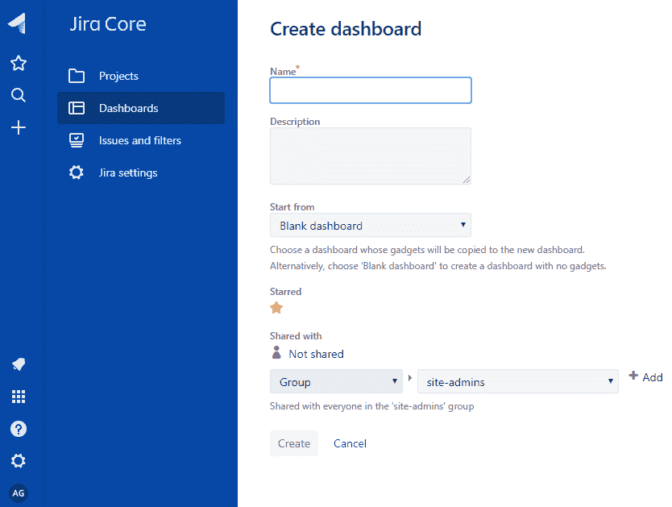
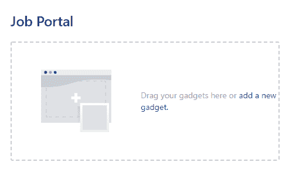

# JIRA 仪表板

> 原文：<https://www.javatpoint.com/jira-dashboard>

当您登录吉拉时，将出现的第一个屏幕是仪表板。仪表板只能由管理员自定义，并且基于角色，管理员可以访问吉拉。

管理员甚至可以改变颜色和吉拉标志。

您可以创建多个仪表板，帮助您在不同的图表中组织项目、工作分配和成就。

## 默认仪表板

您可以在默认仪表板中添加小工具，也可以配置默认仪表板。仪表板的布局也可以配置，例如许多列。对默认仪表板所做的所有更改也将反映当前使用默认仪表板的用户的仪表板中的更改。例如，管理小工具存在于默认控制面板中，但它仅对管理员可见。

**以下是在默认仪表盘中添加小工具的步骤:**

*   登录吉拉网站。

*   点击**添加小工具**链接。

*   添加小工具后，小工具会添加到您的仪表板中，然后单击保存按钮。

 

*   保存小工具时，会创建气泡图，如下所示:

## 创建仪表板

**以下是创建仪表板的步骤:**

*   点击“...”按钮。

*   从“...”的下拉菜单中单击创建仪表板。单击创建控制面板时，屏幕出现，如下所示:

*   输入仪表板的详细信息，如仪表板的名称、描述等，然后单击创建按钮。假设我提供仪表板的名称作为作业入口。下面的屏幕显示仪表板已经创建:

#### 注意:我们也可以通过点击“...”来编辑仪表板按钮，然后单击编辑仪表板。

* * *