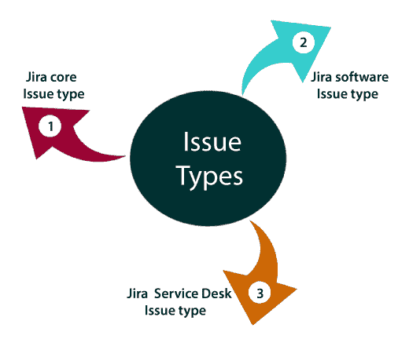
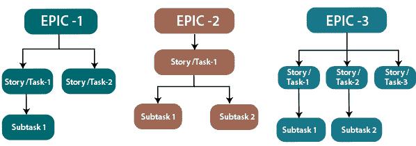

# 吉拉问题类型

> 原文：<https://www.javatpoint.com/jira-issue-types>

JIRA 应用可用于将工作分解成问题。问题可以表示为任务、子任务、萌芽、史诗、特性请求或其他工作。每个吉拉软件都有一些适合您的项目和团队的默认问题类型。

**JIRA 软件附带三种默认吉拉发行类型:**

*   吉拉核心(商业项目)发行类型
*   吉拉软件(软件项目)问题类型
*   吉拉服务台(服务台项目)问题类型

* * *

### 吉拉核心问题类型

*   **任务**
    任务是为了实现团队目标而需要完成或完成的工作。
*   **子任务**
    这是一个问题的子任务。记录问题下的所有任务都称为子任务。

* * *

### 吉拉软件问题类型

*   **Bug**
    Bug 是产品在功能上出现的问题或缺陷。
*   **史诗**

*   Epic 是一个庞大的用户故事，将被分解成更小的故事
*   它不可能在一次冲刺中实现。
*   整部史诗在几个月内完成。
*   Epic 是指一组尚未转化为用户故事的活动。
*   首先，Epics 被转换成用户故事，然后用户故事被转换成敏捷团队工作的几个任务。
*   史诗的范围很广，缺乏细节，它们被分成更小的和多个故事，敏捷团队在这些故事上工作。
*   Epic 被称为“工作层级中的顶层”。

*   **子任务**
    子任务是为了完成整个工作而必须完成的一项工作。
*   **任务**
    任务是为了实现团队目标而需要完成或完成的工作。
*   **故事**
    *   这个故事是一个项目中需要完成的任务列表。
    *   它定义了项目需求的高级设计。
    *   它定义了整个项目的简短描述。
    *   它属于一家公司的产品所有者，但任何人都可以写用户故事。
    *   它是用简单的语言编写的，以便客户能够理解最终产品。
    *   用户故事可以被认为是人渣的**心脏，因为它是冲刺的基石。**

* * *

### 吉拉服务台问题类型

*   **更改**
    它请求更改当前的 It 配置文件。
*   **IT 帮助**
    用于请求 IT 相关问题的帮助。
*   **事故**
    它报告了一起事故或服务信息技术中断。
*   **新功能**
    请求增加新功能或软件功能。
*   **问题**
    用于报告多个事件的根本原因。
*   **服务请求**
    用于向内部或客户服务台请求帮助。
*   **服务请求批准**
    用于请求需要经理或董事会批准的帮助。
*   **支持**
    用于请求客户支持问题的帮助。

* * *