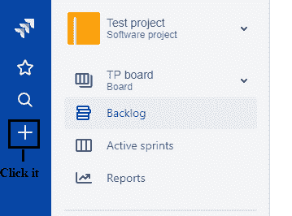
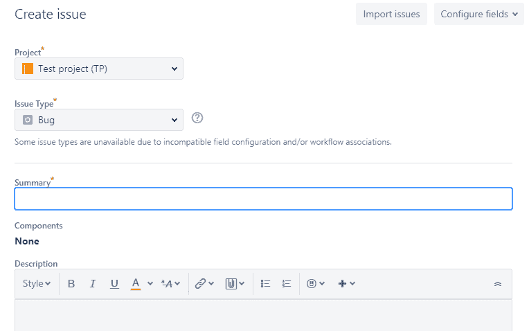
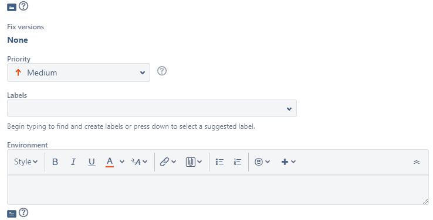
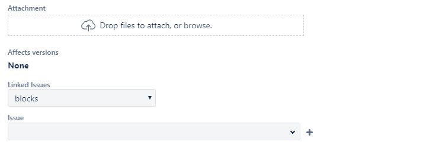
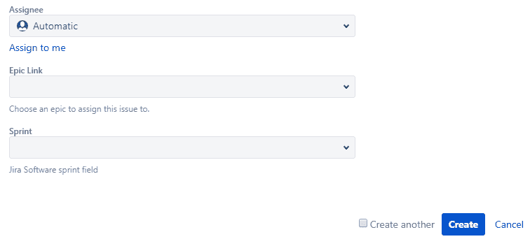
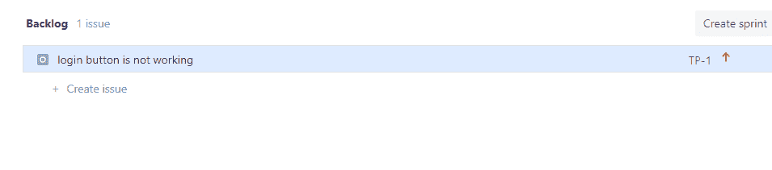

# Jira 积压

> 原文：<https://www.javatpoint.com/jira-backlog>

积压是团队需要在特定迭代中解决的一组活动或问题。您项目的所有问题都被归入一个待办事项清单和 sprint 中。

在 scrum backlog 中，您可以执行多个活动，例如创建和更新问题，拖放问题以确定它们的优先级，将它们分配给 sprints、epics、versions、manage epics 等。

**以下是可以在 scrum backlog 中执行的活动:**

*   **将问题添加到积压中**
    要在积压中添加问题，您需要创建一个问题。单击全局边栏中的+图标来创建问题。填写与问题相关的所有详细信息，然后单击创建按钮。您创建的问题将被添加到积压工作中。
*   **对积压进行优先排序**
    您还可以拖放问题，以便可以对积压中的问题进行优先排序。您也可以右键单击问题以打开菜单，该菜单允许您将问题移到积压的顶部或底部。
*   **查看和编辑某个问题的详细信息**
    点击公告板上的某个问题，查看该问题的所有详细信息。如果您想在单独的窗口中查看问题，请右键单击问题键。
*   **确定用户的工作量**
    分配工作的用户显示在冲刺的顶部。点击“...”查看受托人工作量的选项。
*   **创建子任务**
    点击一个问题，然后点击图标创建子任务。子任务有助于将故事分解成可实现的部分。
*   **转移问题**
    你可以将问题从 Backlog 部分拖放到相关 sprint，或者我们可以说我们可以将问题从 Backlog 部分移到相关 sprint。
*   **拆分问题**
    右键点击问题，选择拆分问题。它可以在 Backlog 和 sprint 部分拆分问题。当您想要将大任务分成两个或更多的问题以使工作更易于管理时，拆分非常有用。
*   **删除问题**
    也可以通过选择问题来删除问题，然后选择**...>删除**。
*   **查找问题**
    您可以创建自己的快速过滤器，只查看您想要的问题。

## 创建积压的步骤

*   单击出现在窗格最左侧的+。

*   填写所有详细信息以创建问题。

在上表中，填写所有必填的详细信息，其他字段保留空白或默认值。

**必填字段为:**

*   **项目:**定义项目名称。假设我给这个项目起的名字是‘T2’测试项目。
*   **发行类型**
    定义发行类型。可以是 bug、史诗、故事等。
*   **小结**
    讲述一个问题的整体描述。
*   **优先级**
    它定义了一个问题的优先级。它可以是中、低或高。

假设我创建了一个问题，它的类型是 Bug，描述是“登录按钮不起作用”，并且一个问题的优先级很高。

在上面的屏幕中，我们可以看到问题被创建，并被放置在 Backlog 中。

* * *