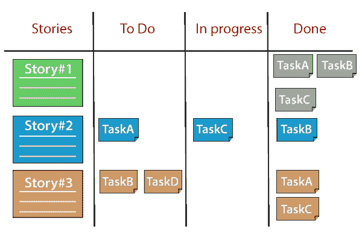
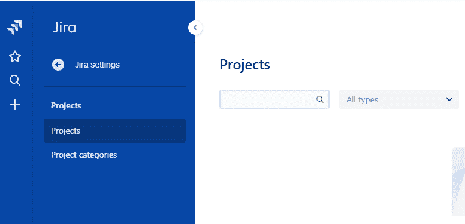
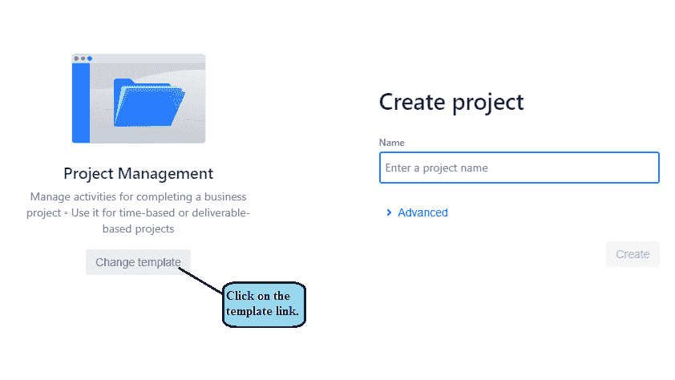
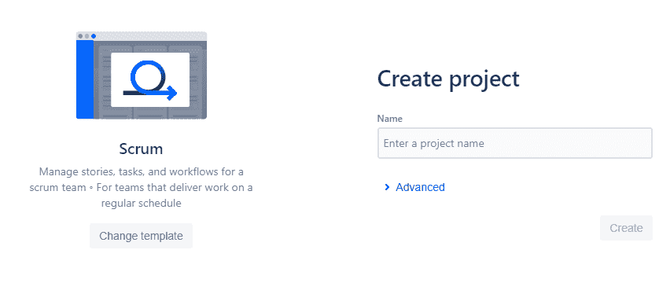
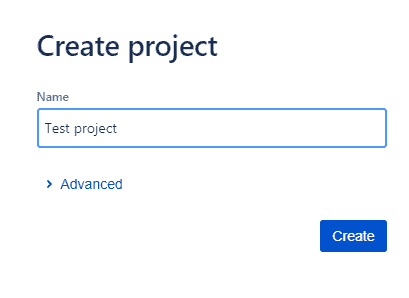
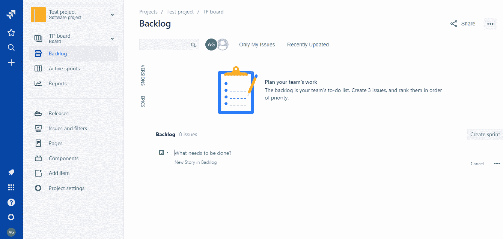

# 吉拉 Scrum 委员会

> 原文：<https://www.javatpoint.com/jira-scrum-board>

吉拉 Scrum Board 是一个工具，用来联合团队来实现一个单一的目标和增量迭代交付。

## Scrum 委员会的职能

*   **增加沟通和透明度**
    吉拉 Scrum 板是团队成员可以随时访问团队所有工作的单一来源。这增加了团队成员之间的沟通和透明度。
*   **促进冲刺规划和迭代开发**
    Scrum 框架的核心是冲刺，这是团队构建可发布产品增量的固定时间。吉拉 scrum board 的主要设计目的是让团队能够在冲刺阶段组织他们的工作。
*   **提高团队的专注度和组织**
    有时候团队忘记了项目的截止日期，他们对自己的工作量过度投入。吉拉 Scrum Boards 通过将工作分成多个阶段并提供燃耗和速度报告，为团队的工作提供了透明度。

### 以下是与 Scrum 委员会相关的重要术语:

*   **冲刺**
    冲刺是时间的限时迭代，主要是 2 周。当冲刺完成时，它会产生市场上最有价值、最有用、最可发布的产品。
*   **积压**
    积压属于产品所有者。产品积压是产品中要考虑的特性、缺陷、增强、实验的列表。
*   **用户故事**
    *   用户故事是敏捷框架中最小的工作单元。用户故事是一个目标，而不是一个用用户视角表达的特征。
    *   用户故事的目的是展示一件作品将如何向客户传递特定的价值。
    *   用户故事是用简单的语言写的句子，以提供期望的结果。
    *   它应该是细粒度的，这样就可以在一次冲刺中交付。Sprint 只不过是交付工作软件的一个有时间限制的迭代。
    *   用户故事属于史诗，而史诗是一大块作品，用户故事属于史诗。一些用户故事取自史诗，放在特定的冲刺阶段。这个循环一直持续到 sprint 中的所有用户故事完成。
*   **期**
    一期也被称为用户故事。在 scrum board 中，一个问题包含执行一项工作所需的所有任务、依赖关系和其他相关信息。
*   **史诗**
    史诗是一大块作品。它基本上是一个大的用户故事，可以分成许多小故事。史诗中的所有用户故事可能需要几个冲刺来完成。
*   **泳道**
    泳道是一种在 scrum 板或看板板的积极冲刺中对问题进行分类的方法。它帮助您区分不同类别的任务，如用户、工作流等。

## Scrum 板的布局

Scrum Board 是一个物理板，在上面显示了当前 sprint 积压中的用户故事。

**Scrum 板分为如下几列:**

*   **故事:**此栏包含当前冲刺积压中所有可用的用户故事。
*   **TODO:** 此状态包含尚未开始工作的故事的子任务。
*   **进行中:**此状态包含工作已开始的所有任务。
*   **完成:**此状态包含工作已完成的所有任务。

## 创建 Scrum 项目的步骤

*   点击页面左侧出现的**项目**。

*   点击**创建项目**按钮，创建一个出现在页面右上角的新项目。
*   点击模板链接。

*   从模板中选择 scrum 项目。

*   输入项目名称。

*   在下图中，创建了 TP Board，这是名为“**测试项目**”的项目的简称。

上图中显示的白板是吉拉板，其中包含与特定项目相关的问题。

在 scrum 板上显示问题为查看、管理和跟踪问题的进展提供了灵活性。

对于新创建的项目，积压是空的。仅当您在“积压”中添加任务或问题时，它才会被填充。

* * *