# 什么是 Sprint？

> 原文：<https://www.javatpoint.com/jira-create-sprint>

团队需要在指定的时间内完成一系列问题，这就是所谓的冲刺。冲刺的持续时间由团队和产品所有者共同决定。

## 创造冲刺

**以下是创建冲刺的步骤:**

*   点击左侧出现的积压，如下图所示:

*   点击右下角出现的**创建冲刺按钮**，如下图截图所示:

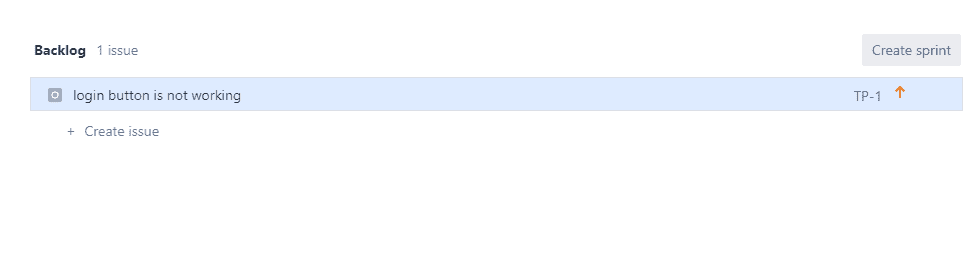

*   点击**创建冲刺按钮**后，屏幕出现，如下图:

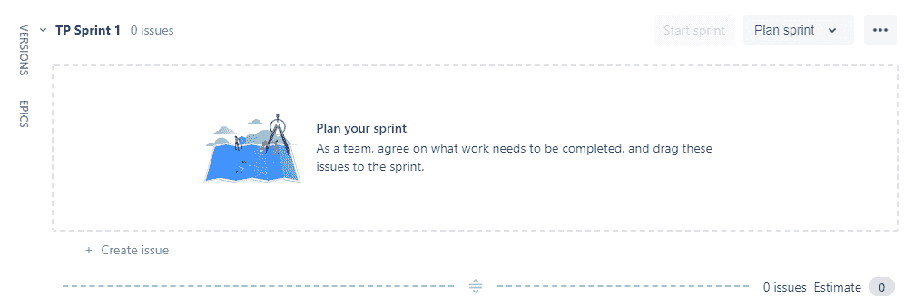

上面的屏幕显示 sprint 已经创建了一个名为“Sprint 1”的项目，现在我们可以将问题添加到这个 Sprint 中。

## 给冲刺增加一个问题

**以下是将问题添加到冲刺所需的步骤:**

*   点击待办事项。
*   从“积压”列表中，右键单击问题，然后选择要在其中添加问题的冲刺。我们刚刚创建了名为 sprint 1 的 Sprint，选择 Sprint 1。

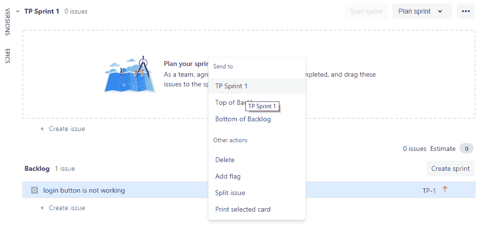

*   将问题 TP-1 添加到 sprint 中，即 Sprint 1。

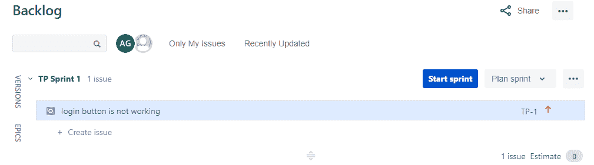

从上面的屏幕中，我们观察到 TP-1 问题被添加到 Sprint 1 中。

## 消除冲刺中的问题

**从冲刺中移除问题需要遵循的步骤:**

*   点击积压。
*   将问题从 Sprint 1 拖放回积压列表。

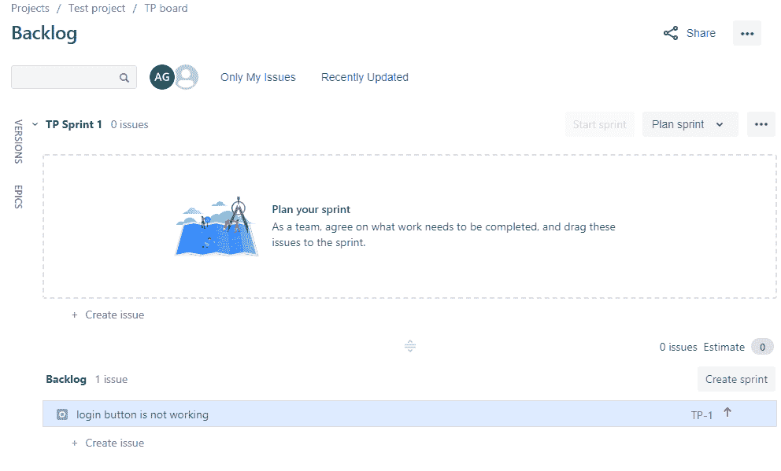

上面的屏幕显示问题 TP-1 从 Sprint 1 移动到 Backlog。

## 开始冲刺

**开始冲刺的步骤:**

*   点击积压。
*   点击**开始冲刺**按钮开始冲刺。

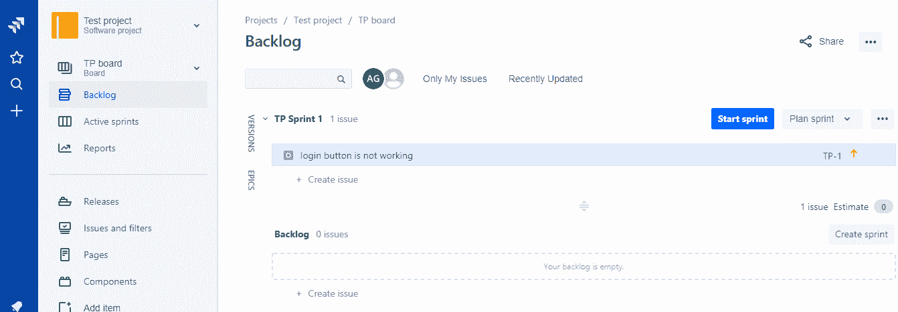

*   填写以下细节开始冲刺，如冲刺名称、冲刺持续时间、结束日期、开始日期、冲刺目标。

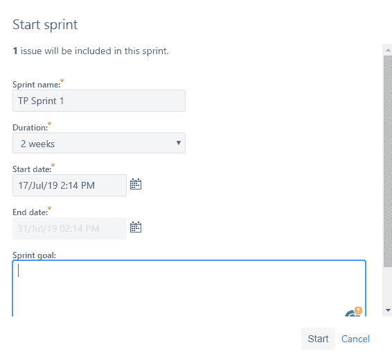

*   现在，**冲刺 1** 开始。最初，这个问题属于**待办事项**状态。

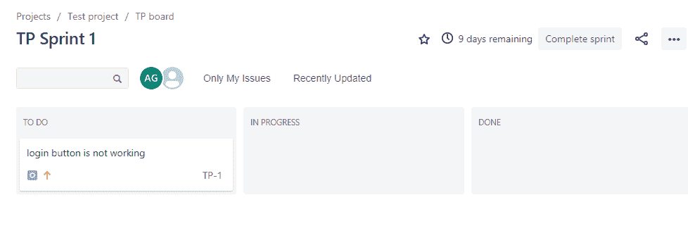

## 结束冲刺

**开始冲刺需要遵循的步骤:**

*   点击积压。
*   点击项目左侧出现的**活动冲刺**。
*   选择你想完成的冲刺或结束冲刺。
*   完成所有问题后，点击右上角出现的**完成冲刺按钮**。

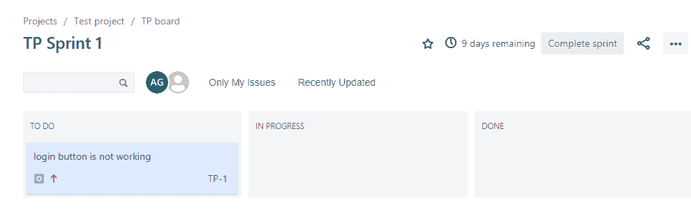

*   它会告诉你是否所有的问题都已经完成，如果没有，那么它会要求你将问题转移到另一个尚未完成的冲刺阶段。

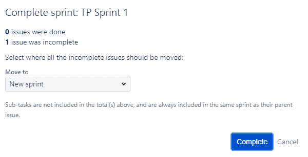

## 删除冲刺

**删除冲刺需要遵循的步骤:**

*   点击**待办事项**。
*   选择要删除的冲刺，然后点击“...”图标。出现下拉菜单，然后选择**删除冲刺**选项。

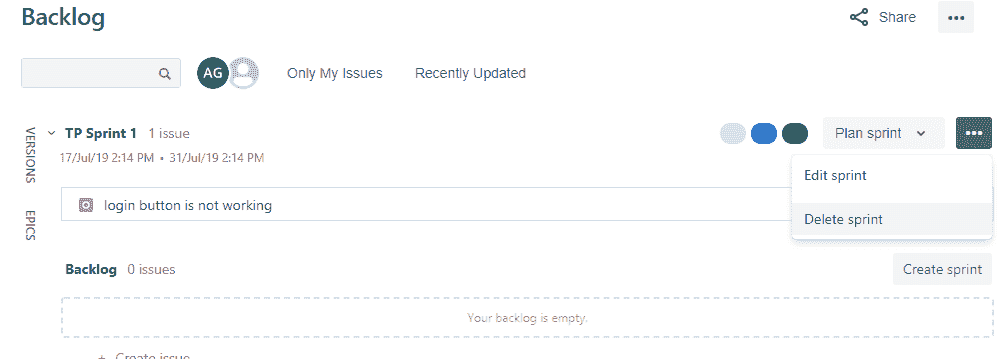

*   点击**删除冲刺**选项，点击**确认**按钮。

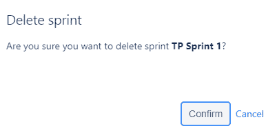

* * *