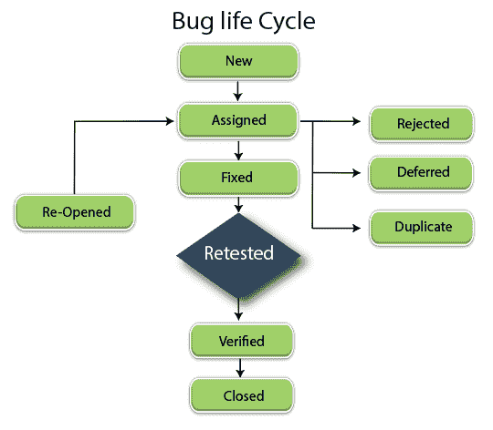

# JIRA 虫的生命周期

> 原文：<https://www.javatpoint.com/jira-bug-life-cycle>

JIRA bug 生命周期也被称为缺陷生命周期。bug 生命周期由 bug 经历的一组状态组成。bug 经历的状态数量因项目而异。我们可以将 bug 定义为错误、缺陷，或者我们可以说，当实际输出与预期输出不匹配时，它被称为 bug 或缺陷。bug 和缺陷这两个术语都是常用的，但是最流行的是 bug。软件开发生命周期的任何阶段都可能产生 bug，bug 可能存在于需求收集、设计 SRS 文档的设计阶段、开发阶段、测试阶段或最终用户在使用应用时进行的用户验收测试中。

一个 bug 有它的生命周期，从 bug 登录到 bug 关闭。Bug 会经历以下状态:

*   新的
*   分配
*   打开
*   固定的；不变的
*   再检查
*   再开
*   已证实的
*   关闭的

* * *

### 新的

在测试阶段，测试人员会识别错误或缺陷，并将其登录到错误跟踪工具，如JIRA、Bugzilla 等。测试人员检测到的错误将首次在错误跟踪工具中发布。该状态被指定为**新的**状态。

### 分配

状态为**新**的 Bug 被分配给软件开发人员，他们将调查 bug，以检查 bug 是有效还是无效。如果 bug 无效，那么他们会将状态更改为无效。如果错误是有效的，那么状态被改变为**指定的**，然后软件开发人员开始对缺陷进行修复。

### 打开

当 bug 被分配给软件开发人员时，他们就开始对它进行分析并修复缺陷。bug 或缺陷可以分三个阶段打开:

*   **复制**
    如果缺陷重复两次或者缺陷对应于前一个 bug 的相同概念，那么它将状态更改为复制。
*   **拒绝**
    如果开发人员觉得该缺陷不是真正的缺陷，则将其状态更改为拒绝。
*   **延期**
    如果 bug 没有更高的优先级，可以在下一个版本中解决，那么状态变为延期。延期状态也称为延期状态。

### 固定的；不变的

当开发人员进行必要的代码更改并验证更改时，他/她可以将错误状态设置为已修复。当开发人员修复了错误后，状态将更改为“已重新打开”或“已验证”。

### 重新检测

一旦软件开发人员修复了错误，它就会被分配回测试团队，以检查错误是否已经被修复。

### 再开

如果即使在开发人员修复了 bug 之后 bug 仍然存在，那么测试人员将状态更改为重新打开，bug 将再次贯穿整个 bug 生命周期。

### 已证实的

测试人员在开发人员修复错误后重新测试错误。如果没有发现错误，测试人员将状态更改为“已验证”。

### 关闭的

如果 bug 不再存在，它会将状态更改为“已关闭”。

**Bug 生命周期的参与者**

*   **bug 报告者**
    识别 Bug 的人被称为 Bug 报告者。Bug reporter 验证 Bug，并将所有与 bug 相关的细节输入 bug 跟踪工具，例如正确的主题、bug 优先级、应用组件、测试环境、bug 受理人、bug 描述。当需要时，测试人员需要发送所附的截图来澄清错误细节。
*   **bug 跟踪工具**
    一个 bug 可以登录 Bug 跟踪工具，Bug 跟踪工具可以是JIRA、Bugzilla、Assembla 等。
*   **Bug 群**
    Bug 群是一群可以看到 Bug 细节的人。Bug 组可以包括报告 bug 的测试人员或最终用户、被分配 bug 的开发人员、项目经理、质量保证经理。
*   **Bug 所有者**
    Bug 所有者是审核并拥有 Bug 的人。Bug 所有者检查 bug 信息是否足够，如果不够，那么 bug 被分配回 bug 报告器，以提供更多信息。根据给予 bug 的优先级，bug 所有者获得 Bug 的所有权，并在截止日期内修复它。

* * *