# 伊庇卡

> 原文：<https://www.javatpoint.com/jira-epic>

*   吉拉 epic 是一个大型用户故事，它根据客户或最终用户的需求被分解成较小的任务(用户故事)。
*   根据客户需求，根据需要在 epic 中添加或删除任务。
*   史诗被用来组织工作和创建层次结构。
*   Epics 通过将较大的任务组织成较小的任务来保持敏捷性。
*   Epic 是开发人员使用的工作层次结构的顶层。
*   史诗是更大的故事，有不同的开始和结束。
*   史诗可以跨越多个冲刺阶段，即史诗是通过多个冲刺阶段传递的。
*   史诗可以包含故事、bug 和任务，对它们进行分组就形成了一个大故事。
*   当史诗包含故事、bug 或任务时，所有这些问题类型在吉拉的层级结构中处于同一级别。
*   故事、bug、任务代表一件作品，而 epic 则是一组相关的问题。

**我们来了解一下史诗的结构流程:**

史诗由多个故事组成，而倡议由史诗组成。因此，我们可以说，主动性高于史诗。主动性使来自多个团队的 Epics 实现一个比任何 Epics 自己都要大的目标。

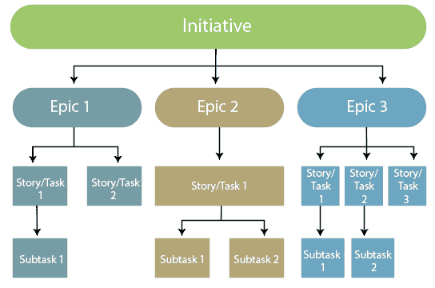

## 史诗作品

### 创造史诗

**创造史诗有两种方式:**

*   **从新一期**创作史诗

**步骤 1:** 点击出现在面板左侧的“+”图标。

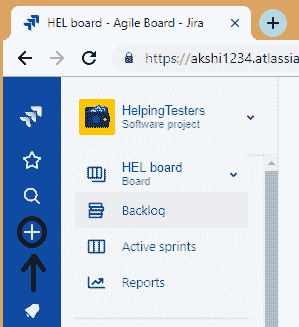

**第二步:点击+图标，屏幕出现，如下图:**

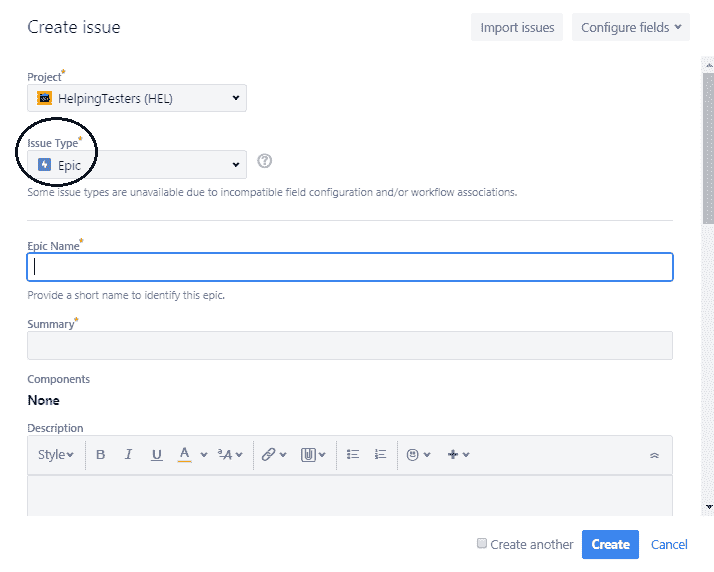

**第三步:**选择问题类型为史诗。

*   **从史诗面板**创建史诗

**第一步:**点击面板左侧出现的**待办事项**。

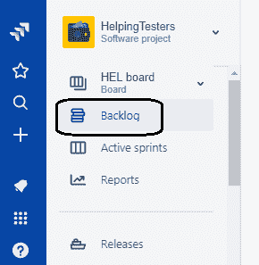

**第二步:**点击史诗面板中显示的**史诗**。

**第三步:**点击**创造史诗**链接。

在以上两种情况下，您需要输入以下详细信息来创建 epic:

*   **史诗名称:**是一部史诗的简短且唯一的标识符。
*   **史诗总结:**提供一部史诗的简短描述。

### 添加和删除故事

在 epic 中添加故事有两种方式:

*   **从问题创建屏幕添加问题**

**步骤 1:** 点击面板左侧出现的+图标。

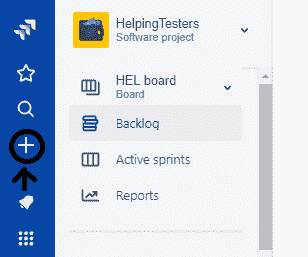

**第二步:**点击问题类型下拉菜单，选择 epic 以外的问题类型。

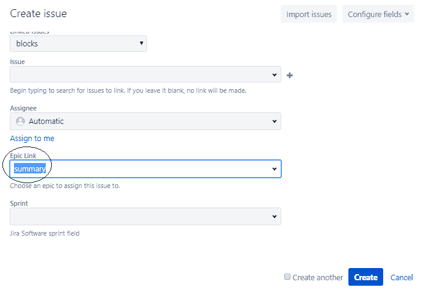

上面的屏幕显示，我们已经创建了一个类型为 **Bug** 的问题，我们将这个问题添加到一个史诗级的“摘要”中。我们在**史诗链接**字段添加史诗。

*   **从 Epics 面板添加问题**

**第一步:**点击面板左侧出现的**待办事项**。

**第二步:**从史诗面板点击**史诗**。

**第三步:**点击**在史诗**中创建发行链接。

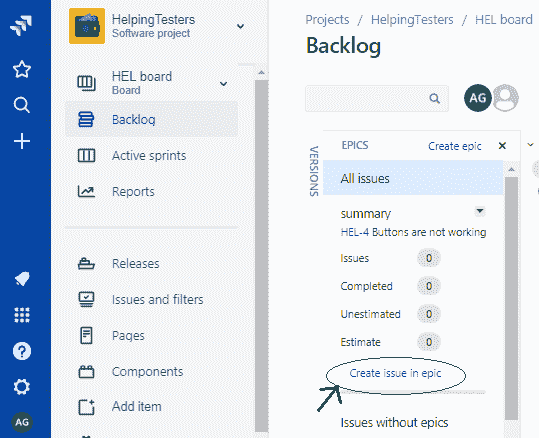

*   **从史诗中移除一个问题**

**要从 Epic 中移除问题，请遵循以下步骤:**

**第一步:**移至**待办事项**页面。

**第二步:**将议题拖放到**没有史诗的议题**中。

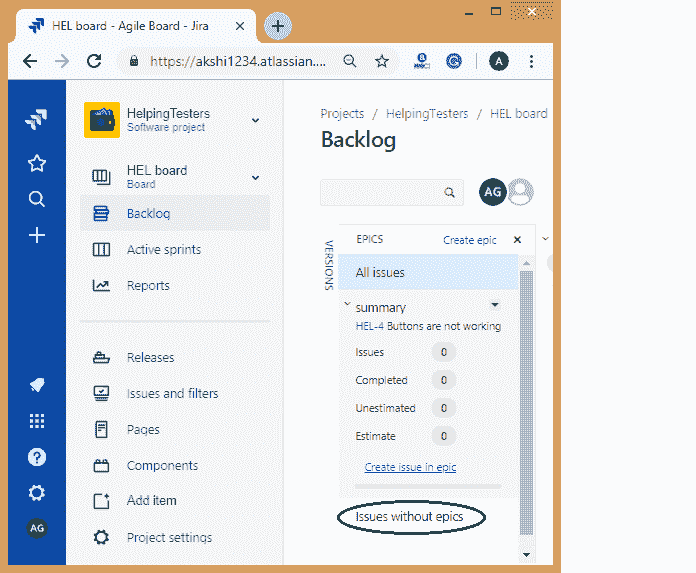

### 查看您所有的史诗

我们可以在 Backlog 中看到与你的史诗相关的信息。

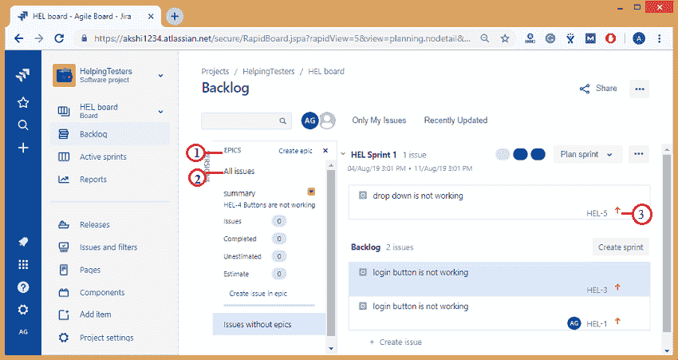

1.  **史诗面板:**导航到 Backlog，然后点击史诗面板查看和管理你的史诗。
2.  **史诗列表:**史诗面板显示项目中所有史诗的列表。
3.  **查看史诗中的问题:**单击史诗的名称，查看史诗中所有冲刺阶段的所有可用问题。

### 完成你的史诗

一旦与史诗相关的所有工作完成，那么史诗就被标记为完成。

**以下是完成史诗所需的步骤:**

*   点击面板左侧出现的**积压**。
*   从**史诗面板**点击**史诗**。
*   选择要标记为**完成**的史诗。
*   点击下拉菜单，选择选项“**标记为完成**”。

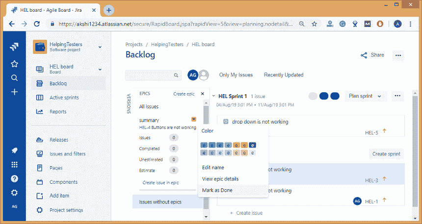

当您将史诗标记为**完成**时，将出现要求确认的对话框。

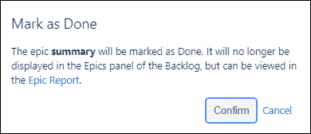

* * *