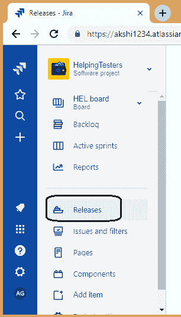
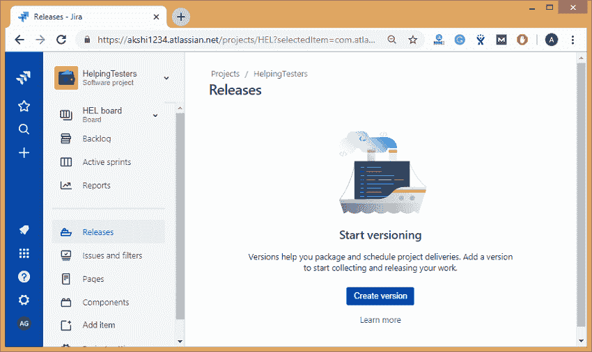
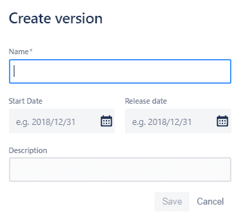
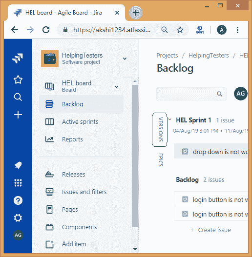
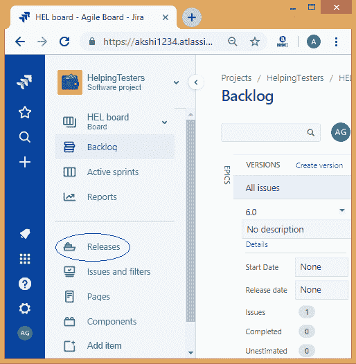
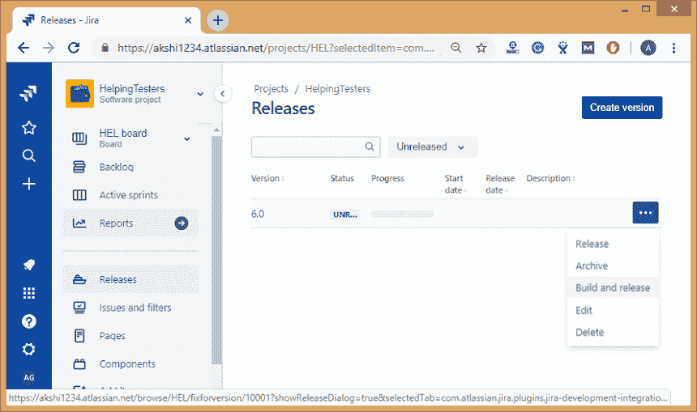

# JIRA版本

> 原文：<https://www.javatpoint.com/jira-versions>

版本用于组织和安排发布。如果创建了版本并为其分配了问题，那么我们可以使用该版本来过滤各种报告中的信息。

您可以将问题分配给特定版本，并可以在该版本中组织冲刺。

## 创建版本

**第一步:**移动到你的项目。

**第二步:**点击出现在面板左侧的**释放**。

**第三步:**点击**发布链接**后，屏幕出现，如下图:

**第 4 步:**点击创建版本按钮。

**第五步:**点击**创建版本**按钮，弹出窗口询问版本名称及其描述。

## 向版本添加问题

**第一步:**移动到你的项目。

**步骤 2:** 点击出现在面板左侧的积压。

**第三步:**点击版本面板。

**第 4 步:**将问题拖到要添加到版本中的版本。

## 完成一个版本

当您的版本准备发布时，您可以完成一个版本。当问题解决后，版本就可以发布了，代码也可以被检查和检查。

**步骤 1:** 导航到您的项目。

**第二步:**点击出现在面板左侧的**释放链接**。

**第三步:**要发布版本，转到省略号(...)>发布。

* * *