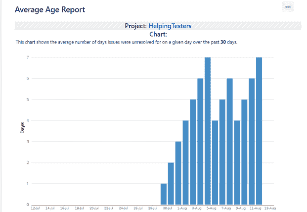
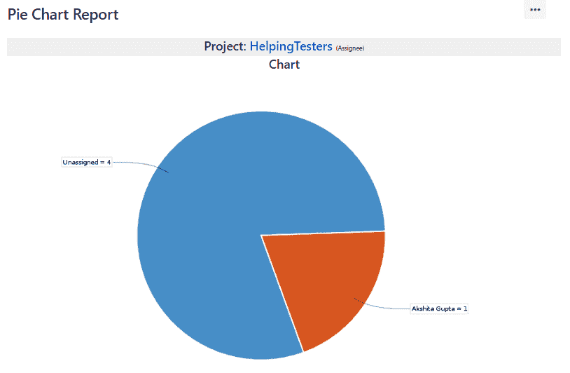
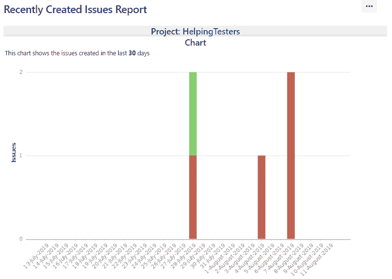
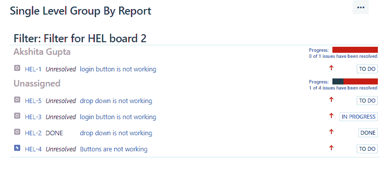
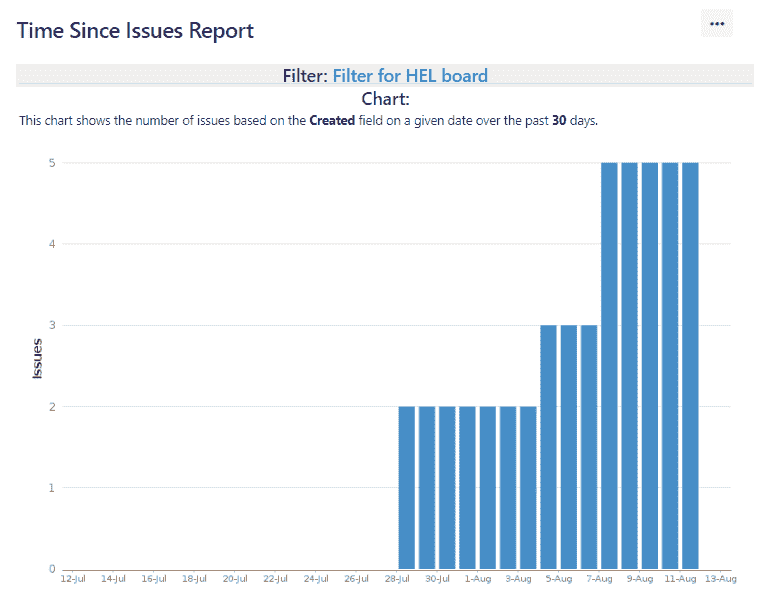

# JIRA报道

> 原文：<https://www.javatpoint.com/jira-reports>

报告用于跟踪和分析团队在整个项目中的表现。

JIRA有一系列的报告，显示关于你的项目，版本，冲刺，史诗和问题的信息。

**以下是报表生成的报表:**

## 平均年龄报告

平均年龄报告显示项目或筛选器未解决问题的平均年龄。它可以帮助您显示积压是否保持最新。

基本上，它会找到问题未解决的平均天数。

根据所选项目、在过滤器中选择的问题类型以及所选时间(小时/天/周/月)，生成“平均年龄”报告。

**平均年龄报告如下所示:**

上图显示了过去 30 天内所有未解决问题的平均年龄。

## 圆形分格统计图表

饼图显示从指定项目或问题筛选器返回的问题。我们可以创建一个问题过滤器，检索属于特定项目特定版本的所有问题。创建饼图是为了将属于特定统计类型的所有问题分组，统计类型可以是“受理人”、“项目”等。

假设我选择统计类型为**受让人**。

上面的屏幕显示了基于“受理人”类型的饼图。上图显示，一个问题分配给了阿克希塔古普塔，其他四个问题未分配。

## 已创建与已解决的问题

已创建和已解决的问题是一个报告，显示在给定时间段内创建和解决的问题数量。

此报告是根据用户选择的项目和问题筛选器创建的，图表可以是累积的，也可以不是。

## 最近创建的问题报告

最近创建的问题报告显示了已创建的问题数量，其中一些问题已得到解决。

在上面的屏幕中，红色部分显示问题已创建且未解决，而绿色部分显示问题已创建但已解决。

## 解决时间报告

解决时间报告确定了解决项目/过滤器问题所需的时间长度。

## 单级分组(按报告)

单级分组依据报告按问题筛选器的特定字段对问题进行分类，但不显示图表。

上面的屏幕显示，一个问题，即 HEL-1，被分配，而其他四个问题，即 HEL-5，HEL-3，HEL-2，HEL-4，未被分配。“按报告分组的单一级别”显示已分配和未分配问题的进度。

## 自问题报告以来的时间

自问题报告生成的报告显示了所选数据字段的问题数量，数据字段可以是“已创建”、“已更新”、“到期”、“已解决”。

* * *