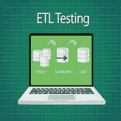

# ETL 测试教程

> 原文：<https://www.javatpoint.com/etl-testing>

ETL 测试教程提供了 ETL 测试的基本和高级概念。我们的 ETL 测试教程是为初学者和专业人士设计的。

ETL 工具从所有不同的数据源中提取数据，转换数据，并(在应用连接字段、计算、删除不正确的数据字段等之后。)并将其加载到数据仓库中。

ETL 测试是为了确保在业务转换准确后，数据已经从源加载到目标。它还涉及在源和目的地之间使用的不同阶段的数据验证

## 先决条件

在学习 ETL 测试之前，我们应该具备计算机功能的基本知识、数学基础、逻辑运算符和计算机语言。

## 观众

我们的 ETL 测试教程是为初学者和专业人士设计的。

## 问题

我们保证您在 ETL 测试教程中不会发现任何问题。但是如果有任何错误，请在联系表格中发布问题。

* * *