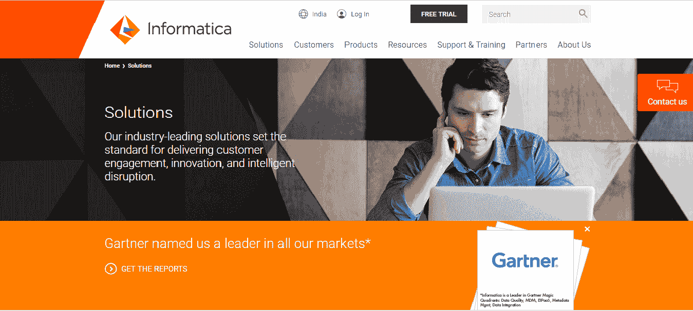
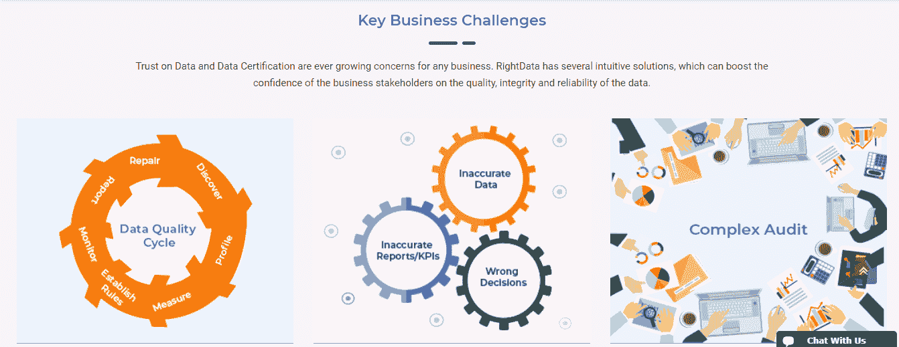
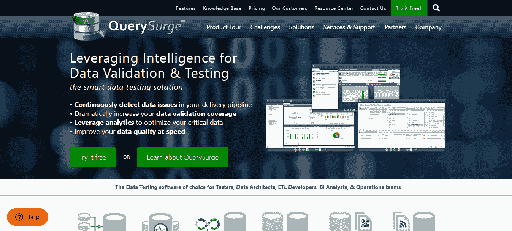
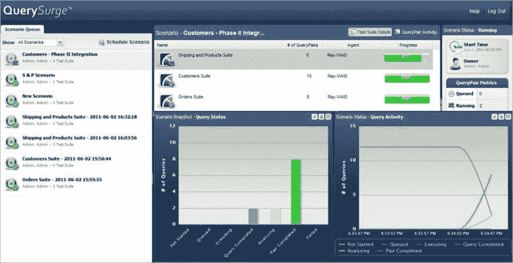
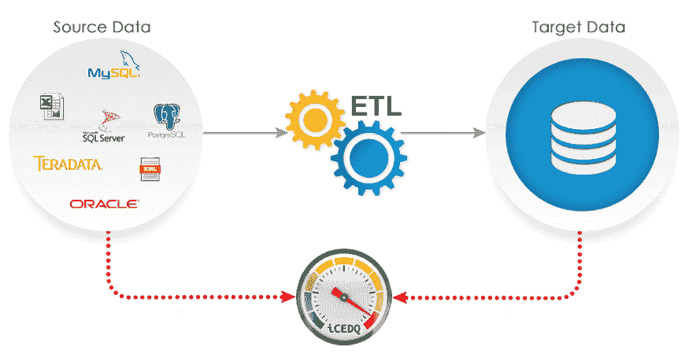
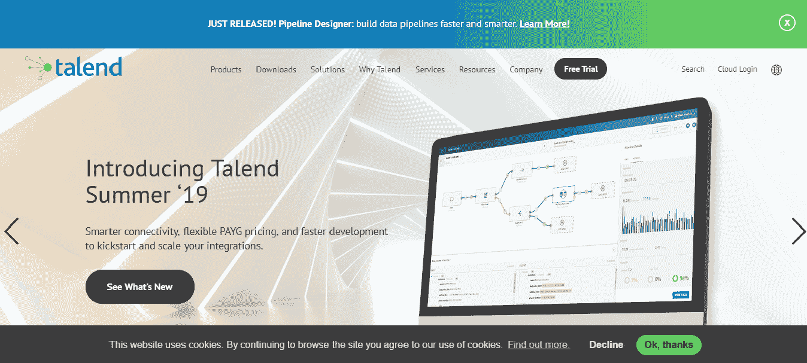

# 什么是 ETL 工具？

> 原文：<https://www.javatpoint.com/etl-tools>

提取、转换和加载有助于组织使数据在不同的数据系统中变得可访问、有意义和可用。ETL 工具是一种用于提取、转换和加载数据的软件。

在当今数据驱动的世界中，大量数据是由各种组织、机器和小工具生成的，无论它们的大小如何。

在传统的编程方式中，ETL 都是提取并进行一些转换操作，然后将转换后的数据加载到目标数据库文件等。

为此，需要用任何编程语言编写代码，如 Java、C#、C++等。

为了避免更多的编码和使用库，通过拖放组件可以减少我们的工作。

ETL 工具是用任何编程语言编写的一组库，它将简化我们的工作，使数据集成和转换操作满足任何需要。

例如，在我们的手机中，每次我们浏览网页时，都会生成一些数据。一架商用飞机每小时可以产生高达 500 GB 的数据。我们现在可以想，这些数据会有多庞大。这就是它被称为**大数据**的原因，但是这些数据在我们对其执行 ETL 操作之前是没有用的。

在这里，我们将介绍每个 ETL 过程。

**1。提取:**数据提取是 ETL 最关键的一步，它涉及到从所有存储系统中访问数据。存储系统可以是关系数据库管理系统、excel 文件、XML 文件、平面文件、索引顺序访问方法(ISAM)等。提取是最重要的步骤；它需要以不影响源系统的方式进行设计。提取步骤确保每个项目的参数都被区别识别，而不管它的源系统。

**2。转换:**在管道中，转换是下一个过程。在此步骤中，聚合数据被分析并应用于其上的各种功能，以将数据转换为所需的格式。通常，用于数据转换的方法有:**转换、过滤、排序、标准化、清除重复、翻译和验证各种数据源的一致性**。

**3。加载:**在 ETL 的过程中，加载是最后的阶段。在这一步中，处理后的数据(提取和转换后的数据)被加载到目标数据存储库中，即数据库。执行此步骤时，应确保负载功能执行准确，但要利用最少的资源。我们必须在加载时保持引用的完整性，这样数据的一致性才不会丢失。当数据被加载时，我们可以选择任何数据块，并且可以很容易地与其他数据块进行比较。

所有这些操作都可以通过任何 ETL 工具高效地执行。

## 对 ETL 工具的需求

数据仓库工具包含来自不同来源的数据，这些数据被组合在一个地方来分析有意义的模式和见解。ETL 处理异构数据并使其同构，这对于数据科学家来说是很顺利的。然后数据分析师分析数据并从中获得商业智能。

与涉及编写传统计算机程序的传统数据移动方法相比，ETL 使用起来更容易、更快。ETL 工具包含一个图形界面，它增加了源数据库和目标数据库之间映射表和列的过程。

ETL 工具可以从多个数据结构中收集、读取和迁移数据，并且可以跨不同的平台，如大型机、服务器等。它还可以识别发生的“增量”更改，使 ETL 工具能够只复制更改的数据，而不需要执行完整的数据刷新。

ETL 工具包括随时可以使用的操作，如过滤、排序、重新格式化、合并和连接。ETL 工具还支持转换调度、监控、版本控制和统一元数据管理，而一些工具与 BI 工具集成在一起。

## ETL 工具的优势

使用 ETL 工具比使用将数据从源数据库移动到目标数据仓库的传统方法更有益。

使用 ETL 工具的优点是:

**易用性:**一个 ETL 工具的首要优势是，它易于使用。该工具本身指定数据源以及提取和处理数据的规则，然后它实现该过程并加载数据。ETL 消除了编程意义上的编码需求，在编程意义上，我们必须编写过程和代码。

**运营弹性:**许多数据仓库被损坏并产生运营问题。ETL 工具具有内置的错误处理功能，它可以帮助数据工程师构建 ETL 工具的特性，从而开发出一个成功且装备良好的系统。

**可视化流程:** ETL 工具基于图形用户界面，提供系统逻辑的可视化流程。图形界面帮助我们使用拖放界面指定规则，以显示流程中的数据流。

**适用于复杂的数据管理情况:** ETL 工具有助于更好地移动大量数据并批量传输。在复杂规则和转换的情况下，ETL 工具简化了任务，这有助于我们进行计算、字符串操作、数据更改和多组数据的集成。

**增强商业智能:** ETL 工具改进了数据访问，简化了提取、转换和加载的过程。它改善了对直接影响战略和运营决策的信息的访问，这些决策基于数据驱动的事实。ETL 还使业务领导者能够检索基于特定需求的数据，并根据这些数据做出决策。

**推进数据分析和清理:**与 SQL 中可用的相比，ETL 工具具有大量的清理功能。高级功能关注复杂的转换需求，这通常发生在结构复杂的数据仓库中。

**(重复)增强的商业智能:** ETL 工具改进了数据访问，因为它简化了提取、转换和加载的过程。ETL 有助于直接访问信息，从而影响基于数据驱动事实的战略和运营决策。ETL 工具还使业务领导者能够根据他们的特定需求检索数据，并据此做出决策。

**高投资回报:**ETL 工具的使用节省了成本，通过使业务产生更高的收入。国际数据公司的研究发现，这些实施收集的 5 年投资回报率中位数为 112%，平均投资回报为 1.6 年。

**性能:**ETL 平台的结构简化了构建高质量数据仓库系统的过程。一些 ETL 工具附带了性能增强技术，如集群感知和对称多处理。

## ETL 工具的类型

ETL 工具提供了各种功能来促进工作流。随着 ETL 工具的日益普及，数据仓库市场已经看到了不同涌现和商业应用的重要性。

有多种可用工具，包括:

*   **Talend 数据集成**
*   **计算机**
*   **水壶**
*   **三叶草 ETL**

**基于云的工具是**

*   **AWS 胶水**
*   **快照逻辑**
*   **云计算**
*   赞美

**部分工具为:**

*   **电力中心信息化建设**
*   **业务对象数据集成器**
*   **IBM InfoSphere DataStage**
*   **微软 SQL Server 集成服务**
*   **Oracle 仓库构建器/数据集成器**
*   **Pentaho 数据集成(开源)**
*   **Jasper ETL(开源)**

## ETL 工具功能

基于 ETL 工具的数据仓库使用暂存区、数据集成和访问层来执行其功能。这是一个三层结构。

*   **暂存层:**暂存数据库或暂存层用于存储从不同源数据系统提取的数据。
*   **数据集成层:**集成层将暂存层的数据进行转换，并将数据移动到数据库中。在数据库中，数据被排列成称为维度的分层组以及事实和聚合事实。数据仓库系统中维度表和事件的组合称为模式。
*   **访问层:**最终用户使用访问层来检索数据，以便进行分析报告或执行功能。

## 信息动力中心工具

Informatica 是一家总部位于加州的软件开发公司。它从不同的数据源提取数据，通过不同的中间系统进行转换，然后加载。

Informatica 是一种基于 ETL 架构的数据集成工具。它为各种企业、行业和政府组织提供数据集成软件和服务，包括医疗保健、金融、保险服务、医疗保健等。

为了描述这一点，我们将假设 SAP 和 ORACLE 应用程序。

一家名为“XYZ”的公司正在使用思爱普应用程序进行业务交易和流程。一家名为“ABC”的公司也同样使用甲骨文。公司“XYZ”拥有公司“中航”现在，整个部门的所有业务、信息和原始数据都将转移到“XYZ”公司

在众多部门中，我们就拿人力资源部来说。如果有 2500 名员工与“ABC”公司有关联，并且需要将他们的账户从 emp ID 转移到“XYZ”公司的银行账户因此，我们将使用 Informatica 工具，因为它有一个数据提取工具，可以从公司“ABC”中提取员工信息 Informatica 将其转换为一个通用数据库，并设置了通用协议来传输，然后加载到公司的“XYZ”服务器上。

* * *

## 正确的日期

RightData 是一个自助式的 ETL/数据集成测试工具。它旨在帮助业务和技术团队实现数据质量保证和数据质量控制流程的自动化。

RightData 的界面允许用户验证和协调数据集之间关于数据模型差异或数据源类型的数据。

RightData 旨在为高复杂度、大容量的数据平台高效工作。

**特征:**

*   RighData 是一个功能强大的通用查询工作室。在这里，我们可以对任何数据源(SAP、BIGDATA、FILES、RDBMS)执行查询，探索元数据，分析数据，通过数据剖析、业务规则和转换验证发现数据。
*   使用 RightData，我们可以执行字段到字段数据与数据模型、源和目标之间的结构的比较。
*   RightData 有一个自定义业务规则生成器和一组验证规则
*   为了方便技术数据，RightData 具有批量比较能力。它与整个项目景观相协调。
*   RighData 与 CICD 工具(Jenkins、吉拉、BitBucket 等)的双向集成。)帮助我们的数据团队踏上通过数据运营实现 DevOps 的旅程。

* * *

## 查询催促

query spread 工具是为测试数据仓库和大数据而构建的。它还注意从源系统提取并加载到目标系统的数据是正确的，并且符合预期的格式。任何问题或差异都可以通过查询敦促快速识别。

**特征:**

*   是一个用于 ETL 测试和大数据测试的自动化工具。它提高了数据质量，加快了测试周期。
*   它使用查询向导验证数据。
*   它通过自动化人工工作和为特定时间安排测试来节省时间和成本。
*   query spread 支持针对 IBM、Oracle、微软等各种平台的 ETL 测试。
*   它有助于在不了解 SQL 的情况下构建测试场景和测试套装以及可配置的报告。
*   通过自动化过程，它生成电子邮件。
*   query spread 通过 ETL 过程验证、转换和升级数据。
*   它是一个商业工具，通过 ETL 过程连接源和升级数据。

* * *

## iCEDQ

icedq 是一个自动化的 ETL 测试工具。它是为以数据为中心的项目中面临的问题而设计的，如仓库、数据迁移等。icedq 在源和系统之间执行验证、确认和协调。它可以确保数据在迁移后没有瑕疵，并避免将坏数据加载到目标系统中。

**特征:**

*   当我们比较数百万个文件和数据行时，iCEDQ 是一个独特的 ETL 测试工具。
*   它有助于确定包含数据问题的确切列和行。
*   它支持回归测试。
*   它在执行后向订阅用户发送通知和警报。
*   Icedq 支持各种数据库，可以从任何数据库读取数据。
*   基于数据库中的唯一列，Icedq 比较内存中的数据。
*   icedq 无需任何自定义代码即可识别数据集成错误。
*   这是一个 30 天试用的商业工具，为自定义报告提供了警报和通知。
*   icedq 大数据版利用了集群的力量。

* * *

## 质量

QualiDI 是一个自动化测试平台，提供端到端测试和 ETL 测试。它自动化了 ETL 测试，提高了 ETL 测试的有效性。它还缩短了测试周期，提高了数据质量。QualiDI 可以非常快速地识别不良数据。QualiDI 减少了回归周期和数据验证。

**特征:**

*   QualiDI 创建自动化测试用例，它还为比较自动化数据提供支持。
*   可以与 HPQC、Hadoop 等集成。
*   它支持电子邮件通知。
*   它支持持续的集成过程。
*   它有助于读取数据和跟踪数据。
*   QualiDI 管理复杂的 BI 测试周期，消除人为错误，以及数据质量管理。

**优势**

QualiDI 的优势如下:

1.  QualiDI 支持敏捷开发。
2.  它提高了效率，节约了成本。
3.  QualiDI 的优势在于它允许测试用例的可追溯性。
4.  这也有助于减少缺陷。
5.  它有助于整合过程。
6.  这有助于数据的验证。
7.  它还支持持续集成过程。

* * *

## 数据集成开放工作室

Talend open studio for integration 是一个开源工具，它使 ETL 测试变得更加容易。它包括所有的 ETL 测试功能和附加的连续交付机制。借助于 Talend 数据集成工具，用户可以在远程服务器上用各种操作系统运行 ETL 作业。

ETL 测试确保数据从源系统转换到目标系统时不会丢失任何数据，并遵循转换规则。

**特征:**

*   Talend 数据集成支持任何关系数据库、平面文件等。
*   集成的图形用户界面简化了设计并开发了 ETL 过程。
*   Talend 支持远程作业执行。
*   在 Talend 的帮助下，我们可以在早期识别缺陷，这有助于降低成本。
*   Talend 可以快速检测转换规则中的业务歧义和一致性。
*   在 Talend 上下文中，切换是可能的。
*   Talend 可以通过详细的执行统计来跟踪实时数据流。

* * *

## 测试平台

测试平台是一个数据库管理和验证工具。它提供了独特的解决方案来解决与数据库相关的问题。用户管理数据回滚，这提高了准确性和测试生产率。它还有助于减少环境停机时间。

**特征:**

*   TestBench 维护数据机密性以保护数据。
*   它提高了关于决策的知识。
*   为了提高测试效率，它定制了数据。
*   它有助于覆盖最大的测试覆盖率，并有助于减少时间和金钱。
*   在测试平台中，数据隐私规则确保实时数据在测试环境中不可用。
*   我们可以借助 TestBench 分析表之间的关系，维护表之间的完整性。

* * *

## DBFit

DBFit 是一个开源的测试工具。DBFit 是在 GPL 许可下发布的。它为任何数据库代码编写单元和集成测试。为了维护测试，DBFit 很容易，可以从浏览器直接执行。测试使用表格编写，并使用命令行或 Java IDE 执行。它支持像**甲骨文、MySql、DB2、PostgreSQL 和 SQL Server** 这样的数据库。

* * *

## 以数据为中心的测试

以数据为中心的测试工具执行可靠的数据验证，以避免数据转换期间的数据丢失或数据一致性。它比较系统之间的数据，并确保加载到目标系统中的数据在数据量、格式、数据类型等方面与源系统相匹配。

**特征:**

*   这个测试是为了执行数据仓库测试和 ETL 测试而构建的。
*   以数据为中心的测试是最古老、规模最大的测试实践。
*   它提供数据迁移、ETL 测试和协调。
*   以数据为中心的测试支持各种关系数据库、平面文件等。
*   以数据为中心的测试也支持报告。

* * *

## 结论

ETL 测试不仅是测试人员的责任；它还涉及开发人员、业务分析师、数据库管理员(DBA)和用户。ETL 测试过程变得很有必要，因为它需要在固定的时间间隔内做出战略决策。

ETL 测试也被称为企业测试，因为它需要具备良好的 SDLC、SQL 查询、ETL 过程等知识。

* * *