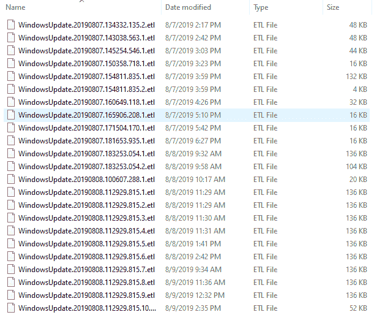

# ETL 文件

> 原文：<https://www.javatpoint.com/etl-files>

ETL 文件是由微软 Tracelog 软件应用创建的日志文件。Microsoft 程序以二进制文件的格式创建事件日志。在微软操作系统中，内核创建日志。ETL 日志包含如何访问磁盘和页面故障的信息，记录微软操作系统的性能，记录高频事件。

Eclipse 开放开发平台也使用。etl 文件扩展名。平台创建文件，该文件与。etl 文件扩展名。

跟踪日志由跟踪会话缓冲区中的跟踪提供程序生成，并由操作系统存储。然后，跟踪日志被写入日志，并以压缩的二进制格式存储，以减少空间量。从 ETL 文件中，可以使用命令行实用程序 Tracerpt 生成报告。ETL 文件的输出可以配置几个选项，例如文件的最大允许大小，以便日志不会导致计算机磁盘空间不足。

ETL 文件类型与 Eclipse 基础相关联。Eclipse 是一个开源社区，其项目专注于构建一个由可扩展的。

存储在磁盘上的 ETL 文件，以及它们的易失性和包含的数据的变化。首先配置跟踪会话时，使用的设置决定如何存储日志文件以及要在其中存储哪些数据。有些日志是循环的，旧数据会在文件达到最大值时被新数据覆盖。在某些情况下，Windows 会将信息存储到 ETL 文件中，例如当系统关闭时，当另一个用户登录到系统时启动时，当更新发生时，等等。

Microsoft office、one drive、sky drive 和 skype 也可以维护包含调试和其他信息的 ETL 文件。ETL 文件中的信息可用于各种场景的取证。

## 文件位置

在窗口系统中，ETL 文件可以在任何地方找到。这些文件存在于系统的大部分地方，可以包含大量信息，这些信息用于分析。在 windows 操作系统中，ETL 文件可以在不同的位置找到，可能有数百个文件是空的，有些文件包含数据。

* * *