# AutoEverywhere教程

> 原文：<https://www.javatpoint.com/automation-anywhere>

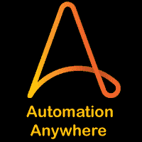

我们的AutoEverywhere教程提供了AutoEverywhere的基本和高级概念。本教程是为初学者和专业人士设计的。

本教程向您介绍了 automation anywhere，以及广泛的主题，例如**为什么要在任何地方使用 automation anywhere，automation anywhere 的历史，automation anywhere 架构，automation anywhere 的特性，Automation Anywhere 的类型，安装，**等。

## 什么是自动化？

自动化是一种用于在最少或没有人工干预的情况下完成任务的技术。这种技术用于使设备、系统或过程自动运行。自动化的主要目标是提高业务流程的效率，减少/取代人力。

自动化一词及其用法最早出现于 20 世纪 20 年代以后。然而，它在 20 世纪 90 年代初开始流行。正如术语“自动化”所说，该技术用于增加对完成不同类型的重复和基于规则的任务的支持，例如数据输入、发票处理等。为了执行这些类型的任务，我们必须利用**RPA**。“自动化无处不在”是流行的 [RPA 工具](https://www.javatpoint.com/rpa-tools)之一，用于轻松执行此类繁琐的任务。

> RPA 或RPA是一种使用软件来模仿重复和基于规则的人类行为的技术。它允许用户在计算机系统或其他数字设备上自动操作。

自动化可以分为四个不同的类别，如下所列:

*   宏记录器
*   应用级宏记录器
*   人工智能
*   业务流程自动化
*   RPA

## 任何地方的自动化

Automation Anywhere 是流行的 RPA 工具之一，它提供了强大的功能来自动化复杂的业务任务。它被用来自动化这些重复的、基于规则的、由人工执行的过程。它为组织提供了端到端的自动化策略。

Automation Anywhere 是一个基于网络的管理系统。它有一个控制室，帮助管理自动化任务。它主要用于企业层面，改变企业的运营方式。Automation Anywhere 的主要目标是为用户提供可扩展、安全和弹性的服务。

## 任何地方自动化的历史

Automation Anywhere 是一款由 Automation Anywhere，Inc .设计的 [RPA](https://www.javatpoint.com/rpa) 工具。该公司最初成立于 2003 年，名称为特提斯解决方案有限责任公司。早在 2010 年，这个名字就被改成了 Automation Anywhere，这是该公司的旗舰产品名称。

## 为什么要在任何地方使用自动化

RPA 工具的选择取决于任何企业的需求。然而，还有其他几个因素迫使企业选择“自动化无处不在”。根据官方网站，全球 700 多家企业已经部署了 Automation Anywhere 的 RPA 解决方案。它提供了行业领先的 RPA 平台，允许企业为员工赋能。

下面列出了企业应该使用“自动化无处不在”的一些重要原因:

### 没有编程

对编码技能或任何编程知识都没有要求。根据企业的要求，可以很容易地使用记录器记录手动操作，并使用任务编辑器进行编辑。

### 没有错误

Automation Anywhere 提供了无错误的自动化。它通过适当地自动化任务来消除人为错误。

### 快速部署

任何地方的自动化都提供了最快的 RPA 解决方案部署。它可以在几周内设置并运行。

### 快速性能

快速的自动化过程节省了时间。

### 精密工程

Automation Anywhere 旨在为采用自动化技术的企业提供一个有远见的路线图并增加创新。

### 安全性和合规性

任何地方的自动化都包括企业级安全性及其内置的治理和法规遵从性控制。

### 经验丰富的领导

Automation Anywhere 已经为多家企业部署了 RPA 解决方案。它有许多经验丰富的 RPA 专业人员，他们可以自动化业务流程，以实现良好的投资回报。

### 可攀登的

未来，企业可以使用 Automation Anywhere 轻松快速地扩展自动化。它可用于从桌面扩展到数据中心。

## AutoEverywhere架构

Automation Anywhere 采用分布式架构。它通过使用其控制室来提供集中管理系统。“自动化无处不在”的架构分为两个部分，机器人创建者和机器人运行者。两个组件都连接到控制室。

查看下图，该图显示了自动化随处架构的结构视图:

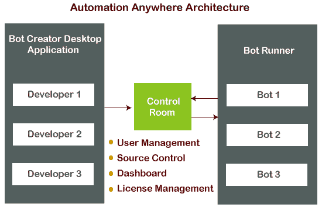

让我们更多地了解它的组成部分。AutoEverywhere体系结构的核心组件是:

### 机器人创造者

顾名思义，机器人创造者用于创建机器人。它们为开发人员提供了基于桌面的应用和工具，这些应用和工具可以针对活动的控制室进行验证，并帮助创建机器人。机器人的配置代码存储在控制室。多个开发人员可以上传、下载或创建单独的机器人/任务，并同时执行所有这些任务。

### 控制室

控制室据说是自动化随处架构中最重要的组成部分。这是一个基于网络的服务器，处理机器人创造者创建的机器人。它充当控制器，控制客户端、脚本、角色、凭证、安全性等的整个执行和管理。所有自动化任务/脚本都上传到控制室。控制室进一步管理和调度主机服务器或机器中任务的执行。它还提供了诸如**用户管理、源代码控制、许可证管理、自动化部署和仪表盘:**等功能

**用户管理**

控制室使管理员能够管理用户对不同系统、应用或网络的访问。

**源头控制**

控制室帮助管理机器人的代码。它使不同系统之间的代码共享变得更加容易。

**许可证管理**

控制室管理已购买的AutoEverywhere许可证。

Automation Anywhere 有两种类型的许可证，例如:

**开发许可证:**该许可证允许创建、编辑和运行机器人。

**运行许可:**该许可只允许运行机器人。我们不能创造或改变机器人。

**自动化部署**

控制室提供部署自动化机器人的选项。

**仪表盘**

仪表板提供了自动化机器人的全面见解。它还显示正在运行的僵尸程序、失败的僵尸程序和通过的僵尸程序等的数量。

### 机器人跑步者

机器人运行器是一组用于执行机器人的机器级代码。几个机器人可以同时执行。要运行机器人，需要运行许可证。Bot Runners 是运行时客户端，通常安装在基于 windows 的系统上。机器人跑者可以向控制室报告执行状态。

## 任何地方自动化的其他重要产品

AutoEverywhere的其他一些重要产品包括:

### 机器人洞察

Bot Insight 是一个允许用户分析僵尸工具性能的工具。它显示图表和统计数据来衡量每个机器人的表现。它还使用户能够计算用户通过自动化节省的时间。据说这是第一个用于机器人的分析解决方案。Bot Insights 将实时业务洞察与数字化员工绩效结合起来。

### 机器人农场

Bot Farm 是一个用于扩展 RPA 机器人数量的工具。它与企业版的“AutoEverywhere”集成在一起。Bot Farm 还可以随时随地通过单击部署来扩展数字劳动力的容量。它允许用户开发、部署和管理数百或数千个机器人，确保弹性和可扩展性。

### 机器人商店

Bot Store 是第一个数字市场，包含几个预建的机器人，用于不同的业务自动化任务。它允许企业在短时间内部署不同的机器人，如应用机器人、进程机器人和认知机器人。

## 任何地方自动化中的机器人类型

在“自动化无处不在”中使用三种类型的机器人:

*   任务机器人
*   当机器人
*   智商测验

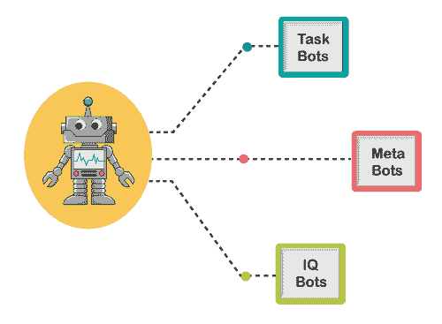

### 任务机器人

任务机器人是用于自动化基于规则的重复任务的机器人。任务机器人通常有益于文档管理、理赔管理、人力资源部、 [IT](https://www.javatpoint.com/it-full-form) 等。它们提高了生产率、减少了错误并节约了成本。

### bot 目标

元机器人被称为自动化构建模块，有助于下一代集成的可扩展性。这些是为复杂、可扩展的流程设计的。如果在过程中有任何改变的需求，我们必须对机器人进行一些编辑。更改将自动应用于与该特定机器人链接的所有进程。

### iq bots

智商机器人是一种先进的工具，包括像人类一样思考的能力。智商机器人也被称为认知机器人。这些机器人是为了自己学习并根据它执行任务而开发的。IQ 机器人使用先进的认知技术和先进的人工技术，让用户体验到自动化的力量。这些机器人包括自我学习、决策和主题专业知识等功能。这些机器人可以从半结构化和非结构化数据中提取数据。

## AutoEverywhere功能

Automation Anywhere 有几个独特的特性，使其在 RPA 工具中引人注目。查看此 RPA 工具中可用的以下重要功能:

### 任务编辑器

Automation Anywhere 允许用户在任务编辑器的帮助下生成任务。任务编辑器提供了一个工具箱，用户可以轻松地从工具箱中拖放项目来生成任务。任务编辑器还允许用户编辑、修改、分解或改进记录的任务。任务编辑器有 380 多个操作。一些重要的动作包括窗口动作、数据库动作、文件/文件夹动作、条件动作、键盘和鼠标动作、互联网动作、循环动作和剪贴板动作。

### 工作流设计器

该特性允许企业创建简单、易于理解的业务流程图形界面。它用于自动执行队列中的多个任务，包括备用路径位置，当主进程执行失败时执行。

### 报表设计器

此功能允许用户生成并打印显示任何特定任务的执行日志统计信息的洞察。它还可以用来创建自定义报告或见解。报告设计器提供诸如工作流时间线、任务时间线、任务运行、可视化日志和投资回报报告等选项。

### 触发器管理器

触发器管理器用于处理基于其他进程、服务或任务的任何任务或工作流，如启动/停止、系统更改、文件或文件夹更改等。

### 工作量管理

此功能用于确定执行流程的优先级。工作负载管理(WLM)允许企业在自动化队列中手动设置高价值流程，以满足企业的需求。它使用数百或数千个软件机器人来满足需求，并确保流程自动化的更好优化。

### 录音机

它是“自动化无处不在”的顶级功能之一。它允许企业记录、保存和测试他们的行为。它跟随用户的动作，并根据它创建一个机器人。开发机器人不需要编程技能，因为记录任何任务都比手工编码更简单。“任何地方的自动化”中有三种类型的录制选项:

**智能记录仪:**用来捕捉整个动作，就像物体克隆一样。

**屏幕记录器:**用于捕捉鼠标点击和移动、键盘操作等动作。

**网页记录器:**用于从网页中提取数据。它准确地记录了用户行为，并进一步自动化了基于网络的任务，而不需要任何编码或编程语言。

### 图像识别和光学字符识别

图像识别用于读取图像的对象，并将其与其他图像进行比较。它还可以从任何文档或整个网页中读取或识别图像。类似地，光学字符识别(OCR)识别图像，并以出色的方式将图像数据转换成文本或字符。

这些是“自动化无处不在”的重要特性。除此之外，还有**生命周期管理、运营分析、Citrix 自动化、可视化、屏幕抓取、web 数据提取、集中备份、安全、数据恢复、**等多项功能。

## 我们可以通过AutoEverywhere实现哪些流程的自动化？

几乎所有重复的和基于规则的数字流程都可以由 Automation Anywhere 控制。它使用图形用户界面像人一样控制进程。它还可以自动化复杂的流程，并高效地完成它们。

使用自动化随处可实现自动化的一些重要流程包括:

*   数据提取和提交
*   数据比较和验证
*   所有窗口和基于网络的用户操作
*   通过网络、窗口、云、遗留系统导航
*   基于规则的决策

#### 注意-手写数据和非基于规则的判断调用不能由 Automation Anywhere 自动化。

## 如何在任何地方安装自动化？

Automation Anywhere 的安装主要包括不同软件的配置，如 IQ Bots、Automation Anywhere 扩展、Automation Anywhere Bot Agent。Automation Anywhere 有不同的版本，如云入门包、高级包和社区版。我们可以根据自己的要求来选择。在你决定哪一个适合你之前，最好把它们都尝试一下。

Automation Anywhere 允许我们尝试 30 天的全功能版本。因此，一旦我们填写了官方网站上给出的表格，我们就有机会试用如何设置它的说明。我们不需要下载任何东西来检查试用版。它基于云，所以我们可以直接从我们的[网络浏览器](https://www.javatpoint.com/browsers)进行测试。但是，我们需要下载并安装“Automation Anywhere Bot Agent”、“Automation Anywhere Browser Extension”，并将我们的机器与控制室连接，以实现软件机器人。

按照下面给出的步骤安装或配置 Automation Anywhere 产品:

**第一步:**首先，我们需要导航到这里的官方网站:
[https://www.automationanywhere.com/](https://www.automationanywhere.com/)

**第二步:**然后，我们需要点击“开始免费试用”按钮，如下图所示:

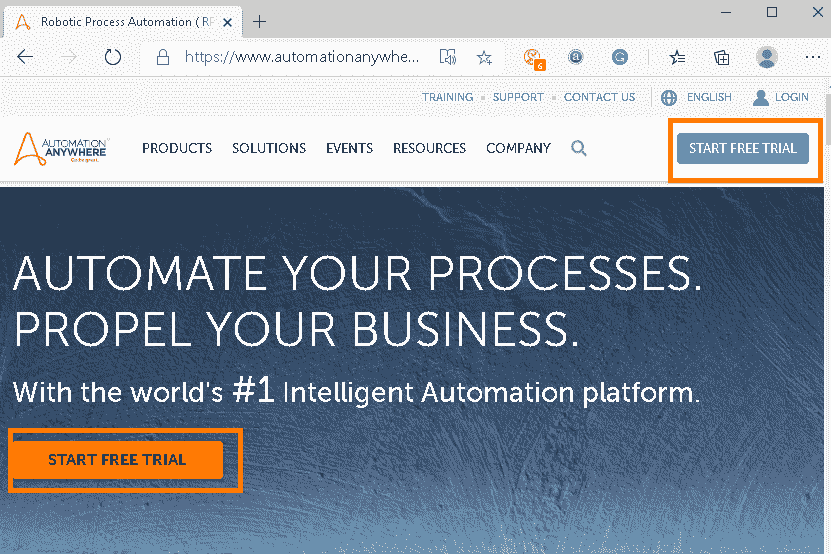

**步骤 3:** 在下一个屏幕上，我们将看到 Automation Anywhere 的不同版本及其功能。同样，我们需要点击一个按钮“开始免费试用”。

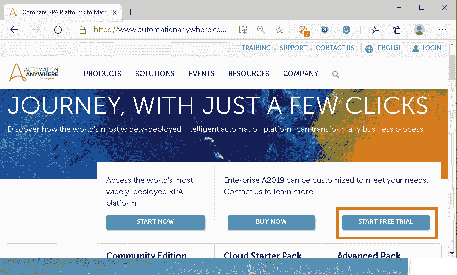

**第四步:**在下一个屏幕上，我们会看到一个表单，从我们这边询问几个细节。我们需要填写所有细节并提交表格，以获得自动化随处试用。

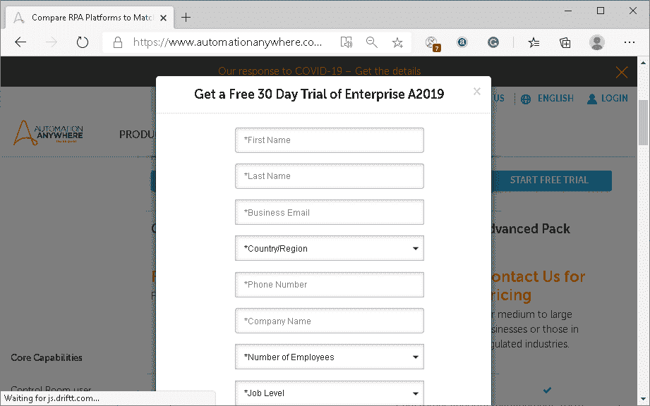

提交表单后，我们会收到提交确认，如下所示:

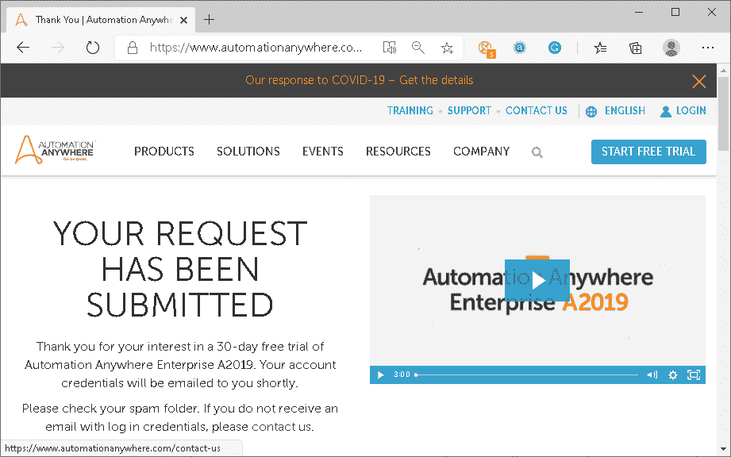

登录信息和链接通过我们填写表格时使用的邮件发送。

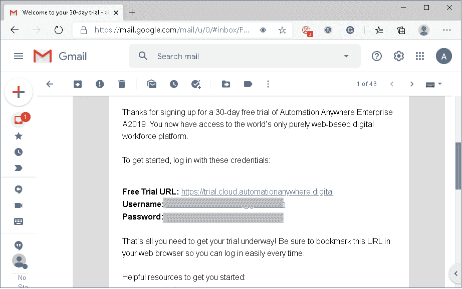

**步骤 5:** 接下来，我们需要打开一个链接，并使用电子邮件中给出的凭据登录。我们一登录，就会看到一个屏幕，要求我们设置一个新密码，而不是使用通过邮件发送的默认密码。

此外，如果我们忘记了登录凭据，我们需要设置一些恢复帐户所需的安全问题。

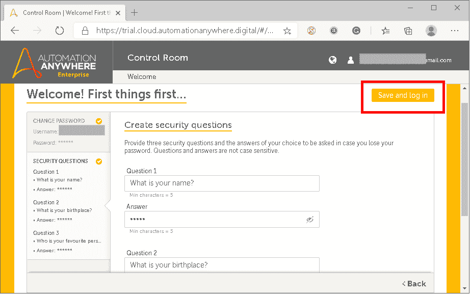

一旦我们配置了所有这些步骤，我们将到达自动化任意位置的控制室(仪表板)。

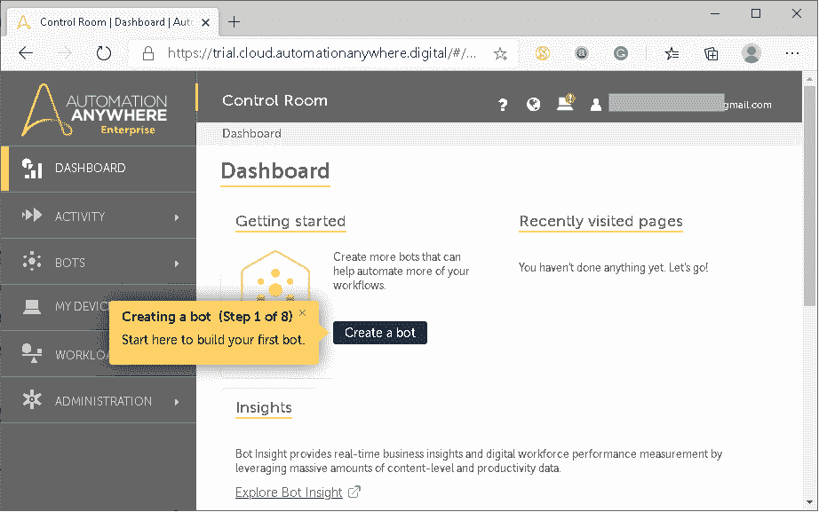

**第六步:**最后，我们需要按照屏幕上的说明连接我们的本地机器，并安装一些包来实现 IQ Bots 到我们的机器中。

这就是我们如何配置/安装 Automation Anywhere 的方法。

### 创建机器人

让我们使用这个工具创建一个简单的机器人。为了更好地了解它是如何工作的，我们正在创建一个机器人，它将通过执行机器人来自动打开网页。

**第一步:**首先，我们需要点击一个按钮“创建机器人”:

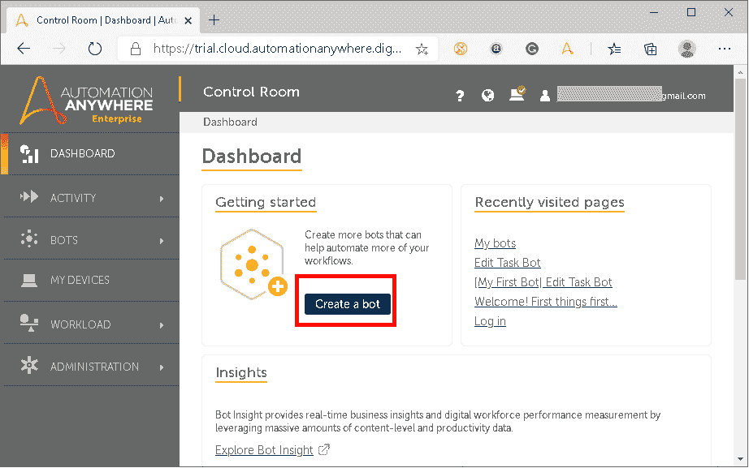

**第二步:**我们还可以选择写一个简短的描述，用来说明机器人的工作原理:

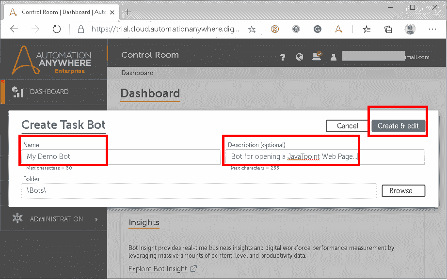

**第三步:**然后，我们需要选择一个要由机器人执行的动作。在这里，我们选择“启动网站”动作。我们需要在流程图的“开始”和“结束”点之间拖放适当的动作:

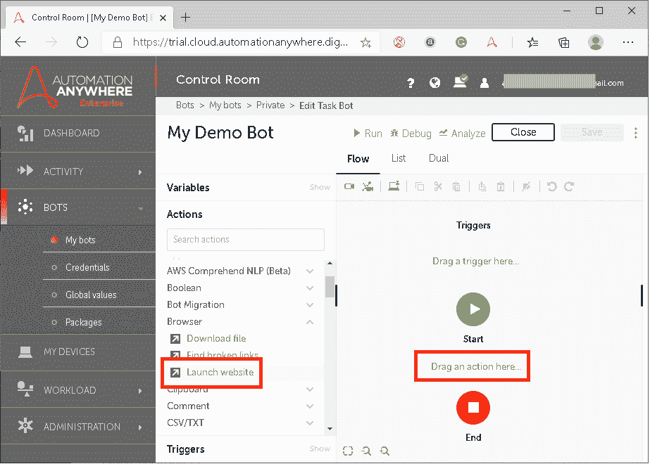

**第四步:**当我们将动作拖放到流程图上时，我们会得到一个新的屏幕，在这里我们需要填写网页的地址(URL)，并选择我们想要用来打开特定网页地址的浏览器:

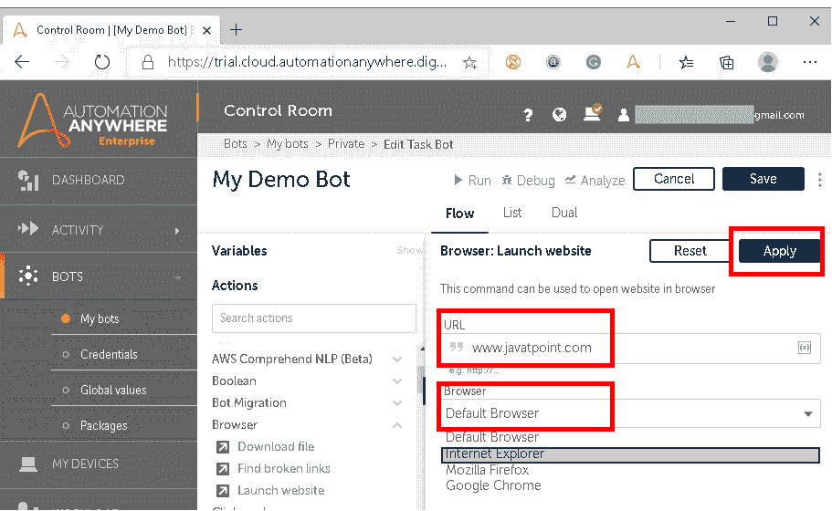

**第五步:**配置完以上所有步骤后，我们需要点击“保存”按钮。我们还可以检查最终的流程图结构，以确保一切都配置正确。

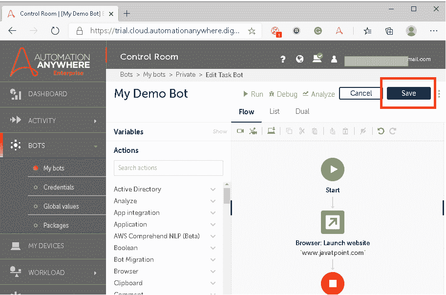

**步骤 6:** 最后，我们可以执行创建的机器人，使用顶部菜单栏中的选项“运行”启动指定的动作:

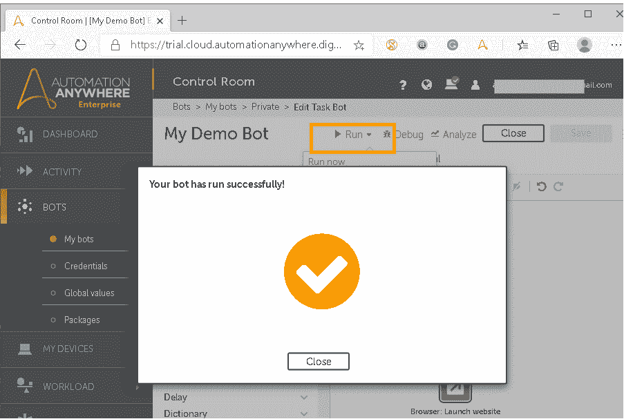

一旦机器人成功运行，指定的动作将被自动处理。这就是我们如何在任何地方的自动化中配置智商机器人来自动化任务。

## 在任何地方使用自动化的行业

该工具的设计方式使得它可以通过跨多台机器自动化业务流程来使多种类型的业务受益。因为每个组织中至少有人执行手动、重复和耗时的任务，因此，您认为的几乎任何行业都可以通过自动化受益。

使用该工具的一些流行行业如下:

| 在任何地方使用自动化的行业 | 自动化在任何地方的应用 |
| 金融/银行/会计 | 发票处理、数据输入、数据验证、银行应用之间的数据迁移、报告、审计、客户账户管理、表格填写、索赔处理等。 |
| 小时 | 在 PeopleSoft 中实现任务自动化。电子邮件通知和填充等。 |
| 运营/技术 | 创建帐户、软件设置、系统集成、应用集成、批处理、功能、负载和移动性能的硬件和软件测试等。 |
| 电信 | 从客户电话系统收集和整合数据，备份来自客户系统的数据，自动上传数据，收集竞争对手定价和电话制造信息等数据。 |
| 销售 | 发票创建和打印，在客户关系管理中添加或删除客户数据等。 |
| 营销 | 创建潜在客户生成报告、监控社会情绪等。 |
| 制造业 | 库存管理、ERP 自动化、数据监控、自动化物流数据、产品价格比较等。 |
| 政府 | 验证过程、自动化每日报告、将遗留系统与更新的系统集成、填写分包商表格等。 |
| 卫生保健 | 医生报告、患者数据迁移和处理、医疗账单生成、保险数据自动化和索赔处理、索赔状态和资格标准自动化、患者记录存储等。 |
| 款待 | 竞争对手的价格分析和比较、客人数据处理、数据验证、支付处理、账户生成等。 |
| 零售 | 从制造商网站提取产品详细信息，自动更新在线库存和项目信息，导入网站和电子邮件销售等。 |
| 生活消费品 | 数据输入、订单处理、订单状态更新、索赔处理、解决方案咨询、FTP 自动化、激励性索赔更新等。 |

## 任何地方自动化的未来范围

RPA 市场正在快速增长。到目前为止，已经为制造自动化和机器人技术开设了 300 多万个职位。根据麦肯锡公司的报告，预计到 2025 年，RPA 将产生近 5.2 至 6.7 万亿美元的重大经济影响。因为这是无代码的，任何人都可以在任何地方学习自动化，而不需要任何编码或编程技能。

运营专家、营销专家和对编程有初步了解的数字营销人士可以轻松采用这一工具。所有想从事RPA职业的工程师都可以在任何地方从事自动化工作。

“AutoEverywhere”中有几个角色，例如:

*   开发人员(70 %的职位空缺)
*   经理(20% %职位空缺)
*   建筑师(10% %职位空缺)

如你所见，最关键的角色是开发人员；因此，作为 RPA 开发人员，有更多的机会。你可以成为一个更好的 RPA 开发人员，几乎没有或根本没有编程知识。

## 观众

我们的自动化教程旨在帮助初学者和专业人士。

## 问题

我们向您保证，您在通过我们的自动化随处教程学习时不会发现任何困难。但是如果您在本教程中发现任何错误，我们请求您将问题发布在联系表中，以便我们进行改进。

* * *