# UiPath 教程

> 原文：<https://www.javatpoint.com/uipath>

我们的 UiPath 教程提供了 UiPath 的基本和高级概念。本教程是为初学者和专业人士设计的。

本教程向您介绍了 UiPath 以及广泛的主题，如**为什么使用 UiPath、UiPath 的历史、UiPath 的体系结构、UiPath 的特性、UiPath 的产品、UiPath 中的机器人类型、安装、**等。

## UiPath(路径)

UiPath 是最受欢迎的 RPA 工具之一，它提供端到端的解决方案来帮助组织有效地自动化重复和冗余的任务。UiPath 是业内领先的 [RPA](https://www.javatpoint.com/rpa) 提供商，为组织提供先进的机器人电源功能，以自动化其重复出现的业务流程。 [RPA](https://www.javatpoint.com/rpa-interview-questions) UiPath 是一个开放平台工具，它提供了数百个内置的、可定制的集成，集成了 ERP、BPM 和 [AI](https://www.javatpoint.com/artificial-intelligence-tutorial) 等多种技术。

我们可以使用 UiPath 开发软件机器人(也称为机器人)，模仿人类的动作并像人类一样执行任务。与人类不同，机器人产生快速结果而不会出错。因此，UiPath 可以帮助组织将其枯燥、重复的任务转换为自动化过程，并允许人类专注于其他需要人工智能或干预的任务。

*   UiPath 主要用于执行 Windows 桌面任务的自动化。
*   UiPath 提供了易于使用的用户界面，支持拖放。
*   UiPath 用于自动化冗余任务，并减少/消除此类任务的人为干预。
*   UiPath 提供了一个标准的工作室版本，具有所有高级功能，试用期为 60 天。
*   UiPath 还有一个社区版，是免费的，包含了 Studio 版本的大部分功能。

## UiPath 的历史

UiPath 目前是全球顶尖的软件公司之一，为 RPA 提供平台。2005 年初，由罗马尼亚企业家丹尼尔·迪内斯和马里乌斯·蒂尔卡首次提出。该公司从罗马尼亚首都布加勒斯特出发。后来，它被扩展到全球几个国家。

2020 年 4 月，UiPath 被英国《金融时报》100 强评选为顶级科技公司，在整体成长型公司中排名第 2 和第 2。

## 为什么要使用 UiPath

有各种自动化工具，如 Automation Anywhere、Blue Prism、Pega 等。然而，它们是根据行业标准制造的，但是 UiPath 比它们稍有优势。这是因为说到桌面自动化，UiPath 是其中最有效的。

下面列出了解释为什么我们更喜欢 UiPath 的其他一些关键方面:

*   与其他自动化工具相比，桌面自动化是 UiPath 的一个独特功能。
*   UiPath 可以轻松处理远程桌面应用。
*   与其他自动化工具相比，UiPath 中的数据处理过程和技术要好得多。
*   UiPath 完全灵活，并且与刮擦技术兼容。
*   与 RPA 市场上的其他自动化工具相比，在 UiPath 中编写逻辑和方法更好。

## UiPath 架构

该架构主要有三个 UiPath 组件——ui path Studio、UiPath Orchestrator 和 UiPath Robot，以及数据库服务器和浏览器组件:

*   UiPath Studio 是一个基于图形用户界面的仪表板，用于为要自动化的任务创建自动化工作流。
*   软件机器人或机器人用于执行指定的自动化步骤或活动。
*   Orchestrator 是 UiPath Studio 和软件机器人之间的接口媒介。它有助于管理自动化任务。

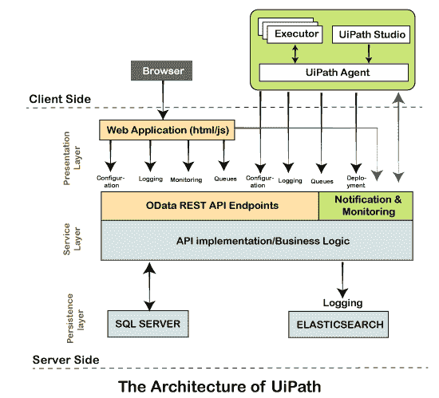

该架构可分为以下两部分:

*   客户端和服务器端细节
*   三层细节

### 客户端和服务器端详细信息

这里，术语客户端包括用户或开发人员可以直接访问的 UiPath 组件。一般包括 UiPath Studio、机器人、[浏览器](https://www.javatpoint.com/browsers)、UiPath Agent。

此外，服务器端包括 UiPath 的后端任务。当用户创建活动或工作流时，它们存储在数据库中。UiPath orchestrator 选择适当的功能，并指示软件机器人按照代码执行指定的任务。此外，机器人的日志和统计数据是后端的一部分。日志有助于分析机器人的性能和发现错误。

### 三层细节

UiPath 的体系结构可以通过将组件分为以下三层来解释:

**客户端层**:客户端层由用户可评估的 UiPath 组件组成。例如，UiPath Studio、机器人、浏览器、UiPath 代理和执行器。通过使用这些组件，用户或开发人员可以设计和开发各种要自动化的任务。这些任务可以在软件机器人的帮助下执行。这一层也被称为表示层。

UiPath 机器人包含以下两个组件:

*   **UiPath 代理服务**:在 UiPath 中，该服务充当 UiPath 客户端和服务器端之间的中介。所有的细节和信息都通过代理传达。此外，消息被记录到 Orchestrator 中，然后传输到 SQL 服务器。
    该服务还可用于检查系统托盘中的所有可用任务。此外，它可以修改系统设置并允许现有任务启动/停止。
*   **UiPath 执行器服务**:该服务由软件机器人使用，在 Windows 会话下执行指定的任务。

**服务器层**:这是 UiPath 架构的第二层，也是最重要的一层。所有服务器详细信息都显示在服务器层中。服务器层主要包括 UiPath Orchestrator。当机器人被完全开发出来执行任务时，整个项目可以上传到服务器上。在 Orchestrator 的帮助下，该项目可以在多个系统上执行。

指挥者控制整个项目。它监控项目活动，安排软件机器人执行，并根据过滤后的需求生成汇总报告。它有助于协调软件机器人继续执行重复的任务。凭借其基于网络的管理系统，它帮助我们的项目满足项目要求、服务水平和时间表。

**持久层**:该层主要由数据库服务器组成。机器人的所有配置细节都存储在这一层。配置细节包括不同用户的数据、他们各自的机器人、分配的任务、日志信息和资产细节等。所有这些细节都由用户在 Orchestrator 中输入。

此外，持久层还负责保持由 UiPath 代理服务更新的日志细节。这些日志存储在弹性搜索中。日志主要有助于发现错误并加以纠正。流程级数据一般存储在 [SQL](https://www.javatpoint.com/sql-tutorial) Server 等关系数据库管理系统中。这使得从海量数据中搜索日志变得更加容易。

持久性层还负责队列和队列中的任务。

## UiPath 的产品

UiPath 包括一些其他产品，它们提供不同的特性和功能来有效地使用该工具。该工具主要提供以下三种产品:

**ui path Studio**:ui path Studio 是工具内一个用户友好的界面，允许用户借助图表直观地规划和设计不同的自动化流程。这些图表只是要执行的特定任务的结构性表示。

**UiPath 机器人**:流程设计好之后，下一步就是在 UiPath 工作室内执行同样的流程。为了执行整个过程，UiPath Robots 用于将过程转换为任务。这些机器人被用来分配不同的步骤，并以与人类相同的方式执行它们，但没有任何人类干预。UiPath 机器人被设计成当机器上发生定义的活动时自动开始执行任务。

**UiPath Orchestrator** :在 UiPath 中，Orchestrator 是一个基于 web 的应用。它提供了部署、监控、调度和控制软件机器人和进程的选项。它是一个集中的平台，用于控制/管理所有软件机器人。

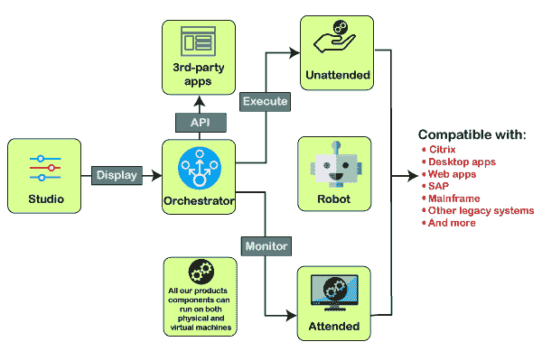

## UiPath 中的机器人类型

UiPath 主要有两种类型的机器人，如有人值守机器人和无人值守机器人:

### 有人值守的机器人

有人值守的机器人像人类一样在相应的工作站上操作，这有助于用户完成常规任务。这些类型的机器人通常由用户事件触发。它们不能用于从 Orchestrator 启动任何任务，也不能在屏幕被锁定时使用。这种机器人只能从机器人托盘或使用命令提示符中的特定命令启动。有人值守的机器人只有在有人监管的情况下才能运行。

根据许可类型，有人值守机器人可进一步分为以下类型:

*   **出席**:他们可以和一个人在同一个工作站上工作，通常是通过用户事件发起的。
*   **Studio** :用于将 Studio 连接到 Orchestrator 进行进一步的开发过程。
*   **StudioX** :用于将 StudioX 连接到 Orchestrator 进行进一步的开发过程。
*   **StudioPro** :用于将 StudioPro 连接到 Orchestrator 进行进一步的开发过程。

### 无人值守机器人

无人值守机器人通常被称为自主机器人，在执行任务时不需要人工监督。这些类型的机器人在虚拟环境中工作，可以同时自动完成几项任务。它们包括有人值守机器人的所有功能。他们还负责其他任务，如远程执行、监控、调度，并为进程队列提供支持。

无人值守机器人可以执行任何类型的流程、任务和测试用例。当它们用于运行并行进程时，每个现有的进程使用一个单独的许可证。

根据许可类型，无人值守机器人可进一步分为以下类型:

*   **无人值守**:他们可以在虚拟环境中工作，自动化许多任务，无需人工监督。
*   **非生产**:在后续开发过程中以无人值守的方式使用。这些类型的机器人不能运行测试用例。
*   **测试**:在无人值守模式下使用，用于进一步的测试过程。这些类型的机器人只能用于执行测试用例。

## UiPath 功能

UiPath 有几个特性和功能，例如:

**托管选项** : UiPath 可以轻松托管在云环境和虚拟终端上，使得这个工具在云平台上灵活。

**应用兼容性**:由于与 web 和桌面应用的兼容性更强，UiPath 支持的应用和活动范围更广。同时拥有 web 和桌面应用对自动化有更多好处。

**集中式知识库**:因为有了集中式知识库，多个用户可以同时处理或控制软件机器人。

**安全性**:安全性是 UiPath 的主导特性之一。UiPath 包括许多安全功能，并通过频繁更新不断增加更多功能:

*   UiPath 包括帐户锁定设置，可保护用户免受暴力攻击。
*   如果用户跨不同的机器登录，该工具将自动检测并结束之前的登录会话。这意味着同一登录凭据一次可以在单个系统中保持活动状态，从而提高了安全性。
*   UiPath 限制所有 orchestrator 凭据输入框跨 web 浏览器自动提交数据。此功能保护用户数据并提高整体安全性。
*   UiPath 已经实现了隐身模式，可以用来在后台执行任务。这将在屏幕上隐藏执行，并以静默方式执行任务。

**高级刮屏解决方案** : UiPath 拥有高级刮屏功能，可以配合 [Java](https://www.javatpoint.com/java-tutorial) 、 [SAP](https://www.javatpoint.com/sap-full-form) 、[等各种应用。Net](https://www.javatpoint.com/net-framework) 、Flash、 [PDF](https://www.javatpoint.com/pdf) 等。借助先进的屏幕刮擦解决方案，用户可以获得比市场上其他自动化工具更高的精确度。

**可靠的业务流程建模工具** : UiPath 提供了几个可靠的工具来提高自动化能力和模型业务流程的卓越性。

**可扩展性和健壮性**:该工具是健壮和可扩展的，并且附带:

*   高效和有效的调试支持和异常处理系统。
*   人工智能处理常规应用，如 excel、pdf、Outlook 任务等。

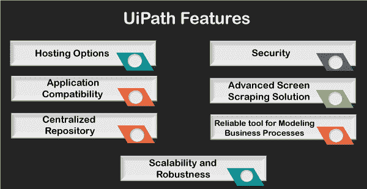

## UiPath 中的工作流

工作流是组合在单个任务中的多个流程的集合。工作流的执行方式与单个任务在 UiPath 中的执行方式相同。工作流的活动是从核心活动包中提取的，核心活动包包括在 UiPath 中设计和开发自动化任务所需的基本活动。

这些活动使软件机器人能够执行以下任务:

*   重新创建或自动化人工操作和活动，例如使用鼠标和键盘、填写表单、提取内容或比较数据等。
*   使用光学字符识别或图像识别技术自动提取数据。
*   创建要在机器上自动执行的基于触发器的操作和活动。
*   执行浏览器自动化、web 自动化、交互和数据操作。
*   通过从机器上获取更多信息来处理数据，如系统日志或错误日志等。
*   在机器上执行其他常规任务，就像人类在操作机器时所做的那样。

工作流可能包括贯穿整个任务流程的几个活动。一些重要活动列表如下:

| 活动 | 句法 | 行动 |
| 每一个 | UiPath。核心活动 | 用于在组件的每个元素上应用任何特定活动或一组多个活动。 |
| 破裂 | UiPath。核心。活动。休息 | 用于对当前的每个活动执行退出，并进入工作流的下一个活动。 |
| 重试范围 | UiPath。核心活动 | 用于重试现有活动，直到找到条件或引发错误。 |
| 选中“真” | uipath . core . activities . check true | 用于检查应用的布尔表达式是否为真。否则，返回错误。 |
| 勾选假 | UiPath。核心。活动。检查错误 | 用于检查应用的布尔表达式是否为假。否则，返回错误。 |
| 调用工作流文件 | UiPath。核心活动 | 用于在有或没有参数的情况下同步调用工作流。 |
| 调用工作流交互 | UiPath。核心活动 | 几乎类似于调用工作流文件活动，但在窗口中提供交互式会话。 |
| 继续 | UiPath。核心.活动.继续 | 用于跳过每个循环中的当前迭代。 |

## 可以通过 UiPath 实现自动化的流程

尽管 UiPath 能够显著提高操作性能。但是，尽管它为自动化提供了几种选择，但有些业务流程比其他流程更有益。为了获得更好的投资回报，使用适合的业务流程进行自动化是非常重要的。

以下是最重要的因素，可以帮助组织找到可以使用 UiPath 自动化的流程:

### 人类参与

大多数组织过程都是重复和耗时的，这高度依赖于人类的参与，但通常不需要人类的智慧。这些过程可能包括订单处理、索赔处理、数据迁移、管理客户数据库等。这些是最适合自动化的过程。自动化这些过程将减少总时间，使任务的执行更快，更不容易出错。

此外，参与此类人工流程的员工可以自由地专注于更有意义和创新的任务，这些任务需要人工智能和干预。

### 复杂性

UiPath 可以用于简单的过程，如复制粘贴或打字，也可以用于复杂的过程，如欺诈检测或应付账款。尽管复杂的流程更有可能需要更多的时间和投资来实现自动化，但这些是最合适的流程，并对公司的业务运营产生更大的影响。

### 卷

大多数业务流程没有特定的时间限制或界限，这意味着无论节假日如何，都可能有大量的订单、请求或投诉。当一个组织依赖于人类员工时，这种工作量就不容易处理了。因此，这些过程可以使用 UiPath 机器人实现自动化。这些机器人将全年无休，全年 365 天工作。机器人是执行这些大批量任务的最有效和最高效的选择。

### 标准化和稳定性

UiPath 最适合基于规则、一致和数据驱动的流程。这些过程是高度可定义的，并且每次都以相同的方式发生。后台流程属于此类流程，被认为更适合自动化，因为它们更倾向于事务性和重复性。这些流程可能包括开户、索赔处理、交易复制或管理等。另一方面，根据流程的复杂性，前台自动化也是可能的。

### 外包的难度

一般来说，可以看到许多业务流程需要高度的法规遵从性。当涉及到安全性时，这样的过程很难维护。这是因为这些类型的流程需要更高程度的监督和直接控制。这种流程通常出现在金融和业务流程外包部门。借助 UiPath 机器人，组织可以开发更安全、更稳健的合规策略。

## UiPath 安装

在我们继续安装之前，让我们简单地看看 UiPath 的不同版本:

*   **社区云**:这个版本适合个人了解 UiPath 自动化的基础知识，并在上面练习自动化任务。
*   **工作室**:这个版本一般是企业层面的个人使用。
*   **企业云**:这个版本的 UiPath 基于云，包含 Studio、Robots 和 Orchestrator。这个版本一般是大机构、大企业用的。
*   **企业服务器**:ui path 的企业服务器是整个自动化平台的内部版本。它还包括 UiPath 工作室、机器人和管弦乐队。这个版本用于大规模自动化。

在这里，我们将安装 UiPath 的社区云版本。其他版本的安装过程相同。此外，UiPath 社区云是 UiPath 的免费版本。其他版本有 60 天的免费试用期。

按照下面给出的步骤安装 UiPath:

**第一步**:首先我们需要使用以下链接导航到官方网站:[https://www.uipath.com/](https://www.uipath.com/)

**第二步**:然后，我们需要点击按钮“尝试 UiPath Free”，如下图所示:

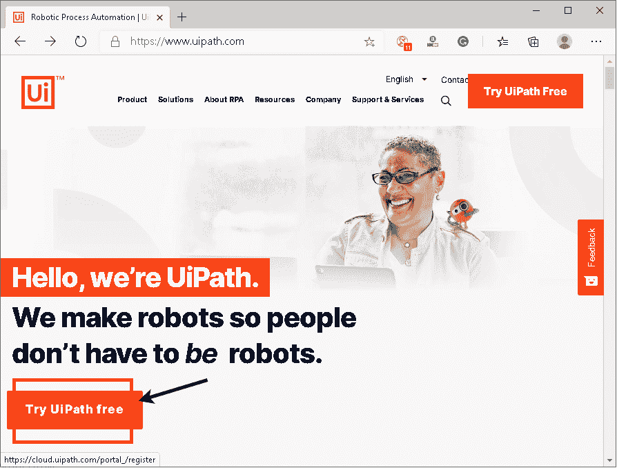

**第三步**:在下一屏，我们会看到左侧是 UiPath 的不同版本，右侧是报名页面，如图所示:

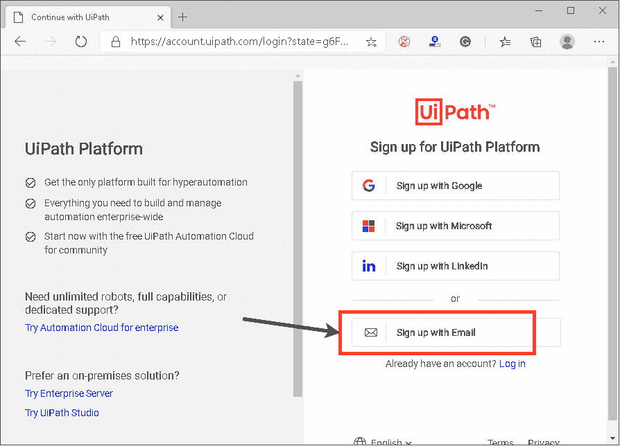

在这里，我们需要使用电子邮件、谷歌帐户、微软帐户或 Linkedln 注册。我们将使用“用电子邮件注册”。

**第四步**:一旦点击“用邮件报名”按钮，我们会得到一个询问一些细节的表格，如下图所示:

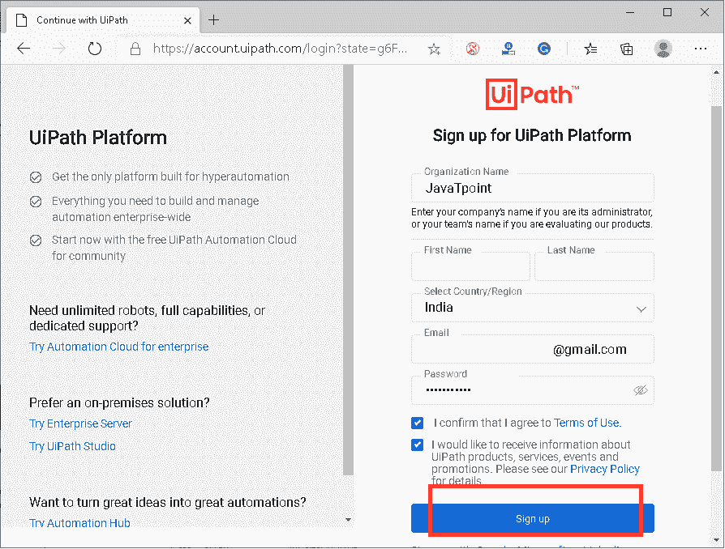

**第五步**:我们提交表单后，会在提交的邮箱-id 上收到一封验证邮件。

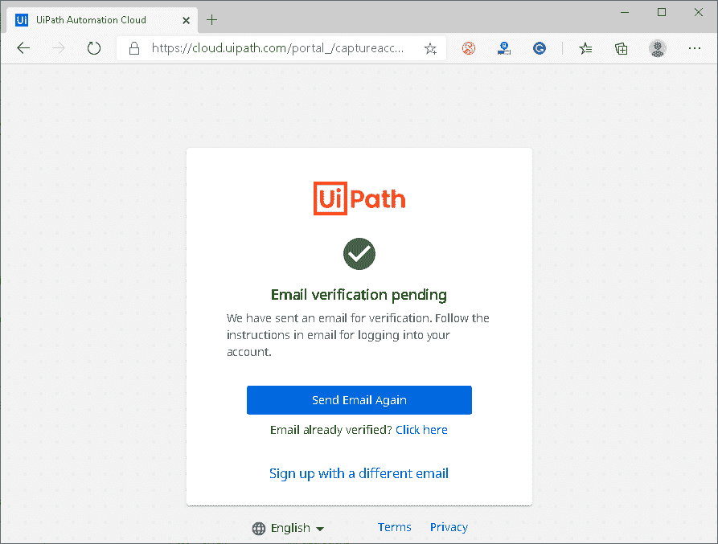

我们需要登录我们的电子邮件帐户，并点击“验证电子邮件”按钮。

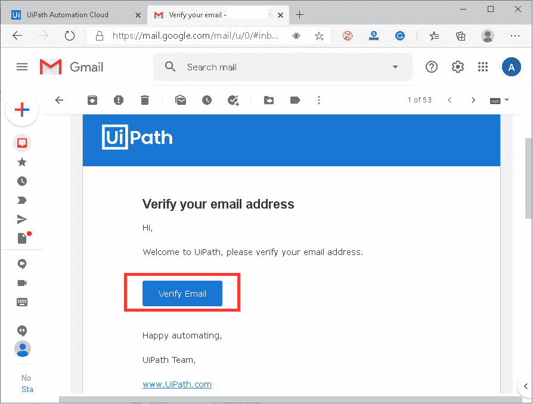

**第六步**:点击“验证邮件”按钮后，我们会被重定向到 UiPath 自动化云的定制主页。在这里，我们需要点击高亮显示的链接，如下图所示:

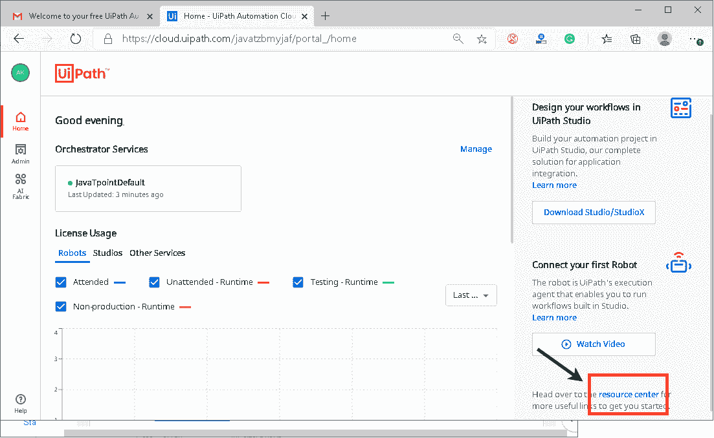

它将显示 UiPath 的所有可用资源和包。

**第七步**:下一屏，我们需要下载 UiPath。这里我们下载了一个稳定版的“UiPath 社区版”。

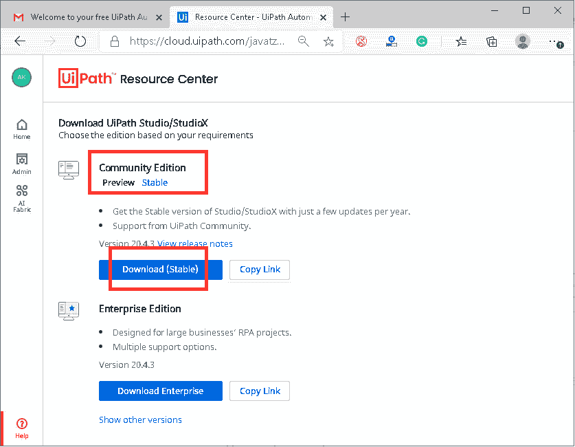

**第八步**:下载完成后，我们需要双击 UiPath 设置文件开始安装。一旦我们启动设置，我们将获得以下屏幕来选择许可类型。在这里，我们需要点击“社区许可证”。

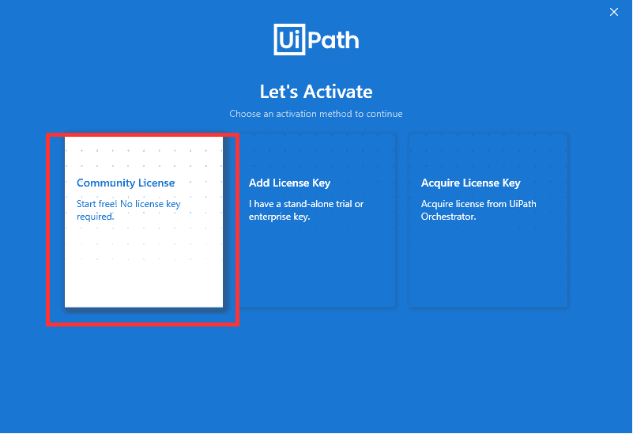

**第九步**:接下来我们需要在“UiPath Studio Pro 社区”和“ui path studios 社区”之间选择一个合适的配置文件。何，我们选择“UiPath Studio Pro 社区”。

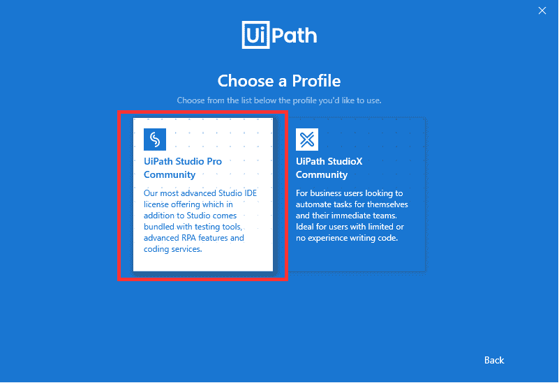

**第十步**:之后，我们需要在 UiPath 的“预览”版本和“稳定”版本之间进行选择。这里，我们选择“稳定”版。

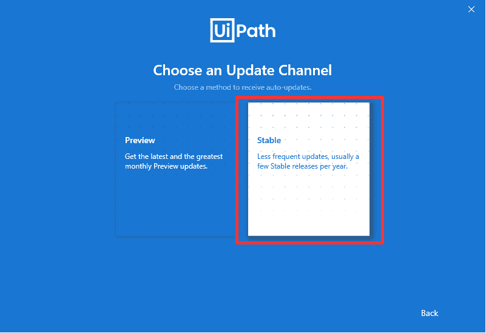

**第 11 步**:在下一屏，我们需要选择需要的源码控制支持，点击【继续】按钮。我们按照 UiPath 的建议保留设置。

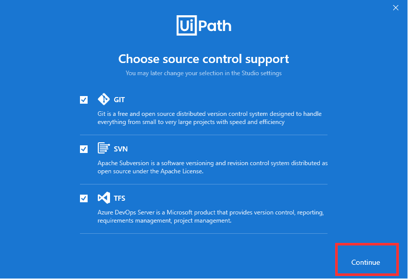

**第 12 步**:一旦我们完成了所有这些屏幕上的指令，我们将被引导到 UiPath 的主屏幕，如下所示:

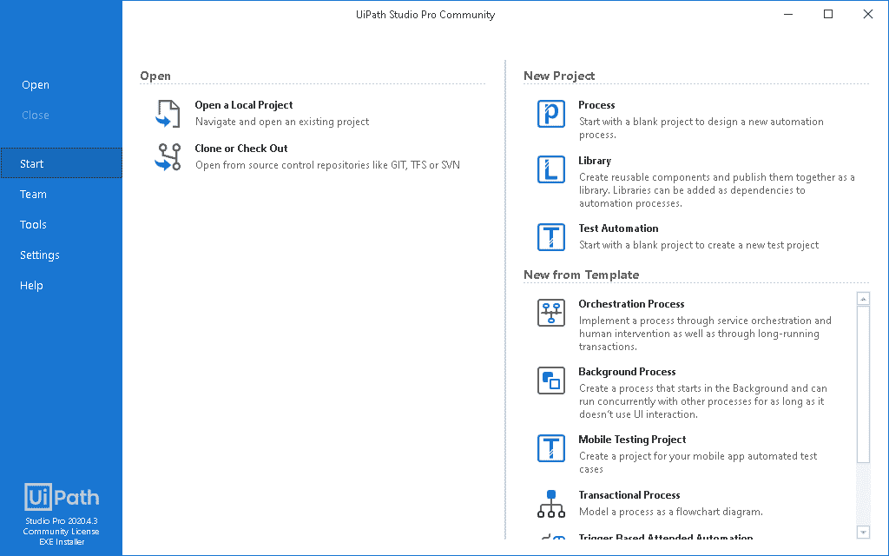

在这里，我们可以根据需求启动一个新的自动化项目或者使用现有的项目。

这就是我们如何配置/安装 UiPath。

## 在 UiPath 中创建简单脚本

让我们使用这个工具创建一个简单的自动化脚本。为了更好地了解它是如何工作的，我们正在创建一个脚本，它将通过执行脚本来自动执行记录的任务。

**第一步**:首先我们需要点击“测试自动化”选项，如下图所示:

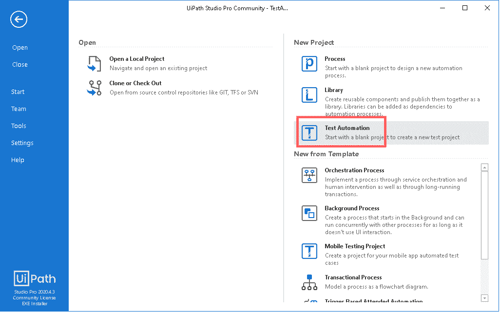

**第二步**:在下一个屏幕上，我们需要输入我们项目的名称，然后点击“创建”按钮:

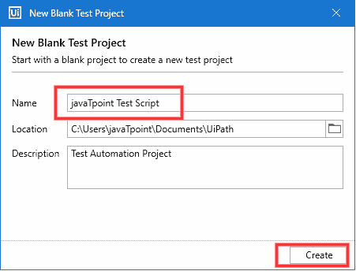

**第三步**:点击“创建”按钮后，会创建一个空白项目。我们需要从顶部面板点击“录音”，然后点击“基本”:

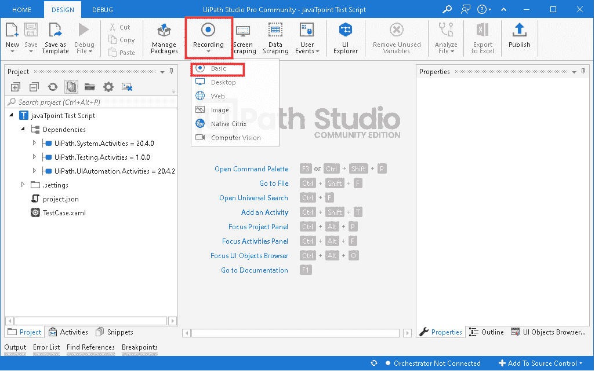

**第四步**:我们一旦点击“基本”，就会打开一个新的弹出窗口，里面有各种录音工具:

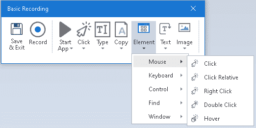

**第五步**:然后，我们需要点击“记录”按钮:

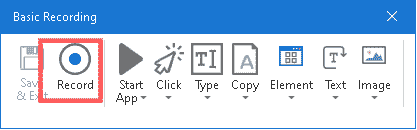

**第五步**:点击“记录”按钮后，鼠标光标变成手形图标，整个屏幕变成蓝色，突出显示所有对象。然后，我们使用记录工具执行手动任务。我们将使用计算器应用并记录一个简单的计算:

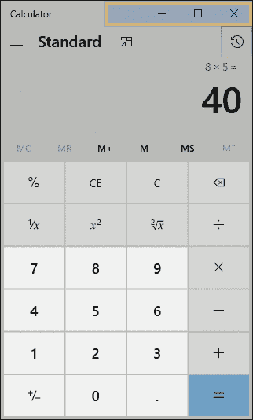

**第 6 步**:完成任务后，需要点击【保存】&退出】按钮:

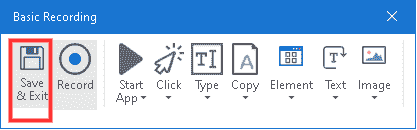

**第七步**:整个过程会被记录下来，工作流程会显示为流程图:

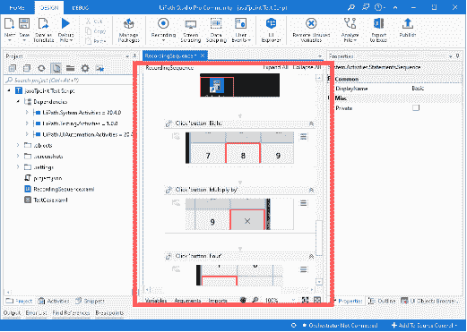

**第 8 步**:我们可以使用“运行”按钮运行我们的脚本，如下图所示:

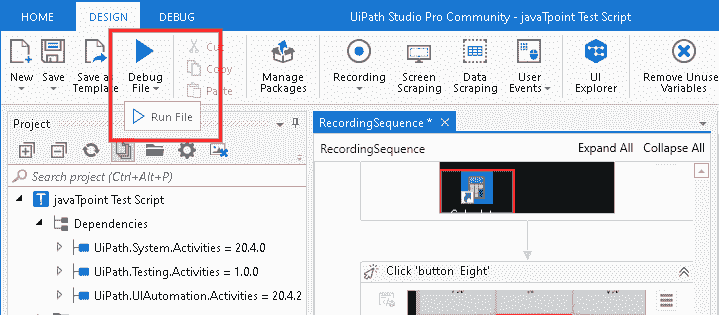

执行将重复屏幕上执行的整个操作。

使用这种方式，我们可以简单地创建一个小的自动化任务。UiPath 包含许多高级功能和模板，帮助我们自动化更复杂的任务。

## UiPath 中的项目类型和模板

### 项目

*   **流程**:此类项目用于设计新的自动化流程。
*   **库**:这种类型的项目用于开发可重用的组件，并将其发布为库。这些库可以进一步用作自动化过程的依赖项。
*   **测试自动化**:这种类型的项目用于创建新的测试项目。

### 模板

*   **编排流程**:该模板用于通过服务编排和人工干预实现一个流程。这种类型的模板也用于长期运行的事务。
*   **后台进程**:当我们需要一个只要不与 UI 交互就可以与其他已有进程在后台执行的进程时，使用这个模板。
*   **移动测试项目**:这个模板一般用于创建移动 app 自动化测试用例项目。
*   **事务流程**:这种类型的模板主要用于将自动化工作流建模为流程图。
*   **基于触发器的有人值守自动化**:当我们需要响应鼠标点击、键盘敲击或任何其他活动来触发自动化任务时，会使用这种类型的模板。
*   **机器人企业框架**:该模板用于创建事务性业务流程。它最适合大规模部署。

## UiPath 的工作和未来范围

[RPA 工具](https://www.javatpoint.com/rpa-tools)的使用在自动化领域快速增长，但是 UiPath，特别是，对大多数组织产生了积极的影响。正因为如此，越来越多的公司在利用和获得该工具提供的其他好处方面表现出了兴趣。与市场上其他类似的 RPA 工具相比，UiPath 获得了更多的用户接受度和机会。该工具显著提高了组织的生产率，并大幅降低了总体运营成本。

因此，UiPath 的未来有积极的一面，因为大多数组织都表现出了他们的兴趣，并投入他们的时间、金钱和资源来实现良好的投资回报率。该工具最终将帮助他们简化业务流程并高效地实现自动化。此外，UiPath 通过更新不断推出新功能，以提高质量并进一步改进。

随着 RPA 工具的使用急剧增长，像 UiPath 开发人员和经理这样的工作机会越来越多。因为目前市场上 RPA 资源稀缺，一个在 UiPath 有 1-2 年专业知识的人会得到一笔不错的薪水。

## 观众

我们的 UiPath 教程旨在帮助初学者和专业人士。

## 问题

我们向您保证，通过我们的 UiPath 教程学习时，您不会发现任何困难。但是如果您在本教程中发现任何错误，我们请求您将问题发布在联系表中，以便我们进行改进。

* * *