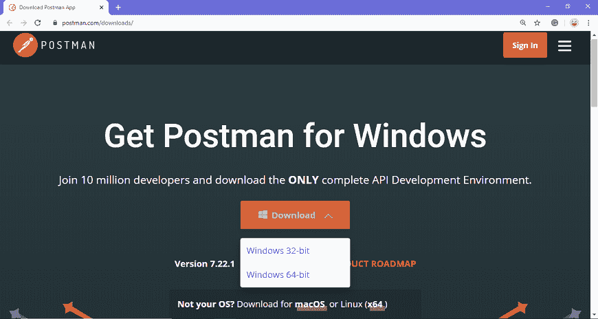
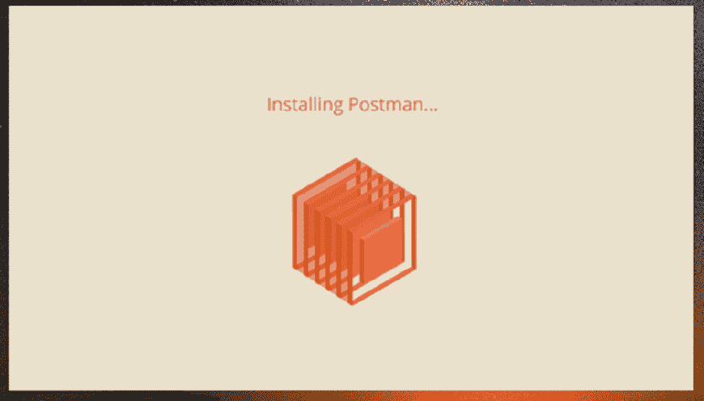
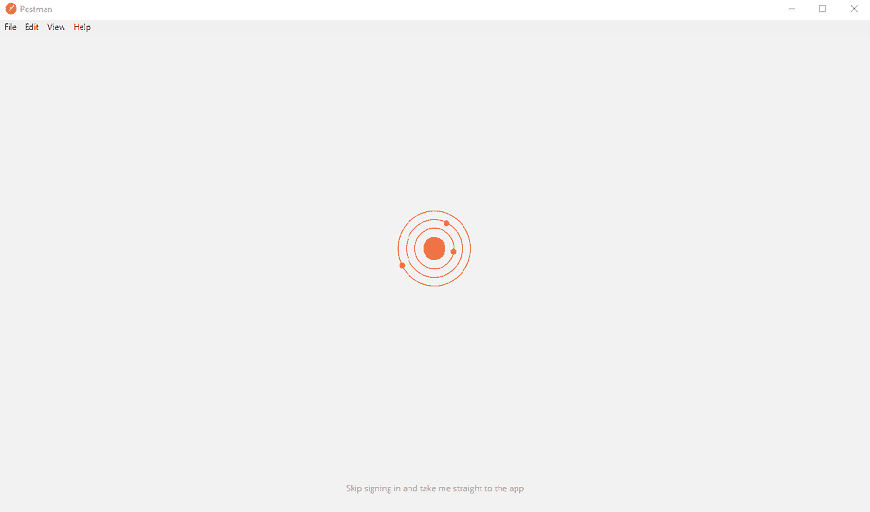
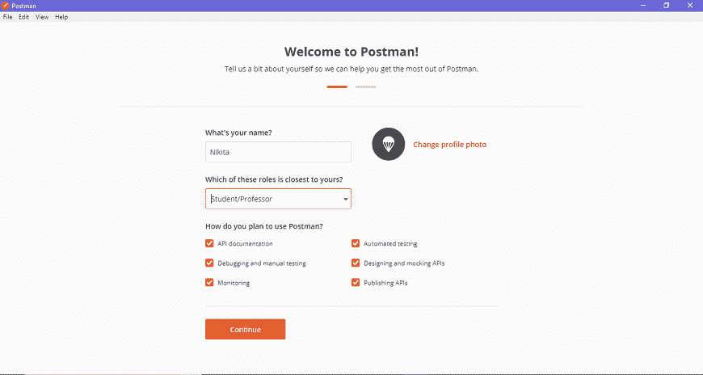
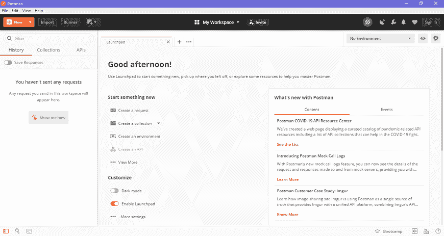
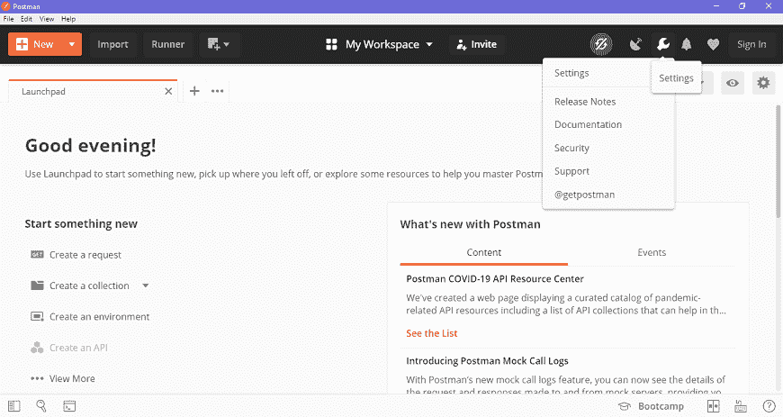

# 安装和更新

> 原文：<https://www.javatpoint.com/postman-installation-and-updates>

邮差可以作为本机应用(独立应用)下载到所有主要操作系统，包括苹果电脑、Linux 和视窗系统。Postman 也可以作为 chrome 扩展应用使用，但是最好安装和使用本机应用，因为 Postman chrome 扩展不支持本机应用拥有的所有功能。

### 下载和安装本机 Postman 应用的步骤

**步骤-1:** 转到链接[https://www.postman.com/downloads/](https://www.postman.com/downloads/)并根据您的操作系统点击下载 Mac 或 Windows 或 Linux。

**第 2 步:**要下载 Windows 应用，请点击下载按钮并选择特定版本。我选择了 64 位版本。如果您使用的是 32 位操作系统，可以选择 32 位，如上图所示。

**步骤-3:** 如果使用的是 Chrome 浏览器，可以查看左下角的下载进度。一旦。exe 文件下载完毕后，就需要安装应用了，如下图所示。

**第 4 步:**一旦安装完成，你会被重定向到如图所示的窗口，在这里你可以点击**停止登录，直接带我进入应用**(因为这个应用也可以不用登录就可以使用)，否则你会得到一个新的窗口来注册。

最好创建一个帐户，因为这将帮助您节省您在Postman中所做的工作，并且这样您就不会丢失任何工作。

**第五步:**用所有需要的细节创建你的账户，或者你也可以用谷歌注册，如图所示。

**步骤-6:** 登录后，根据您的需求选择工作区工具，然后点击，继续进入启动画面。

**步骤-7:** 你会看到下面的页面，然后你就可以使用 Postman 了。

### 更新Postman的步骤

*   如果有任何更新，您将在邮差应用中收到通知。
*   要下载或安装最新的更新，点击**设置图标，**如下图所示，转到**设置>更新**。
    
*   您可以通过启用**的设置自动下载主要更新**来更改更新设置，如下图所示。
    T3】
*   您也可以通过点击**检查更新**来检查最新的更新，这将显示您是否有任何新的更新可用。
*   您必须选择更新选项来下载和安装最新的更新。下载完成后，您将看到一条通知，要求您重新启动应用以安装更新的功能。
*   它会自动下载小更新和错误修复。

* * *