# 邮差导航

> 原文：<https://www.javatpoint.com/postman-navigation>

在我们的系统中下载并安装邮差后，我们现在将讨论邮差的用户界面，以了解邮差提供的功能和术语。

我们可以将Postman导航拆分为四个 UI 结构，如下图所示。

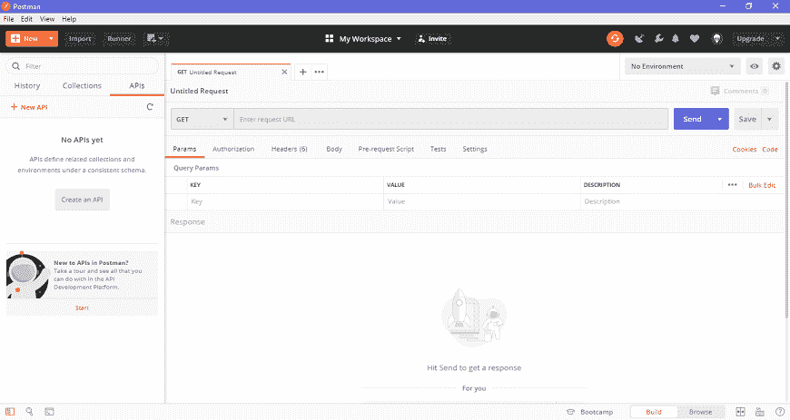

1.  标题栏
2.  补充报道
3.  构建器部分
4.  响应部分

## 1.标题栏

标题栏包含以下选项-

### 新的

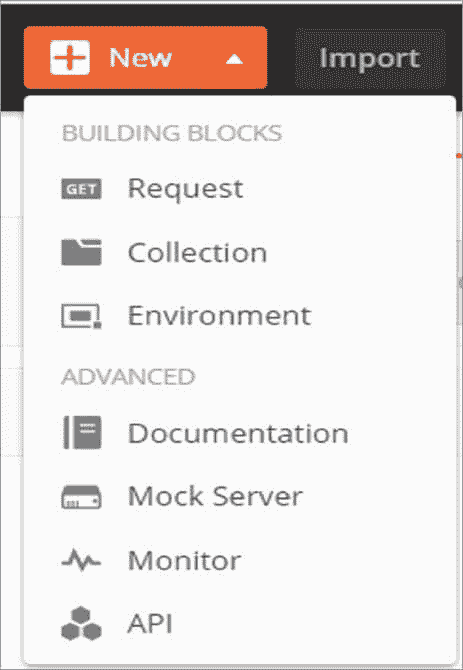

新选项用于以下任务

**请求**

它用于创建新的请求，您可以通过输入请求名称来创建和保存请求，并可以在将来使用它。

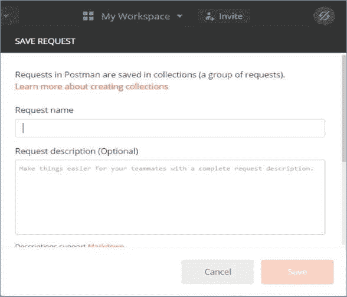

**集合**

它以集合的形式保存您的请求，以便重用和共享。

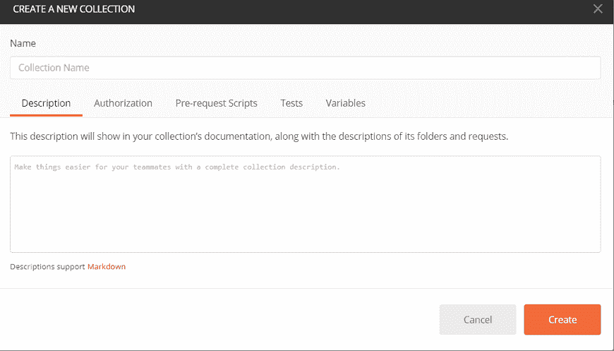

**环境**

环境是带有键值的变量。每个变量名代表它的键。因此，如果我们引用变量的名称，它使我们能够访问其相应的值。所以它基本上保存了您在环境中经常使用的值。

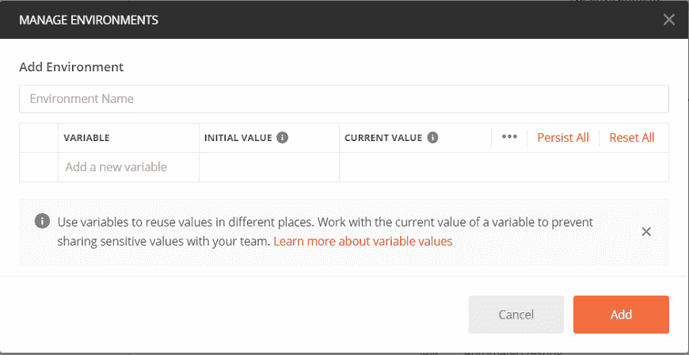

新按钮还提供了一些高级功能，例如

**文档-** 为 API 创建文档，

**模拟服务器-** 创建开发中的 API，

**监控-** 测试原料药性能，

**API** -用于管理 API 的所有方面，包括设计、开发和测试。

*   **导入**

您可以使用“导入”选项将不同格式的文件导入软件。如下图所示，您可以从任何位置导入 postman 集合和环境文件，并可以通过 Postman 运行它。

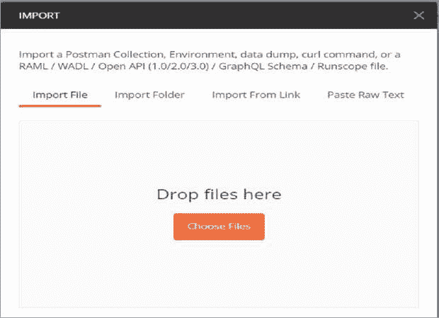

*   **转轮**

此选项有助于在Postman中直接运行加载的集合。

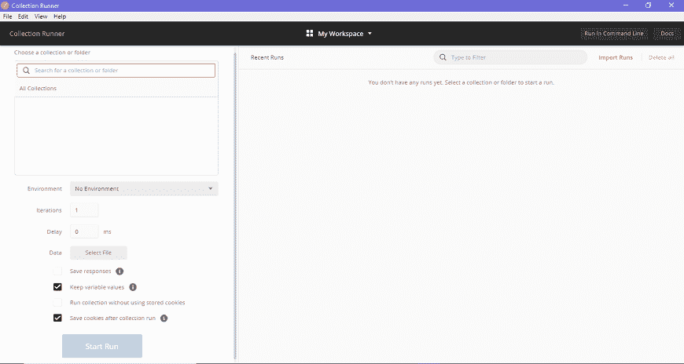

*   **打开新图标**

该选项用于打开新的**标签、**新的**邮差窗口**和新的**跑步者窗口**。

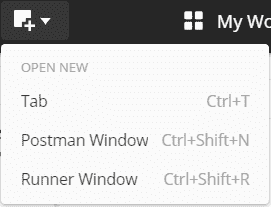

*   **我的工作区**

此选项帮助您查看、管理和创建个人和团队工作区。集合、监视器、环境和模型是工作空间的组成部分。

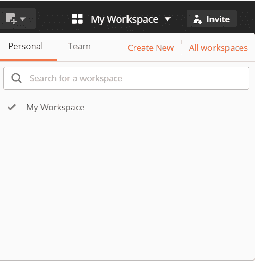

*   **邀请**

这用于邀请其他用户加入您的团队，以便与他们协作创建团队工作区。如下图所示，这可以通过输入电子邮件地址或上传邀请他们的名单来完成。

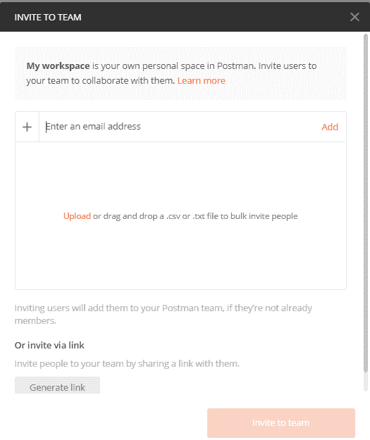

*   **同步图标**

此选项用于同步您从其他设备发送的应用编程接口请求，并更新您的Postman帐户状态。

*   **拦截器图标**

拦截器选项是一个代理服务器，用于**捕获**您通过浏览器、电话或任何其他设备发送的所有请求。

*   **设置图标**

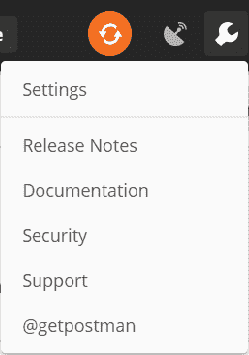

*   **通知图标**

它显示了Postman应用的所有通知。

## 2.补充报道

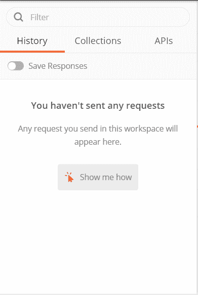

*   **历史**
    历史选项位于应用的过滤器部分下方。“历史记录”选项卡会自动记录您的所有应用编程接口请求，就像任何其他浏览器一样。它让你过去所有的搜索都很方便。
*   **集合**
    集合是显示在集合选项卡下的一组相关请求。在收藏选项卡中，还可以新建一个收藏，如下图所示。还有一个**垃圾桶区**，你可以在那里找回丢失或删除的收藏。

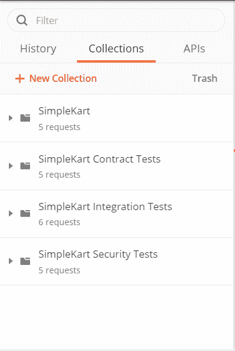

*   API

本节列出了所有的应用编程接口。也可以从该选项卡创建新的应用编程接口。

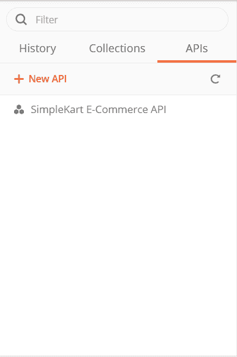

## 3.生成器或请求部分

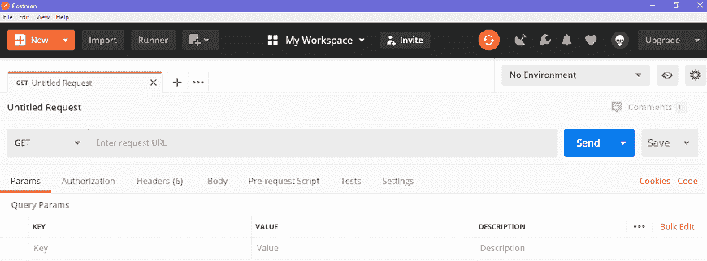

*   **无题请求**

“无标题请求”基本上是您正在处理的默认请求标题。标题取决于您正在处理的请求方法的类型，如下图所示。

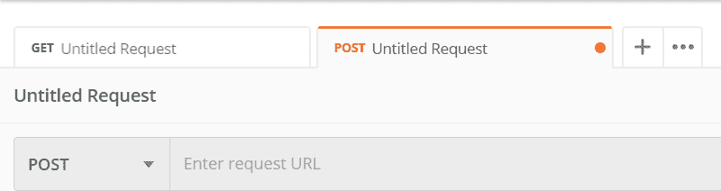

*   **HTTP 请求**

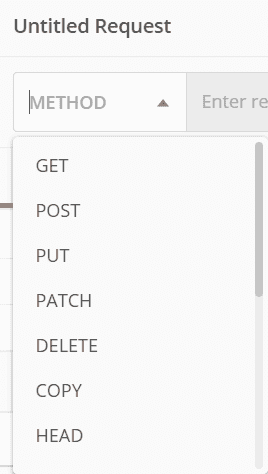

该选项打开一个包含所有 HTTP 请求方法的下拉列表，如图所示，如 GET、DELETE、PATCH、OPTIONS、LINK、POST、COPY、UNLOCK、PURGE 等。一般来说，我们大多使用 POST 和 GET。我们将在后面的章节中讨论这些请求。

*   **请求网址或端点**

此网址选项与任何其他浏览器网址一样。在本文中，我们提到了与应用编程接口通信的链接。

*   **参数**

该选项用于写入请求的参数。这些参数包括键值和描述。

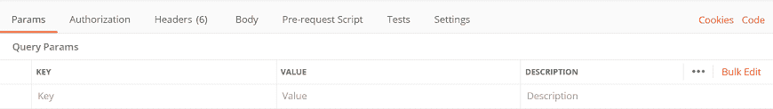

*   **授权**

访问应用编程接口需要授权过程。此过程验证您是否拥有服务器访问所需数据的权限。我们将在后面的完整章节中讨论这一点。

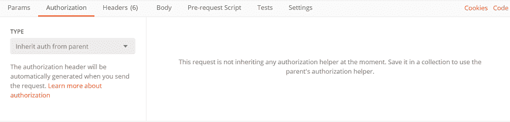

*   **表头**

HTTP 请求头是与请求一起发送所需的附加数据。客户端和服务器之间正确的双向通信需要此标头信息。

*   **车身**

它允许您指定需要随请求一起发送的数据类型。您可以发送各种类型的身体数据来匹配您的应用编程接口。

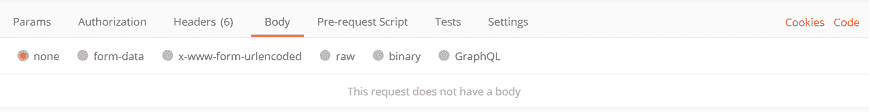

*   **预请求脚本**

这些都是用 JavaScript 编写的，顾名思义，这些都是在发送请求之前执行的。通常，这些脚本用于设置环境并确保请求在正确的环境中运行。

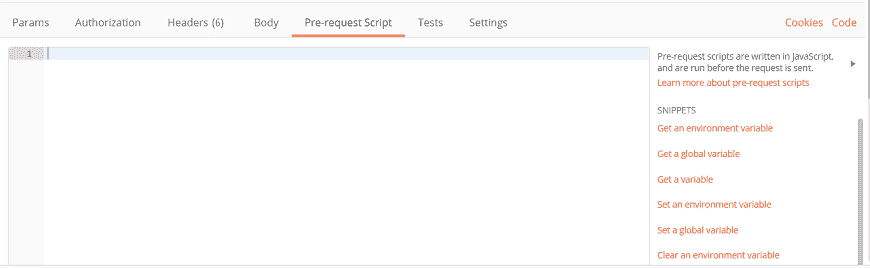

*   **测试脚本**

它在请求期间执行。也是用 JavaScript 写的。这有助于确保应用编程接口按预期工作。测试很重要，因为它设置检查点来验证响应状态是否正常，检索到的数据是否符合预期。

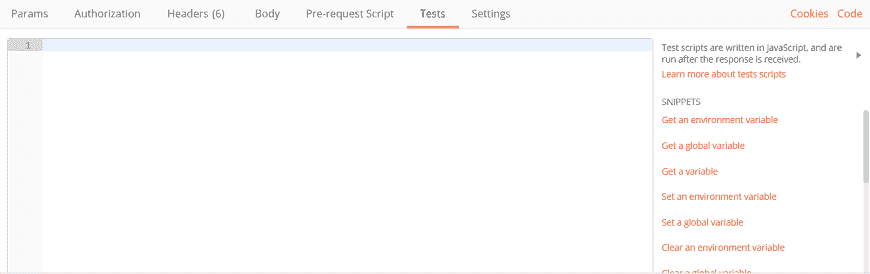

## 4.响应部分

从服务器发回的应用编程接口响应显示在响应窗口中。这些是在您向服务器发送应用编程接口请求后生成的。由于我们没有发送任何请求，因此我们的案例中没有响应。

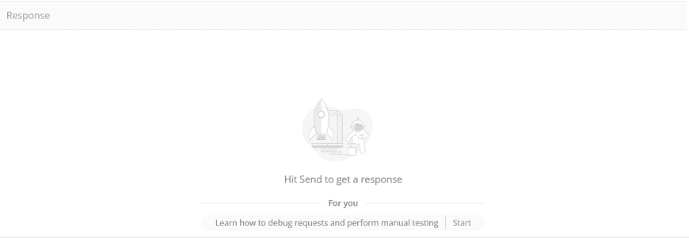

* * *