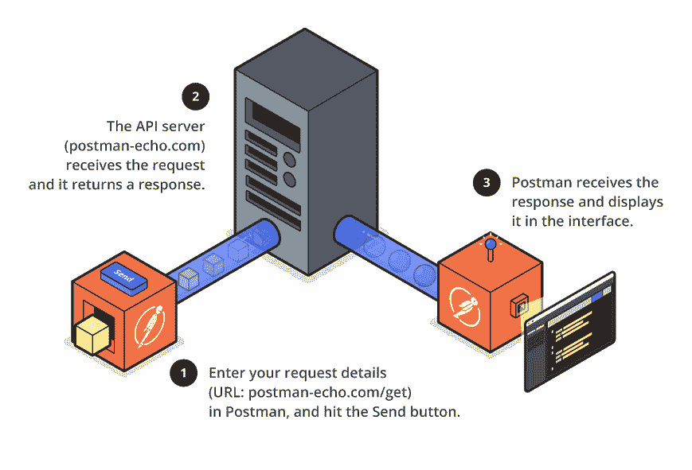
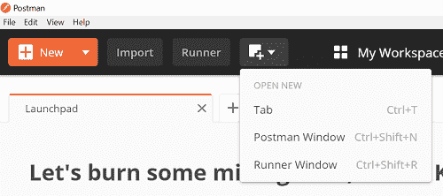
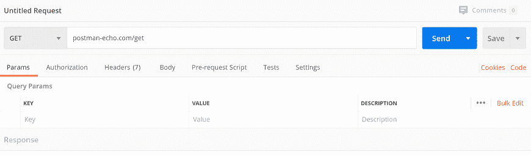
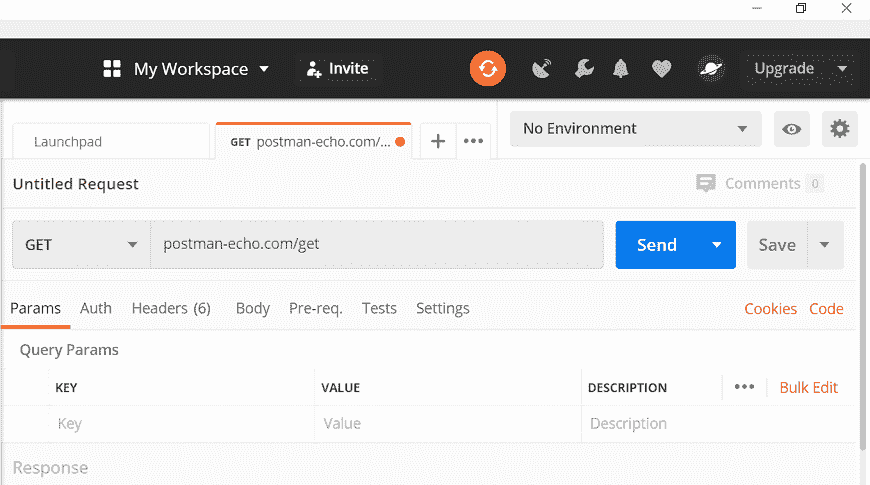
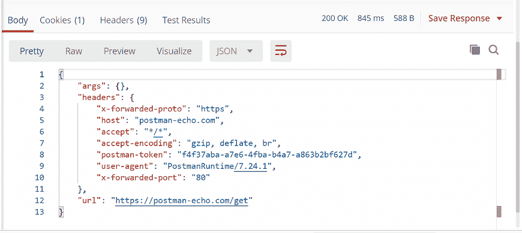

# 邮递员发送你的第一个请求

> 原文：<https://www.javatpoint.com/postman-sending-your-first-request>

发送一个请求就像在你的网络浏览器中发布一个网址一样简单。我们可以很容易地在 Postman 中向 API 发送请求。应用编程接口请求帮助您访问或发送来自数据源的数据。

要发送 API 请求，我们需要一个 [HTTP](https://www.javatpoint.com/http) 方法。一些常用的方法是 POST、GET、DELETE、PUT 和 PATCH。

**GET:** 这个 [HTTP](https://www.javatpoint.com/http-full-form) 方法是用来从一个 API 访问数据的。

**POST:** 此方法传输新数据。

**DELETE:** 用于删除现有数据。

**PATCH:** 此方法用于更新现有数据。

**PUT:** 此方法用于更新已有数据。

无需任何终端或代码，我们就可以在[邮递员](https://www.javatpoint.com/postman)的帮助下发出 [API](https://www.javatpoint.com/api-full-form) 请求并查看答案。只需构建一个新的请求并选择发送按钮，您将获得 API 响应。



### 发送请求

打开邮递员应用程序发送第一个应用编程接口请求。现在，要打开一个新标签，点击 **+** 加号按钮。


您也可以通过输入 **ctrl+T** 打开新标签页，或者从**打开新标签页**菜单中选择**标签页**选项。



在网址字段中，输入以下[网址](https://www.javatpoint.com/url-full-form):

```

postman-echo.com/get

```



在网址字段的右侧，单击发送按钮。



在下面的窗格中，您将从服务器获得 JSON 数据中的响应。

```

{
    "args": {},
    "headers": {
        "x-forwarded-proto": "https",
        "host": "postman-echo.com",
        "accept": "*/*",
        "accept-encoding": "gzip, deflate, br",
        "postman-token": "f4f37aba-a7e6-4fba-b4a7-a863b2bf627d",
        "user-agent": "PostmanRuntime/7.24.1",
        "x-forwarded-port": "80"
    },
    "url": "https://postman-echo.com/get"
}

```



* * *