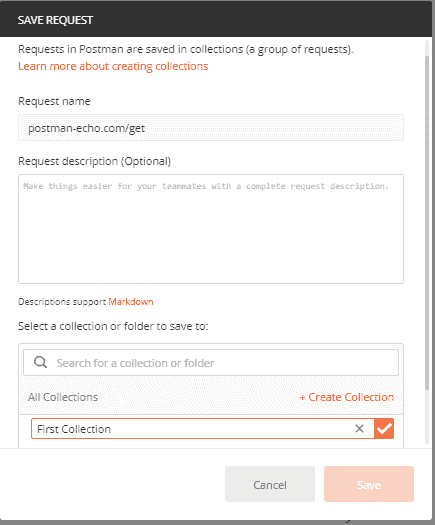
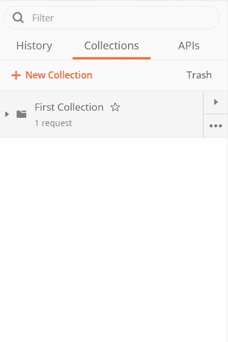

# 创建第一个集合

> 原文：<https://www.javatpoint.com/postman-creating-first-collection>

邮差中的集合意味着您已经保存在邮差中的一组应用编程接口请求。您可以将这些请求排列到文件夹中。

### 创建第一个集合的步骤

*   在“请求网址”选项中输入新请求，该选项位于“生成器”部分。

*   点击保存按钮，然后会打开一个新窗口，如下图所示。

*   您可以更改请求名称，或者默认情况下，请求网址将显示为请求名称。
*   您也可以编写请求描述作为可选步骤。
*   现在转到**创建收藏**选项，并为你的收藏写一个名字。我把它命名为第一收藏，正如你在上面的图片中看到的。
*   单击保存按钮保存您的收藏。
*   现在，保存后，您可以在“收藏”选项卡下的边栏中看到您的收藏，如下图所示。
*   在一个集合中，可以添加任意数量的请求。

* * *