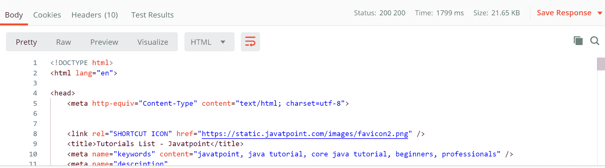
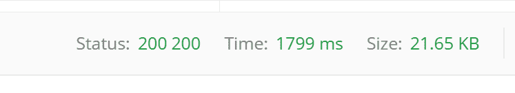
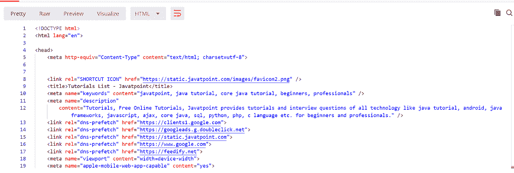
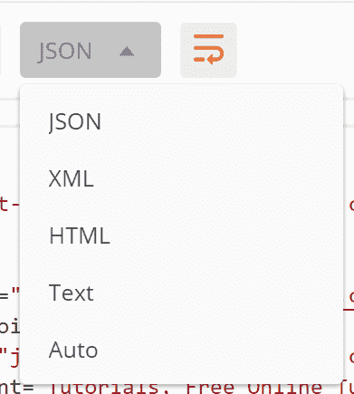
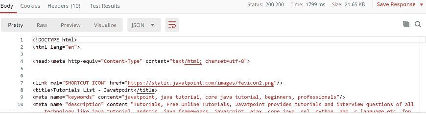
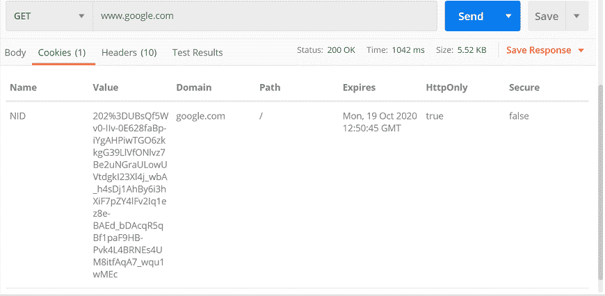
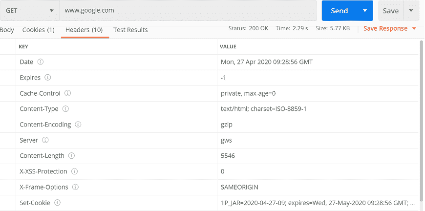

# 《Postman》中的回应

> 原文：<https://www.javatpoint.com/response-in-postman>

一旦发送请求，API就会发送响应。响应是服务器收到的消息，作为对我们发送的请求的回应。当我们发送请求时，服务器接受该请求，并发回一个包含所请求信息的数据包，称为响应。每个响应取决于发送的请求。

服务器对每个请求的响应都不一样，如果我们从所有的服务器响应中提取一些信息就好了。它提供了一个用户友好的界面，可以轻松地从所有响应中查看多条信息。

Postman响应界面有多个选项。让我们逐一看看这些选项:

## 响应状态和信息

输入网址[www.javatpoint.com](https://www.javatpoint.com)查看回复:

在响应框的右上角，我们可以看到代码的状态、时间和大小。

### 状态代码

状态代码定义了请求的状态。输入网址时，可能会在网址中键入错误，或者可能存在服务器端问题。状态码用于了解哪里出错了，哪里出错了。有不同的状态代码，每个状态代码都有不同的含义。

让我们看看一些标准状态代码:

**200:** 此代码用于成功的请求。

**201:** 请求成功，数据已创建。

**204:** 为空响应。

**400:** 这是用于**不良请求**的。如果您输入了错误的内容或遗漏了一些必需的参数，那么服务器将无法理解该请求，您将获得 400 个状态代码。

**401:** 这是用于**未授权访问**。如果请求验证失败或者用户没有请求操作的权限，那么您将获得 401 状态代码。

**403:** 这是给**禁止**或**禁止进入**的。

**404:** 如果**数据找不到**就会出现这种情况。

**405:** 如果不允许该方法或者不支持所请求的方法，就会出现这种情况。

**500:** 此代码用于**内部服务器错误**。

**503:** 此代码用于**服务不可用**。

### 时间

时间是发送的请求时间和接收的响应时间之间的持续时间。意思是，这是我们发送请求并收到响应后响应所用的持续时间。

这有时非常有用，因为许多项目都有服务级别协议。此处显示的时间不是请求将花费的实际时间。这只是一个大概的时间，但你可以认为这是一个实际的时间。

### 大小

Size 是在内存中处理响应时的大小。这个响应的大小包括响应的大小、cookies、报头以及随响应一起传输的所有内容。

## 响应体

响应主体是响应的主体，它实际上包含从服务器发送的响应内容。在本节中，您可以看到网页代码作为响应发送给我们。

在此框中，有三种方法可以查看响应正文中的响应:

*   漂亮的
*   生的
*   试映

**漂亮:**顾名思义，漂亮是看内容更漂亮的方式。在此选项中，代码将使用不同的关键字以彩色显示，并在代码中有缩进，这对阅读很有用。每种颜色都有不同的含义。这使得代码更好。

**Raw:** 这几乎类似于漂亮，但是显示的代码没有颜色，并且是单行的。它只是代码的原始版本，没有任何丰富多彩的关键词。

**预览:**这将显示已发送页面的预览。它在浏览器中运行了相同的页面。你只需要点击预览，你就会得到你在浏览器中看到的准确页面。

Preview 选项卡在沙盒 iframe 中呈现响应，由于 iframe 沙盒限制，在 iframe 中禁用了 JavaScript 和图像。

## 格式类型

每个请求都有一个由内容类型头定义的响应。该响应可以是任何格式。比如在下面的例子中我们有 HTML 代码文件:

您将看到我们有多种格式类型:

*   数据
*   可扩展置标语言
*   超文本标记语言
*   文本
*   汽车

有时，服务器以多种格式发送响应。响应的格式类型对其对应的格式类型是可见的。

## 复制响应

从响应框的右侧，可以看到两个矩形；该选项用于将完整的响应复制到剪贴板，这对于向任何人发送响应非常有用。

## 饼干

Cookies 是包含与服务器文件或网站页面相关的信息的小文件。一旦你第一次打开网站，一个 cookie 文件就会下载到你的系统中。该 cookie 包含一些信息，当您再次访问时，这些信息将被同一站点使用。这样网站就可以根据你上次的访问给出具体的回复和具体的信息。

Postman 让您看到服务器作为响应发送的 cookies。我们无法对 cookies 进行任何更改，因为我们从服务器获得了。

试试网址[www.google.com](https://www.google.com)去饼干区，你会得到饼干。

## 头球

标头是传输到服务器或客户端的额外信息。在Postman中，标题将在标题标签下显示类似的键值对。

选择“标题”选项后，您将获得以下信息:

* * *