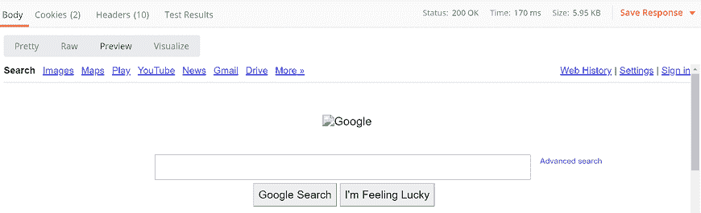
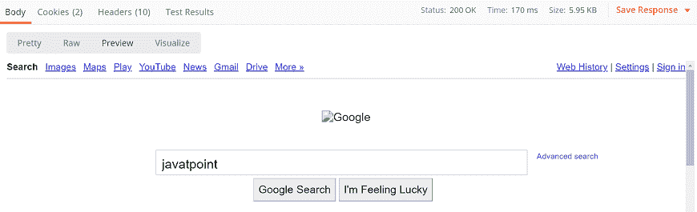
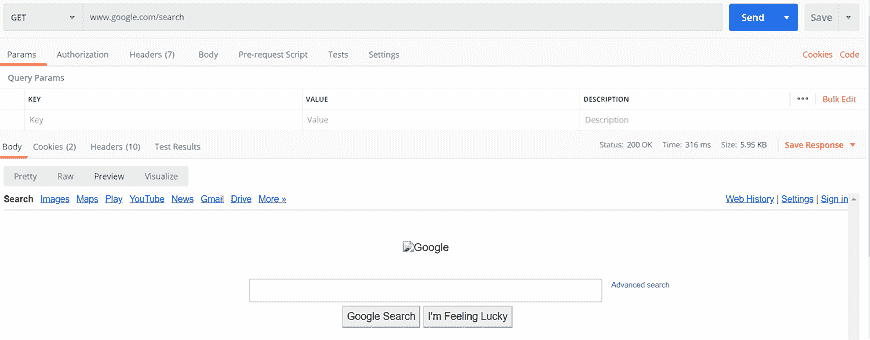
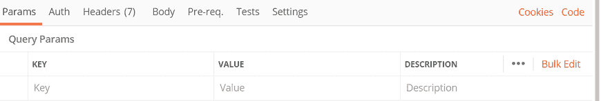
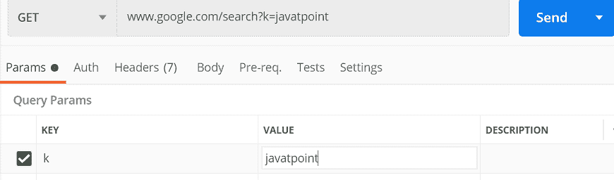
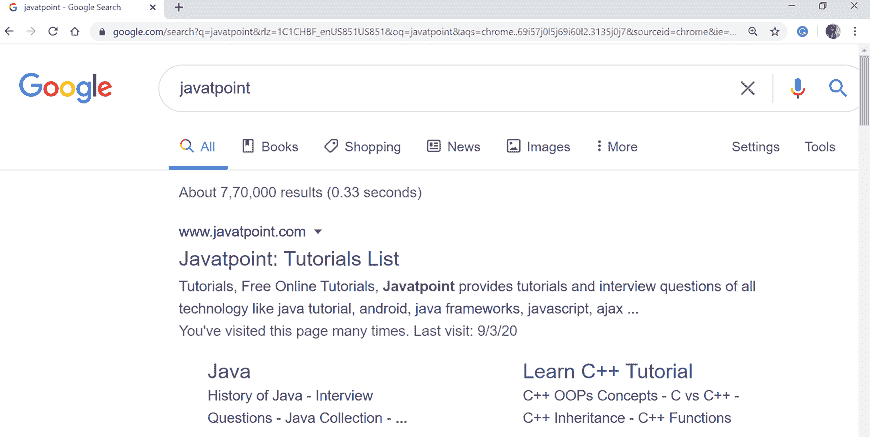
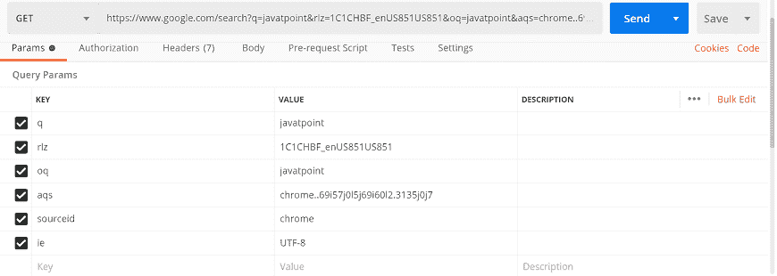

# 邮递员中的请求参数

> 原文：<https://www.javatpoint.com/request-parameters-in-postman>

请求参数用于向服务器发送附加信息。网址包含这些参数。参数有两种类型:

**查询参数:**这些被附加到请求 URL 的末尾，查询参数被附加到请求 URL 的末尾，跟在“？”并以键值对的形式列出，以“&分隔。语法:

```

?id=1&type=new

```

**路径参数:**这些是请求 URL 的一部分，使用以“:”开头的占位符进行访问。示例:

```

/customer/:id

```

在[邮差](https://www.javatpoint.com/postman)中，有两种方式可以根据请求设置**查询参数**。

## 使用网址字段

添加参数最常见的方式是——将查询字符串追加到 [URL](https://www.javatpoint.com/url-full-form) 的末尾。

让我们在网址文本字段中输入网址:

假设我们有网址[www.google.com/search](https://www.google.com/search)当你点击发送选项时，你会得到如下回应:



现在尝试以以下格式输入参数:

*.google.com/search？q=javatpoint*

这里的“q”是键，“javatpoint”是键的值。

当您在 URL 中输入参数并选择发送按钮时，您将得到以下响应:



## 使用参数

使用 Params 是第二种方法。该选项位于网址文本字段的左侧。该选项将在 URL 字段下提供额外的文本字段，以键值对的形式输入查询参数。

在参数文本字段中输入参数后，这些参数将自动添加到网址中。该界面提供了以有组织的方式保存您输入的参数，这对于需要多个参数的请求非常有用。

让我们看一个例子:

在网址文本字段中输入网址[www.google.com/search](https://www.google.com/search):



现在转到参数部分:



如图所示，在键值对下写入参数。这里，k 是查询，javatpoint 是搜索词。



现在按发送按钮，查看响应窗口的预览部分；您将得到以下响应:


### 多个参数

我们还可以在一个查询中使用多个参数。只需进入你的浏览器，在谷歌“javatpoint”中搜索。



[https://www . Google . com/search？q = javatppoint&rlz = 1c 1 CHF _ enus 851 us 851&OQ = javatppoint&ACS = chrome-什么 69i 57 j0l 5 j69 i60 l2.3135 j7&source id = chrome&ie = utf-8](https://www.google.com/search?q=javatpoint&rlz=1C1CHBF_enUS851US851&oq=javatpoint&aqs=chrome..69i57j0l5j69i60l2.3135j0j7&sourceid=chrome&ie=UTF-8)

见上图及网址；URL 中发送了多个参数。

在上面的网址中，' **& '** 后面应该跟一个参数，比如 **& ie=UTF-8** 。在这个参数中，即是键，UTF-8 是键值。

在邮递员文本字段中输入相同的网址；您将在参数选项卡中获得多个参数。甚至您可以编写每个参数，并用多个参数发送请求。



* * *