# Postman的投递请求

> 原文：<https://www.javatpoint.com/post-request-in-postman>

**帖子**是一个类似 GET 的 HTTP 方法。当需要在请求正文中向服务器发送附加信息时，我们使用这种方法。一般来说，当我们提交一个 POST 请求时，我们希望服务器上有一些变化，比如更新、删除或插入。

使用 POST 请求的最佳示例之一是脸书的登录页面或其他网站的登录页面；您将密码等个人信息发送到服务器。服务器使用与该帐户相同的信息创建一个新帐户，该信息将永久添加到脸书服务器上。

POST 请求是一种基本的方法，这种方法主要用于用户想要向服务器发送一些敏感数据时，比如发送表单或一些机密数据。

开机自检请求的要点:

*   开机自检请求不会接受 cookies。
*   开机自检请求不会留在浏览器的历史中。
*   我们无法为开机自检请求添加书签。
*   开机自检请求中的数据长度没有限制。

在[Postman](https://www.javatpoint.com/postman)中，REST API 的每个端点都与其 **HTTP 动词**相关联。当端点声明应该使用 POST http 动词来调用它时，那么对于调用端点，只需要 POST [HTTP](https://www.javatpoint.com/http) 动词。

让我们首先检查一下开机自检端点的 GET 请求。

### 在开机自检端点上获取请求

这里，我们有一个 [API](https://www.javatpoint.com/api-full-form) ，用于注册新客户:

[http://restapi.demoqa.com/customer/register](http://restapi.demoqa.com/customer/register)

在Postman端点栏输入[网址](https://www.javatpoint.com/url-full-form)，按发送。然后从下拉列表中选择 GET 方法。


请参见以下回应:

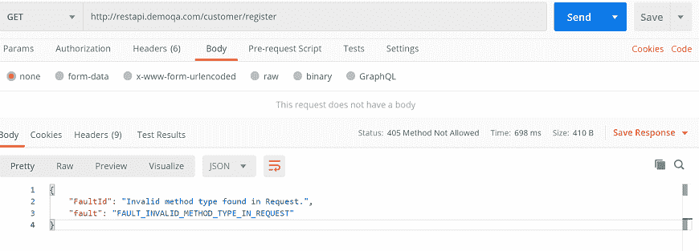

查看 [HTTP](https://www.javatpoint.com/http-full-form) 状态码，会得到“405 方法不允许”的错误代码。这意味着我们被用错误的方法请求一个端点。在“漂亮”选项卡中，您还可以看到错误。

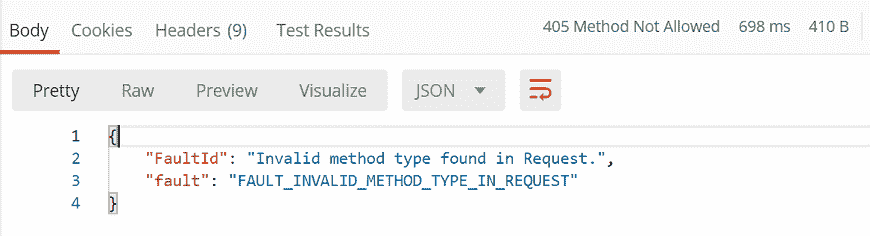

这意味着我们选择了不正确的方法类型。现在让我们尝试改变方法的类型，看看我们是否会得到正确的响应。

### 无正文的发布请求

首先，将方法类型从“获取”更改为“发布”，然后单击“发送”按钮。

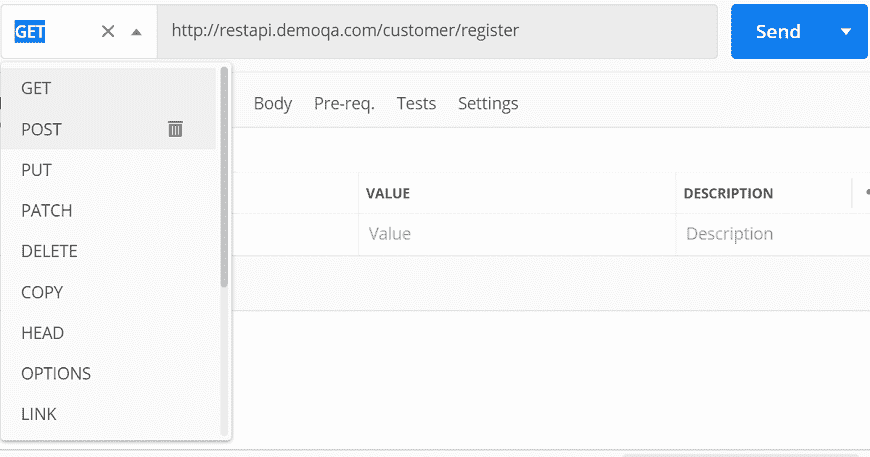

现在，请参见响应部分。

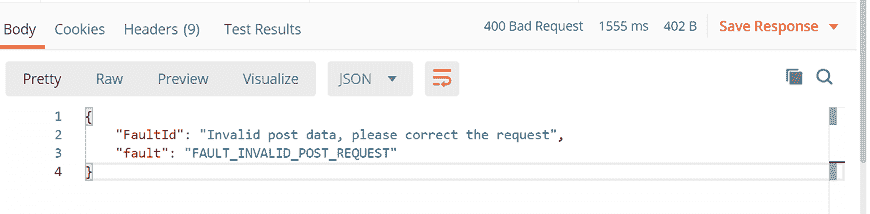

这里，400 个坏请求，如上图所示，表示请求和服务器参数没有找到匹配的来获得响应。从响应正文来看，“无效的帖子数据”意味着输入的帖子数据无效。

因此，我们需要在请求正文中添加格式正确的信息。

向发布请求添加请求正文-为此，请选择正文选项卡。

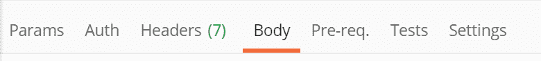

现在在 Body 选项卡中，选择 raw，并从下拉菜单中选择 JSON 作为格式类型，如下图所示。这样做是因为我们需要以服务器期望的适当格式发送请求。

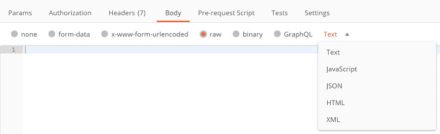

在我的例子中，服务器需要一个包含新用户信息的 json 主体。这里有一个简单的例子:

```

{
   "FirstName"  : "value",
   "LastName"  : "value",
   "UserName" : "value",
   "Password"  : "value",
   "Email"        : "value"
 }

```

将以上示例复制并粘贴到您的Postman请求正文中。只需将属性值更改为所需的值，如下例所示:

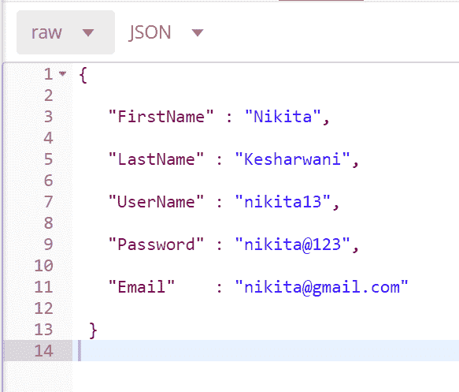

最后，按发送，查看响应正文和响应状态。

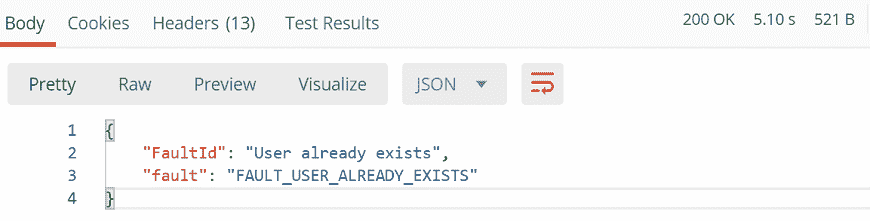

这里状态码是 200 OK 这意味着服务器批准了请求，我们收到了肯定的答复。错误“用户已经存在”意味着数据已经存在于数据库中。

让我们输入不同的值并检查响应状态:

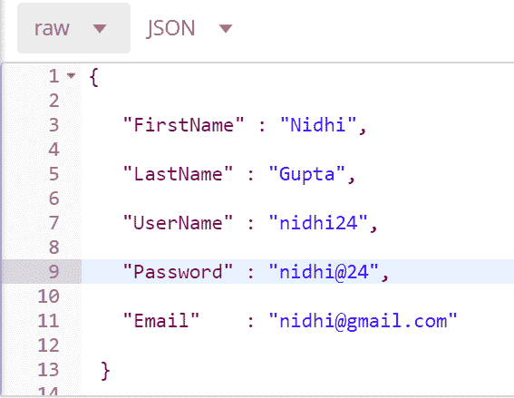

按发送并检查响应:

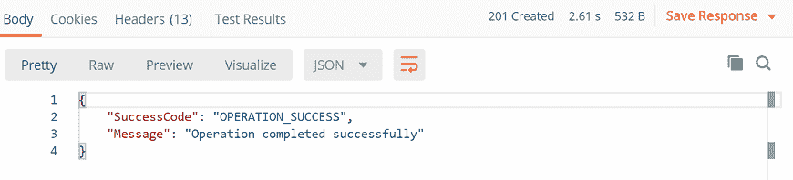

在这里，“操作成功完成”意味着您的条目已成功创建，并且您的开机自检请求已成功完成。

### 发送身体数据

从现在开始，您知道每当您需要添加或更新结构化数据时，我们都需要发送带有请求的正文数据。

选择开机自检请求方法，并转到正文选项，在该选项中，我们有不同的发送数据选项:

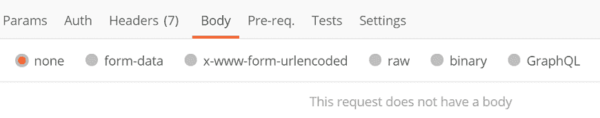

这里有:

*   没有人
*   表单数据
*   默认值
*   生的
*   二进制的
*   介绍

### 表单数据

表单数据发送表单的数据。比如填写表格时输入的信息。要发送这些详细信息，请将它们写成键值对。这里，关键字是条目的名称，值是您正在发送的条目的值。请遵循以下步骤:

*   选择表单-数据。

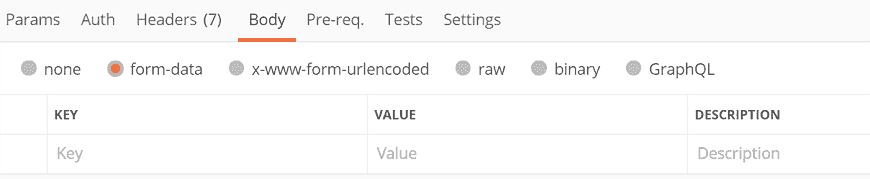

*   添加键值对。


### 默认值

它的工作原理类似于表单数据。两者唯一的区别是，当你通过 x-www-form-urlencoded 发送数据时，url 是编码的。编码表示传输的数据被转换成各种字符，因此未经授权的人无法识别数据。

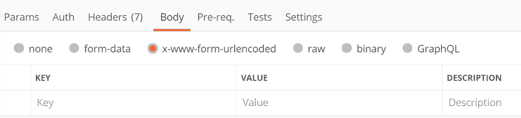

### 生的

在将正文发送到 POST 方法时，这是一个非常有用的选项。这里，主体数据将以比特流的形式呈现。

在上面的例子中，我们已经讨论了 raw。所以，我们就不再讨论了。

### 二进制的

二进制用于以不同的格式发送数据。例如文件、图像等。要使用此选项，请选择二进制文件，然后单击选择文件浏览系统中的任何文件。

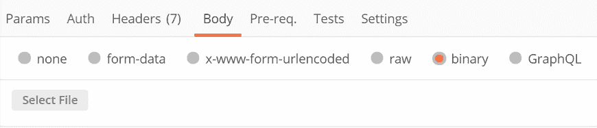

### GraphQL(图形 SQL)

通过该选项，您可以通过选择请求正文中的 GraphQL 选项卡来发送Postman请求中的 [GraphQL](https://www.javatpoint.com/graphql) 查询。

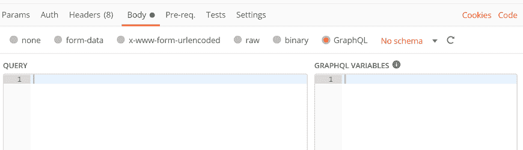

这里需要在 QUERY 部分输入代码，在 GRAPHQL VARIABLES 部分输入任何变量。

* * *