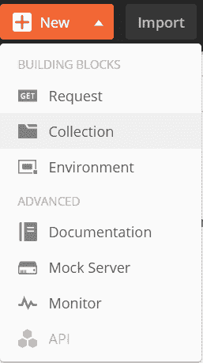
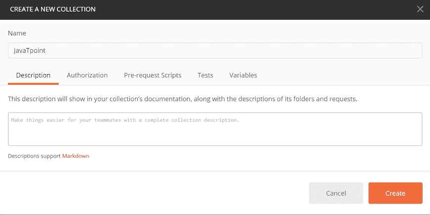
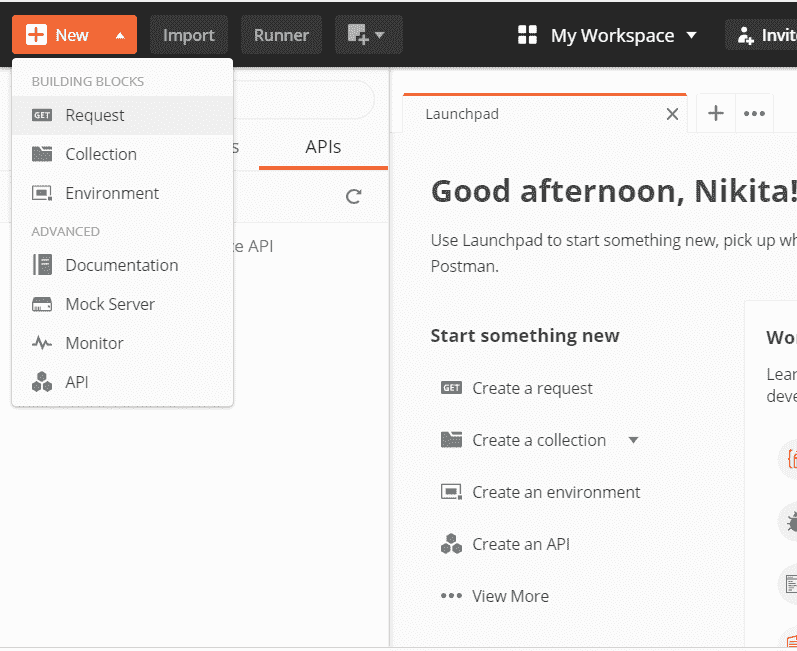
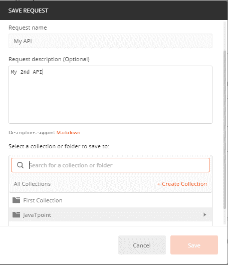
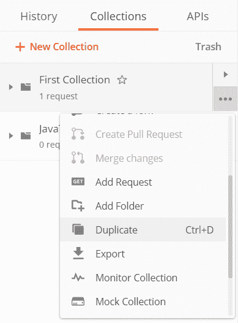

# Postman 创建集合

> 原文：<https://www.javatpoint.com/postman-creating-collections>

## 创建新集合

可以从 Postman 中的以下选项创建新的集合。

### 1.标题栏中的“新建”按钮

*   标题栏中的转到新建按钮；点击收集选项。
    
*   将弹出一个新窗口，如下图所示。
    
*   命名您的收藏，您可以添加可选的描述。
*   转到授权选项卡并选择授权类型。
*   添加请求前脚本，该脚本将在此集合中的每个请求之前执行。
*   添加测试，该测试将在此集合中的每个请求之后执行。
*   添加特定于此集合及其请求的变量。
*   最后，点击**创建**按钮，如下图所示，保存收藏。

### 2.侧边栏中的收藏选项卡

*   在 Postman 的侧边栏中，点击收藏选项卡，然后选择**新建收藏**选项，如下图所示。
    T3】
*   屏幕上将再次弹出相同的窗口，然后重复相同的授权、变量等过程。创建新的集合。

### 3.在启动板中创建一个收集选项

*   打开 Postman 应用后，在构建器部分，您将获得发射台。
*   在启动板中，在“开始新的东西”选项卡下，您将获得**创建收藏**选项，如下图所示。
    T3】
*   单击创建收藏选项后，屏幕上将弹出一个新窗口。
*   您必须遵循相同的身份验证、测试、变量等程序。如前所述来创建新的集合。

## 将请求保存到集合

每当您在[Postman](https://www.javatpoint.com/postman)中创建新请求时，您可以将其保存为单个请求，或者保存在新的集合/文件夹或现有的集合/文件夹中。您可以从以下选项创建新请求，如下图所示。

1.  **侧栏中新增**按钮
2.  **在启动屏幕中创建请求**选项
3.  **施工方部分**

*   无论您选择哪个选项来创建请求，您都将获得下面提到的**保存**
    窗口
*   输入请求名称，可选请求描述，然后选择一个收藏或文件夹从'**选择一个收藏或文件夹保存**到'选项，如图所示。
*   您也可以通过点击**+创建收藏**来创建新的收藏。
*   现在点击**保存**按钮保存请求。

## 将请求从历史记录保存到集合中

要将请求从历史记录保存到现有集合或新集合中，请按照下列步骤操作。

*   转到 Postman 工具条中的**历史标签**，然后点击( **+** )按钮保存请求。如下所示:
*   屏幕上将弹出一个新的**保存请求**窗口，按照相同的程序将请求保存到新的或现有的收藏中。
    T3】

## 复制现有集合

*   要复制已经保存在 Postman 中的收藏，请转到边栏的**收藏**标签。
*   选择要复制的收藏，点击 **(…)** 选项展开，从下拉菜单中点击**复制**复制选中的收藏。
    

* * *