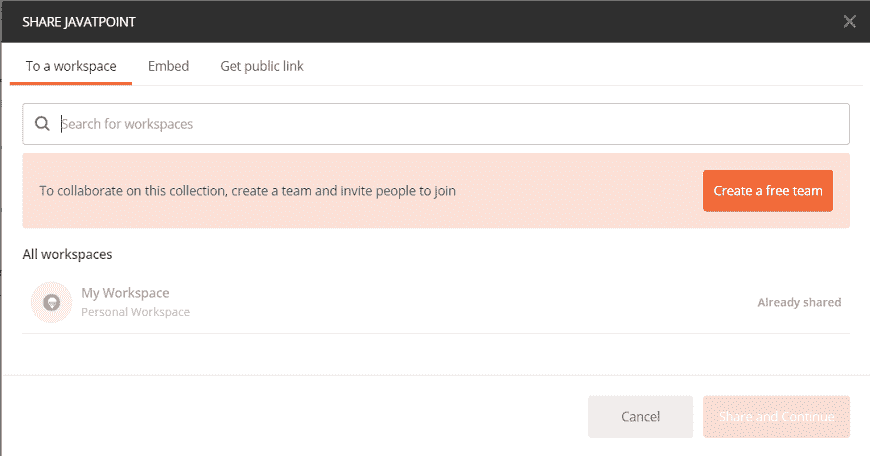
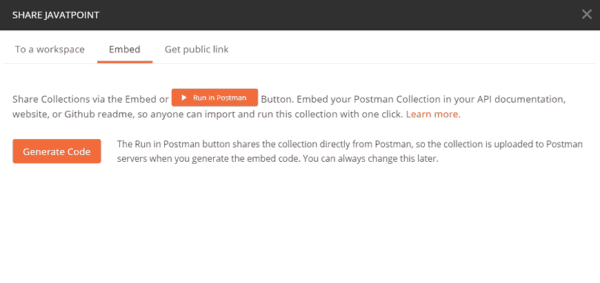
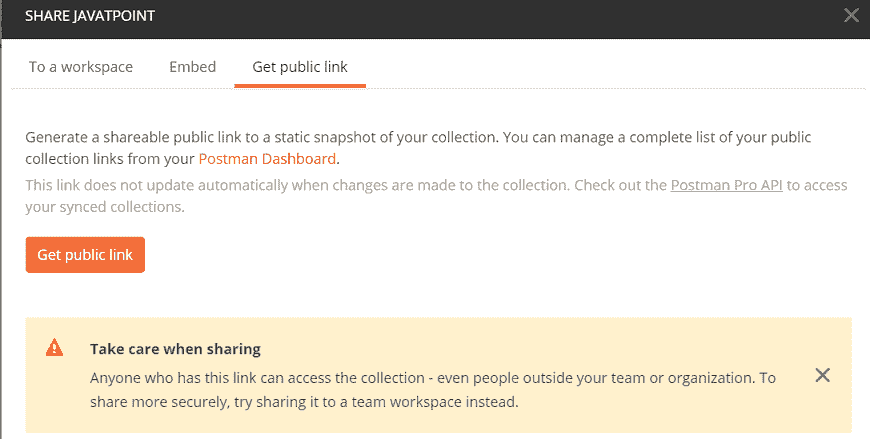

# Postman 共享收藏

> 原文：<https://www.javatpoint.com/postman-sharing-collections>

您可以将 Postman 应用中的收藏共享给工作区团队，也可以将其作为链接共享给不属于工作区团队的用户。您需要登录到 Postman 才能共享收藏。

如果用户以文件形式发送收藏，则不需要登录 Postman 帐户。

## 在应用中共享收藏的步骤

有两个选项可以共享集合。

### 1.从侧边栏

*   打开 Postman 应用，进入侧边栏的收藏标签，点击 **(…)** 扩展查看更多选项，如图所示。
    T3】
*   从下拉菜单中点击**共享收藏**选项。

### 从浏览选项

*   点击应用右下角的浏览按钮切换到**浏览**，如下图所示。
*   点击收藏选项卡查看所有收藏，选择**共享**选项，如图所示。
    T3】
*   无论您选择哪个选项来共享您的收藏，屏幕上将弹出一个新窗口，其中包含三个选项，如下图所示。
    
*   所以在 Postman 中，你可以通过以下三种方式分享你的收藏。

### 共享到工作区

此选项用于与另一个工作区或工作区的成员共享集合。如果与团队工作区共享，团队的所有成员都可以使用它。但是，共享集合后，您可以将集合的权限从只读更改为编辑，反之亦然。

现在选择工作区团队或成员，并选择共享按钮来传输集合。

### 与嵌入共享

使用该选项，如下图所示，您将获得两个按钮运行在[Postman](https://www.javatpoint.com/postman)和生成代码。使用“生成代码”按钮，将生成一个链接，使用“在 Postman 中运行”按钮集合将被共享。

### 与公共链接共享

通过该选项，当您点击**获取公共链接**按钮时，将生成一个链接，通过该链接，您的收藏可以被共享。任何拥有此链接的人都可以访问您的收藏，即使是组织或团队以外的人。

### 将收藏集共享为文件

如果用户以文件形式发送收藏，则不需要登录他们的 Postman 帐户。只需以[JSON](https://www.javatpoint.com/json-tutorial)(JavaScript Object notification)文件的形式下载集合并共享即可。

* * *