# Postman 中的变量

> 原文：<https://www.javatpoint.com/variables-in-postman>

*   Postman 变量的工作方式与编程变量相同。这些是能够取各种值的符号。您可以将值存储在变量中，并可以在请求、环境、集合和脚本中使用它。
*   Postman 中的变量提高了用户的工作效率，减少了错误。

## Postman 的环境

键值对的集合称为环境。变量的每个名称代表它的键。并且引用变量的名称允许您访问它的值。

这是一组区分请求的变量。比如，我们可以有一个测试环境，一个用于开发，另一个用于生产。我们可以改变变量的值，在请求和测试之间传递数据。

### 创造环境

要创建环境，请执行以下步骤:

*   转到新建->环境。
    
*   或者您可以从环境快速查看中创建一个环境。为此，点击**环境快速查看**按钮，该按钮在构建器部分的右上角显示为一个眼睛图标，如下图所示。
    T3】

现在选择添加。

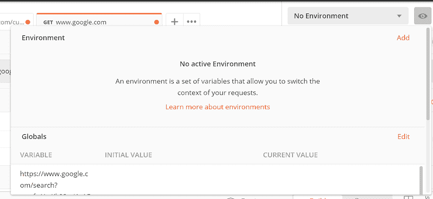

输入环境的名称，然后单击添加。

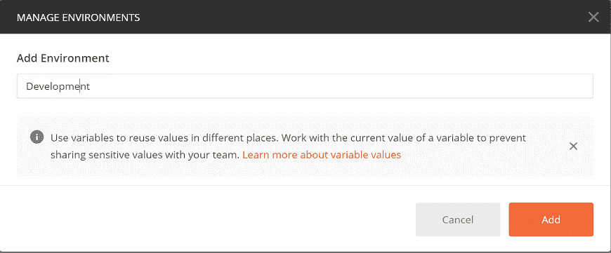

我们还可以下载、共享、删除、复制或导入环境。

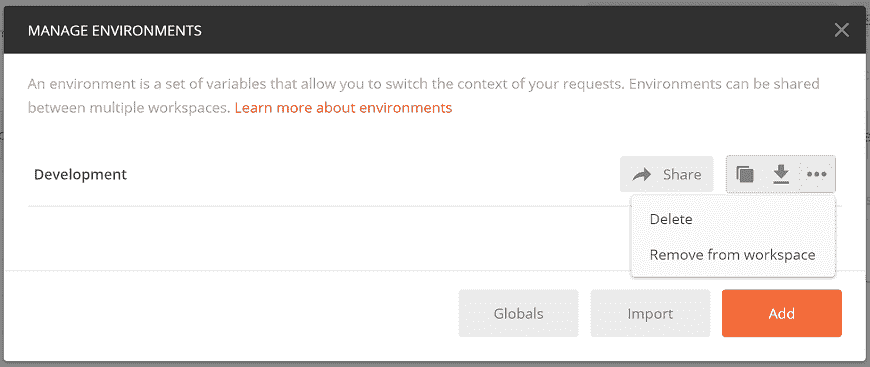

共享环境将有助于您针对同一组数据运行请求。

## Postman 中的环境变量

Postman 变量类似于编程语言变量。正如我们所知，变量是一个存储值的实体。您可以更改变量值。在[Postman](https://www.javatpoint.com/postman)中，变量是一组键值对。这里的键是变量，值是变量值。

### 在 Postman 中创建环境变量

要创建环境变量，请执行以下步骤:

*   转到**环境快速查看**按钮，在构建器部分的右上角可以看到一个眼睛图标。
    T3】
*   选择编辑选项。
    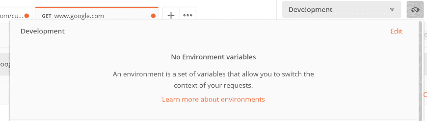
*   输入下面提到的键值对，其中 Key = url，初始值= http://restapi.demoqa.com
    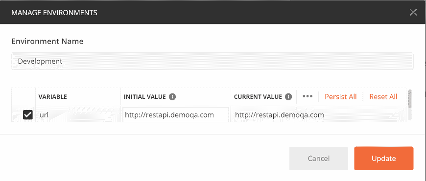

然后选择更新按钮，关闭**管理环境**窗口。现在您有了一个名为“url”的环境变量，该变量的值是[http://restapi.demoqa.com](http://restapi.demoqa.com)。

### 在 Postman 中使用环境变量

*   从下拉列表中选择环境。现在我们可以访问环境中所有可用的变量。
    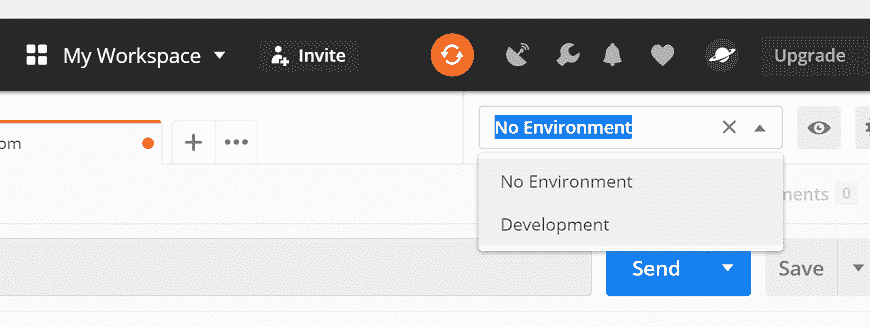
*   在地址栏或者我们可以说 URL 文本字段中输入以下 URL:{ { URL } }/utilities/weather full/city/Bengaluru
    
*   点击发送。你会得到如下回应:
    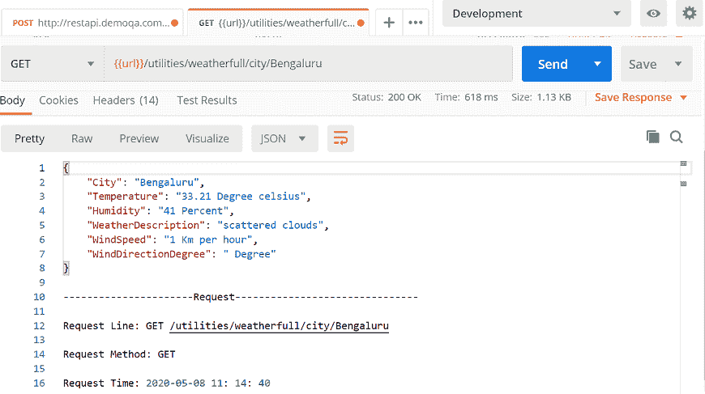

因此，环境是用一个名为“url”的变量创建的。这意味着我们现在可以使用变量代替实际的 [URL](https://www.javatpoint.com/url-full-form) 。

## Postman 中的全局变量

这里我们将看到如何创建全局变量。与环境变量不同，在全局变量的情况下，我们不需要先创建环境。

### 在 Postman 中创建全局变量

*   打开 Postman 应用，点击**环境快速查看**按钮，在构建器部分的右上角可以看到一个眼睛图标，如下图所示。
    T3】
*   现在选择**编辑**选项，如下图所示，在“全局”旁边可用。
    T3】
*   输入下面提到的键值对，其中 Key = url，初始值= http://restapi.demoqa.com
    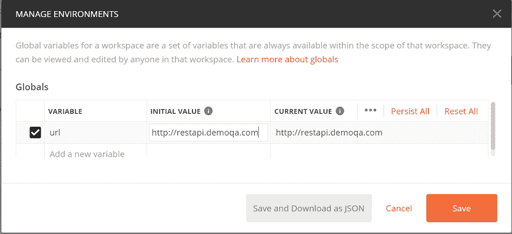
*   选择保存按钮并关闭**管理环境**在这里，您的全局变量以名称“url”创建。

### 在 Postman 中使用全局变量

从 Postman 的右上角下拉选择**无环境**。

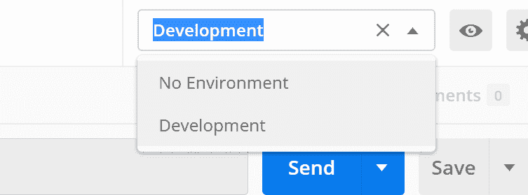

*   在地址栏中输入以下网址:{ { URL } }/实用程序/天气预报/城市/孟加拉国
    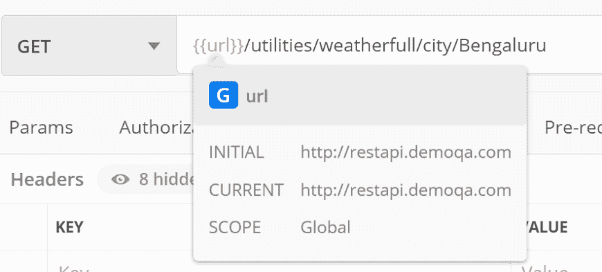
*   单击发送并查看响应。
    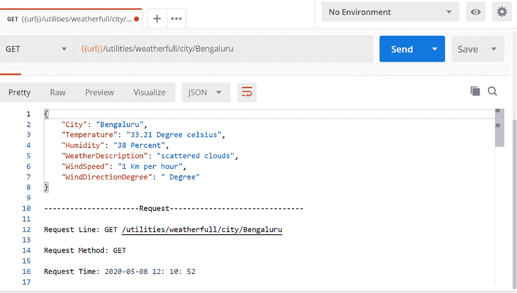

## 可变范围

变量范围是可以访问和执行这些变量的边界。Postman 支持以下变量范围，用于不同的任务。最窄的变量范围是本地，然后是数据、环境、集合，最宽的是全局。

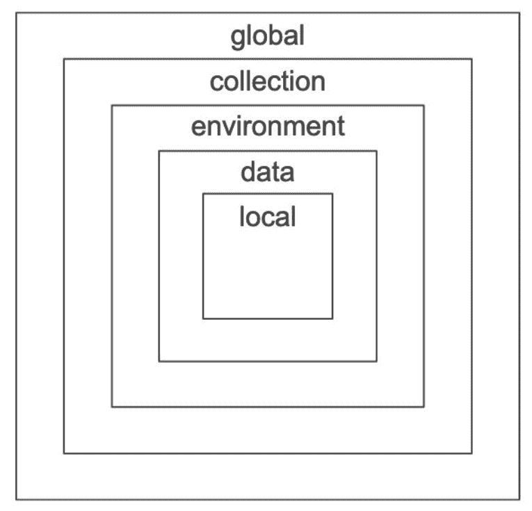

在这种情况下，变量名是相同的，在具有不同值的两个作用域中，那么在运行请求时将使用最窄的变量作用域的值。假设局部变量和全局变量的名字都是 **My Variable。**然后 Postman 将使用局部变量值来运行请求，因为局部变量是最窄的变量范围。

让我们逐一查看这些变量范围:

*   **局部变量**
    这些是临时变量，只在它们被创建的环境中起作用。当您更改环境时，变量将停止其访问，并会出现错误。
*   **集合变量**
    这些变量独立于环境，可用于集合中的所有请求。
*   **环境变量**
    这些是 Postman 中使用最多的变量范围。一次只能有一个环境处于活动状态。它们被绑定到用于执行请求的指定环境。
*   **全局变量**
    这些变量独立于环境，在环境之外发挥作用。用户不需要为全局变量创建环境。通过全局变量，我们可以在集合、测试脚本、请求和环境之间访问数据。
*   **数据变量**
    数据变量来自外部 CSV 和 JSON 文件，用于定义数据集，当通过 Newman 或 Collection Runner 运行集合时，可以使用这些数据集。

* * *