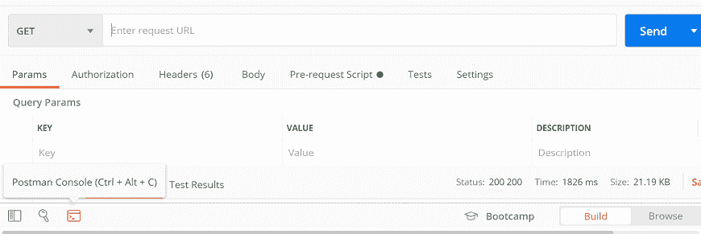
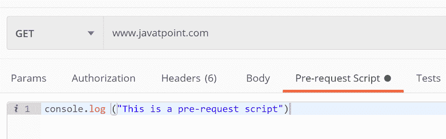
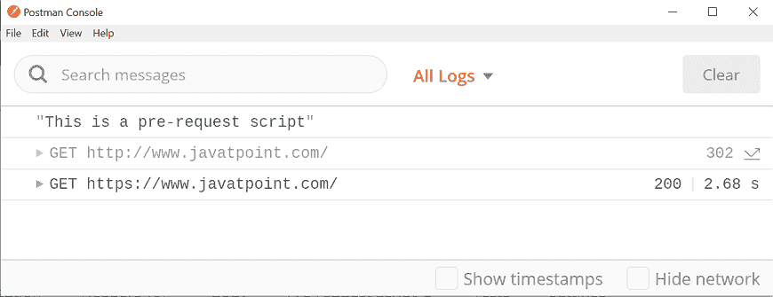
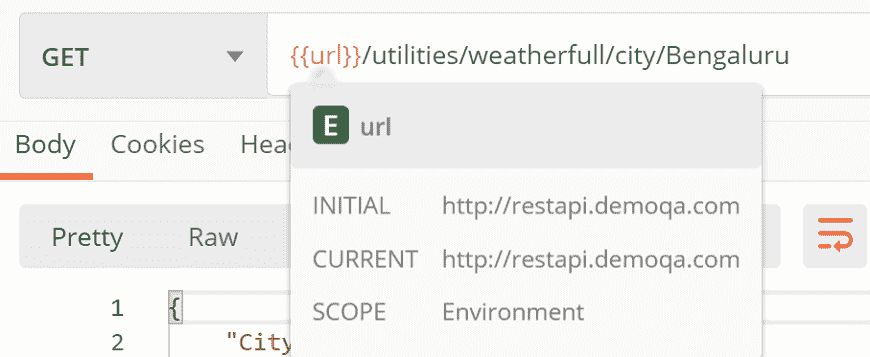
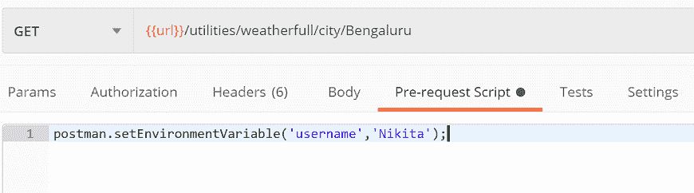
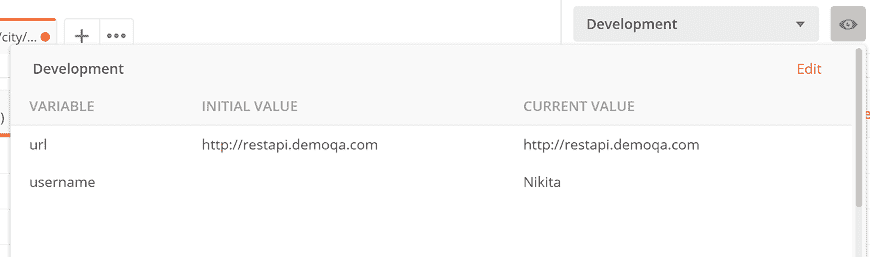
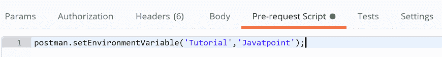
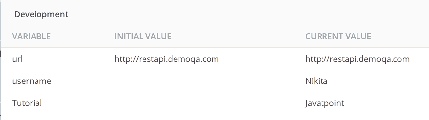

# 请求前脚本

> 原文：<https://www.javatpoint.com/postman-pre-request-scripts>

请求前脚本是一段将在请求执行之前运行的代码。它运行在[Postman](https://www.javatpoint.com/postman)沙箱中，允许我们添加动态行为来请求执行。

我们可以在请求级别、集合级别或文件夹级别应用预请求脚本，这意味着预请求脚本将应用于属于该集合或文件夹的所有请求。

但是，如果我们在请求、集合和文件夹中定义了所有三种方式的脚本，那么脚本必须以给定的顺序运行:

*   与集合关联的预请求脚本将在集合中的任何请求之前运行。
*   文件夹的预请求脚本将在文件夹中的任何请求之前运行。

我们可以将预请求脚本用于预处理任务，如设置参数、变量值、正文数据和标题。我们也可以使用预请求脚本来调试代码，例如通过将输出记录到控制台。此外，使用预请求脚本的概念，我们可以获得函数的输出，如日期、时间、时间戳等。

让我们看一个简单的例子来证明在执行请求之前，请求前脚本正在运行:

*   点击Postman控制台。**Postman控制台**存储请求中发生的所有事情。通过Postman控制台，我们可以看到日志和错误。它就像浏览器开发控制台，所有的东西都是可见的，包括用户发送到该网站或页面代码的整个请求。
*   要打开Postman控制台，请从窗口底部选择“Postman控制台”图标或按 ctrl+alt+c。



从控制台清除旧日志。


*   现在，在网址文本字段中输入网址。


*   转到**预请求脚本**选项卡，编写以下脚本:

```

console.log ("This is a pre-request script")

```



*   按下发送按钮，检查Postman控制台。



在这里，您可以看到请求前脚本在请求执行之前运行。

## 通过预请求脚本创建变量

这里，我们将使用环境变量。

*   转到**环境快速查看**按钮，在构建器部分的右上角可以看到一个眼睛图标。


*   从下拉列表中选择您的环境。在这里，我们将使用我们在学习“Postman中的变量”时已经创建的**开发**API。


*   在地址栏中输入以下网址:*{ { URL } }/实用程序/天气预报/城市/孟加拉国*



*   转到**预请求脚本**在编辑器中编写以下代码:

```

postman.setEnvironmentVariable('username','Nikita');

```



这将在“开发”环境中创建一个名为“用户名”且值为“尼基塔”的变量。

*   选择发送按钮，并通过选择作为眼睛图标可见的**环境快速查看**按钮查看当前变量。



在这里，我们可以看到创建的“用户名”变量在环境中可用。

同样，在请求前脚本编辑器中添加以下脚本:

```

postman.setEnvironmentVariable('Tutorial','Javatpoint');

```



再次检查**开发**环境变量:



因此，在脚本执行之前，我们可以在预请求脚本中执行多个任务，而无需一次又一次地创建和删除变量。

* * *