# 测试脚本

> 原文：<https://www.javatpoint.com/postman-test-scripts>

测试脚本在服务器收到响应后执行。在 postman 中，我们可以在 [Javascript](https://www.javatpoint.com/javascript-tutorial) 中编写测试脚本来测试 API 请求。测试脚本用于测试您的应用编程接口是否相应地工作，确定服务之间的集成是否正常工作，并检查新的开发是否没有影响现有请求的任何功能。测试脚本也称为请求后脚本。

我们可以用测试代码来调试你的 [API](https://www.javatpoint.com/api-full-form) 项目的流程。例如，您可以通过提交不完整的数据请求，使用测试脚本来验证 API 的错误处理。

我们可以对单个请求、文件夹或集合运行测试脚本。让我们看一个简单的例子，将测试脚本添加到请求中:

*   打开Postman控制台。要打开邮差控制台，请从窗口底部选择“邮差控制台”图标或按 ctrl+alt+c。


从控制台清除旧日志。

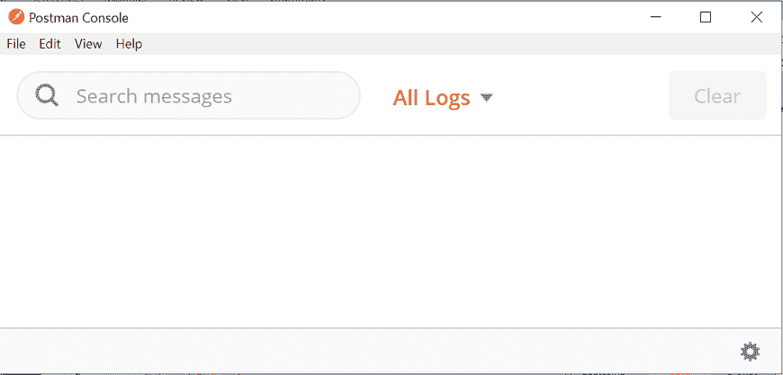

*   现在，在网址文本字段中输入网址。

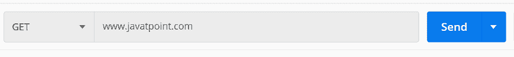

*   转到**测试**选项卡并编写以下脚本:

```

console.log ("This is a tests script")

```

*   按下发送按钮，检查Postman控制台。

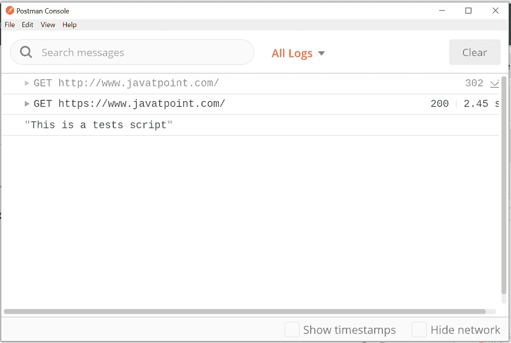

在这里，您可以看到测试脚本在请求执行之后正在运行。

## 使用测试脚本创建变量

这里，我们将使用环境变量。

*   转到**环境快速查看**按钮，在构建器部分的右上角可以看到一个眼睛图标。


*   从下拉列表中选择您的环境。在这里，我们将使用我们在学习“Postman中的变量”时已经创建的**开发**应用编程接口。


*   现在，在网址文本字段中输入给定的网址。{ { URL } }/公用事业/天气预报/城市/孟加拉国


*   转到**测试**在编辑器中编写以下代码:

```

pm.environment.set("u", "Hello");

```

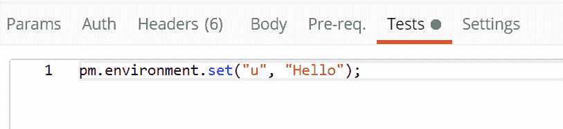

这将在“开发”环境中创建一个名为“u”且值为“Hello”的变量。

*   选择发送按钮，并通过选择作为眼睛图标可见的**环境快速查看**按钮查看当前变量。

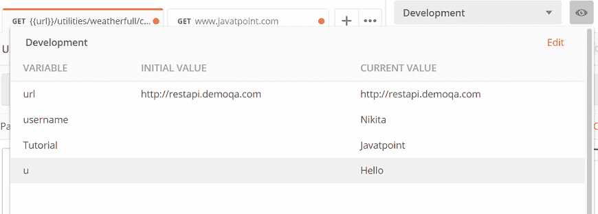

在这里，我们可以看到创建的“u”变量在环境中是可用的。

## 编写测试脚本

我们可以手动输入脚本或者使用代码编辑器右侧的 **Snippets，**。

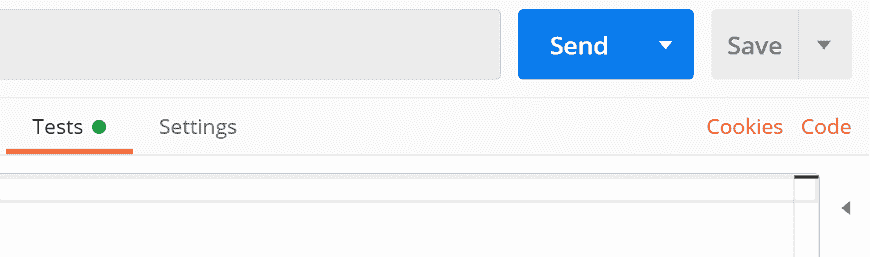
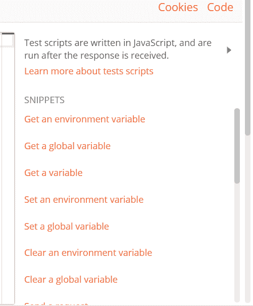

我们也可以在[邮差](https://www.javatpoint.com/postman)中编写自定义测试脚本。邮差提供了一个“**pm**API(称为 pm。* API)，用于编写测试。

### pm.test()

该函数将测试的条件写入Postman测试沙箱。在这个特性中编写测试有助于您正确命名测试，并确保脚本的其余部分不会在出现任何错误时被中断。

这个函数有两个参数，第一个是测试名(字符串形式)，第二个是返回布尔值的函数。

让我们看一个例子:

*   在网址文本字段中输入任何网址。


*   在**测试**选项卡中输入以下脚本:

```

// example using pm.response.to.have
pm.test("response is ok", function () {
    pm.response.to.have.status(200);
});

```

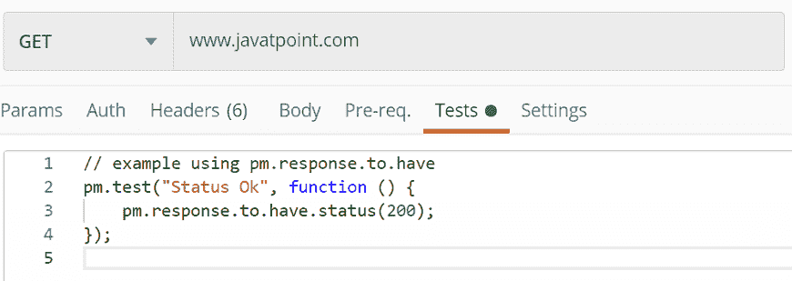

点击发送按钮测试您的请求，并在响应部分选择**测试结果**。这将显示通过了多少次测试，总共运行了多少次。

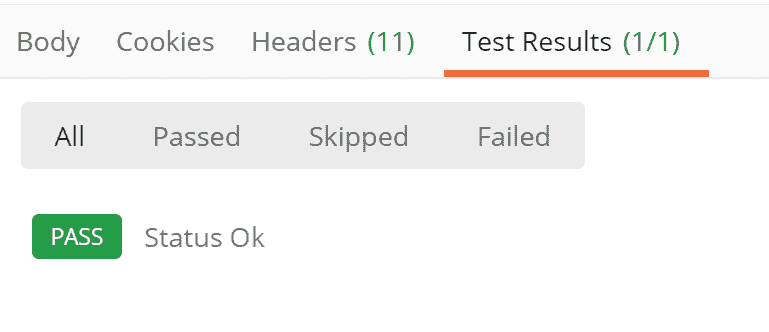

在上面的例子中，如果请求返回了一个 200 的状态代码，测试将通过；否则，它将失败。尝试更改测试的状态代码，并再次运行相同的请求。

```

pm.test("Status Fail", function () {
    pm.response.to.have.status(404);
});

```

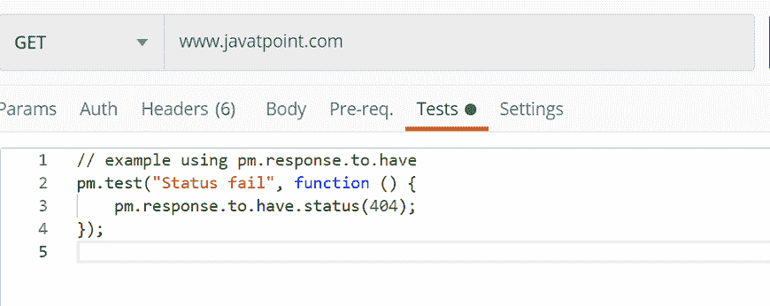

您将得到以下响应:

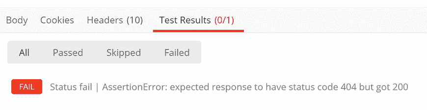

### pm.except()

pm.except()函数用于以不同的格式打印测试结果消息。这个函数使测试可读，甚至我们可以从变量或响应中管理数据断言。

```

// example using pm.expect()
pm.test("Status", function () { 
    pm.expect(pm.response.code).to.equal(404); 
});

```

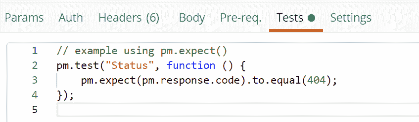

点击发送按钮，从响应部分看到**测试结果**:

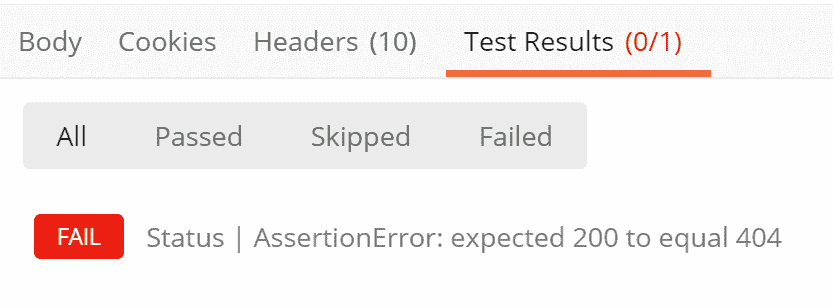

通过这个函数，我们可以测试请求环境，如下所示:

```

pm.test("environment to be production", function () {
    pm.expect(pm.environment.get("env")).to.equal("production");
});

```

另一个例子是:

```

// example using response assertions
pm.test("Status Ok", function () { 
    pm.response.to.not.be.error; 
    pm.response.to.have.jsonBody(""); 
    pm.response.to.not.have.jsonBody("error"); 
});

```

### pm.response.to.be.*

这是一个对象，提供了基于常用响应的测试简写。

```

// example using pm.response.to.be*
pm.test("Response", function () {
     // assert that the status code is 200
     pm.response.to.be.ok; 

     pm.response.to.be.withBody;
     pm.response.to.be.json; 
});

```

### 试验结果

测试笔试是通过还是失败；我们使用测试结果。运行带有测试的请求后，从响应窗口中选择测试结果选项卡。在这里，您将获得一份测试结果列表，无论测试是通过还是失败。布尔值为真表示测试通过，假表示测试失败。

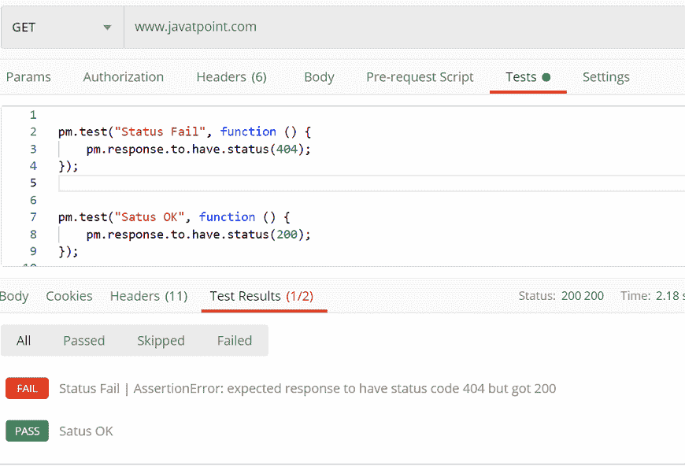

* * *