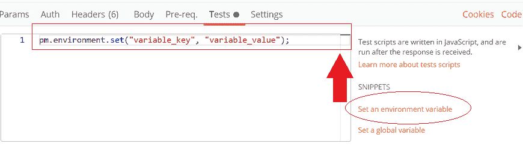
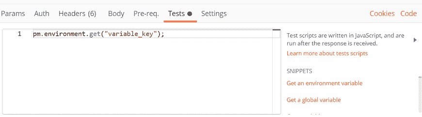
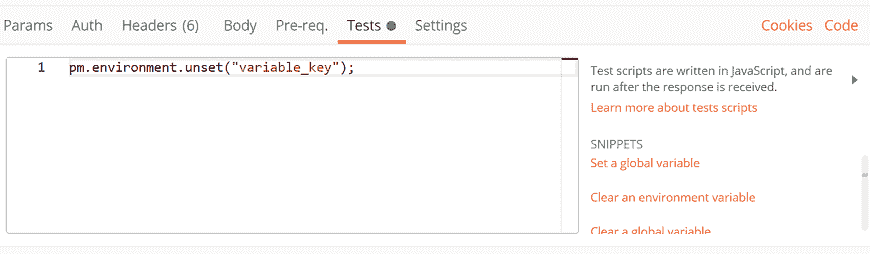
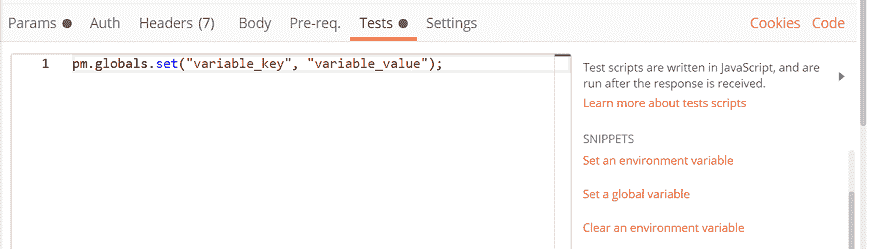
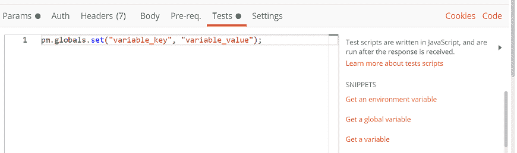
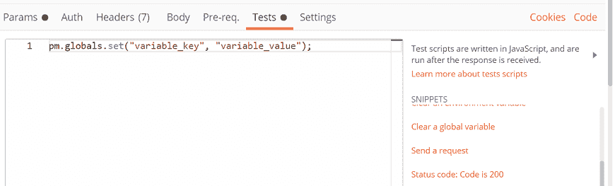

# 测试示例

> 原文：<https://www.javatpoint.com/postman-test-examples>

正如我们从上一节所理解的，测试脚本是在请求被发送，服务器收到响应之后执行的。

在这里，我们将讨论一些测试的例子。大多数例子可以在[邮递员](https://www.javatpoint.com/postman)的片段中找到。我们可以为一个请求运行多个测试。

## 环境

**设置环境变量**

```

pm.environment.set("variable_key", "variable_value");

```



我们还可以将嵌套对象设置为环境变量:

```

var array = [1, 2, 3, 4];
pm.environment.set("array", JSON.stringify(array, null, 2));

var obj = { a: [1, 2, 3, 4], b: { c: 'val' } };
pm.environment.set("obj", JSON.stringify(obj));

```

**获取环境变量**

```

pm.environment.get("variable_key");

```



**清除环境变量**

```

pm.environment.unset("variable_key");

```



## 募捐

**设置收集变量**

```

pm.collectionVariables.set(variableName:String, variableValue:String);

```

**获取集合变量**

```

pm.collectionVariables.get(variableName:String);

```

**清除收集变量**

```

pm.collectionVariables.unset(variableName:String);

```

## 全球

**设置全局变量**

```

pm.globals.set("variable_key", "variable_value");

```



**获取全局变量**

```

pm.globals.get("variable_key");

```



**清除全局变量**

```

pm.globals.unset("variable_key");

```



## 响应处理

**在响应正文中搜索字符串**

```

pm.test("Body Contains", function () {
    pm.expect(pm.response.text()).to.include("search_string");
});

```

**检查响应体是否等于字符串**

```

pm.test("Body is correct", function () {
    pm.response.to.have.body("response_body_string");
});

```

**检查 JSON 值**

```

pm.test("Your test name", function () {
    var jsonData = pm.response.json();
    pm.expect(jsonData.value).to.eql(100);
});

```

**检查内容类型标题是否存在**

```

pm.test("Content-Type header is present", function () {
    pm.response.to.have.header("Content-Type");
});

```

**响应时间小于 200 毫秒**

```

pm.test("Response time is less than 200ms", function () {
    pm.expect(pm.response.responseTime).to.be.below(200);
});

```

**状态码为 200**

```

pm.test("Status code is 200", function () {
    pm.response.to.have.status(200);
});

```

**代号包含一个字符串**

```

pm.test("Status code name contains a string", function () {
    pm.response.to.have.status("Created");
});

```

**成功开机自检请求状态码**

```

pm.test("POST request Successful ", function () {
    pm.expect(pm.response.code).to.be.oneOf([201,202]);
});

```

* * *