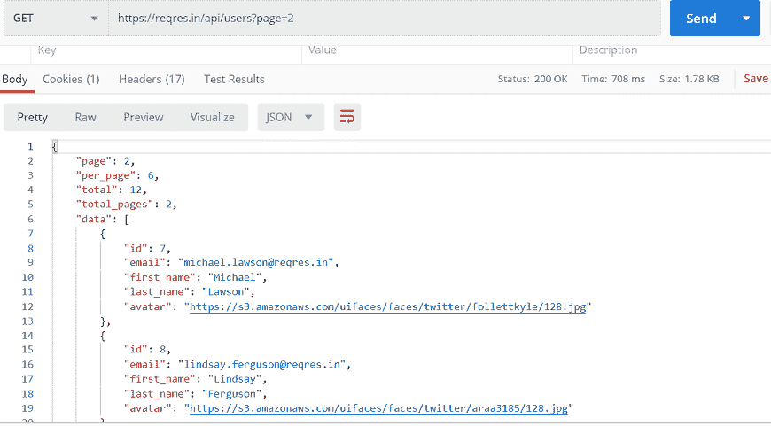
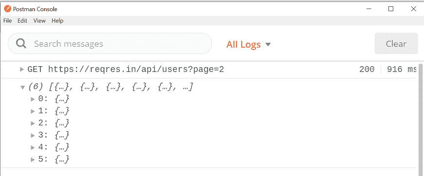
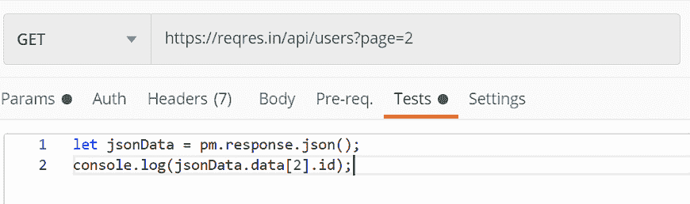
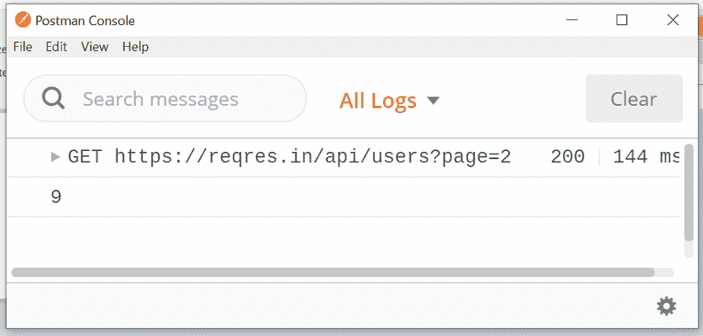

# Postman的资产

> 原文：<https://www.javatpoint.com/asserts-in-postman>

**断言**检查给定的预测在任何编程语言中是真还是假。预测是值为真或假的布尔表达式。这意味着断言只不过是可以用来检查或分析从服务器收到的响应的代码。

断言是用 Postman 中的 [javascript](https://www.javatpoint.com/javascript-tutorial) 编写的代码，在收到响应后执行。

## 为什么我们在Postman中使用断言

测试的主要目的是确定系统的给定参数是否工作。为了对函数参数施加力，我们在测试运行期间用实际值断言预测值。

断言帮助我们断言预期值和实际值应该在测试运行期间匹配。如果实际值和期望值不匹配，那么测试将失败，输出指向失败。

在[Postman](https://www.javatpoint.com/postman)中，我们可以用多种方式写出断言。最简单的方法之一是**片段，**只不过是一组代码，其中有一些独特的功能，可以在Postman应用中找到。用户可以很容易地访问代码片段，并且可以在测试编辑器中获取代码并运行测试。

## 例子

这里我们将讨论主要基于**格式响应的断言。json** 。

在 Postman 中，断言可以应用于不同的属性，如对象、数组等。

正如我们在 Postman 中默认知道的，从服务器接收到的响应是以 JSON 格式显示的，甚至我们可以选择 [JSON](https://www.javatpoint.com/json-tutorial) 应用，得到转换成 JSON 格式的响应。

首先，在网址文本字段中输入以下[网址](https://www.javatpoint.com/url-full-form):

[https://reqres.in/api/users?page=2](https://reqres.in/api/users?page=2)

发送请求并查看响应:



现在在给定请求的测试选项卡中添加下面一行代码。

```

let jsonData = pm.response.json();
console.log(jsonData.data);

```


代码 pm.response.json()用于解析 json 主体。而 console.log(jsonData.data)代码用于将对象登录到 Postman 控制台。

现在，重新运行请求并打开Postman控制台。



在上图中，您可以看到对象内部的数组。列出了从 0 到 5 的各种对象，因此有六个不同的对象。

我们可以在点()的帮助下访问数组的名称和值。)运算符。

使用以下代码行编辑测试编辑器，并查看控制台:

```

let jsonData = pm.response.json();
console.log(jsonData.data[2].id);

```




在这里，您可以看到 id 的值，它属于数组的索引 2。

* * *