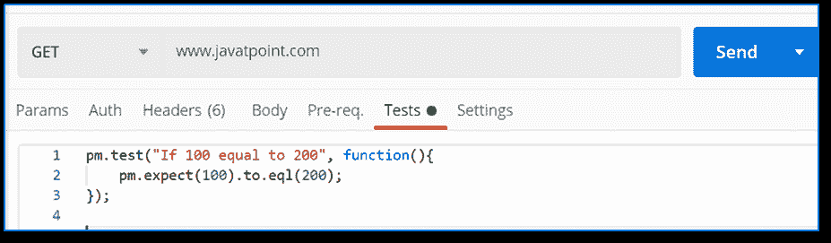
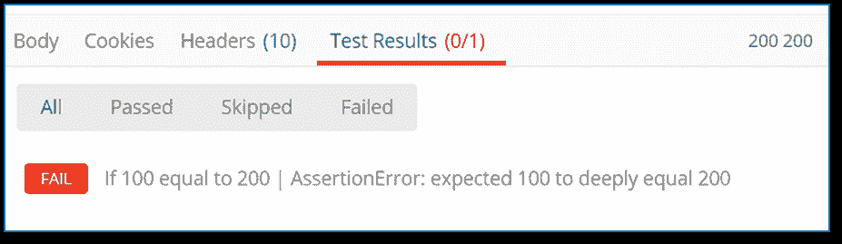
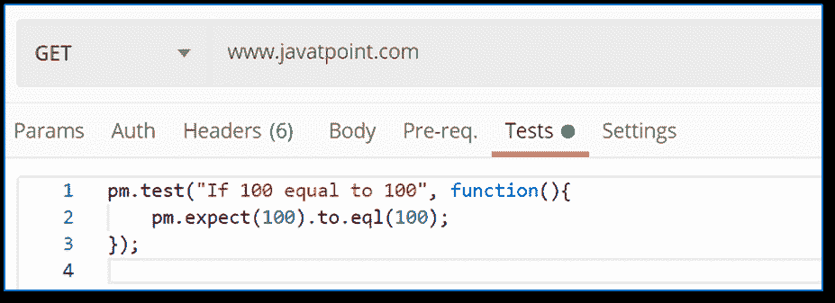
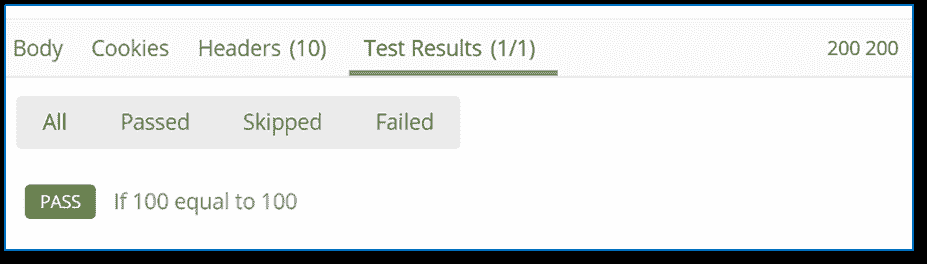
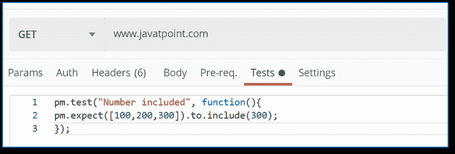
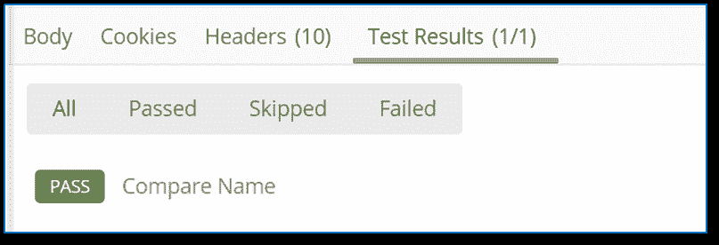
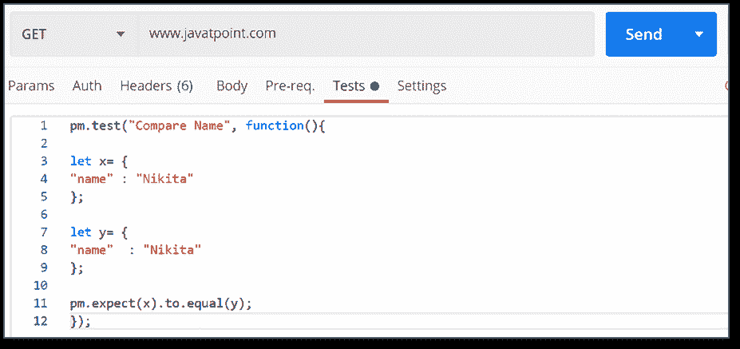
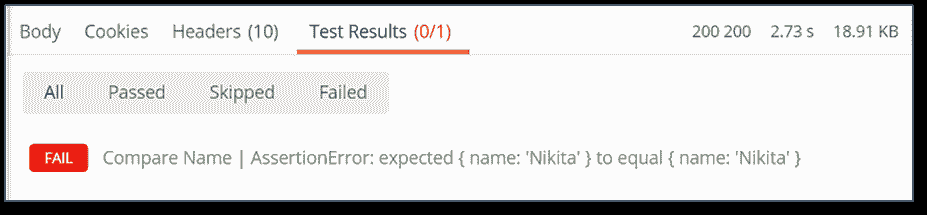

# 柴断言库

> 原文：<https://www.javatpoint.com/postman-chai-assertion-library>

Chai 断言库是一个用于编写断言的外部 javascript 库。与我们直接用 javascript 编写的内容相比，这个断言库需要更少的时间和精力，并且易于使用。

默认情况下，Chai 断言库在[Postman](https://www.javatpoint.com/postman)中可用。所以当你写 chai 断言的时候，不要担心其他的安装过程。Postman 断言的主要特征是他们用人类可读的英语句子编写测试。所以它非常容易阅读，用户友好。


如果你想了解更多关于柴断言库的信息，这里有一个官方网站。你可以参观这个[https://www.chaijs.com/](https://www.chaijs.com/)。

### 使用柴断言库编写断言。

在[网址](https://www.javatpoint.com/url-full-form)文本字段中复制以下网址。

```

www.javatpoint.com

```

**例 1:**

*   转到测试选项卡，并在测试编辑器中编写以下代码。

```

pm.test("If 100 equal to 200", function(){
    pm.expect(100).to.eql(200);
});

```



*   单击发送，查看响应部分的测试结果。



在上面的例子中，我们检查 100 是否等于 200。回应是失败的，这是显而易见的。

只需用下面的代码编辑代码，然后再次看到响应。

```

pm.test("If 100 equal to 100", function(){
    pm.expect(100).to.eql(100);
});

```




既然 100 等于 100。测试通过了。

**例 2:**

这里，我们将检查给定的数字是否在数组中。

*   打开 tests 选项卡并编写以下代码:

```

pm.test("Number included", function(){
pm.expect([100,200,300]).to.include(300);
});

```



*   按发送，查看响应中的测试结果选项卡。


在这里，您可以看到测试通过了，因为在 100、200 和 300 的数组列表中有 300。

**例 3:**

在这个断言中，我们将验证对象。

*   打开 tests 选项卡并编写以下代码:

```

pm.test("Compare Name", function(){

let x= {
"name" : "Nikita"
};

let y= {
"name"  : "Nikita"
};

pm.expect(x).to.eql(y);
});

```


*   点击发送按钮，查看响应中的测试结果。



测试通过是因为在两个对象上，名称是相同的。

在上面的代码中，我们使用了 eql()。Postman 提供了 eql()和 equal()两种方法。但是两种方法都不一样。equal()用于比较对象，eql()用于比较对象的属性。在这种情况下，eql()比较了对象的 name 属性。

尝试用 pm.expect(x).to.equal(y)编辑最后一行代码，并查看响应。




上面的测试失败了，因为我们使用了 equal()，它比较的是对象，而不是对象的属性。

* * *