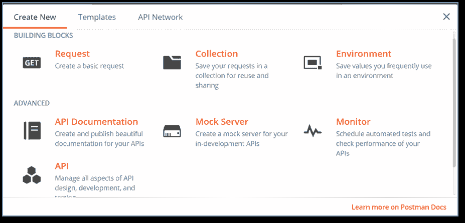
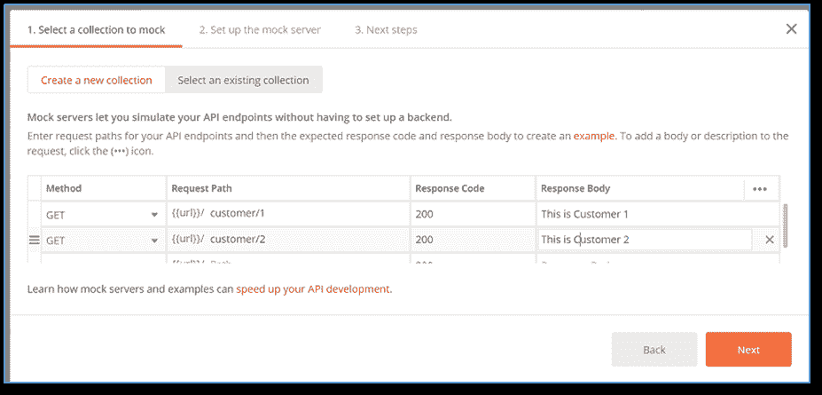
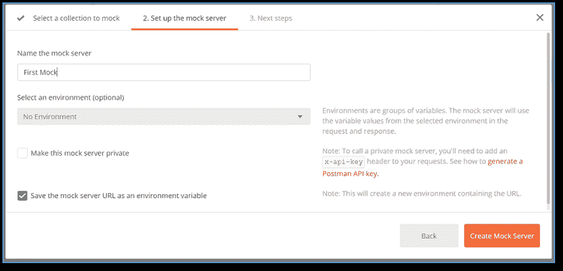
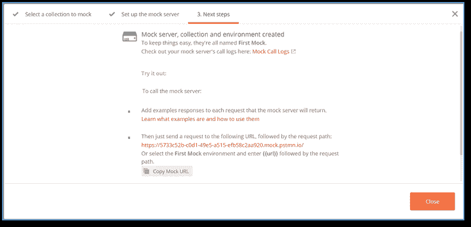
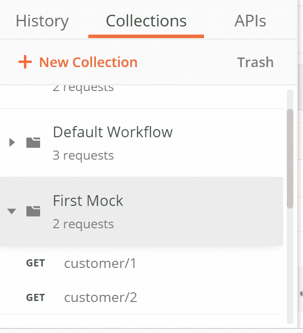
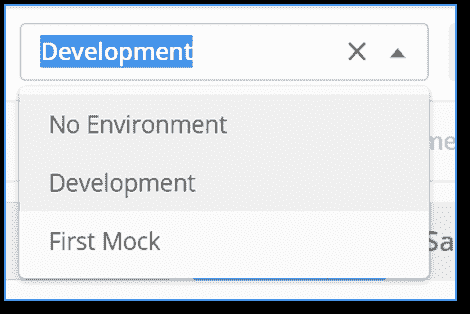
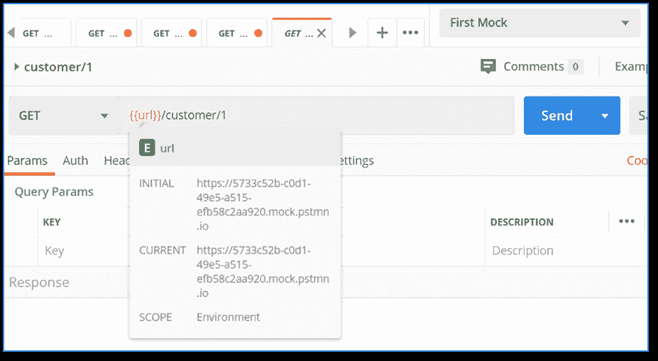
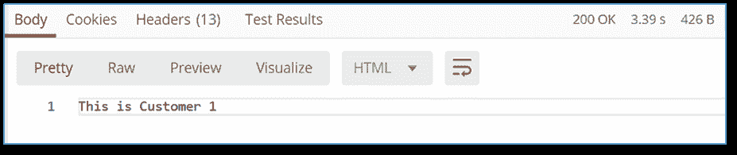

# 设置模拟服务器

> 原文：<https://www.javatpoint.com/postman-setting-up-a-mock-server>

要在 Postman 中设置一个模拟服务器，我们需要一个集合，因为 Postman 中的模拟与一个集合绑定在一起。Postman 比较请求，并根据集合请求中的示例创建模拟响应。

在 Postman 中创建模拟服务器之前，我们必须了解模拟服务器的一些要点:

*   在 Postman 应用中，模拟服务器已经集成，所以我们不需要浪费时间从外部下载和安装。
*   模拟服务器支持 CORS。CORS 代表跨来源资源共享。当使用模拟服务器时，它确保你不会得到任何跨来源的错误。
*   Postman 中提供了模拟服务器，可以免费使用。

在[邮递员](https://www.javatpoint.com/postman)中，有很多方法可以构建模拟服务器:

*   新按钮
*   邮差应用编程接口
*   启动屏幕
*   邮差应用

默认情况下，模型可以使用。它是公开的。当您制作一个私有的模拟服务器时，企业用户和 postman pro 客户端可以与他们的组和特定的团队成员共享基础集合，或者他们可以授予编辑或查看的权限。

让我们创建模拟服务器。这里我们将讨论如何用**新建**按钮创建一个模拟服务器。

*   从邮差应用标题部分的左上角，选择“新建”按钮。

*   选择模拟服务器。

*   选择模拟服务器后，将会打开一个新面板。通过这个面板，我们可以创建一个新的请求。

在上图中，我们有多个选项。

在这里，

*   **方法**为 GET、POST 等请求型方法。
*   **请求路径**是您的应用编程接口请求的网址。
*   **响应代码**是我们想要得到响应的代码。
*   **反应体**是你想要在反应中表现出来的反应体。

如下所示填写该栏:

*   点击下一步。现在在下一个选项卡上，给出模拟服务器的名称。你可以根据自己的选择给予任何东西。

在上图中，您可以看到一个复选框。如果你想让你的模拟服务器私有，启用它。

选择**创建模拟服务器**按钮。

*   下一个面板是审查面板，它向您提供模拟服务器已经成功构建的审查。

该屏幕还将显示一个[网址](https://www.javatpoint.com/url-full-form)，通过该网址我们可以访问模拟服务器。

*   单击关闭按钮关闭面板。

关闭面板后，使用给定的 API 生成了一个新的集合。

*   我们还可以看到已经创建了一个同名的新环境。

选择此环境变量。

*   现在，从集合中选择第一个请求，并查看请求 url。

*   点击发送按钮。在这里你可以看到回应。

在这里，您可以看到，我们获得了与设置模拟服务器时相同的响应主体和响应代码。

* * *