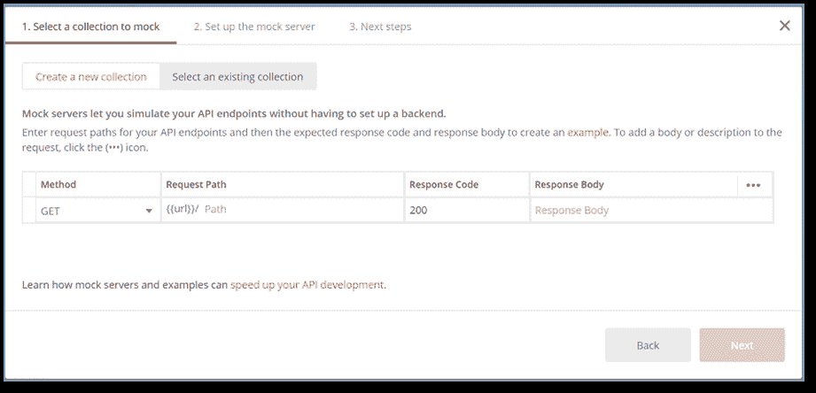
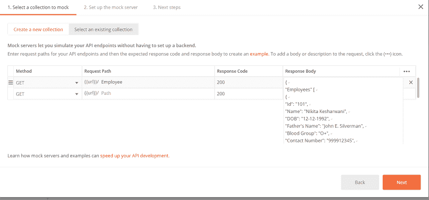
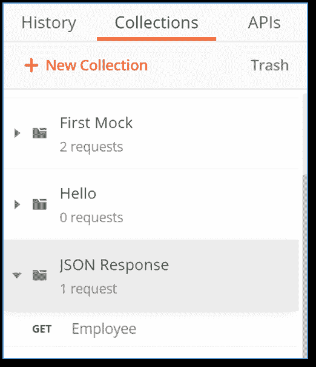
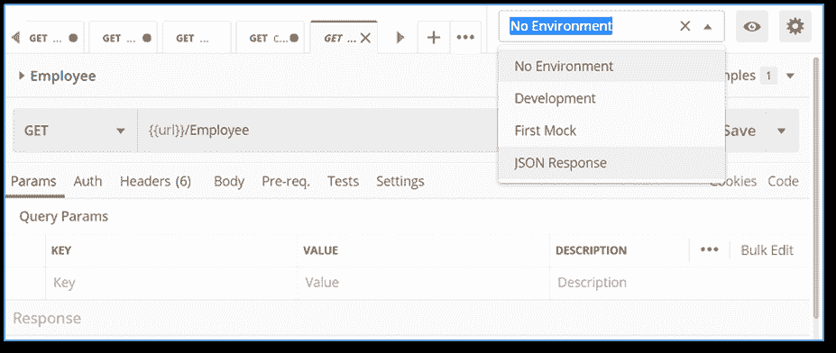
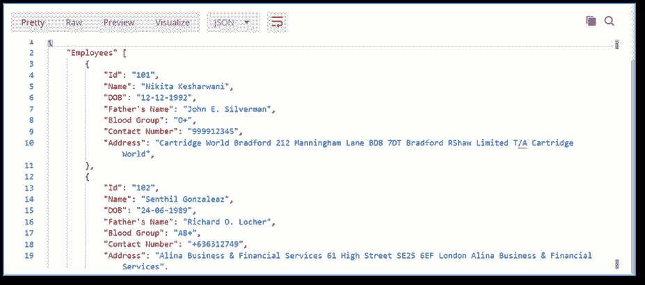

# 在模拟服务器中获取响应

> 原文：<https://www.javatpoint.com/postman-get-response-in-mock-server>

这里我们将讨论如何在[邮差](https://www.javatpoint.com/postman)中获取其他不同格式的响应，非常简单。最常见的格式是 JSON。让我们看看如何获得 [JSON](https://www.javatpoint.com/json-tutorial) 格式的响应。

*   从邮差应用的标题部分的左上角，选择**新建**


*   选择模拟服务器。


*   选择模拟服务器后，将会打开一个新面板。通过这个面板，我们可以创建一个新的请求。



*   在**响应体**列，不写纯文本，输入 JSON 格式的响应体。

在这里，我们将记录不同员工的数据:

```

{
"Employees" [
{
"Id": "101",
"Name": "Nikita Kesharwani",
"DOB": "12-12-1992",
"Father's Name": "John E. Silverman",
"Blood Group": "O+",
"Contact Number": "999912345",
"Address": "Cartridge World Bradford 212 Manningham Lane BD8 7DT Bradford RShaw Limited T/A Cartridge World",
},
{
"Id": "102",
"Name": "Senthil Gonzaleaz",
"DOB": "24-06-1989",
"Father's Name": "Richard O. Locher",
"Blood Group": "AB+",
"Contact Number": "+636312749",
"Address": "Alina Business & Financial Services 61 High Street SE25 6EF London Alina Business & Financial Services",
}
]
}

```

在响应正文中复制上面的 JSON。



*   按下一步。现在在下一个面板中，根据您的选择给出服务器的名称。我给出了 JSON 回应’。


*   选择创建模拟服务器按钮。



*   选择员工应用编程接口，然后选择 JSON 响应环境。



*   按发送并查看响应。



这里，默认情况下，您可能会得到 [HTML](https://www.javatpoint.com/html-tutorial) 格式的响应，从下拉列表中将格式更改为 JSON，您将得到上面给出的响应。

同样，我们可以使用不同的格式在模拟服务器中获得响应。

* * *