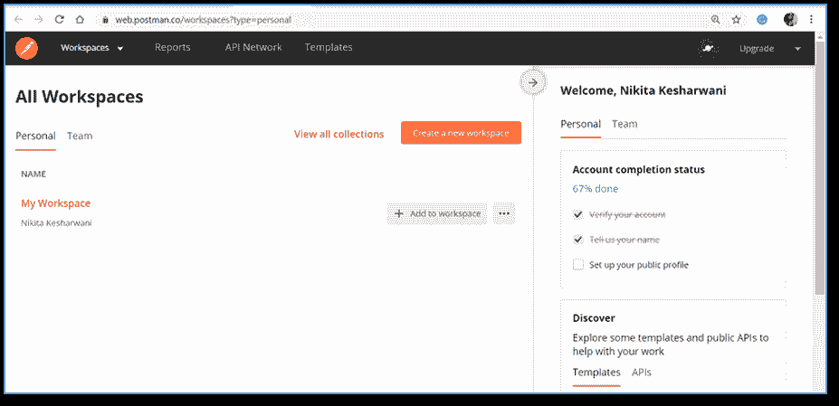
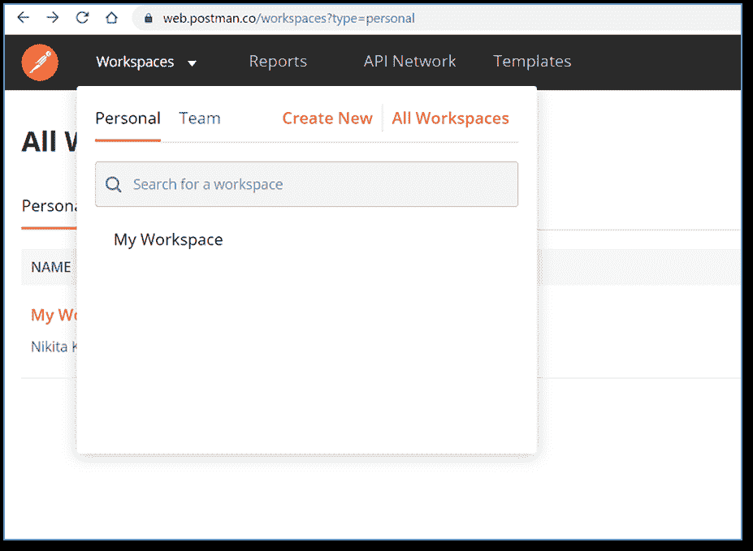
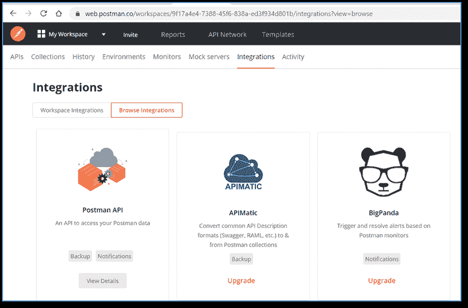
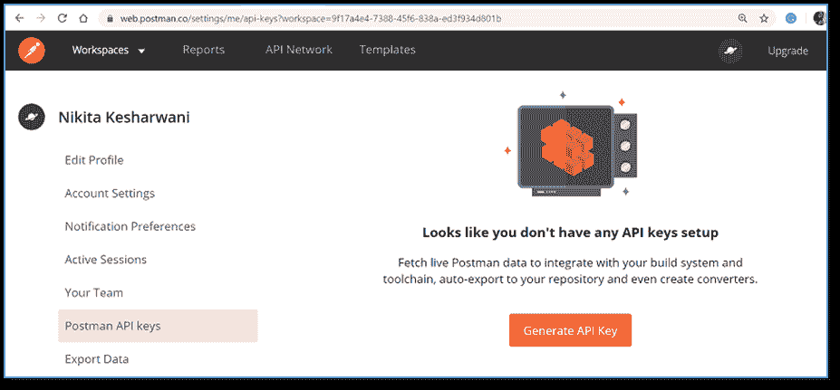
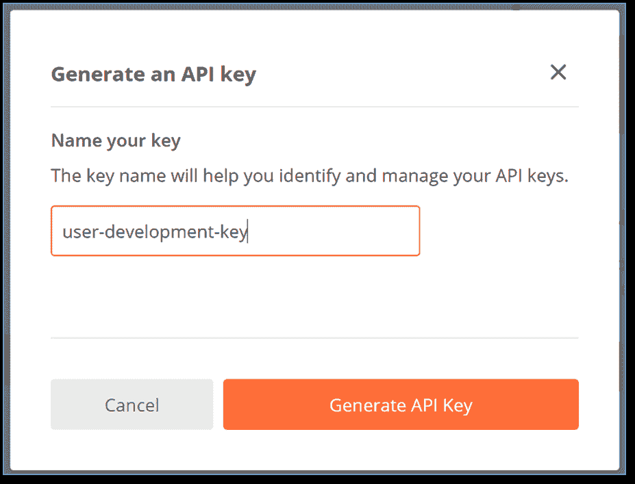
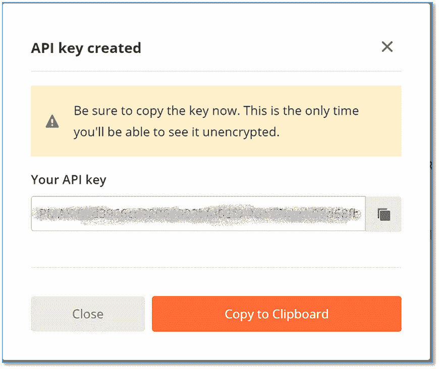
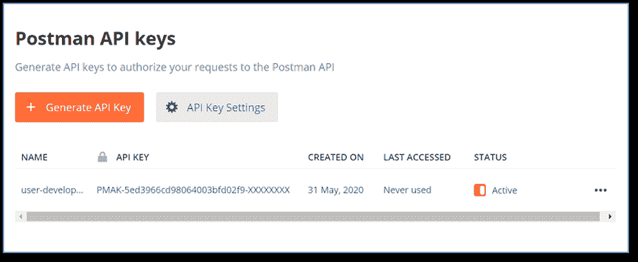
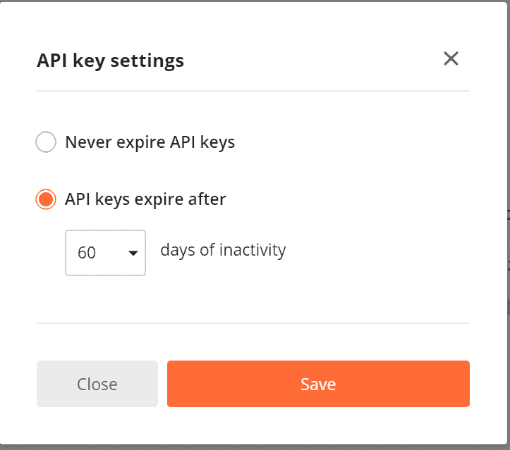

# PostmanAPI介绍

> 原文：<https://www.javatpoint.com/postman-api>

PostmanAPI的端点允许您将Postman集成到您的工具链中进行开发。

在 postman API 中，我们可以创建新的集合、更新环境、更新现有集合，并直接添加和运行监视器。它帮助您以编程方式访问Postman应用中存储的数据。

## 生成PostmanAPI密钥

发送请求需要有一个适用的 [API](https://www.javatpoint.com/api-full-form) 键。

*   转到以下链接[网页仪表盘](https://web.postman.co/workspaces?type=personal)。

*   选择您的工作区。

*   选择**集成**选项卡，找到**PostmanAPI**，然后选择**查看详情**。

*   如果您还没有任何密钥，您将获得**生成API密钥**选项。选择**生成API密钥**

*   根据您的选择输入密钥的名称，然后单击生成API密钥。这里我给出了‘用户开发键’。

*   别忘了抄钥匙。然后单击关闭。

*   您的密钥已经生成。现在，您可以在工作区内处理这些键。

*   您可以删除并重新生成密钥。

*   选择**API密钥设置**选项，设置密钥的有效期。

## 证明

通过在您创建的任何请求的 **X-Api-Key** 头中提交您的 Api 密钥，您将需要向Postman API 验证您的请求。

该API密钥用于提供对授权数据的访问。

您也可以将您的API密钥存储在名为**Postman-API密钥**的环境变量中。[Postman](https://www.javatpoint.com/postman) API 集合可以自动访问 API 密钥。

## 费率限制

每分钟需要 60 个请求才能使用密钥访问 API。

API的每个响应都包含以下一组标题来标识您的消费状态。

| 页眉 | 描述 |
| 极限速度极限 | 此标头指定每分钟允许使用者提交的最大请求数。 |
| x-速率限制-剩余 | 此标头指定当前限制窗口中剩余的请求数量。 |
| x 比例限制重置 | 此标题定义当前速率限制窗口重置的时间(以世界协调时纪元秒为单位)。 |

* * *