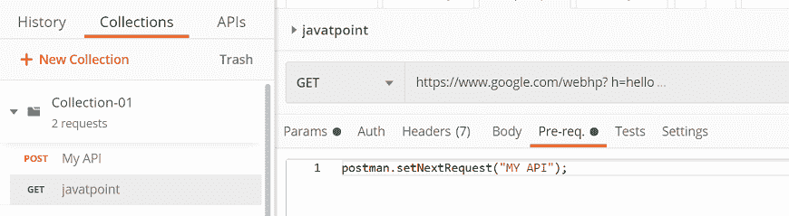
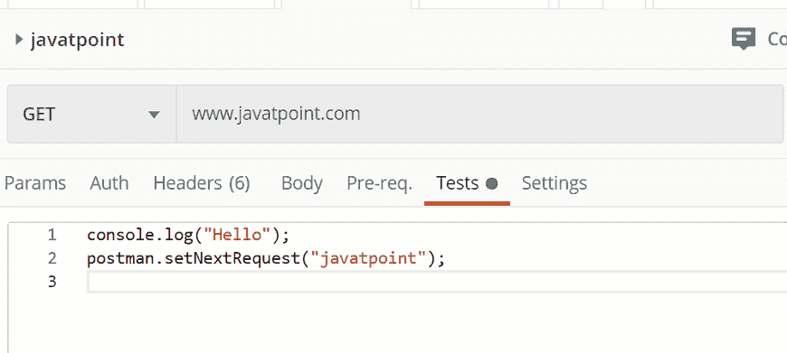

# 分支和循环

> 原文：<https://www.javatpoint.com/postman-branching-and-looping>

在 Postman 中，我们还可以处理分支和循环。我们可以在 setNextRequest()函数的帮助下，跨 API 请求进行分支和循环。

```

postman.setNextRequest("request_name");

```

该函数用于设置下一步要执行的请求。这个函数接受一个参数，即请求的名称，然后执行。



在上面的例子中，“我的应用编程接口”是请求的名称。

setNextRequest()的一些特性:

*   提供请求名称或请求标识，收集运行程序将处理其余部分。
*   我们可以在测试脚本和预请求脚本中使用 setNextRequest()。当您有多个赋值时，最后设置的值优先。
*   如果请求中未给出 Postman.setNextRequest()，收集运行程序将遵循默认设置的线性执行设置，并移动到下一个请求。

## 循环当前请求

如果在 setNextRequest()函数的参数中给出当前运行的请求名称，那么 Postman 将连续运行相同的请求。



但是当您不断地循环同一个请求时，我们必须在 setNextRequest()上应用一些逻辑，这样请求就不会无休止地运行；否则收集滑道将不得不强制关闭。

## 停止工作流执行

若要停止工作流的执行，请在 setNextRequest()函数中传递 null 参数。

```

postman.setNextRequest(null);

```

* * *