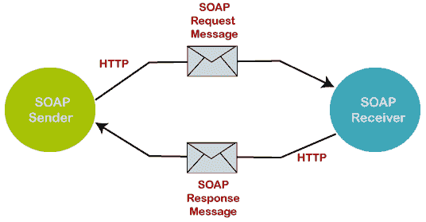
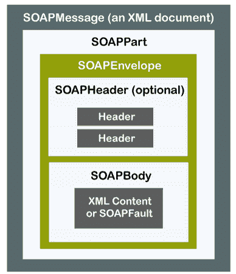
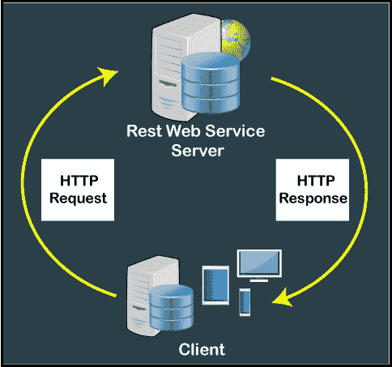

# SOAP 和 REST 网络服务简介

> 原文：<https://www.javatpoint.com/soap-and-rest-web-services>

## SOAP 网络服务

**SOAP** 代表**简单对象访问协议是网络服务中使用的网络平台**，用于在网络上的两台不同机器之间交换或通信数据。它使用数据的 XML 格式通过 [HTTP](https://www.javatpoint.com/computer-network-http) 协议传输消息。在网络服务中，SOAP 允许用户请求与其他编程语言交互。通过这种方式，它提供了一种在不同平台(操作系统)上运行的应用之间进行通信的方式，编程语言和技术用于 web 服务。



### SOAP 消息:

SOAP 消息包含以下 [XML](https://www.javatpoint.com/what-is-xml) 格式的信息，如下所示。

*   它包含有关在网络上处理期间消息结构和指令的信息。
*   SOAP 包含一个信封，以 XML 格式表示消息的开始和结束。
*   在消息中，标头是一个可选元素，包含特定于应用的信息，如身份验证、授权和支付等。
*   故障元素是一个可选元素，它在信息处理过程中显示错误消息。

### 肥皂的特性

*   它是一个开放的标准协议，用于通过互联网进行通信的网络服务。
*   它用于通过网络广播消息。
*   它用于调用远程过程和交换文档。
*   它可以在任何平台上使用，并且可以支持多种语言。所以，它是一个平台和语言独立的。
*   它使用 XML 格式通过 HTTP 协议发送消息。
*   SOAP 消息的结构由信封、头和正文元素组成。

### SOAP 构造块

SOAP 构造块描述了什么样的 XML 数据被发送到 web 服务和客户端应用。下图显示了 SOAP 构建块。



**SOAP 信封:**信封用于定义 SOAP 消息的开始和结束。它包含 SOAP 消息的细节。它是 XML 文档的一个重要元素。

**SOAP 头:**它是一个可选元素，其中头包含授权、认证等凭证信息。在处理 SOAP 消息的过程中使用。

**SOAP Body:** 它是 SOAP 消息的重要元素，包含 XML 格式的请求和响应信息。它定义了要在客户端和 web 服务器之间发送的消息的实际内容。

**SOAP Fault:**SOAP Fault 元素是一个可选元素，用于显示 SOAP 消息传输过程中遇到的错误消息。它保存 SOAP 消息和错误的状态。

以下是 SOAP 故障元素的子元素。

| 子故障元素 | 描述 |
| **T2【故障码】T3** | 它用于识别 SOAP 消息中的错误代码。 |
| **<断层线>** | 它用于提供人类可读的错误描述。 |
| **<>** | 它是 SOAP Fault 中的一个可选元素，指示在处理消息期间发生的错误。 |
| **<详情>** | 它用于保存 Body 元素的特定于应用的状态错误。 |

### SOAP 结构:

下面的代码表示 SOAP 结构。

```

<?xml version="1.0"?>
<SOAP:Envelope
xmlns:SOAP="http://www.w3.org/2003/05/SOAP-envelope/"
SOAP:encodingStyle="http://www.w3.org/2003/05/SOAP-encoding">

<SOAP:Header>
...
</SOAP:Header>

<SOAP:Body>
...
  <SOAP:Fault>
  ...
  </SOAP:Fault>
</SOAP:Body>

</SOAP:Envelope>

```

### SOAP 请求示例

```

<?xml version = "1.0"?>
<SOAP-ENV:Envelope xmlns:SOAP-ENV="http://schemas.xmlSOAP.org/SOAP/envelope/">
    <SOAP-ENV:Header/>
    <SOAP-ENV:Body>
        <ns2:getCourseDetailsResponse xmlns:ns2="http://in28minutes.com/courses">
            <ns2:course>
                <ns2:id>Course1</ns2:id>
                <ns2:name>Spring</ns2:name>
                <ns2:description>10 Steps</ns2:description>
            </ns2:course>
        </ns2:getCourseDetailsResponse>
    </SOAP-ENV:Body>
</SOAP-ENV:Envelope>

```

### 肥皂的优点

SOAP 协议的优点是:

*   W3C 联盟建议 web 服务和应用编程接口与客户端应用通信。
*   这是一种轻量级通信协议，用于在网络上两台机器之间交换数据。
*   它是一个独立于平台的操作系统，可以在 Linux、Windows 和 macOS 上运行。
*   SOAP 使用默认协议通过网络发送消息，所有的网络应用也支持它。
*   它有一个 XML 格式，包括一个信封、头、正文和一个在消息处理过程中作为 SOAP 消息的错误元素

### 肥皂的缺点

SOAP 协议的缺点是:

*   SOAP 仅用于 web 服务中的 XML 格式数据，而 JSON 和其他轻量级格式不受其支持。
*   它很慢，因为它使用了 XML 格式，而简单字符串消息的负载很大。
*   SOAP 规范中没有安全特性。
*   SOAP 客户端中没有远程对象的状态引用。

## 网络服务

代表状态转移。它是一种架构风格，在 web 服务上提供计算机系统之间的标准。它是一组用于创建轻量级、可扩展和可维护的 web 服务的约束，便于通信。它是一组用于创建轻量级、可扩展和可维护的 web 服务的约束，使得彼此之间的通信变得容易。所有的网络服务都基于 REST 因此，它被称为 RESTful 服务。开发 [RESTful web 服务](https://www.javatpoint.com/restful-web-services-tutorial)的目的是让 web 服务更加有效。罗伊·菲尔丁在 2000 年开发了它，他也开发了 HTTP 协议。它不依赖于使用特定的协议，但是它使用了 HTTP/HTTPS。



### 休息特征

*   这是一个无状态服务器。
*   它支持 JSON 和 XML
*   它比 SOAP 简单。
*   它有维护良好的文档，反映了 REST 架构中的每一个变化。
*   构建客户机和服务器服务是一种简单的方法。
*   它遵循标准协议，如 HTTP、HTTPS 和 FTP。
*   它提供了一种与服务器端应用连接的方式。
*   与 SOAP 相比，它基于设计简单、轻量级和分布式 web 服务的架构风格。
*   REST 系统的例子有——谷歌眼镜 API、亚马逊网络服务、Atom、特斯拉 Model S。

### 约束与休息原则

*   客户端-服务器
*   无状态服务器
*   可缓冲的
*   统一界面
*   分层系统

**客户端-服务器模型:**

*   **客户端:**客户端机器或用户向 web 服务器发送特殊请求，等待 web 服务器的响应。
*   **服务器:**服务器是为多个客户端提供不同服务的 web 资源的集合。它从客户端机器接收多个请求，并向客户端响应该请求。

**无状态服务器:**从客户端向服务器生成的每个请求都应该包含服务器容易理解的所有必要信息。

**缓存响应:**从网络服务器收到的任何响应都必须验证该响应是否可缓存。缓存有助于客户端和服务器更快地响应，从而不会产生到 web 服务器的流量。例如，当客户端在服务器上重复请求相同的请求时，服务器已经响应了该请求。同样，相同的请求将被发送到服务器，这增加了整个网络的流量。

**统一接口:**是代表 REST web 服务如何与 [HTTP](https://www.javatpoint.com/http) 协议协同工作的技术。

*   资源标识符-网址/URI
*   资源表示和操作——它定义了哪个网址标识数据资源。并且该数据可以从请求到服务器的客户端 URL 直接操作。
*   它有助于管理客户端和服务器之间的通信。

**分层系统**

*   它用于容纳额外的层，如代理服务器、防火墙、网关和缓存系统。
*   按需代码:这是一个可选的按需代码约束，允许客户端请求和执行服务器的代码。此外，服务器可以向客户机部署新功能。

### REST 网络服务的 HTTP 方法

**GET:** 用于从资源服务器获取信息。

**POST:** 用于在资源服务器上新建或插入新信息。

**DELETE:** 用于从资源服务器中删除记录或信息。

**PUT:** 用于操作或更新服务器上已有的记录。

### REST 的优势

*   REST web 服务与 SOAP 相比速度更快，因为它没有像 SOAP 那样的限制。它消耗更少的带宽和资源。
*   这是一种用于创建轻量级、可扩展和可维护的 web 服务的架构风格。
*   它是一种独立于语言和平台的网络服务，可以用任何编程语言编写，并在 Windows、Linux 和 Mac 上运行。
*   REST web 服务帮助客户端机器访问不同格式的数据，如 HTML、JSON、XML 等。从网络服务器上。

## SOAP 和 REST 网络服务的区别

| soap webservice | 网络服务 |
| 它代表简单对象访问协议。 | 它代表代表性国家转移。 |
| 它是基于 XML 的消息传递协议。 | 这不是一个协议。它是分布式超媒体系统的一种架构风格。 |
| 它需要更多的带宽和资源来获得更好的网络性能。 | 与 SOAP 相比，REST 需要更少的带宽和资源。 |
| SOAP 强制 XML 作为消息格式。 | 消息格式必须是 XML 或 JSON 等并没有特别应用。 |
| 与 REST 相比，它的性能并不出色。 | 与 SOAP 相比，它具有更好的性能、更少的 CPU 占用、更少的代码等。 |
| SOAP 定义了它的安全性。 | REST 从底层传输继承安全措施。 |
| 它不支持错误处理。 | 它有内置的错误处理。 |
| SOAP 是一种重量级的 XML 协议，需要更多的编码来发送消息。 | 它是轻量级的、可扩展的和可维护的。 |
| 它不能被缓存。 | 可以缓存。 |
| SOAP 消息被封装在一个信封中，并发送到任何传输机制，如 SMTP、FTP、HTTP 或任何协议。 | 它依赖 HTTP 协议进行两台机器之间的通信。 |

* * *