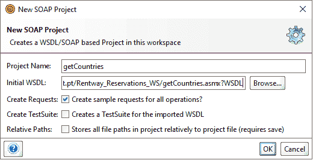
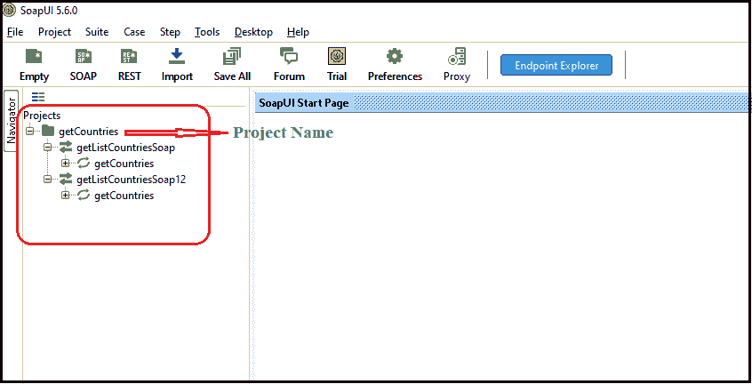
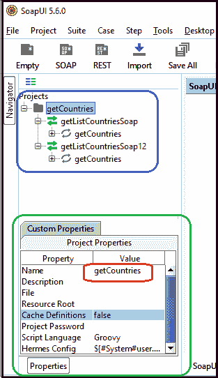
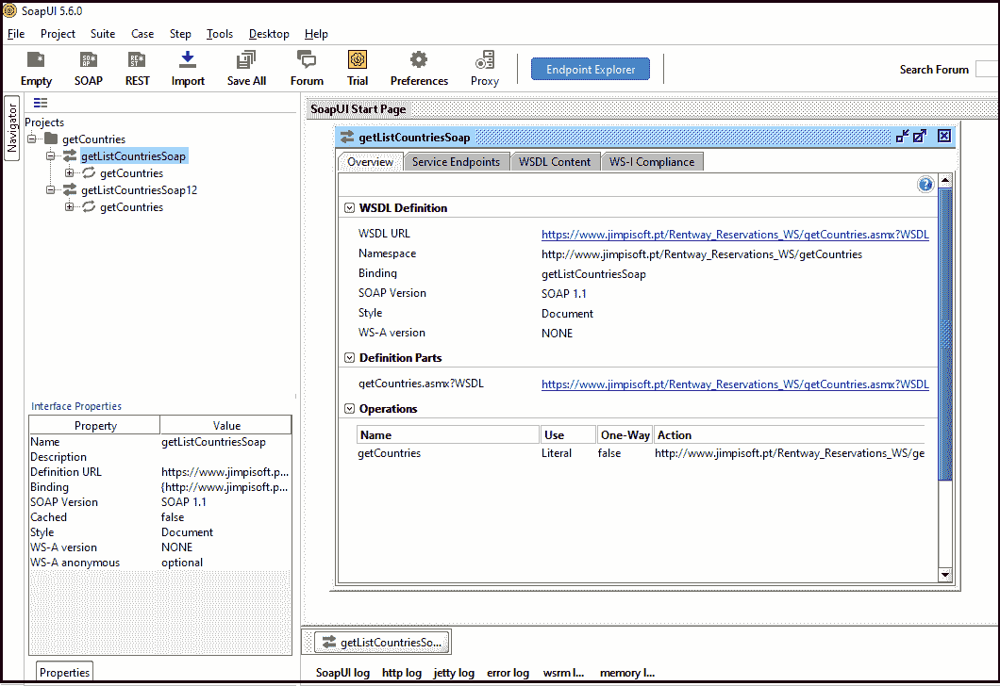
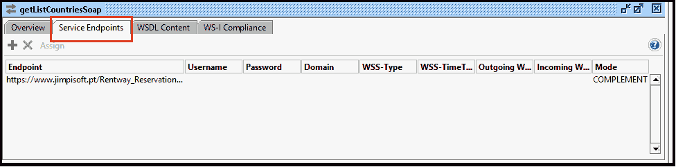
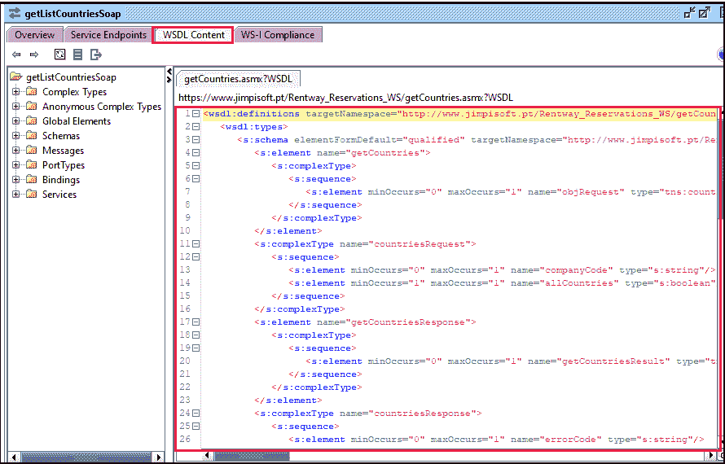

# 使用 WSDL 文件

> 原文：<https://www.javatpoint.com/soapui-working-with-wsdl-file>

WSDL 代表网络服务描述语言。它描述了 web 服务，并在分散或分布式环境中交换信息。它用于创建服务请求者和服务提供者之间的关系。这是一种基于 XML 的语言来描述基于 T2 SOAP 的网络服务的功能。

在本节中，我们将学习如何在 [SoapUI](https://www.javatpoint.com/soapui) 中处理 WSDL 文件。

### WSDL 的特色

WSDL 有以下特点:

*   它是一种基于 XML 的语言，定义了如何在 SoapUI 中与基于 XML 的服务进行交互。
*   它用于配置 SOAP 域中的节点。
*   它用于描述 web 服务的功能特性。
*   它用于在 web 服务中用一组输入、输出和错误消息来设置一个已定义的端点。
*   WSDL 是一种基于 XML 的语言，它与平台无关。
*   发音为 wiz-dull，书写为 W-S-D-L。

### 用 Soap 和 XML 表示的 WSDL 模式:

WSDL 是构建 web 应用的重要组成部分。它有助于基于多种语言构建的各种应用相互交互。WSDL 被用作 SOAP 和 XML 模式的组合，通过互联网在客户端和 web 服务之间提供通信。要读取 WSDL 文件，客户端程序必须连接到网络服务，并指定连接到网络服务器所需的操作。

### WSDL 文件要素

*   **定义**:包含一个或多个服务定义的是 WSDL 文件的基本元素。
*   **类型**:Type 元素用于给出 WSDL 文档中使用的复杂数据类型的信息。
*   **消息**:包含客户端和网络服务器通信中使用的抽象数据。它还定义了每个操作的数据元素。
*   **portType** :包含一个或多个端点支持的抽象操作的集合。
*   **端口**:用于将单个端点定义为绑定的地址。
*   **服务**:它是指定绑定端口地址的端点网络的集合。
*   **绑定**:指定操作如何通过具体的协议和数据格式特性来实现操作和消息传递。

### WSDL 文件的结构

下面的代码片段显示了 WSDL 文档的结构。

```

<definitions>
        <types>
                Definition of types goes here.
       </types>

       <message>
               Definition of a message goes here.
       </message>

      <portType>
         <operation>
             Definition of an operation goes here.
        </operation>
     </portType>

     <binding>
           Definition of a binding goes here.
     </binding>

   <service>
          Definition of service goes here.
       </service>
</definition>

```

我们还可以添加其他元素，例如扩展元素和服务元素，这些元素组合成一个 WSDL 文档，其中可能包含多个 web 服务的定义。

以下是在 SoapUI 工具中支持端点的 WSDL 的四个主要传输。

1.  单向
2.  请求和响应
3.  征求回应
4.  通知

**单向:**单向服务只能接收单向消息。这意味着客户端可以通过使用单个输入元素执行操作来向服务器发送请求。

```

<wsdl:definitions .... >  
   <wsdl:portType name="getListCountriesSoap">
      <wsdl:operation name = "getCountries "> 
<wsdl:input message="tns:getCountriesSoapIn"/>
      </wsdl:operation> 
   </wsdl:portType > 
</wsdl:definitions>

```

**请求和响应**:请求和响应服务用于向服务器发送请求，并从 web 服务器接收响应。它有两个操作元素。第一个输入元素后面是另一个元素，用于发送和接收 web 服务中的请求和响应。

```

<wsdl:definitions ?.>
<wsdl:portType name="getListCountriesSoap">
<wsdl:operation name="getCountries">
<wsdl:input message="tns:getCountriesSoapIn"/>
<wsdl:output message="tns:getCountriesSoapOut"/>
</wsdl:operation>
</wsdl:portType>
</wsdl:definitions>

```

**请求响应**:请求响应由涉及两个输入元素的操作组成。第一个输入元素包含服务器对客户端的请求，后面是客户端对服务器响应的一个输入元素。

```

<wsdl:definitions ?.>
<wsdl:portType name="getListCountriesSoap"> 
<wsdl:operation name="getCountries" parameterOrder ="getListCountries">
<wsdl:output name="getCountries"? message="tns:getCountriesSoapOut"/>
<wsdl:input name="getCountries"? message="tns:getCountriesSoapIn"/>
<wsdl:fault name = " getCountries " message = "tns:getCountries"/>
</wsdl:operation>
</wsdl:portType>
</wsdl:definitions>

```

**通知**:服务器向客户端机器发送信息或消息。因此，通知由一个操作组成，该操作包括向客户端发送通知的输入元素。

```

<wsdl:definitions .... > 
   <wsdl:portType name="getListCountriesSoap" > 
      <wsdl:operation name = " getCountries "> 
         <wsdl:output name = " getCountries "? message = " tns:getCountriesSoapOut "/> 
      </wsdl:operation> 
   </wsdl:portType > 
</wsdl:definitions>  

```

### 创建 WSDL 文件

要创建 WSDL 文件，我们必须遵循以下步骤:

**第一步:**转到**文件- >新 Soap 项目**。


**第二步:**点击**新 Soap 项目**；它显示了下面的屏幕。


**第三步:**在初始 WSDL 文本框中输入以下 WSDL 网址，如下所示。

```

https://www.jimpisoft.pt/Rentway_Reservations_WS/getCountries.asmx?WSDL

```

之后点击**确定**按钮。



它会自动设置项目名称。我们也可以在 WSDL 网址的初始化过程中更改项目名称。



**第四步:** SoapUI 会将指定的 WSDL [URL](https://www.javatpoint.com/url-full-form) 内容加载解析到对象模型中，如下图所示。



#### 注意:当我们处理一个项目时，SoapUI 会将 WSDL 文件保存到缓存中，以避免不必要的请求。要在 SoapUI 中使用 WSDL 文件，我们需要将缓存定义的属性设置为 FALSE。

### 探索 WSDL

我们可以通过双击导航器打开编辑器来探索 WSDL 文件的服务。

概述选项卡用于显示 WSDL 文件的一般信息，例如:

*   WSDL 定义
*   WSDL 网址
*   命名空间
*   有约束力的
*   Soap 版本
*   风格
*   定义部分
*   操作



**服务端点**用于将接口的端点包含在 WSDL 文件中。此外，我们可以为需要身份验证的 WSDL 服务指定多个端点。



**WSDL 内容**提供了 WSDL 文件的详细信息。



* * *