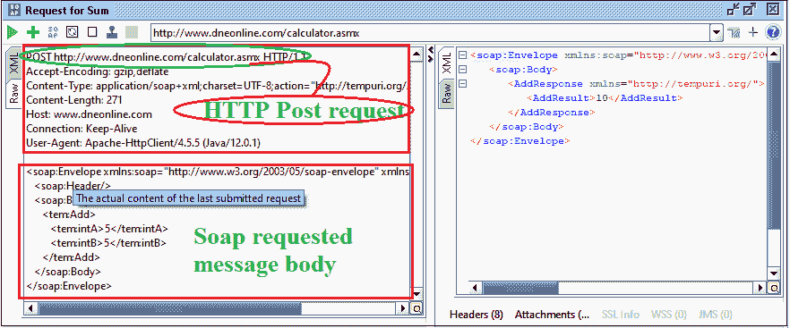
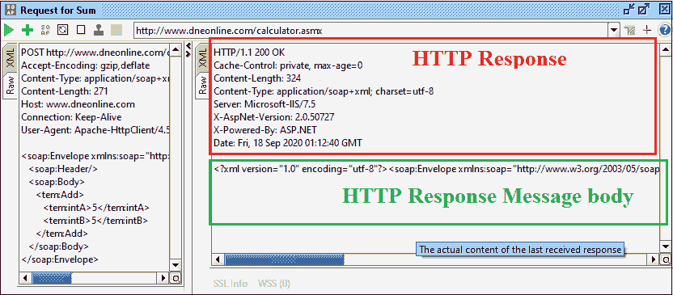
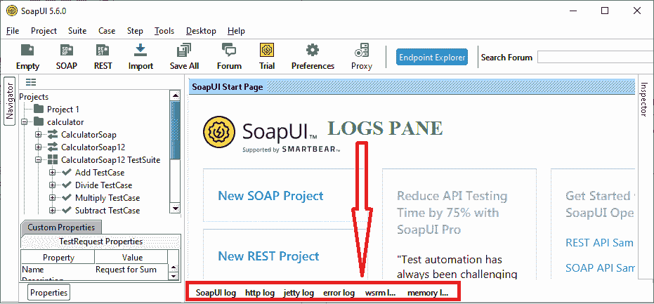
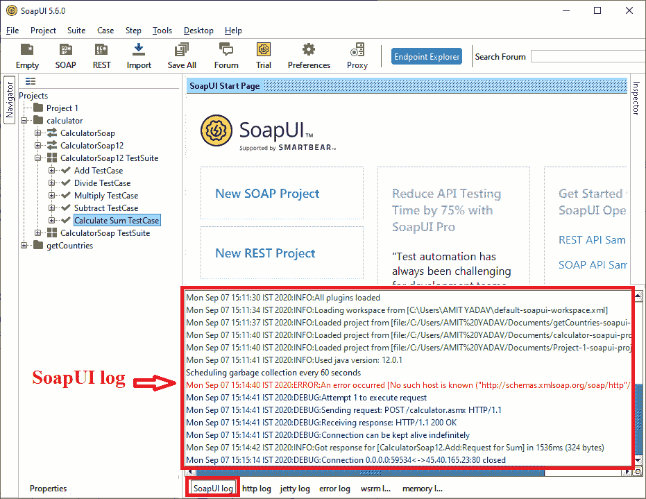
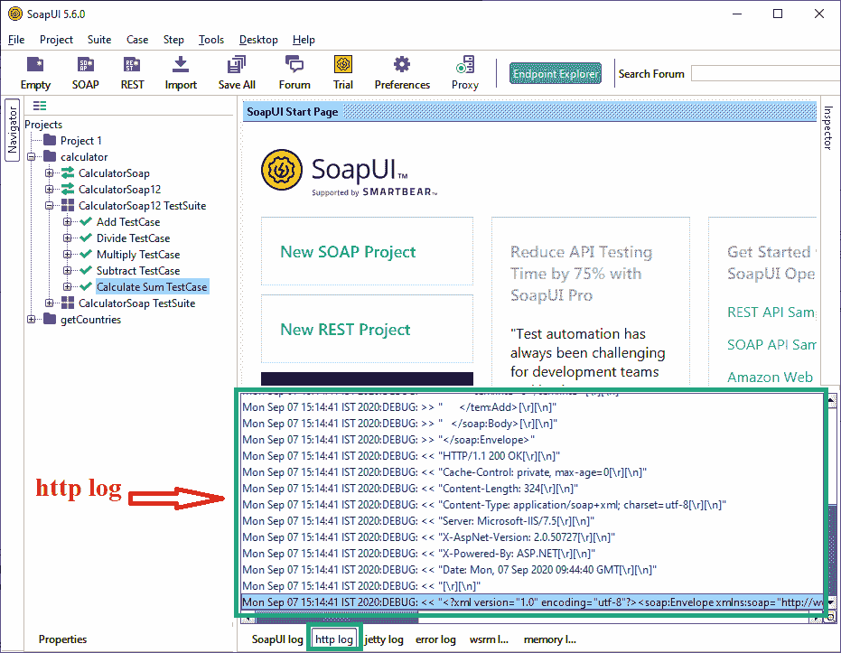
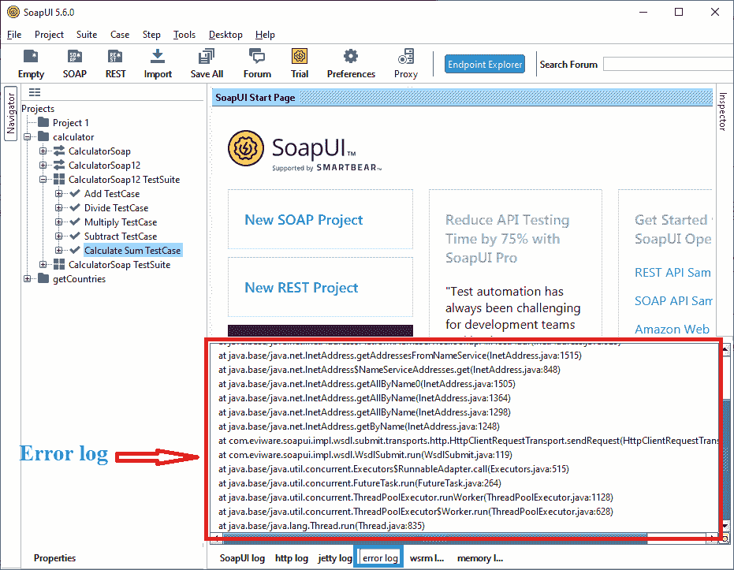
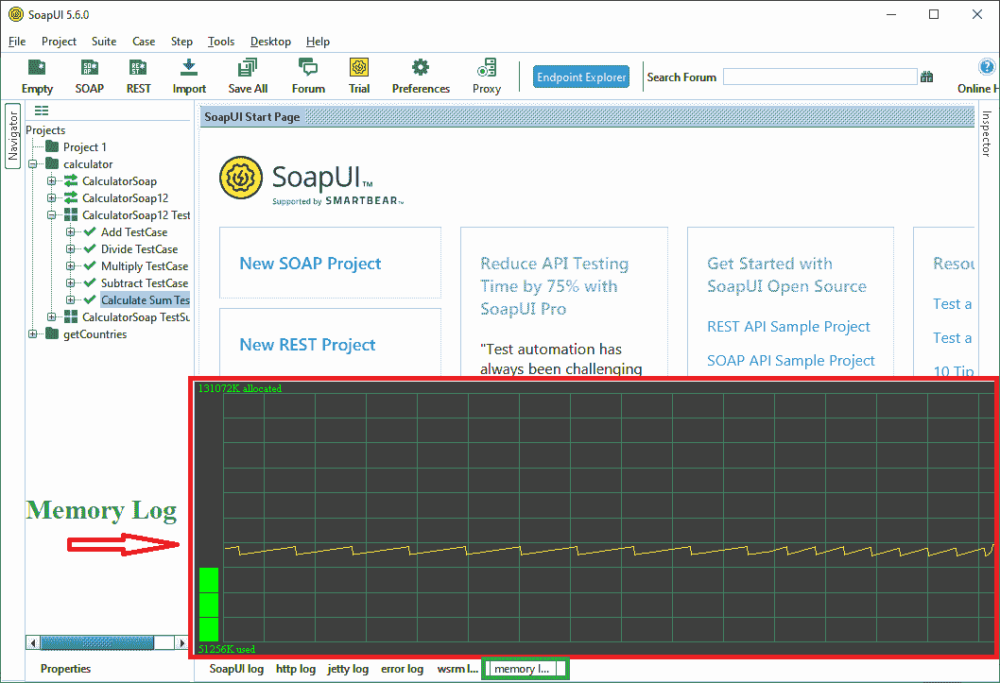

# SoapUI 响应和日志窗格

> 原文：<https://www.javatpoint.com/soapui-response-and-logs-pane>

我们知道，SOAP 请求的消息或响应是通过 HTTP 协议传递的。当我们向网络上的网络服务器发送请求时，网络服务器检查所请求的介质(协议)，然后响应该请求。在本节中，我们将了解 [HTTP](https://www.javatpoint.com/http) 请求和响应是如何通过网络传输的。让我们了解一下 HTTP 请求和响应是如何在 [SoapUI](https://www.javatpoint.com/soapui) 中处理的。

**步骤 1:** 点击**请求 Sum** [XML](https://www.javatpoint.com/xml-tutorial) 文件的 Raw 标签，查看 SOAP 请求的消息是如何使用 HTTP 协议的 POST 方法传输的，如下图所示。



**HTTP 求和请求:**

```

POST http://www.dneonline.com/calculator.asmx HTTP/1.1
Accept-Encoding: gzip,deflate
Content-Type: application/soap+xml;charset=UTF-8;action="http://tempuri.org/Add"
Content-Length: 271
Host: www.dneonline.com
Connection: Keep-Alive
User-Agent: Apache-HttpClient/4.5.5 (Java/12.0.1)
<soap:Envelope xmlns:soap="http://www.w3.org/2003/05/soap-envelope" xmlns:tem="http://tempuri.org/">
   <soap:Header/>
   <soap:Body>
      <tem:Add>
         <tem:intA>5</tem:intA>
         <tem:intB>5</tem:intB>
      </tem:Add>
   </soap:Body>
</soap:Envelope

```

**第二步:**同样，点击右侧的 Request for XML 文件的 Raw 选项卡，查看响应如何检查 HTTP 协议并将结果发送给请求，如下图所示。

**HTTP 响应**

```

HTTP/1.1 200 OK
Cache-Control: private, max-age=0
Content-Length: 324
Content-Type: application/soap+xml; charset=utf-8
Server: Microsoft-IIS/7.5
X-AspNet-Version: 2.0.50727
X-Powered-By: ASP.NET
Date: Mon, 07 Sep 2020 09:44:40 GMT
<?xml version="1.0" encoding="utf-8"?><soap:Envelope xmlns:soap="http://www.w3.org/2003/05/soap-envelope" xmlns:xsi="http://www.w3.org/2001/XMLSchema-instance" xmlns:xsd="http://www.w3.org/2001/XMLSchema"><soap:Body><AddResponse ><AddResult>10</AddResult></AddResponse></soap:Body></soap:Envelope>

```



通过 [HTTP](https://www.javatpoint.com/computer-network-http) 协议处理 SOAP 请求后，如上图所示，显示 **HTTP** 响应码 **200** ，为 **OK** 。这意味着网络服务器已经成功地发送了消息。

web 服务器使用 [HTTP](https://www.javatpoint.com/http-tutorial) 代码发送并调试响应。

| HTTP 代码 | 描述 |
| **1xx:** | **信息性:**表示已经收到的请求，正在继续处理中。 |
| **2xx:** | **成功:**成功表示服务器已成功接收并理解请求的 HTTP Server 响应。 |
| **3xx:** | **重定向:**表示必须采取进一步措施来满足请求。 |
| **4xx:** | **客户端错误:**表示请求语法不正确或无法完成请求时出现错误。 |
| **5xx:** | **服务器错误:**服务器未能满足有效请求 |

## 日志窗格

日志窗格在 SoapUI 工具中用于存储客户端和服务器之间的消息、错误消息和正在执行的消息的详细信息。它允许用户在日志窗格中查看各种选项卡的状态，例如测试用例的调试、测试步骤等。让我们讨论一下 SoapUI 测试工具中使用的日志窗格，如下图所示。



### SoapUI 日志

SoapUI 日志用于保存服务器和客户端机器接收到的请求和响应消息的相关信息，同样的信息也保存在 SoapUI bin 文件夹的 soapui.log 文件中。



### http 日志

它用于显示在网络上传输消息期间使用的所有 HTTP 数据包。我们可以在 HTTP 日志中查看 Raw 的所有信息，如下所示。



### 错误日志

SoapUI 中使用错误日志来显示项目完成过程中遇到的所有错误。同样的错误信息也保存在 SoapUI bin 文件夹的 **soapui-error.log** 文件中。



### 内存日志

内存日志充当监视器，显示 SoapUI 资源的内存消耗。它以图表的形式显示内存状态，如下图所示。



* * *