# SoapUI 断言

> 原文：<https://www.javatpoint.com/soapui-assertions>

## 什么是断言？

断言是应用于声明验证结果的验证规则，用于检查目标 web 服务的工作方式是否与预期结果相同。断言可以通过在每个验证参数上使用检查点或验证点来理解。例如，当我们向网络服务器发送请求时，网络服务器接收请求并生成响应。现在，我们必须使用断言规则来验证服务器响应结果，该规则包含与我们预期相同的结果。因此，我们使用断言来验证响应。

## 断言的特征

*   断言包含验证规则，用于验证服务器在测试步骤执行期间收到的响应。
*   在断言中，我们可以定义应该被验证的响应消息或整个消息的特定部分。
*   我们可以指定任意数量的断言验证规则来验证结果不同方面的测试步骤。
*   如果任何测试步骤不符合接收到的响应结果，断言测试结果将无法通过测试步骤。它在测试执行日志中用红色表示。

## 断言的类型

以下是 [SoapUI](https://www.javatpoint.com/soapui) 工具中使用的断言列表类型。

1.  属性内容
2.  合规状态标准
3.  脚本
4.  服务等级协议
5.  （同 JavaMessageService）Java 消息服务
6.  安全

### 属性内容

它用于检查在触发特定服务请求后收到的响应中存在的属性。

*   **包含断言:**用于验证响应 xml 中是否存在指定的字符串。此外，我们可以定义正则表达式来检查表达式的存在。
*   **Non-Contains 断言:**用于验证响应 xml 中不存在指定的字符串。此外，我们可以在“不包含”中定义正则表达式来检查表达式的存在性。
*   **XPath Match 断言:** XPath match 用于从目标属性中选择特定内容，并将 XPath 表达式的结果与响应 xml 中的预期值进行匹配。
*   **XQuery Match:**XQuery 表达式类似于 XPath Match，用于从目标源中选择内容，并将 XQuery 表达式结果与响应 XML 中的预期值进行比较或匹配。
*   **脚本断言:**脚本断言使用户能够运行自定义脚本来执行用户定义的验证。

### 合规性、状态和标准

它用于检查响应 XML 中故障消息的状态和模式符合性。

*   **HTTP 下载全部资源:**用于验证图片、脚本等所有 html 文档。下载资源后可用的。
*   **无效的 HTTP 状态代码:**无效的 HTTP 状态代码用于验证目标**测试步骤**是否收到了 HTTP 代码在定义的 HTTP 代码列表中不可用的结果。
*   **Not Soap Fault:** 顾名思义，Not Soap Fault 用于确定最后收到的消息中不存在 Soap 故障。
*   **Soap 响应:**用于验证最后收到的消息是否是 Soap 响应消息，只能应用于任何 Soap 请求的**测试步骤**。
*   **Soap Fault:** 用于查找上次收到的消息中存在的任何 Soap 故障。它只适用于 Soap 测试步骤和模拟响应测试步骤。
*   **WS-Security:** 用于检查最后收到的消息是否有有效的 WS-Security 头。模拟响应测试步骤只支持它。
*   **模式符合性:**模式符合性用于检查最后收到的 XML 消息是否符合 WSDL 或 WADL 的符合性定义。SOAP 和 REST 测试步骤都使用模式一致性。
*   **WS 寻址请求:**用于验证最后提交的请求是否有正确的 WS 寻址头。模拟响应测试步骤只支持它。
*   **WS-Addressing 响应:**用于验证最后收到的响应 XML 消息是否有正确的 WS 地址头。Soap 请求测试步骤只支持它。

### 脚本

*   **脚本断言:**脚本断言用于创建在响应 XML 文件中执行用户定义的验证规则的自定义脚本。

### 安全

*   **敏感信息暴露:**用于对收到的不会向目标系统泄露敏感信息的 XML 响应消息进行认证。

### 服务等级协议

*   **响应 SLA:** 响应 SLA 用于验证最后收到的消息的响应时间是否在规定的时限内。此外，可以通过脚本测试来实现 SLA，脚本测试向服务器发送脚本请求并接收响应。

### （同 JavaMessageService）Java 消息服务

*   **JMS 状态:**用于检查测试阶段的 JMS 请求是否已经成功执行，对于有 JMS 端点的测试步骤有好处。它被实现来处理 JMS 端点的测试步骤请求。
*   **JMS 超时:**JMS 超时用于验证 JMS 指定的测试步骤的描述所花费的时间不会超过指定的持续时间。

### 数据库编程

*   **JDBC 状态:**JDBC 状态用于验证指定测试步骤的请求是否在 SoapUI 测试工具中成功执行。它只能在 JDBC 测试步骤中实现。
*   **JDBC 超时:**JDBC 超时用于验证指定测试步骤的 JDBC 语句不会花费超过指定时间限制的时间。

## 包含断言

它用于搜索响应 [XML](https://www.javatpoint.com/xml-tutorial) 文件中出现的指定字符串。此外，它还使用正则表达式来检查字符串或文本。

以下是创建包含断言的步骤:

**步骤 1:** 初始，断言选项卡中没有断言。因此，点击(+)图标添加新的断言，如下所示。

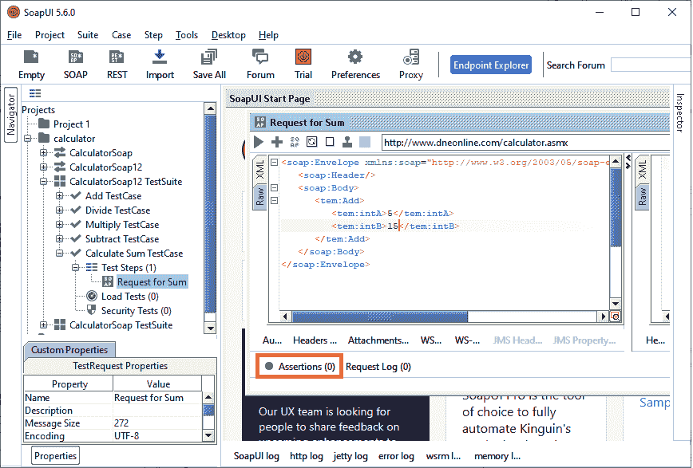

我们还可以在断言选项卡中检查添加的断言的数量。

**第二步:**从**属性内容**等添加断言类别中选择合适的断言，然后选择**包含**等属性内容类型，如下图所示。

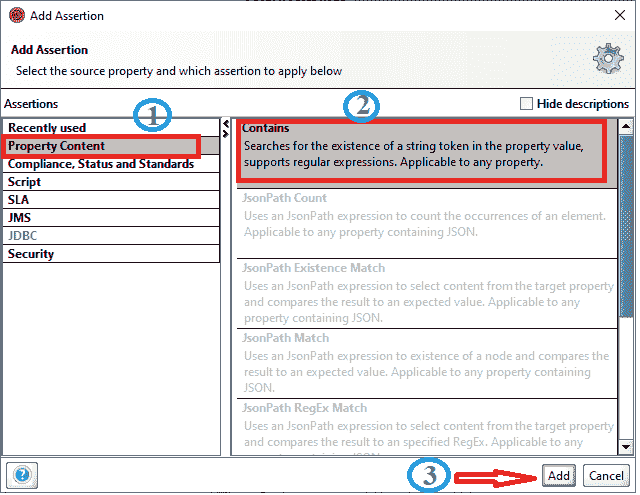

**第三步:**点击**添加**按钮后，弹出**包含断言**的对话框。

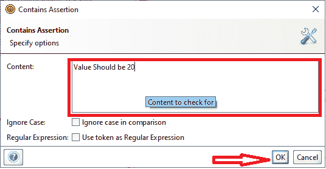

指定我们希望与现有 web 响应匹配的字符串或值。

**第四步:**点击**确定**按钮后，将控制权转移到**请求求和**窗口，如下图所示。

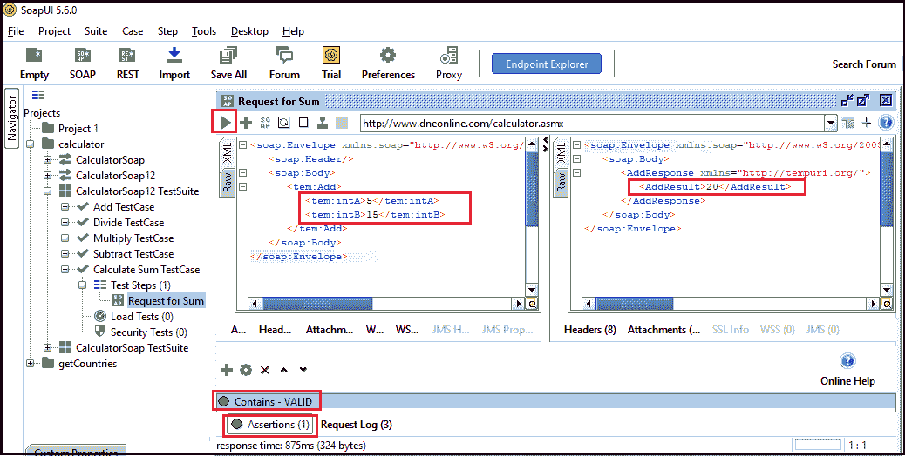

在上图中，**包含**为**有效**，因为**求和请求**的响应与**包含字符串**匹配。如果 contains 无效，它会显示一条错误消息。

## 不包含断言

它用于搜索 web 响应 xml 文件中是否存在指定的字符串或文本。以下是创建不包含断言的步骤:

**步骤 1:** 要验证**不包含断言**，请单击(+)图标添加新断言。

**第二步:**选择**属性内容**，然后点击**不包含**断言，如下图。

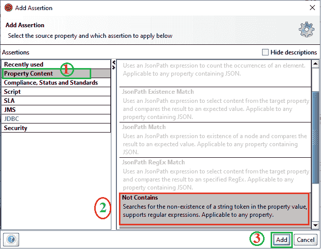

**第三步:**点击**增加**按钮后，弹出**不包含断言**对话框。

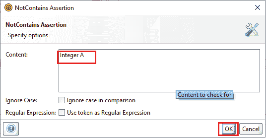

**步骤 4:** 指定 web 响应 XML 文件或 Sum Request 中不存在的内容或字符串，然后单击**确定**按钮检查验证，如下所示。

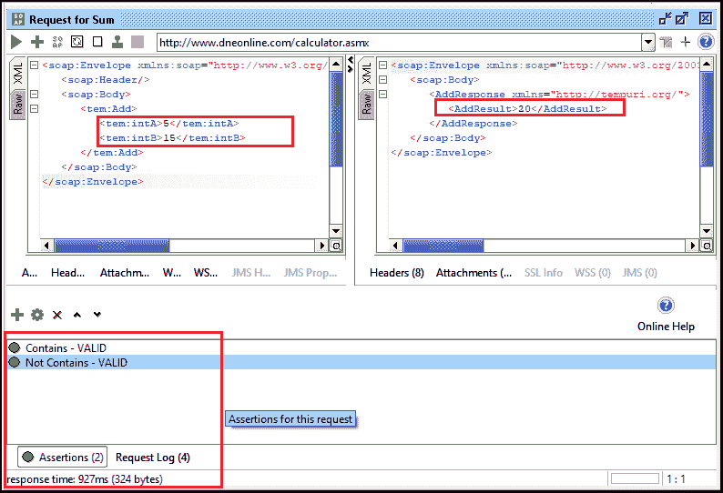

它验证定义语句**整数 A** 是否存在。如果语句存在，则显示一条**错误**消息，如果当前内容中不存在定义的字符串，**不包含**的条件为**有效**，如上图所示。

## XPath 匹配断言

[XPath](https://www.javatpoint.com/xpath-tutorial) 匹配用于从目标属性中选择特定内容，并将 XPath 表达式的结果与响应 xml 中的预期值进行匹配。

以下是验证 XPath 匹配断言的步骤:

**步骤 1:** 要验证 **XPath 匹配断言**，单击(+)图标添加新断言。

**第二步:**选择**属性内容**，然后点击 **XPath Match** 断言，如下图。

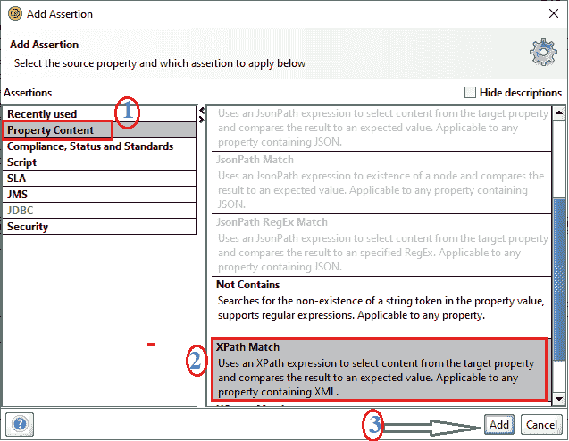

**第三步:**点击**添加**按钮后，显示 XPATH 窗口的配置。

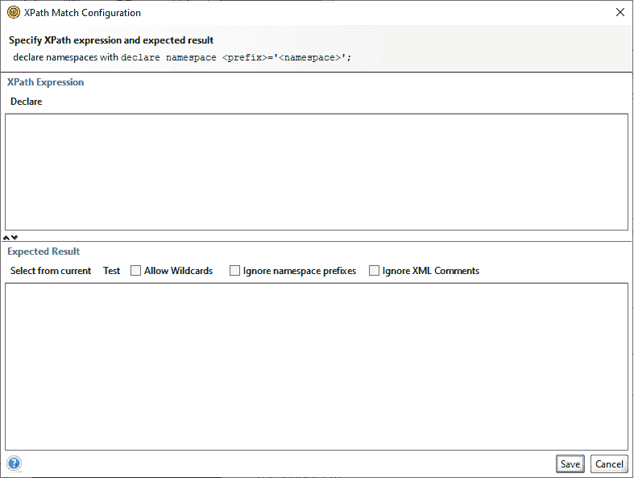

**步骤 4:** 要在 XPath 匹配配置中声明 XML 命名空间，请单击**声明**按钮，该按钮填充 XPath 中的两个 XML 命名空间，如下所示。

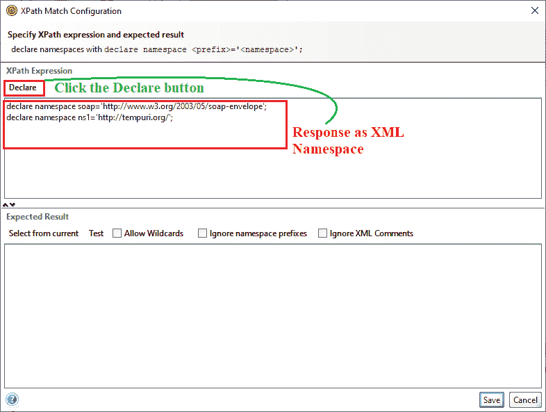

以下是 XPath 匹配中使用的命名空间的声明:

```

declare namespace soap='http://www.w3.org/2003/05/soap-envelope';
declare namespace ns1='http://tempuri.org/';

```

**第 5 步:**填充 XML 命名空间后，输入 XPATH 节点为 **//ns1:AddResult，**，用于搜索并验证<AddResult>&</AddResult>之间的值。

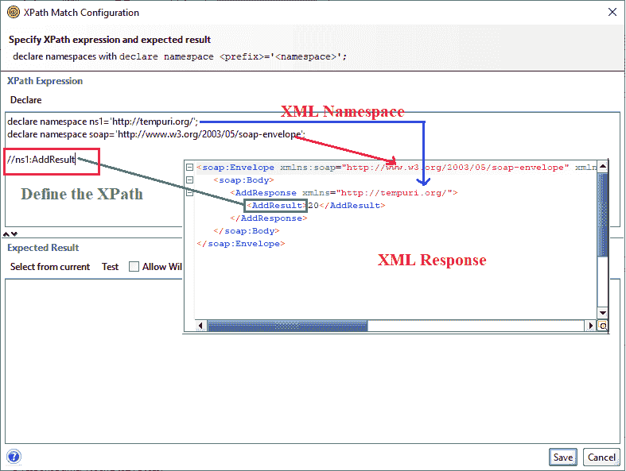

**第六步:**在 XPath 表达式中添加 **//ns1:AddResult** 后，现在点击**从内容中选择**，从当前响应中搜索一个值，如下所示。

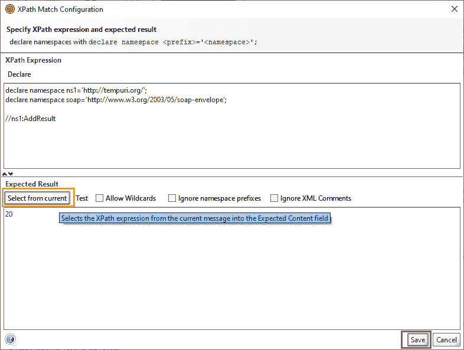

**第七步:**点击**保存**按钮后，显示如下图，其中我们可以看到 XPath Match 断言为 **VALID** 。

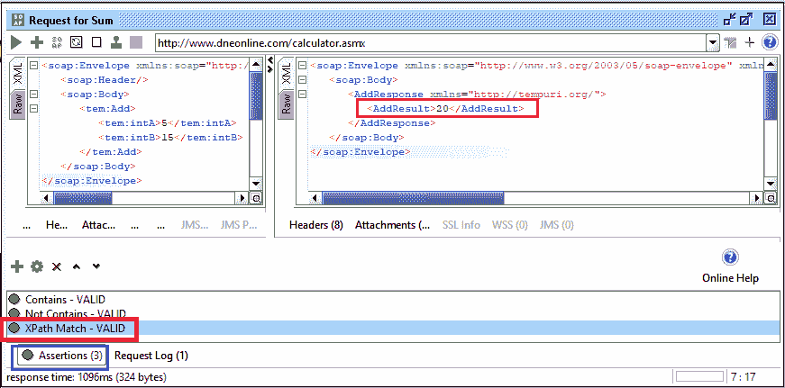

## XQuery 匹配断言

[XQuery](https://www.javatpoint.com/xquery-tutorial) 匹配类似于 XPath 表达式，只是它使用 XQuery 表达式从目标响应代码中选择字符串，并将 XQuery 表达式的结果与期望值进行比较。

以下是使用 XQuery 匹配断言的步骤。

**步骤 1:** 要验证 **XQuery 匹配断言**，单击(+)图标添加新断言。

**第二步:**选择**属性内容**，然后点击 **XQuery Match** 断言，如下图。

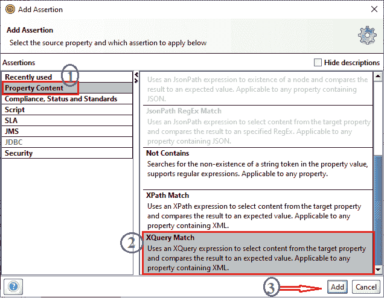

**第三步:**点击**添加**按钮后，显示 XQuery Match 的配置。

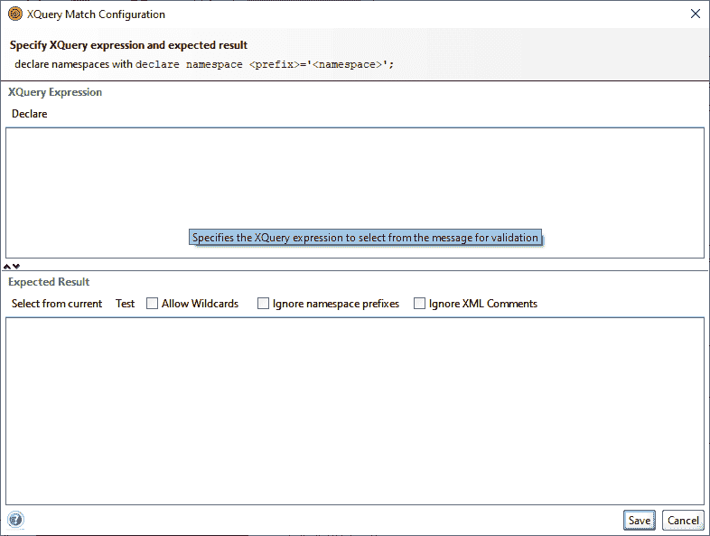

**第 4 步:**要在 XQuery 匹配配置中声明 XML 命名空间，请单击**声明**按钮，该按钮填充 XQuery 中的两个 XML 命名空间，如下所示。

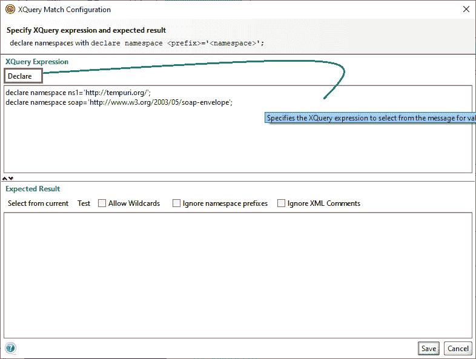

以下是 XQuery Match 中使用的命名空间的声明:

```

declare namespace ns1='http://tempuri.org/';
declare namespace soap='http://www.w3.org/2003/05/soap-envelope';

```

**步骤 5:** 填充 XML 命名空间后，现在定义 XQuery 表达式，用于选择和检索与 XQuery 表达式匹配的值，如图所示:

下面是获取结果的查询结构。

```

<resultData>
{
for $x in //ns1:AddResult
return $x
}
</resultData>

```

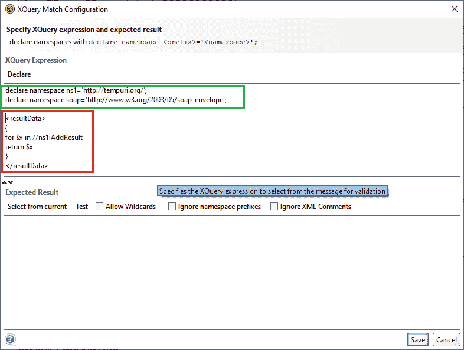

**第六步:**定义表达式后，点击**从当前**选择按钮，从当前 Response XML 文件中检索匹配内容，如下图所示。

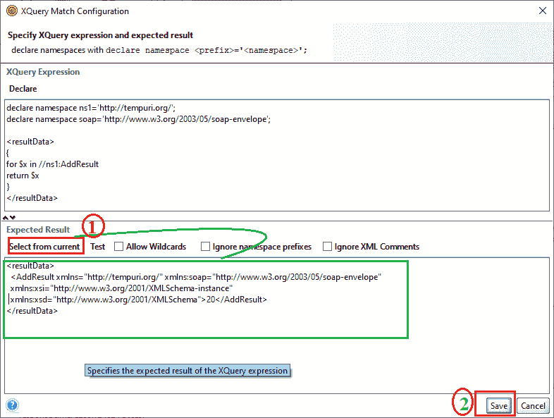

下面是从 XML 响应中检索数据。

```

<resultData>
  <AddResult  xmlns:soap="http://www.w3.org/2003/05/soap-envelope"
  xmlns:xsi="http://www.w3.org/2001/XMLSchema-instance" 
  xmlns:xsd="http://www.w3.org/2001/XMLSchema">20</AddResult>
</resultData>

```

**第七步:**点击**保存**按钮后，显示下图，其中可以看到 XQuery Match 断言为 **VALID** 。

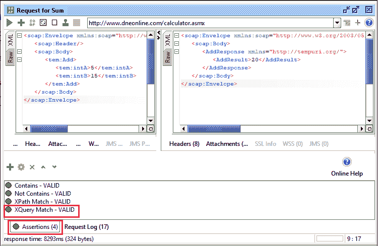

* * *