# 肥皂 JDBC

> 原文：<https://www.javatpoint.com/soapui-jdbc>

SoapUI 引入了一个从数据库中检索数据或记录的新概念，称为 JDBC。它以 [XML](https://www.javatpoint.com/xml-tutorial) 格式提供结果，这些结果可以像 [XPath](https://www.javatpoint.com/xpath-tutorial) 、 [XQuery](https://www.javatpoint.com/xquery-tutorial) 等一样以标准方式断言或处理。在 JDBC 的 SoapUI 中，我们将学习如何创建 JDBC 连接、JDBC 属性和 JDBC 断言。

为了在[肥皂界面](https://www.javatpoint.com/soapui)中创建 [JDBC](https://www.javatpoint.com/java-jdbc) 连接，我们必须遵循下面给出的步骤。

**步骤 1:** 选择项目，右键点击所选测试用例的测试步骤，添加步骤- > JDBC 请求，如下图。

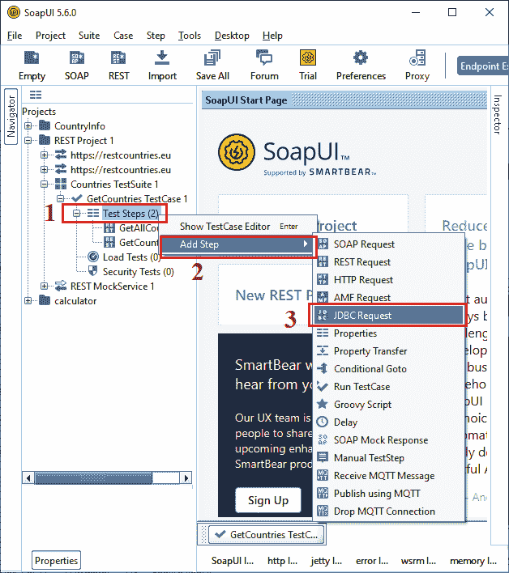

**第二步:**选择 JDBC 请求后，弹出对话框指定**新步骤**的名称，如下图所示。

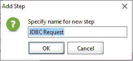

**第三步:**点击**确定**按钮，显示 **JDBC 请求**窗口，创建 JDBC 连接，如下图。

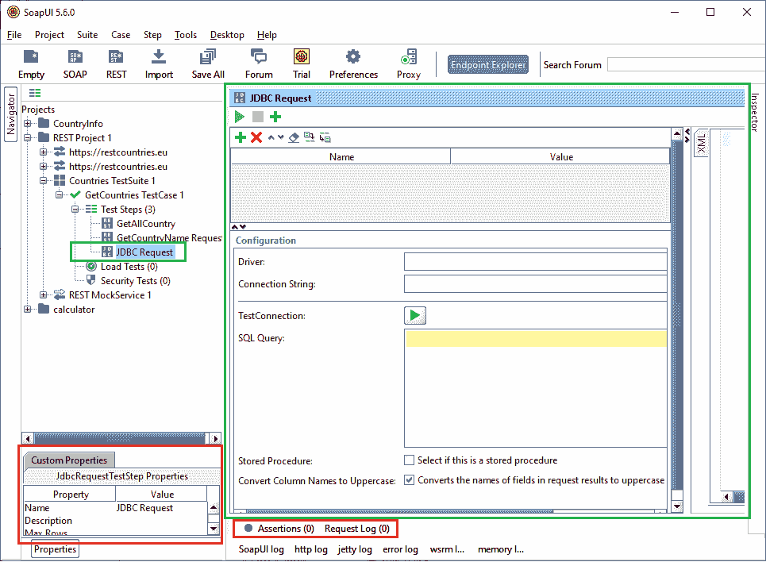

为了创建 **JDBC** 连接，我们必须提供必要且有效的 JDBC 配置信息，例如**驱动程序**名称和**连接字符串**。有效信息用于标识数据库的名称，并创建使用已定义数据库的连接。

**第四步:**如果要连接 MySQL 数据库，需要将驱动定义为 **com.mysql.jdbc.Driver** 。同样，我们可以为另一个数据库定义驱动程序，在 SoapUI 的文档部分中提到过。

**步骤 5:** 要在 **JDBC** 中设置**连接字符串**的格式，请使用下面给出的语句。

```

jdbc:mysql://hostname:port_name/database_Name?[Property]=[value]

```

其中属性是**用户名**，值是与各自参数值相关的**密码**以连接数据库。

例如，

```

jdbc:mysql://localhost:3306/SoapUIDB?user=root&password=

```

这里我们将密码字段留空，因为我们没有在 [phpMyAdmin](https://www.javatpoint.com/phpmyadmin) 中保存任何密码。如果在 phpMyAdmin 中设置了密码，请指定它。

#### 注意:在为 SoapUI 工具创建 JDBC 连接之前，我们必须在 phpMyAdmin 中定义或创建数据库名称。

**步骤 6:** 指定 JDBC 的配置细节后，点击**测试连接**的运行图标(绿色三角形)验证连接。如果 JDBC 连接成功，显示**成功**对话框；否则显示**失败**连接详情。

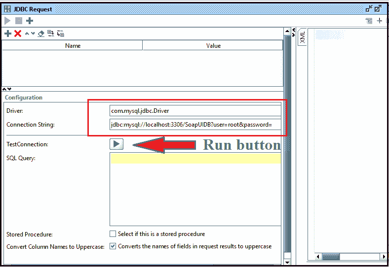

**第七步:**当我们点击运行按钮时，它弹出一个对话框成功测试了 **JDBC** 连接，如下图所示。


## JDBC 查询的执行

为 JDBC 创建数据库后，我们需要定义 JDBC 属性。JDBC 属性的属性是在属性列表中添加一个参数名，该参数名可以作为变量使用 [SQL](https://www.javatpoint.com/sql-tutorial) 查询从数据库中查找已定义的项目。

例如，我们需要获取特定国家的名称及其属性，将 SQL 查询设置为**从表名中选择*其中表名=:名称**。当在 JDBC 的一个 SoapUI 中执行查询时，它从 JDBC 数据库中返回一个特定国家的名称及其属性。

我们创建了名为**国家**的数据库表，并执行以下查询将数据插入该表。我们稍后使用 JDBC SQL 查询检索的数据。

```

INSERT INTO country VALUES ('Afghanistan', 'Asia', 'Kabul', '93');
INSERT INTO country VALUES ('Åland Islands', 'Europe', 'Mariehamn', '358');
INSERT INTO country VALUES ('Albania', 'Europe', 'Tirana', '355');
INSERT INTO country VALUES ('Algeria', 'Africa', 'Algiers', '213');
INSERT INTO country VALUES ('American Samoa', 'Oceania', 'Pago Pago', '1684');
INSERT INTO country VALUES ('Argentina', 'Americas', 'Buenos Aires', '54');
INSERT INTO country VALUES ('Armenia', 'Asia', 'Yerevan', '374');
INSERT INTO country VALUES ('Australia', 'Oceania', 'Canberra', '61');

```

在 JDBC，SQL 查询用于从数据库表中搜索特定项目或项目集合。让我们创建 JDBC 请求来接受数据库表中的国家记录。

**步骤 1:** 将 SQL 查询写成**从国家中选择*从定义的表中选择所有国家的名称及其附加属性。**

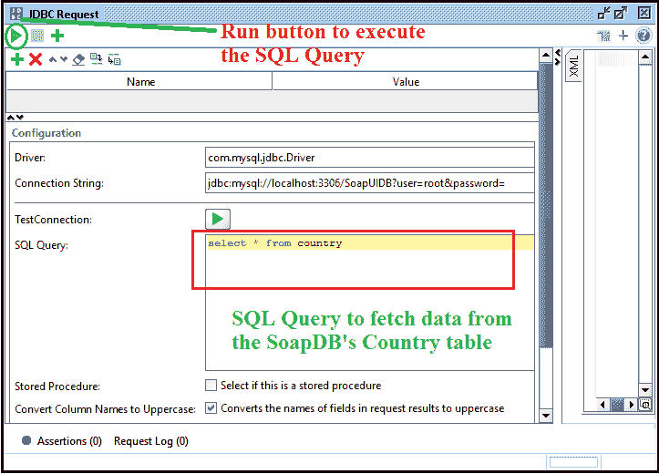

**第二步:**之后点击左上角的**运行按钮**执行 JDBC 的 SQL 查询，如下图。

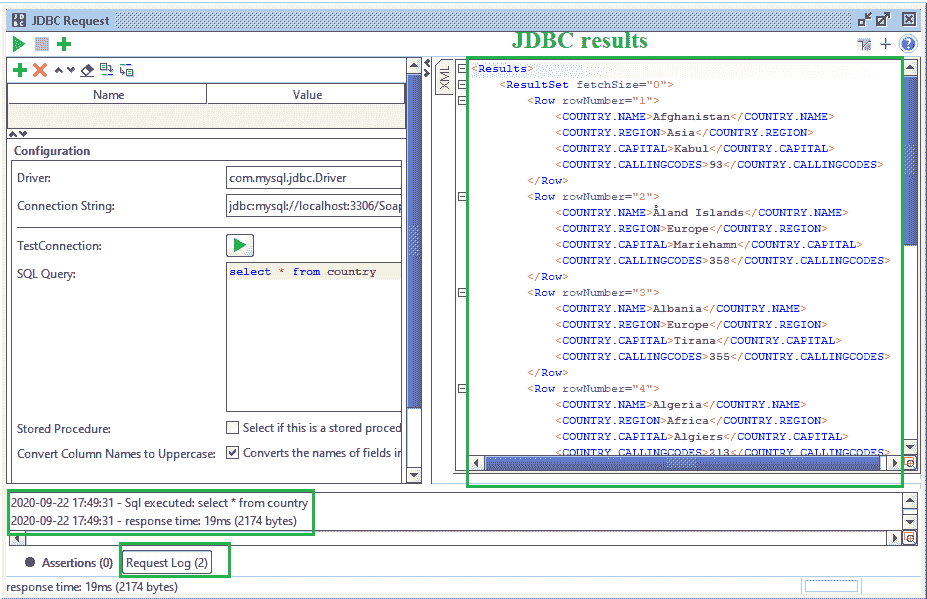

执行完 SQL Query 后，它会在屏幕上产生上述输出。上述输出包含从数据库的国家表中提取的国家名称、地区、首都和呼叫代码。

这里，JDBC SQL 查询的结果是:

```

Results>
    <ResultSet fetchSize="0">
        <Row rowNumber="1">
            <COUNTRY.NAME> Afghanistan </COUNTRY.NAME>
            <COUNTRY.REGION> Asia </COUNTRY.REGION>
            <COUNTRY.CAPITAL> Kabul </COUNTRY.CAPITAL>
            <COUNTRY.CALLINGCODES> 93 </COUNTRY.CALLINGCODES>
        </Row>
        <Row rowNumber="2">
            <COUNTRY.NAME> ?land Island s</COUNTRY.NAME>
            <COUNTRY.REGION> Europe </COUNTRY.REGION>
            <COUNTRY.CAPITAL> Mariehamn </COUNTRY.CAPITAL>
            <COUNTRY.CALLINGCODES> 358 </COUNTRY.CALLINGCODES>
        </Row>
        <Row rowNumber="3">
            <COUNTRY.NAME> Albania </COUNTRY.NAME>
            <COUNTRY.REGION> Europe </COUNTRY.REGION>
            <COUNTRY.CAPITAL> Tirana </COUNTRY.CAPITAL>
            <COUNTRY.CALLINGCODES> 355 </COUNTRY.CALLINGCODES>
        </Row>
        <Row rowNumber="4">
            <COUNTRY.NAME> Algeria </COUNTRY.NAME>
            <COUNTRY.REGION> Africa </COUNTRY.REGION>
            <COUNTRY.CAPITAL> Algiers </COUNTRY.CAPITAL>
            <COUNTRY.CALLINGCODES> 213 </COUNTRY.CALLINGCODES>
        </Row>
        <Row rowNumber="5">
            <COUNTRY.NAME> American Samoa </COUNTRY.NAME>
            <COUNTRY.REGION> Oceania </COUNTRY.REGION>
            <COUNTRY.CAPITAL> Pago Pago </COUNTRY.CAPITAL>
            <COUNTRY.CALLINGCODES> 1684 </COUNTRY.CALLINGCODES>
        </Row>
        <Row rowNumber="6">
            <COUNTRY.NAME> Argentina </COUNTRY.NAME>
            <COUNTRY.REGION> America s</COUNTRY.REGION>
            <COUNTRY.CAPITAL> Buenos Aire s</COUNTRY.CAPITAL>
            <COUNTRY.CALLINGCODES> 54 </COUNTRY.CALLINGCODES>
        </Row>
        <Row rowNumber="7">
            <COUNTRY.NAME> Armenia </COUNTRY.NAME>
            <COUNTRY.REGION> Asia </COUNTRY.REGION>
            <COUNTRY.CAPITAL> Yerevan </COUNTRY.CAPITAL>
            <COUNTRY.CALLINGCODES> 374 </COUNTRY.CALLINGCODES>
        </Row>
        <Row rowNumber="8">
            <COUNTRY.NAME> Australia </COUNTRY.NAME>
            <COUNTRY.REGION> Oceania </COUNTRY.REGION>
            <COUNTRY.CAPITAL> Canberra </COUNTRY.CAPITAL>
            <COUNTRY.CALLINGCODES> 61 </COUNTRY.CALLINGCODES>
        </Row>
    </ResultSet>
</Results>

```

### 选择或获取数据的 JDBC SQL 查询

按照下面给出的步骤，使用 JDBC SQL 查询来选择和获取数据。

**第一步:**要添加 JDBC 属性，单击(+)按钮，然后传递参数“**名称**和**值**。然后提到 SQL Query 来选择国家名称，如下图所示。

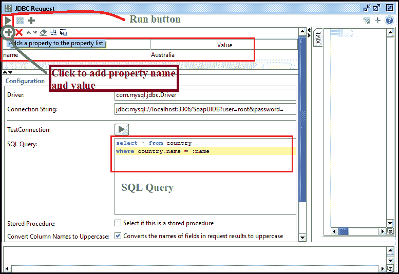

这里，我们传递的房产名称为**名**，房产价值为**澳**。然后，将 SQL 查询写成**'选择*表格国家，其中国家.名称=:名称'**

**第二步:**点击运行按钮，执行 JDBC 的 SQL 查询，如下图所示。

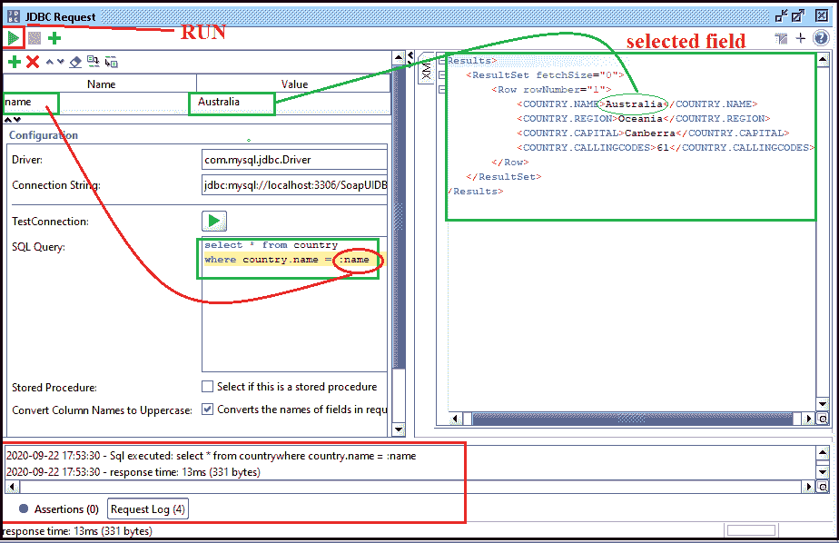

这里，JDBC SQL 查询的结果是:

```

<Results>
    <ResultSet fetchSize="0">        
         <Row rowNumber="1">
            <COUNTRY.NAME> Australia </COUNTRY.NAME>
            <COUNTRY.REGION> Oceania </COUNTRY.REGION>
            <COUNTRY.CAPITAL> Canberra </COUNTRY.CAPITAL>
            <COUNTRY.CALLINGCODES> 61 </COUNTRY.CALLINGCODES>
        </Row>
    </ResultSet>
</Results>

```

## JDBC 断言

JDBC 断言用于验证使用来自数据库表的 JDBC 请求接收的数据。

为了在 SoapUI 中使用 JDBC 断言，我们必须遵循下面给出的步骤。

**步骤 1:** 点击(+)按钮添加 JDBC 请求测试步骤的断言，如下图所示。

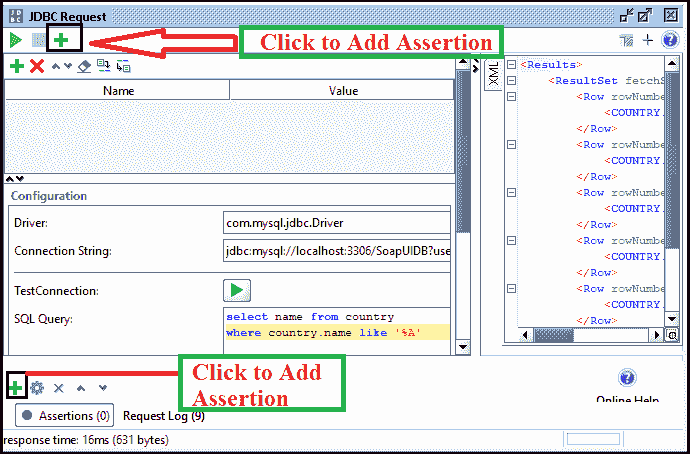

**第二步:**点击**添加断言**按钮后，显示添加断言窗口，选择断言，如图所示。

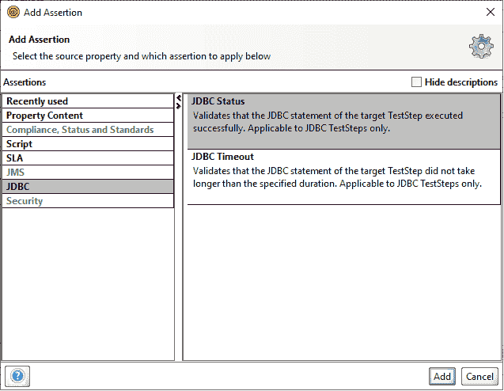

**第三步:**点击**添加**按钮后，在 SoapUI 中正确执行 JDBC SQL 查询，如图所示。

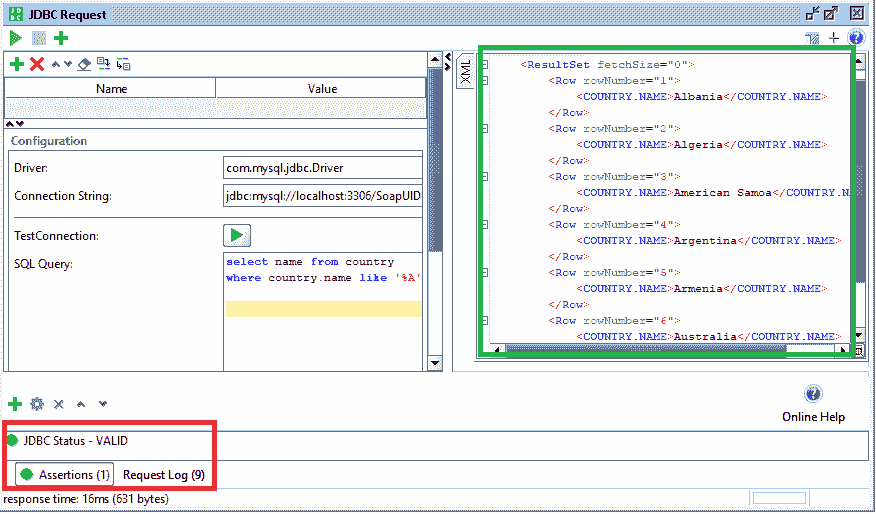

如果 JDBC 状态断言为真，则断言有效；否则，它会显示一条错误消息。同样，我们可以在 SoapUI 中使用不同类型的断言来验证 JDBC 请求 TestStep。

* * *