# SoapUI Groovy 脚本

> 原文：<https://www.javatpoint.com/soapui-groovy-script>

**Apache Groovy** 是基于 Java 平台的面向对象、 **Java 语法兼容的**编程语言。它有许多静态和动态特性，类似于 python、Ruby、Pero 和 Small talk 语言。它可以作为一种编程和脚本语言，使 java 平台能够使用编译成 [Java 虚拟机(JVM)](https://www.javatpoint.com/jvm-java-virtual-machine) 字节码的 groovy 源代码。此外，它在内部使用 [Java](https://www.javatpoint.com/java-tutorial) 库，直接在 Groovy 脚本中使用与 Java 相关的关键字和函数。它是一种包含所有 Java 库的脚本语言。如果我们想在 Groovy 脚本中直接使用 [Java 关键字](https://www.javatpoint.com/java-keywords)和函数，我们可以轻松使用。

在 SoapUI 工具中使用 Groovy 脚本进行 API 或网络服务测试。

1.  groovy 脚本用于生成数据并将其提供给 groovy 测试请求。
2.  它用于验证 groovy 响应。
3.  它可以用来设置不同级别的脚本属性值，例如请求测试步骤、测试用例和测试套件级别。
4.  使用 groovy 脚本，我们可以在请求的 groovy 脚本期间启用或禁用测试套件和测试用例。

### 在 SoapUI 工具中创建和测试一个 Groovy 脚本

为了在 [SoapUI](https://www.javatpoint.com/soapui) 中创建 groovy 脚本，我们必须遵循给定的步骤，如图所示。

**第一步:**选择 **CalculatorSoap 测试套件**，然后选择**测试用例**，我们将在其中创建 **Groovy 脚本**。右键点击**测试步骤**，然后进入**添加步骤**从可用服务中选择 **Groovy 脚本**，如下图。

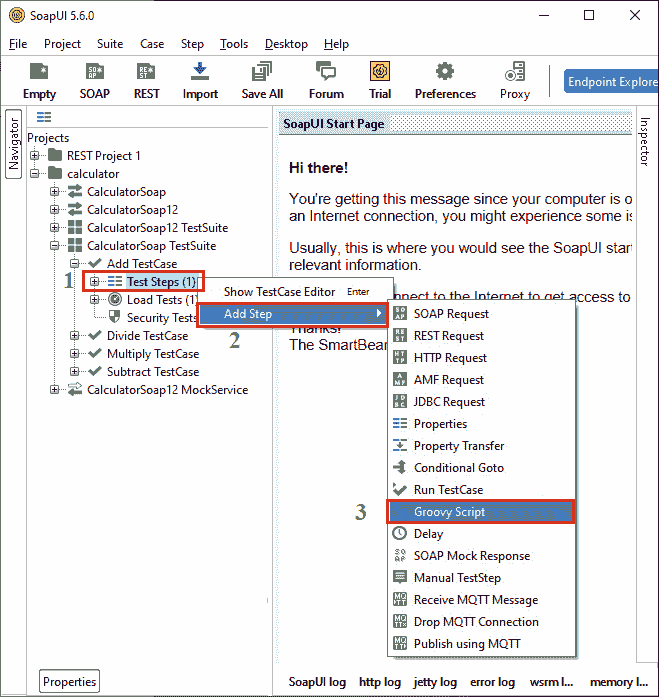

**第二步:**点击 [**groovy 脚本**](https://www.javatpoint.com/groovy) ，会弹出一个对话框，为新的步骤指定 Groovy 脚本的名称，或者我们可以将 Groovy 脚本名称保留为默认名称，然后点击**确定**按钮。

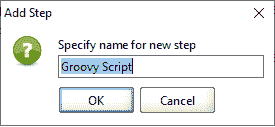

**第三步:**点击确定按钮，显示 **Groovy Script** 编辑器，我们可以通过点击 **run** 按钮编写脚本并进行测试，如下图所示。

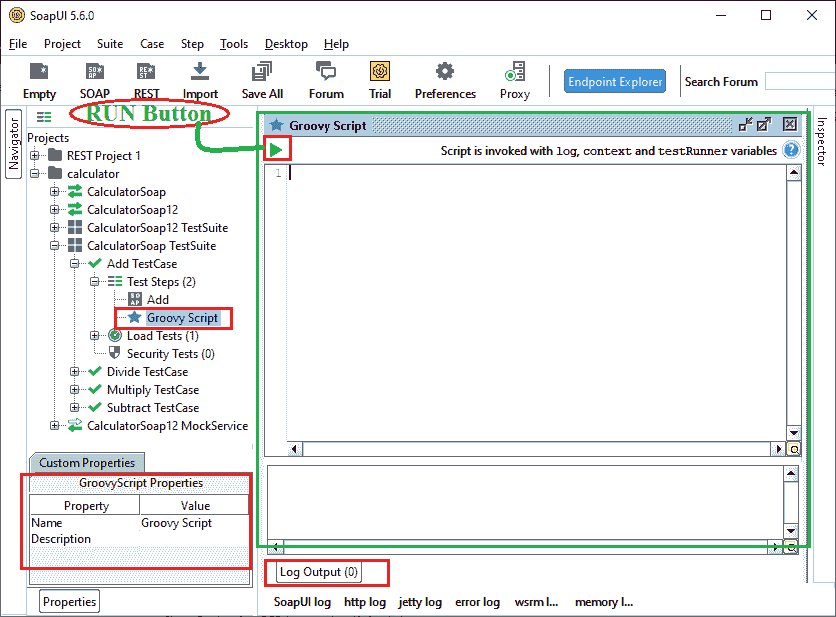

**第 4 步:**现在，我们在 Groovy 脚本编辑器中编写一些文本，然后运行它。

让我们在 Groovy 脚本编辑器中编写一条消息，在日志输出中显示这条消息。

```

log.info "Welcome to JavaTpoint"         // log is a variable and info used to print statement.
log.info ("Welcome to JavaTpoint")

```

**第 5 步:**要在 SoapUI 工具中执行 Groovy 脚本，请单击显示日志中脚本输出的**绿色运行按钮**。

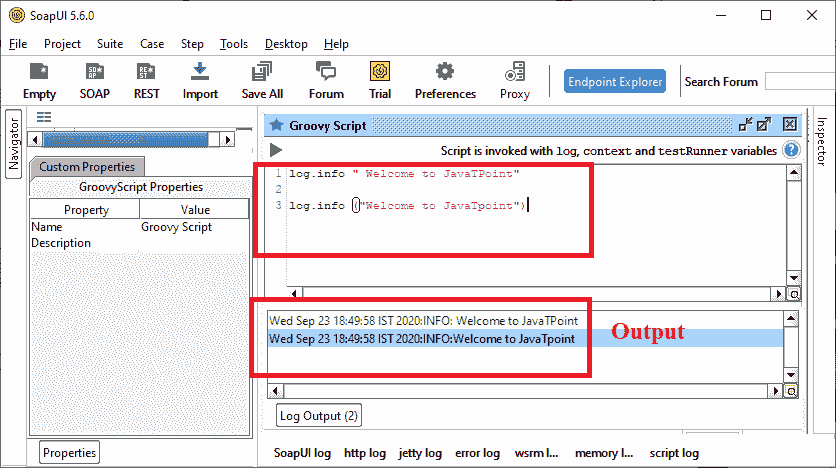

**示例:编写一个程序，返回在 SoapUI Groovy 脚本编辑器中使用的方法数量。**

通过右键单击旧的 groovy 脚本创建一个新的 groovy 脚本，然后选择新的 Groovy 脚本，如下所示。

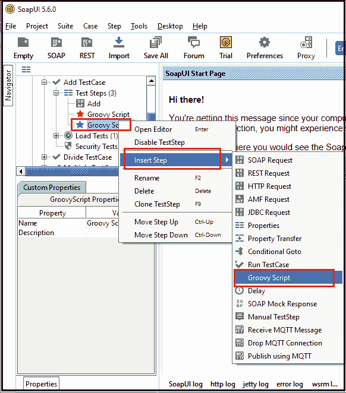

选择 groovy 脚本服务后，它会显示 Groovy 脚本窗口，如下所示。

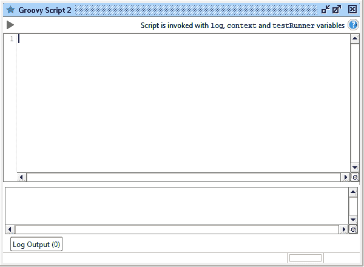

现在输入 Groovy 脚本语句，如下所示。

```

// It is the statement used to return the number of methods used in a SoapUI Groovy Script.
log.info testRunner.metaClass.methods*.name.unique().sort()

```

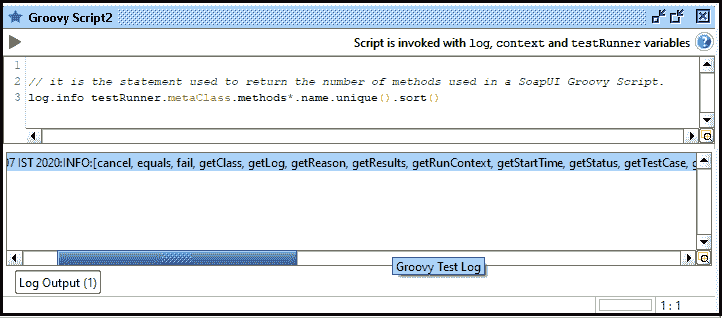

点击**运行**按钮后，它显示了 SoapUI Groovy 脚本语言中使用的所有方法。

```

Wed Sep 23 19:43:07 IST 2020:INFO:[cancel, equals, fail, getClass, getLog, getReason, getResults, getRunContext, getStartTime, getStatus, getTestCase, getTestRunnable, getTimeTaken, gotoStep, gotoStepByName, hashCode, isRunning, notify, notifyAll, runTestStep, runTestStepByName, setMockRunContext, setRunContext, start, toString, wait, waitUntilFinished]

```

**示例:用 groovy 编写一个创建类的程序。**

要在 SoapUI 中创建一个类，右键单击 TestStep 并选择 Groovy Script 打开编辑器。将该类保存为“MyClass”，然后编写如下代码，如下所示。

**密级**

```

import java.io.*;
class MyClass
{
def log;
def MyClass (log)
{
	log.info("Welcome to JavaTpoint");
}
}
context.setProperty ("MyClass", new MyClass(log)) // Specify the class name with consttructor parameter

```

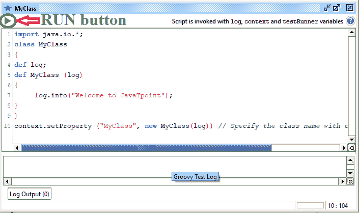

点击运行按钮来执行 groovy 脚本。

**输出:**

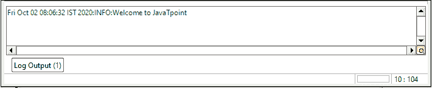

### 从另一个 Groovy 类调用一个 Groovy 类

要在 SoapUI 中创建一个类，右键单击 **TestStep** ，选择 Groovy Script 打开编辑器。将类保存为**我的类**，然后编写如下代码，如下所示。

**密级**

```

import java.io.*;
class MyClass
{
def log;
def context;
def testRunner;

def MyClass (log, context, testRunner)
{
	this.log = log
	this.context = context
	this.testRunner = testRunner
}
def MyPro(String name)
{
	log.info (" Welcome to " + name);
}
}
context.setProperty ("MyClass", new MyClass(log, context, testRunner))  /* It is the necessary sentence while creating a class in SoapUI groovy */

```

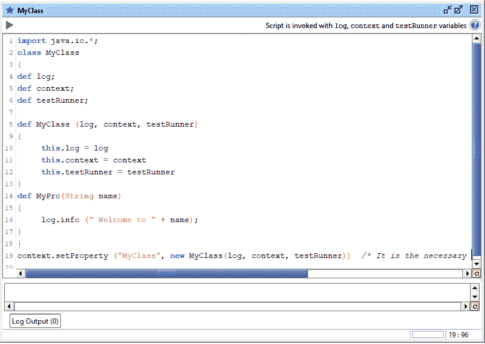

点击**运行**按钮执行 Groovy 脚本。如果脚本运行过程中出现错误，Groovy 图标颜色变为**红色**，如果没有错误，图标颜色变为**绿色**。

同样，右键单击测试步骤，然后通过添加步骤从可用资源创建 groovy 脚本。保存名为**的 groovy 文件，调用 Groovy 脚本 MyClass** ，然后编写以下代码调用 **MyClass** ，如下图。

**调用 Groovy 脚本 MyClass**

```

// initialize the testStep variable
def testStep = testRunner.testCase.getTestStepByName("MyClass")
testStep.run(testRunner, context)  
context.MyClass.MyPro( "JavaTpoint" ) // pass the string name to MyPro Method

```

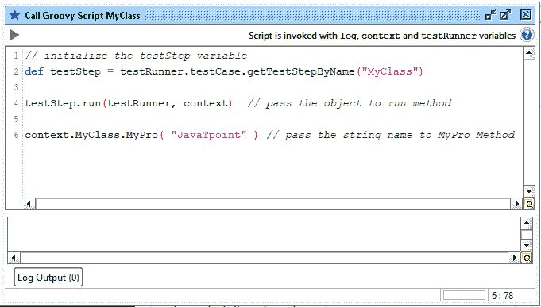

点击运行按钮来执行 groovy 脚本。

**输出:**

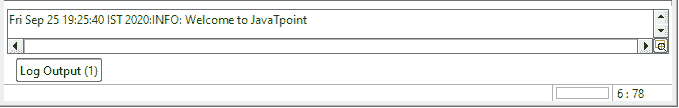

* * *