# Soap产权转让

> 原文：<https://www.javatpoint.com/soapui-property-transfer>

有时我们需要从响应消息中获取一些特定的内容或信息，然后将其添加到后续的请求中。这些情况需要一些特定的机制来检索该值并将它传递给 SoapUI 项目的其他元素。所以，我们需要使用**皂水属性转移**测试步骤。

### 添加财产转移

要在 [SoapUI](https://www.javatpoint.com/soapui) 中使用属性转移，我们必须遵循下面给出的步骤。

**第一步:**点击 Soap 图标新建一个 Soap 项目，然后输入[【WSDL】](https://www.javatpoint.com/soapui-working-with-wsdl-file)[URL](https://www.javatpoint.com/url-full-form)，如下图。

```

http://webservices.oorsprong.org/websamples.countryinfo/CountryInfoService.wso?WSDL

```

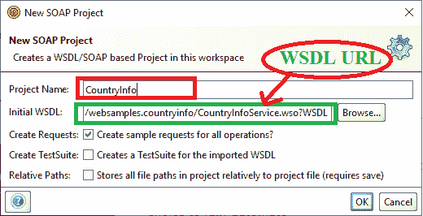

**第二步:**点击确定按钮后，处理 [Soap 项目](https://www.javatpoint.com/create-soap-project-in-soapui-tool)及其相关服务，如下图所示。

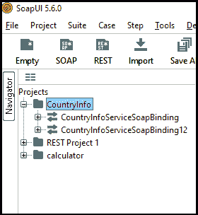

**第三步:**右键点击**【countrinfoservicesoap binding 12】**打开生成测试套件，如下图所示。

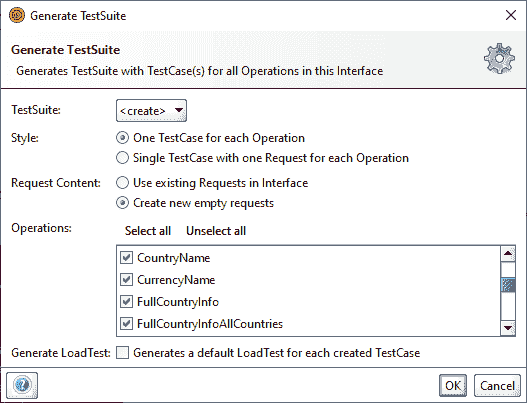

**第四步:**点击确定按钮，出现对话框指定测试套件名称，如下图。

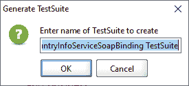

**第五步:**点击 OK 按钮后，显示测试套件内部的默认测试用例，如下图所示。

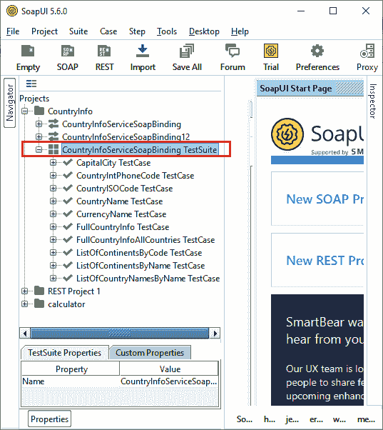

### 创建用于财产转移的克隆

**步骤 6:** 右键点击**countrinforservicesoap binding 测试套件**为属性转移创建一个新的测试用例，如下所示。

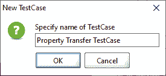

在这里，我们将测试用例的名称指定为**属性转移测试用例**，然后点击确定按钮。

**第七步:**之后，在**countrinforservicesoap binding 测试套件**中创建属性转移测试用例，并显示测试用例窗口，如下图所示。

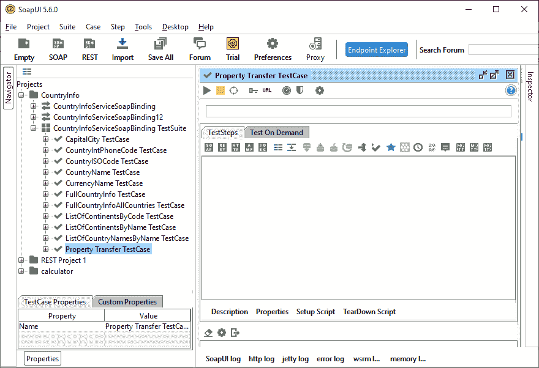

**步骤 8:** 现在，我们在 Property Transfer testcase 的测试步骤中转移或克隆两个测试用例请求: **CountryISOCode TestCase** 请求和 **CapitalCity TestCase** 请求，如下所示。

克隆 **CountryISOCode 测试用例:**单击 CountryISOCode 测试用例的(+)然后右键单击 CountryISOCode 请求，如下所示。


点击克隆测试步骤，打开**“克隆测试步骤窗口”**，定义目标测试用例。在这里，我们为属性转移测试用例指定了目标**‘国家代码请求’**，如下所示。

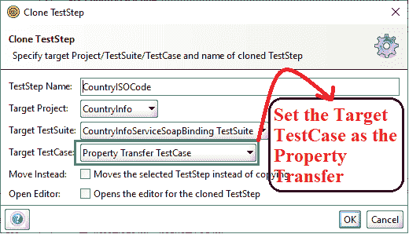

**第九步:**点击确定按钮后，将**国家代码**请求转移到财产转移测试用例，并在右窗格显示 [XML](https://www.javatpoint.com/xml-tutorial) 请求，如下所示。

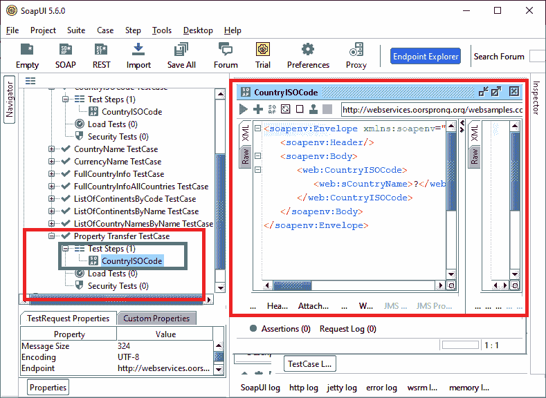

**步骤 10:** 同样，我们将把 CapitalCity 测试用例的请求转移到 Property Transfer 测试用例，如下所示。

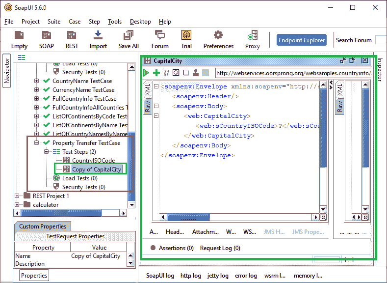

**步骤 11:** 现在，双击属性 Transfer 测试用例，查看可用的测试用例，如下图所示。

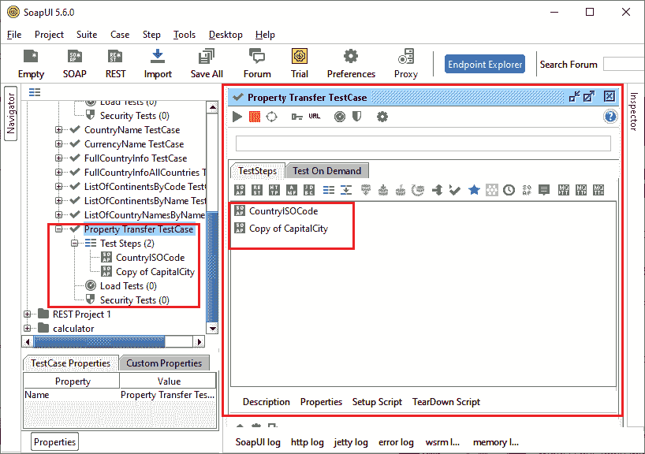

### 添加财产转移

**步骤 12:** 右键单击测试步骤的**国家代码**请求，然后选择财产转移服务，如下所示。

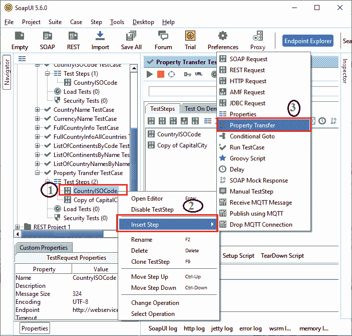

**步骤 13:** 当我们点击**财产转移**时，它显示一个弹出对话框，指定财产转移新步骤的名称。

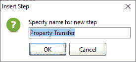

**步骤 14:** 点击**确定**按钮后，将**房产过户**添加到**房产过户测试用例**中，然后显示一个新的**房产过户**窗口添加房产，如下图所示。

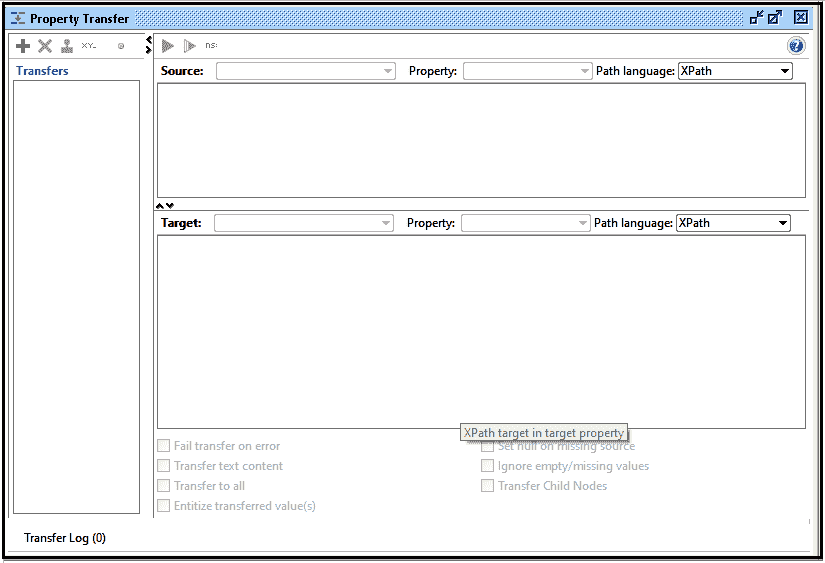

**步骤 15:** 要添加属性，请在属性转移窗口中单击左上角的(+)图标。之后，它会显示一个弹出对话框，指定在属性转移中转移值的名称。输入名称**国家/地区**并点击**确定**。


**第 16 步:**之后，在**房产过户**窗口显示**国别**值，如下图所示。

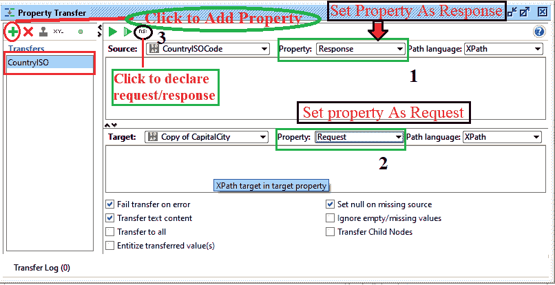

在这里， **CountryISO** 值被添加到 CountryISOCode 中，用于将一个值转移到**capital city 副本**请求中。之后将 **CountryISOCode** 属性设置为 **Response** ，然后将**复制 CapitalCity** 属性设置为 **Request** ，如上图。

**步骤 17:** 现在，单击请求/响应按钮(3)来声明源表达式和目标表达式的名称空间，如下所示。

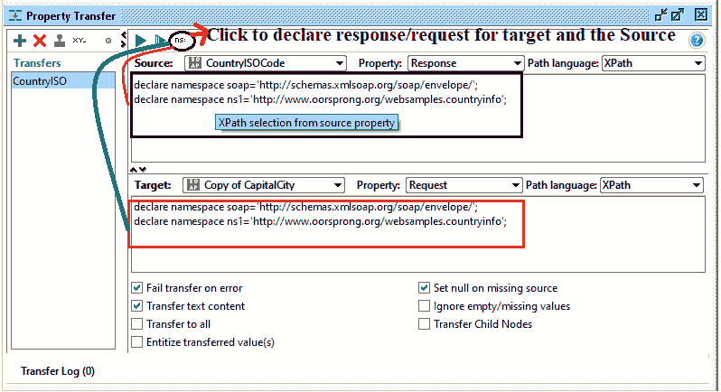

**步骤 18:** 双击 CountryISOCode 显示 XML 请求文件，如图所示。

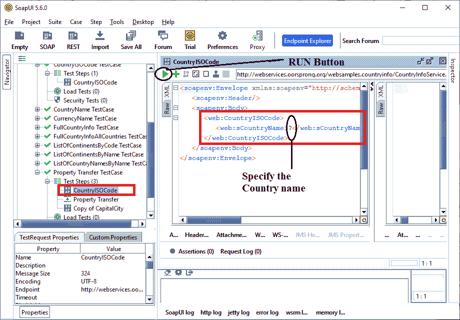

**第 19 步:**指定国家名称为**美国**后，点击**绿色**运行按钮执行查询，如下图。


下面的代码片段以 XML 格式显示了**请求国家代码**。

```

<soapenv:Envelope xmlns:soapenv="http://schemas.xmlsoap.org/soap/envelope/" xmlns:web="http://www.oorsprong.org/websamples.countryinfo">
   <soapenv:Header/>
   <soapenv:Body>
      <web:CountryISOCode>
         <web:sCountryName>United State</web:sCountryName>
      </web:CountryISOCode>
   </soapenv:Body>
</soapenv:Envelope>

```

下面的代码片段以 XML 格式显示了**响应国家代码**。

```

<soap:Envelope xmlns:soap="http://schemas.xmlsoap.org/soap/envelope/">
   <soap:Body>
      <m:CountryISOCodeResponse xmlns:m="http://www.oorsprong.org/websamples.countryinfo">
         <m:CountryISOCodeResult>US</m:CountryISOCodeResult>
      </m:CountryISOCodeResponse>
   </soap:Body>
</soap:Envelope>

```

**第 20 步:**现在，我们必须在源位置从**country isocode Response**XML 中指定 **//m:CountryISOCodeResult** 来获取 ISO 代码值。

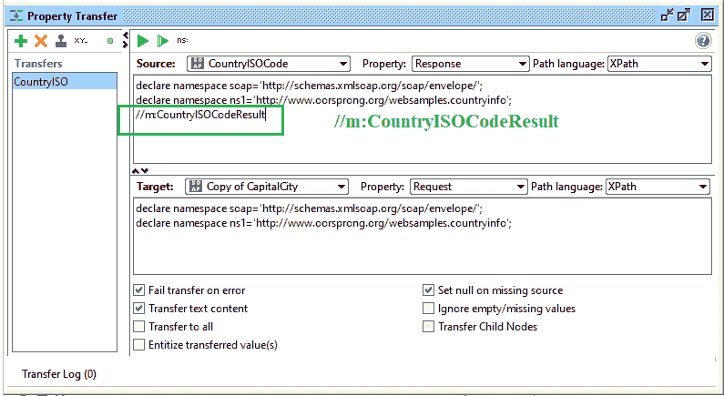

**第 21 步:**双击复制首都请求，然后指定目标**复制首都**的请求命名空间，如下所示。

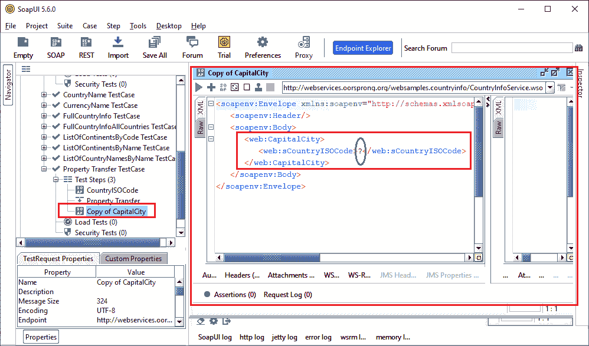

这是**请求复制首都** XML

```

<soapenv:Envelope xmlns:soapenv="http://schemas.xmlsoap.org/soap/envelope/" xmlns:web="http://www.oorsprong.org/websamples.countryinfo">
   <soapenv:Header/>
   <soapenv:Body>
      <web:CapitalCity>
         <web:sCountryISOCode>?</web:sCountryISOCode>
      </web:CapitalCity>
   </soapenv:Body>
</soapenv:Envelope>

```

**第 22 步:同样**我们要在目标处指定**//web:scountrysocode**来自 **CapitalCity Request** XML，得到指定国家的首都名称。

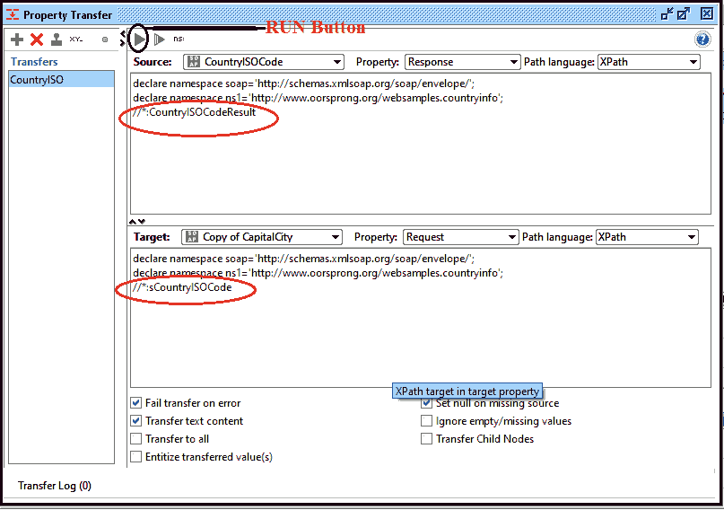

**第 23 步:**点击绿色运行按钮，执行财产转移，获取国家 ISO 代码，如下图。

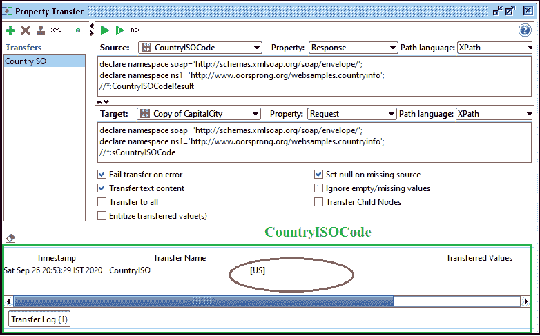

**第 24 步:**之后，我们要双击**【人口转移测试案例】**来执行所有可用的测试步骤，如下所示。

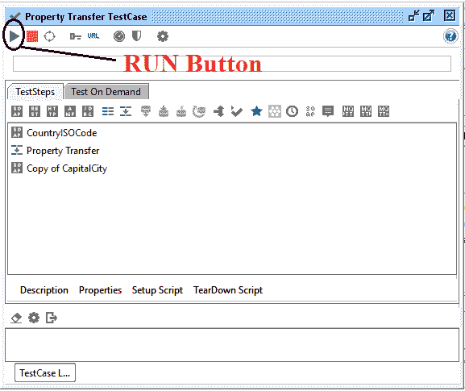

当我们点击运行按钮时，所有的测试步骤都在属性转移测试用例中执行。

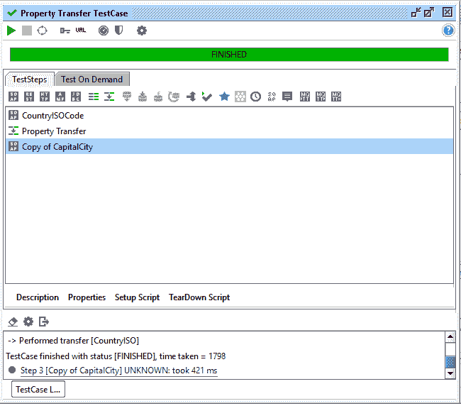

**步骤 25:** 现在，从财产转移中选择**【复制首都】**请求，然后运行 XML 文件来生成请求和响应，如下所示。

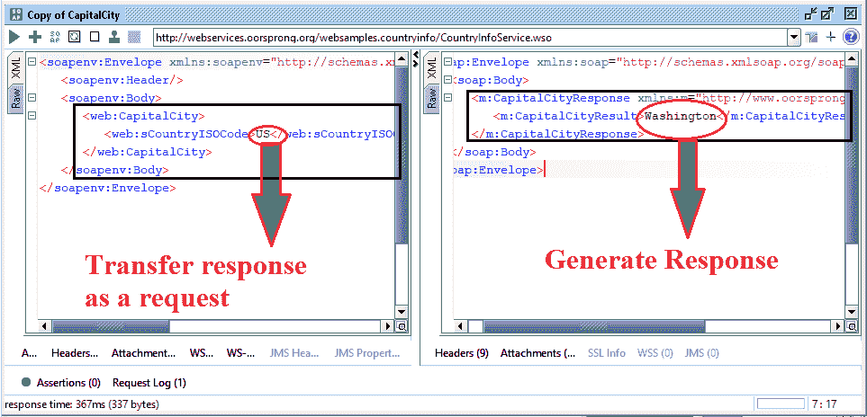

下面的代码片段以 XML 格式显示了**请求复制首都**。

```

<soapenv:Envelope xmlns:soapenv="http://schemas.xmlsoap.org/soap/envelope/" xmlns:web="http://www.oorsprong.org/websamples.countryinfo">
   <soapenv:Header/>
   <soapenv:Body>
      <web:CapitalCity>
         <web:sCountryISOCode>US</web:sCountryISOCode>
      </web:CapitalCity>
   </soapenv:Body>
</soapenv:Envelope>

```

下面的代码片段以 XML 格式显示了首都的**响应副本。**

```

<soap:Envelope xmlns:soap="http://schemas.xmlsoap.org/soap/envelope/">
   <soap:Body>
      <m:CapitalCityResponse xmlns:m="http://www.oorsprong.org/websamples.countryinfo">
         <m:CapitalCityResult>Washington</m:CapitalCityResult>
      </m:CapitalCityResponse>
   </soap:Body>
</soap:Envelope>

```

因此，通过这种方式，我们在一个 SoapUI 项目中使用了属性转移服务。

* * *