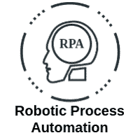
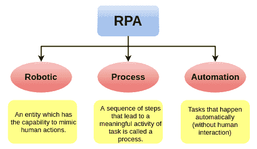
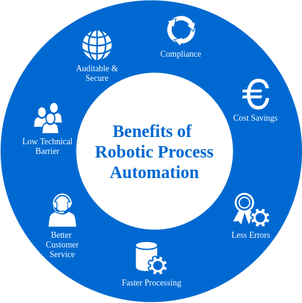

# RPA 教程

> 原文：<https://www.javatpoint.com/rpa>

我们的 **RPA 教程**提供了 RPA 的基本和高级概念。本教程是为初学者和专业人士设计的。

本教程向您介绍了 RPA 以及广泛的 RPA 主题，如 **RPA 特性、RPA 应用、RPA 工具、RPA 示例和 RPA 面试问题、**等。

## 什么是 RPA？

RPA 代表**RPA。**它是用于自动化人工任务的软件工具的技术，这些人工任务是手动的、基于规则的或重复的。通常，它就像一个机器人，以比人类更高的速度执行这些任务。这些 RPA 软件机器人从不休眠，零失误，可以与内部应用、网站、用户门户等进行交互。他们可以登录应用，输入数据，打开电子邮件和附件，计算并完成任务，然后注销。

术语“RPA”创建了一幅物理机器人完成一些劳动密集型人类物理任务的图片，例如从车辆上传或卸载重物或打扫房屋等。然而，在现实中，情况完全不同。“RPA”中的“机器人”一词不是物理机器人，而是一个虚拟系统，有助于自动化重复的手动计算或业务流程任务。

RPA 技术可分为三类:

考试

这些机器人遵循简单、可重复的规则来处理数据。

**知识机器人**

这些机器人从互联网上搜索用户指定的信息，并对用户做出响应。

**Chatbots**

这些机器人作为虚拟代理进行操作和响应。他们实时回复客户的询问。

## 为什么是 RPA？

RPA 不是组织的信息技术基础设施的一部分。相反，它属于整个组织的信息技术基础设施的顶部。在信息技术环境中，大多数业务流程都不智能。他们中的许多人依赖于多个信息技术系统，这些系统很少相互作用。这种类型的任务对人类来说是重复的、耗时的和劳动密集型的。借助机器人流程自动化，与人类相比，需要大型信息技术转型计划和实施流程才能更快、更准确、更不懈地自动化这些类型的重复、耗时和基于规则的任务。

RPA 技术使用与 web 应用、网站、excel 工作表和电子邮件交互的机器人来像人一样自动完成任务。RPA 是目前最有效的自动化解决方案，它帮助人类专注于那些需要情商、推理、判断和与客户互动的任务，而不仅仅是做重复的任务。

## RPA 的优势

RPA技术具有以下优势:

### 成本节约

RPA 有助于组织节省大量成本，因为它通常比雇佣员工执行同一组任务更便宜。

### 较少误差

RPA 基于标准逻辑工作，不会感到无聊、分心或疲倦。因此，出错的概率在很大程度上降低了，这意味着减少了重复劳动，提高了效率。

### 更快的处理

RPA 比人类员工工作更快，因为计算机软件不需要休息、食物、休息等。，并能不知疲倦地执行重复操作。使用 RPA，处理时间变得可预测且一致，这确保了整个运营过程中的高质量客户服务。

### 更好的法规遵从性

RPA 软件对提供给它的逻辑和数据进行处理，并且只根据给定的指令做需要做的事情。因此，不符合标准规定的可能性极小。

### 更好的客户服务

当 RPA 在企业中实施时，它释放了许多员工，他们可以将时间花在与客户相关的服务上。对于收到大量客户查询的商家来说是非常有利的。它还能提高员工的生产力。

### 可审计且安全

RPA 机器人将只访问他们被授予权限的数据，并创建所有活动的详细审计跟踪。

### 低技术壁垒

RPA 不需要任何编程技能来配置软件机器人。由于它是一种无代码技术，任何非技术人员都可以使用拖放功能来设置机器人。它还包括记录自动化步骤的“记录器”。

凭借所有这些优势，RPA 可确保任何组织的整体质量水平更高。

### 先决条件

本教程没有特定的先决条件。你所需要的只是不断学习和使用工具练习。然而，如果你想扩展功能来满足你的需求，那么软件编码和编程逻辑的基础知识将是有益的，并使你处于优势。

### 观众

我们的 RPA 教程旨在帮助初学者和专业人士。

### 问题

我们向您保证，通过我们的 RPA 教程学习时，您不会发现任何困难。但是如果您在本教程中发现任何错误，我们请求您将问题发布在联系表中，以便我们进行改进。

* * *