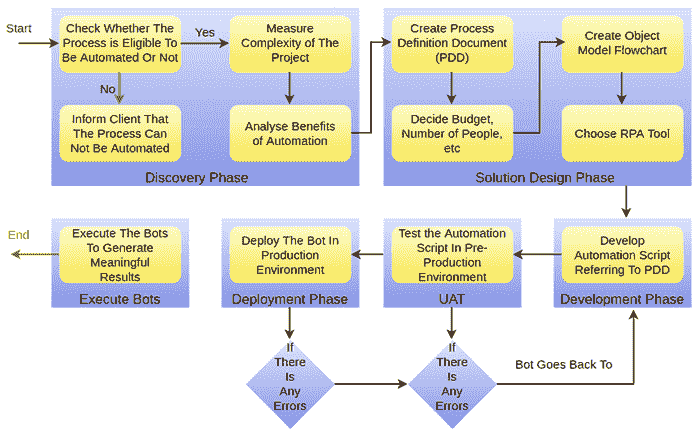

# RPA 生命周期

> 原文：<https://www.javatpoint.com/rpa-life-cycle>

RPA 生命周期没有任何特定的定义结构。它包括自动化过程的不同阶段，从机器人的创建到机器人的执行。查看显示所有这些阶段的下图:

## 发现阶段

发现阶段是 RPA 生命周期的初始阶段。在这个阶段，RPA 流程架构师分析客户的需求。然后进一步决定该过程是否可以自动化。如果流程可以自动化，那么 RPA 分析师团队可能会让 RPA 架构师团队参与进来，并分析流程的复杂性。

## 解决方案设计阶段

基于需求，设计了自动化任务的步骤。RPA 技术架构师与流程架构师合作，开发一个**流程定义文档** (PDD)，其中包括关于整个流程的信息。他们遵循开发方法，并开发一种策略来自动化特定任务，以尽可能减少手动工作。

一旦所有的需求都匹配，下一步就是决定预算、人数、花在项目上的时间等。然后，分析师团队创建一个流程图来理解流程，这有助于为自动化选择正确的流程。选择流程后，使用 RPA 工具开始开发机器人并自动执行任务。

## 开发阶段

在这个阶段，RPA 开发人员创建脚本/机器人，在 RPA 工具的帮助下自动完成任务。市场上有几种 RPA 工具。自动化脚本/机器人是按照以前开发的 PDD 生成的。一般不需要编码。但是它可能会根据要自动化的任务而改变。

开发完机器人后，下一步是测试开发的机器人。

## UAT(用户验收测试)

在这个阶段，RPA 开发团队测试开发的机器人。这些机器人在生产前环境中进行测试，以检查用户如何使用它们来自动化特定任务。如果测试阶段成功通过，那么它将被进一步转移到下一阶段。此外，如果测试失败，那么它将被转移回开发阶段，在那里，RPA 开发人员检查在测试阶段发现的错误并解决它们。

一旦机器人测试成功，它们就会被转移到 RPA 生命周期的部署阶段。

## 部署和维护阶段

只有当机器人完成了开发和测试阶段，它们才会被部署到生产环境中。在部署过程之后，用户可以使用它们来自动化他们的任务。如果机器人仍然有问题，比如机器人没有自动化，那么它们将被进一步转移到 RPA 开发和测试团队。开发团队将再次分析机器人并解决问题。

## 执行 Bots

这个阶段包括部署后机器人的执行。还会检查僵尸工具，以确保执行符合要求。

下图解释了构建机器人的流程:

* * *